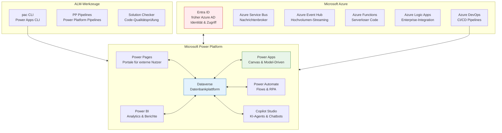
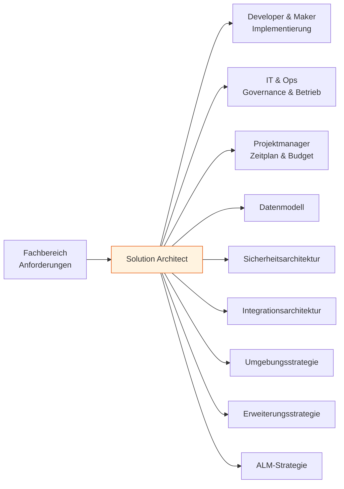
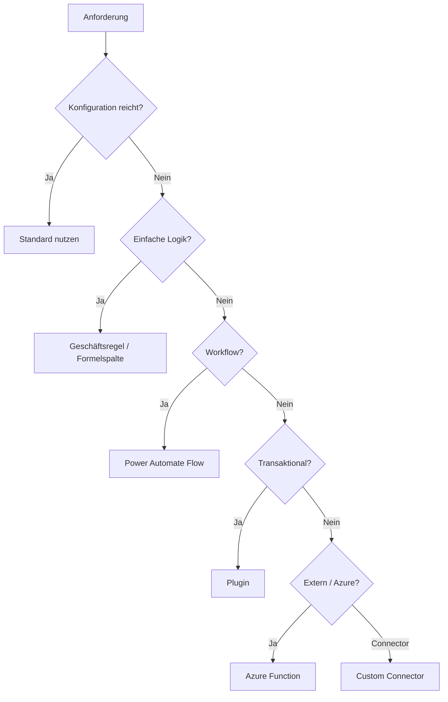
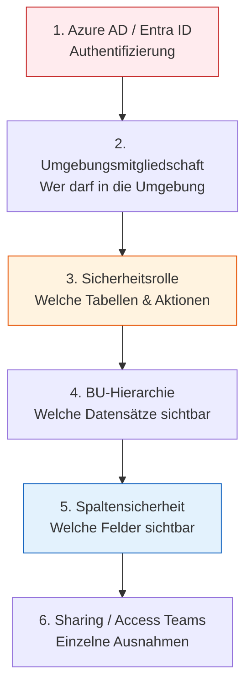

# Kursübersicht: Power Platform Solution Architect

## Ziel des Seminars

Dieses 2-Tages-Seminar bereitet auf die praktische Arbeit als Solution Architect (SA) auf der Microsoft Power Platform vor und deckt gleichzeitig die Prüfungsinhalte der Zertifizierung **PL-600: Microsoft Power Platform Solution Architect** ab.

---

## Architektur-Landschaft auf einen Blick

---

## Die Rolle des Solution Architects

Der **SA (Solution Architect)** ist verantwortlich für die Gesamtarchitektur einer Power Platform-Lösung. Er trifft keine Feature-Entscheidungen ("wie baut man das?"), sondern Architekturentscheidungen ("warum so und nicht anders?").

---

## Kursstruktur — Big Picture

### Tag 1: Grundlagen, Plattformverständnis und Datenmodell

| Modul   | Nr. | Thema                                         | Labs      |
| ------- | --- | --------------------------------------------- | --------- |
| Modul 1 | 01  | Rolle & Methodik des SA                       | 0101–0105 |
| Modul 2 | 02  | Power Platform Architektur & Plattformgrenzen | 0201–0205 |
| Modul 3 | 03  | Datenmodellierung auf Architektenebene        | 0301–0305 |
| Modul 4 | 04  | Copilot Studio als Architektur-Baustein       | 0401–0404 |

### Tag 2: Sicherheit, Integration und ALM

| Modul   | Nr. | Thema                                                | Labs      |
| ------- | --- | ---------------------------------------------------- | --------- |
| Modul 5 | 05  | Sicherheitsarchitektur: Umgebungen, BUs, Rollen, RLS | 0501–0504 |
| Modul 6 | 06  | Erweiterte Sicherheit: Hierarchie, Teams, Spalten    | 0601–0604 |
| Modul 7 | 07  | Integration & APIs: Muster, Web API, Plugins, Events | 0701–0705 |
| Modul 8 | 08  | ALM & Deployment: Solutions, Pipelines, DevOps       | 0801–0803 |

---

## Kernentscheidungen eines SA im Überblick

### 1. Wann welche App-Art?

| App-Typ                    | Geeignet für                                         | Nicht geeignet für                      |
| -------------------------- | ---------------------------------------------------- | --------------------------------------- |
| **Canvas App**             | Flexibles UI, mobile Nutzung, externe Datenquellen   | Komplexe Datenmodelle, viele Datensätze |
| **Model-Driven App (MDA)** | Strukturierte Geschäftsprozesse, Dataverse-zentriert | Custom UI-Anforderungen                 |
| **Power Pages**            | Externe Nutzer ohne Lizenz (Kunden, Lieferanten)     | Interne Nutzer (Lizenzkosten)           |

### 2. Wann welche Erweiterung?

### 3. Wann welche Integrationsmethode?

| Methode                     | Einsatz                                          | Volumen         |
| --------------------------- | ------------------------------------------------ | --------------- |
| **Standard Connector**      | Bekannte SaaS-Dienste (SharePoint, Teams, SAP)   | Niedrig–Mittel  |
| **Custom Connector**        | REST-APIs ohne Standardconnector                 | Niedrig–Mittel  |
| **Dataverse Web API**       | Direktzugriff auf Dataverse von außen            | Niedrig–Mittel  |
| **Virtual Table**           | Externe Daten als native Dataverse-Tabelle lesen | Niedrig         |
| **Plugin**                  | Serverseitige Logik bei Dataverse-Events         | Event-getrieben |
| **Webhook**                 | Dataverse informiert externes System             | Niedrig–Mittel  |
| **Azure Service Bus (ASB)** | Entkoppelte, robuste Nachrichtenübermittlung     | Mittel–Hoch     |
| **Azure Event Hub**         | Hochvolumen-Streaming, IoT, Logs                 | Sehr hoch       |

### 4. Wann welches ALM-Werkzeug?

| Werkzeug                       | Einsatz                                         |
| ------------------------------ | ----------------------------------------------- |
| **pac CLI**                    | Lokales Entwickeln, Exportieren, Source Control |
| **PP Pipelines**               | Einfache Teams ohne Azure DevOps                |
| **Azure DevOps + Build Tools** | Größere Teams, automatisierte CI/CD-Pipelines   |

---

## Sicherheitsschichten auf einen Blick

---

## Dateien in diesem Repository

| Ordner                 | Inhalt                                                     |
| ---------------------- | ---------------------------------------------------------- |
| `0000-overview/`       | Diese Übersicht, Glossar, Tagesablauf                      |
| `0010-pac/`            | pac CLI Befehlsreferenz                                    |
| `0020-best-practices/` | Architektur-Checklisten und Muster                         |
| `01xx–04xx`            | Tag 1: SA-Methodik, Plattform, Datenmodell, Copilot Studio |
| `05xx–08xx`            | Tag 2: Sicherheit, Integration, ALM                        |

Jedes Lab-Verzeichnis enthält:

- `theorie.md` — Konzepte und Erklärungen
- `uebung.md` — Aufgabenstellung mit Szenario
- `loesung.md` — Musterlösung mit Begründungen
