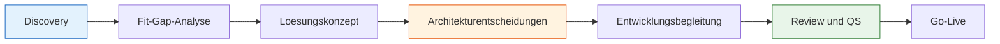

# Lab 1.1 - Rolle, Mandat und Verantwortung des Solution Architects

## Was ist ein Solution Architect?

Ein Solution Architect auf der Power Platform ist die Person, die dafuer verantwortlich ist, dass die gesamte Loesung zusammenhaelt. Nicht einzelne Features, nicht einzelne Flows, nicht einzelne Screens, sondern das Gesamtbild: Wie passen Datenmodell, Sicherheit, Integrationen, Umgebungen und Benutzererfahrung so zusammen, dass das Ergebnis wartbar, skalierbar und korrekt ist?

Diese Verantwortung ist breiter als die eines Developers und tiefer als die eines Projektmanagers. Der SA muss beide Welten verstehen und zwischen ihnen uebersetzen.

## Das Aufgabenbild im Detail

Ein Solution Architect auf der Power Platform traegt Verantwortung in sechs Kernbereichen.

**Datenmodell und Dataverse-Architektur**
Der SA entscheidet, welche Tabellen erstellt werden, welche Standardtabellen der Power Platform genutzt werden und wie Alternativschluessel fuer Integrationen aussehen. Diese Entscheidungen sind schwer rueckgaengig zu machen und praegen die gesamte Loesung.

**Sicherheitsarchitektur**
Wer darf welche Datensaetze sehen, bearbeiten und loeschen? Das sind keine Entwicklerfragen, sondern Architekturentscheidungen. Der SA entwirft das Sicherheitsmodell mit Business Units, Rollen, Zugriffstiefen und Sharing-Regeln.

**Umgebungsstrategie**
Wieviele Umgebungen gibt es? Welche Umgebung ist fuer Entwicklung, Test und Produktion? Wie werden Loesungen zwischen diesen Umgebungen transportiert? Der SA legt diese Strategie fest.

**Integrationsstrategie**
Welche externen Systeme muessen angebunden werden? Ueber welche Schnittstelle? Synchron oder asynchron? Der SA waehlt das richtige Integrationsmuster.

**Erweiterungsstrategie**
Wann reicht Standardkonfiguration? Wann braucht es einen Power Automate Flow? Wann ein Plugin? Wann eine Azure Function? Der SA zieht diese Grenzen bewusst.

**Governance und ALM**
Wie wird die Loesung versioniert, getestet und ausgeliefert? Der SA stellt sicher, dass kein unkontrolliertes Chaos in den Umgebungen entsteht.

## Abgrenzung zu anderen Rollen

| Rolle | Fokus | Entscheidungstiefe |
|---|---|---|
| Solution Architect | Gesamtarchitektur, Datenmodell, Sicherheit, ALM | Strukturell und langfristig |
| Developer und Maker | Implementierung von Features | Technisch und kurzfristig |
| Business Analyst | Anforderungsaufnahme, Prozessanalyse | Fachlich |
| Projektmanager | Zeitplan, Budget, Ressourcen | Organisatorisch |
| Functional Consultant | Konfiguration von Standardfunktionen | Fachlich-technisch |

Der entscheidende Unterschied liegt nicht im Wissen, sondern im Zeithorizont der Entscheidungen. Ein Developer entscheidet, wie ein Feature heute umgesetzt wird. Ein SA entscheidet, wie das System in zwei Jahren noch wartbar ist.

## Der SA im Projektablauf

Der SA ist in allen Phasen aktiv, nicht nur in der Konzeptionsphase. Er begleitet die Entwicklung, prueft ob Implementierungen den Architekturvorgaben entsprechen, und stellt sicher, dass Go-Live-Entscheidungen auf einer soliden Grundlage basieren.

## Was macht eine gute Architekturentscheidung aus?

**Begruendet:** Es gibt einen nachvollziehbaren Grund, warum diese und keine andere Option gewaehlt wurde.

**Dokumentiert:** Die Entscheidung ist fuer andere nachlesbar, damit sie nicht zweimal getroffen werden muss.

**Konsequenzbewusst:** Der SA hat verstanden, welche anderen Bereiche der Loesung von dieser Entscheidung betroffen sind.

Ein Beispiel: Die Entscheidung, ob Dateien in Dataverse gespeichert oder in SharePoint ausgelagert werden, klingt wie eine Detailfrage. In Wirklichkeit beeinflusst sie den Speicherverbrauch, die Lizenzkosten, die Sicherheitsarchitektur und die Offline-Faehigkeit der Anwendung.

## Typische SA-Situationen

**Situation 1: Der Developer hat eine Loesung gefunden, die nicht zum Datenmodell passt**
Ein Developer speichert Zwischenergebnisse in lokalen Variablen der Canvas App statt in Dataverse. Die Loesung funktioniert in der Demo, aber Daten gehen verloren wenn die App abstuerzt. Der SA erkennt dieses Muster und korrigiert die Architektur fruehzeitig.

**Situation 2: Der Fachbereich fordert Features, die die Plattform so nicht kann**
Der Fachbereich will Echtzeitaggregation ueber 500.000 Datensaetze auf einem Dashboard. Der SA erklaert, warum Rollup-Spalten asynchron sind, und fuehrt das Gespraech in Richtung eines realisierbaren Designs.

**Situation 3: Kein Mensch hat ueber die Umgebungsstrategie nachgedacht**
Das Projekt laeuft seit drei Monaten, alle entwickeln in der Produktivumgebung. Der SA erkennt diesen Zustand und etabliert eine Struktur, bevor der Schaden groesser wird.

## Kernfrage fuer jeden SA

"Wenn diese Loesung in zwei Jahren von jemandem uebernommen wird, der jetzt noch nicht im Projekt ist, versteht er dann, warum das so gebaut wurde, und kann er es ohne grossen Aufwand weiterentwickeln?"

Wenn die Antwort nein ist, ist die Architekturentscheidung noch nicht gut genug.
