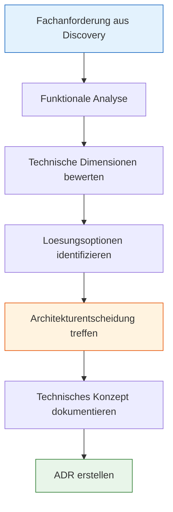
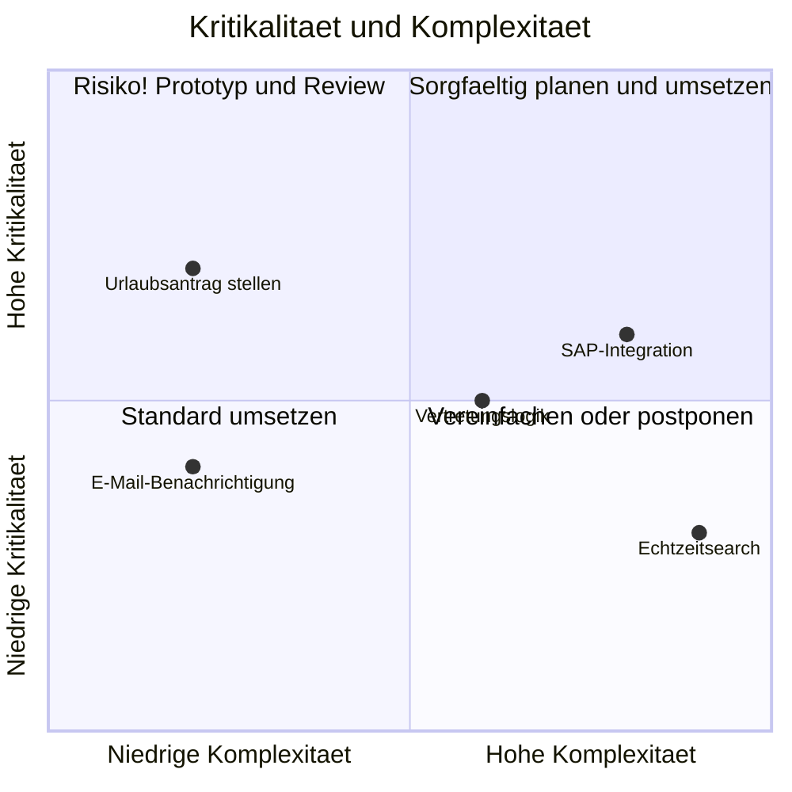

# Lab 1.4 - Von der Fachanforderung zum technischen Konzept

## Die Bruecke zwischen Fachlichkeit und Technik

Eine Fachanforderung klingt so: "Ich moechte, dass Mitarbeiter ihren Urlaub beantragen koennen und ihr Vorgesetzter benachrichtigt wird."

Ein technisches Konzept klingt so: "Die Tabelle cr_UrlaubsAntrag enthaelt die Felder Startdatum, Enddatum, Status (Offen, Genehmigt, Abgelehnt), AntragstellerID (Lookup auf SystemUser), VorgesetzterID (Lookup auf SystemUser). Ein Power Automate Cloud Flow wird durch das Erstellen eines neuen Datensatzes ausgeloest und sendet eine Adaptive Card an Microsoft Teams an den Vorgesetzten."

Die Aufgabe des SA ist, diese Uebersetzung zu leisten. Er muss die Fachanforderung vollstaendig verstanden haben und daraus ein technisches Konzept ableiten, das ein Developer direkt umsetzen kann.

## Der Weg vom Fachbedarf zum Pflichtenheft



## Kritikalitaet und Komplexitaet bewerten

Bevor der SA eine Loesungsoption waehlt, bewertet er jede Anforderung auf zwei Achsen:

**Kritikalitaet:** Wie gross ist der Schaden, wenn diese Anforderung falsch umgesetzt wird? Eine Anforderung mit hoher Kritikalitaet verdient mehr Planungsaufwand, sorgfaeltigeres Design und mehr Tests.

**Komplexitaet:** Wie aufwaendig ist die Umsetzung? Komplexitaet entsteht durch Abhaengigkeiten von anderen Systemen, durch ungenaue Anforderungen, durch technische Grenzen der Plattform oder durch Unklarheiten im Datenmodell.



## Architekturentscheidungen dokumentieren: Das ADR-Format

Ein Architecture Decision Record (ADR) ist ein kurzes Dokument, das eine Architekturentscheidung festhaelt. Es hat eine klare Struktur und bleibt dauerhaft im Projektarchiv.

**Warum ADRs wichtig sind:** Architekturentscheidungen werden oft muendlich getroffen und dann vergessen. Wenn sechs Monate spaeter jemand fragt "Warum haben wir das so gemacht?", gibt es keine Antwort. ADRs loesen dieses Problem.

**ADR-Struktur:**

```
Titel: ADR-001 - Datenspeicherung fuer Anhange bei Urlaubsantraegen

Datum: 15.06.2026
Status: Akzeptiert

Kontext:
Mitarbeiter sollen in bestimmten Faellen (z.B. Sonderurlaub) Anhange an 
Urlaubsantraege anfuegen koennen. Diese Anhange koennen bis zu 10 MB gross sein.

Optionen:
Option A: Dateispeicher in Dataverse (File-Spalte)
Option B: SharePoint mit Referenz-Link in Dataverse

Entscheidung:
Wir waehlen Option B (SharePoint).

Begruendung:
Dateispeicher in Dataverse verbraucht File-Storage, der teuer ist (0.40 USD pro GB/Monat).
SharePoint-Storage ist in den meisten M365-Lizenzen unbegrenzt enthalten.
Bei 5.000 Mitarbeitern und durchschnittlich 2 Anhangen pro Jahr entsteht ueber
5 Jahre ca. 500 GB File-Storage, der in SharePoint kostenlos ist.

Konsequenzen:
- SharePoint-Bibliothek muss provisioniert und Berechtigungen muessen geregelt werden.
- Anhange sind nur mit SharePoint-Zugriff sichtbar, nicht direkt in der App.
- Vorteil: SharePoint bietet Versionierung und erweiterte Suchfunktionen.
```

## Wie ein technisches Konzept aussieht

Ein technisches Konzept fuer eine einzelne Fachanforderung beantwortet die folgenden Fragen:

**Datenmodell:** Welche Tabellen und Felder benoetigt diese Anforderung? Welche Beziehungen gibt es?

**Prozesslogik:** Welche Ereignisse loesen welche Aktionen aus? Ist die Logik synchron oder asynchron?

**Benutzeroberflaeche:** Welche App-Art (Canvas, Model-Driven) wird verwendet? Welche Formulare und Ansichten sind notwendig?

**Integrationen:** Welche externen Systeme sind beteiligt? Ueber welche Schnittstelle?

**Sicherheit:** Wer darf diese Funktion nutzen? Welche Sicherheitsrolle wird benoetigt?

**Testkriterien:** Woran erkennt man, dass die Anforderung korrekt umgesetzt wurde?

## Praxisbeispiel: Vollstaendiges technisches Konzept

**Fachanforderung ANF-002:** Vorgesetzte erhalten E-Mail-Benachrichtigung bei neuen Antraegen.

**Datenmodell:**
- Tabelle: cr_UrlaubsAntrag
- Relevante Felder: cr_AntragstellerID (Lookup SystemUser), cr_VorgesetzterID (Lookup SystemUser), cr_Status (Choice: Offen, Genehmigt, Abgelehnt), cr_Startdatum (Datum), cr_Enddatum (Datum)
- Vorgesetzter-ID wird beim Erstellen des Antrags aus dem Dataverse-Benutzerprofil des Antragstellers ermittelt.

**Prozesslogik:**
- Trigger: Power Automate Cloud Flow, ausgeloest durch "When a row is added" auf cr_UrlaubsAntrag
- Aktion 1: Vorgesetzten-E-Mail aus Dataverse-Benutzerprofil ermitteln (Get a row by ID auf SystemUser)
- Aktion 2: E-Mail senden mit Outlook-Connector
- E-Mail-Inhalt: Name des Antragstellers, Zeitraum, direkter Link zum Datensatz in der App

**App:** Model-Driven App "HR Urlaubsverwaltung". Vorgesetzter erhaelt Link direkt zum Formular.

**Sicherheitsrolle:** Vorgesetzter benoetigt Lesezugriff auf cr_UrlaubsAntrag und Schreibzugriff auf cr_Status-Feld, um genehmigen oder ablehnen zu koennen.

**Testkriterium:** Ein Mitarbeiter erstellt einen Antrag. Innerhalb von fuenf Minuten erhaelt der eingetragene Vorgesetzte eine E-Mail mit korrektem Inhalt und funktionierendem Link.

## Typische Fehler beim Uebergang von Fach zu Technik

**Anforderungen uebersetzen, nicht interpretieren:** Der SA uebersetzt, was der Stakeholder braucht. Er erfindet keine Anforderungen hinzu. Wenn jemand sagt "benachrichtigen", entscheidet der SA ob das E-Mail, Teams-Nachricht oder Notification in der App ist und bestaetigt diese Entscheidung mit dem Stakeholder.

**Nicht-dokumentierte Annahmen:** Jede Annahme, die der SA in einem technischen Konzept macht, muss explizit als Annahme markiert werden. Beispiel: "Annahme: Jeder Mitarbeiter hat genau einen direkten Vorgesetzten im System."

**Zu detailliert zu frueh:** Ein technisches Konzept in der Planungsphase beschreibt das Was, nicht das Wie. Der Developer entscheidet, ob er fuer die E-Mail den Outlook-Connector oder den Office365-Connector nutzt. Der SA legt fest, dass eine E-Mail gesendet wird.

## Wo konfigurieren und überwachen?

| Thema | Navigation |
|---|---|
| Tabellen und Felder anlegen | [make.powerapps.com](https://make.powerapps.com) → **Dataverse** → **Tables** → + **New table** |
| Beziehungen zwischen Tabellen konfigurieren | make.powerapps.com → **Tables** → [Tabelle] → **Relationships** → + **Relationship** |
| Power Automate Flow erstellen | [make.powerautomate.com](https://make.powerautomate.com) → **+ New flow** → **Automated cloud flow** |
| Flow-Trigger „Wenn Datensatz erstellt wird" | Neuer Flow → Trigger: **When a row is added, modified or deleted (Dataverse)** |
| Sicherheitsrolle für neue Funktion | PPAC → **Environments** → [Umgebung] → **Settings** → **Users + permissions** → **Security roles** → + **New role** |
