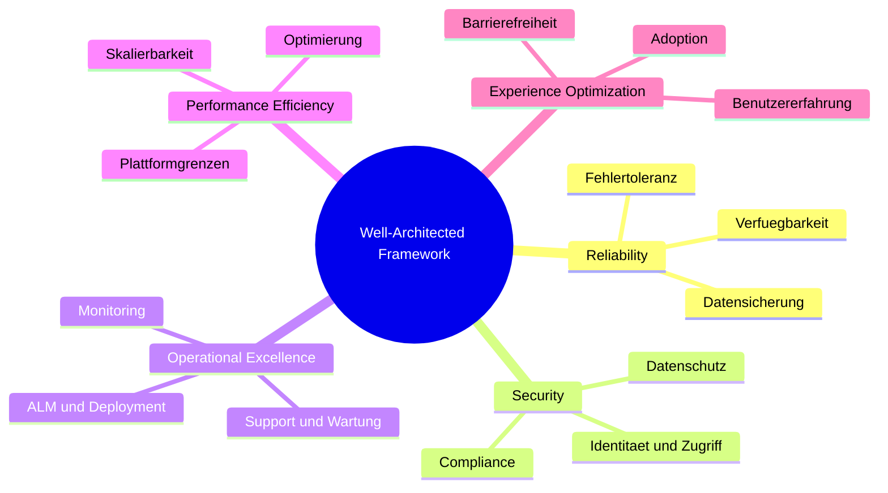

# Lab 1.5 - Architekturqualitaet sichern und typische Fehlerbilder erkennen

## Das Power Platform Well-Architected Framework

Microsoft hat fuer die Power Platform ein eigenes Well-Architected Framework definiert. Es beschreibt fuenf Saeulen, anhand derer eine Loesung bewertet werden kann. Eine gute Architektur erreicht in allen fuenf Saeulen ein angemessenes Niveau.

Das Framework ist kein Checklisten-Tool, das man am Ende eines Projekts ausfuellt. Es ist ein Denkrahmen, der den SA waehrend des gesamten Projekts begleitet.

## Die fuenf Saeulen

### Saule 1: Reliability (Zuverlaessigkeit)

Eine zuverlaessige Loesung funktioniert auch dann, wenn einzelne Komponenten ausfallen oder die Last steigt. Auf der Power Platform bedeutet das:

Fehlerbehandlung in Power Automate: Flows muessen Fehler fangen und protokollieren. Ein Flow, der bei einem Netzwerkfehler stillschweigend abbricht, ohne den Nutzer oder das Monitoring-System zu informieren, ist nicht zuverlaessig.

Dataverse-Verfuegbarkeit: Dataverse hat eine Microsoft-garantierte SLA von 99,9%. Die Loesung muss aber trotzdem mit transienten Fehlern umgehen koennen (Retry-Logik in Flows).

Datensicherung: Dataverse-Backups werden automatisch erstellt (taeglich, 28 Tage Aufbewahrung). Der SA muss sicherstellen, dass kritische Konfigurationen und angepasste Daten im Rahmen des ALM-Prozesses versioniert sind.

### Saule 2: Security (Sicherheit)

Sicherheit auf der Power Platform umfasst mehrere Ebenen:

Identitaet: Alle Nutzer authentifizieren sich ueber Microsoft Entra ID. Der SA entscheidet, welche Authentifizierungsflueffe (interaktiv, Service-to-Service) verwendet werden.

Datenzugriff: Wer darf welche Datensaetze sehen? Das Sicherheitsmodell mit Business Units, Rollen und Row-Level Security ist eine SA-Entscheidung.

Externe Verbindungen: Custom Connectors und HTTP-Aufrufe in Power Automate koennen sensible Daten nach aussen senden. Der SA prueft alle Verbindungen auf Sicherheitsrisiken.

DLP-Policies: Data Loss Prevention Policies definieren, welche Connectors zusammen verwendet werden duerfen. Der SA stimmt die DLP-Policies mit der IT-Abteilung ab.

### Saule 3: Operational Excellence

Eine Loesung, die nach Go-Live nicht wartbar ist, hat das Projekt langfristig nicht erfolgreich abgeschlossen.

Monitoring: Gibt es ein Dashboard, das zeigt ob Flows laufen und ob Fehler aufgetreten sind? Power Automate hat einen eingebauten Flow-Monitor, aber fuer kritische Loesungen empfiehlt sich Application Insights oder Azure Monitor.

ALM: Sind Loesungen in Solutions verpackt? Gibt es eine Umgebungsstrategie? Sind Deployments automatisiert oder mindestens dokumentiert?

Dokumentation: Kann ein neues Teammitglied die Loesung in einem vertretbaren Zeitraum verstehen? ADRs, Datenmodell-Dokumentation und Prozessbeschreibungen sind Teil der Loesung, nicht optionale Extras.

### Saule 4: Performance Efficiency

Die Plattform hat technische Grenzen. Eine performante Loesung arbeitet innerhalb dieser Grenzen und nutzt sie effizient.

Delegation: Canvas Apps muessen Datenabfragen an Dataverse delegieren, um performant zu sein. Nicht-delegierbare Funktionen wie IsBlank() oder Left() loesen alle Daten auf den Client und brechen bei grossen Datenmengen.

API Request Limits: Jeder lizenzierte Nutzer hat 40.000 API-Requests pro Tag (Power Platform Premium). Loesungen mit vielen automatisierten Flows koennen dieses Limit ueberschreiten.

Rollup-Asynchronitaet: Rollup-Spalten in Dataverse werden asynchron berechnet (Standard: alle 12 Stunden). Wenn Echtzeitaggregation benoetigt wird, braucht es eine andere Loesung.

### Saule 5: Experience Optimization

Eine Loesung, die technisch korrekt aber unbenutzbar ist, scheitert an der Adoption.

Benutzererfahrung: Model-Driven Apps sind effizienter fuer datenintensive Sachbearbeitung. Canvas Apps bieten mehr Gestaltungsfreiheit fuer einfache, benutzerfreundliche Interfaces. Der SA waehlt den richtigen App-Typ fuer die jeweilige Nutzungsanforderung.

Barrierefreiheit: Canvas Apps unterstuetzen Screen Reader, wenn sie korrekt entwickelt werden. Model-Driven Apps haben gute Barrierefreiheit von Haus aus.

Mobile Nutzung: Funktioniert die Loesung auf einem Smartphone? Nicht jede Canvas App ist automatisch mobil-tauglich.

## Sechs typische Fehlerbilder in Power Platform Projekten

### Fehlerbild 1: Alles in einer Umgebung

**Symptom:** Entwickler, Tester und Endnutzer arbeiten alle in derselben Umgebung.

**Konsequenz:** Ein fehlerhafter Flow oder eine fehlerhafte Konfigurationsaenderung beschaedigt Produktivdaten. Kein Rollback moeglich.

**Praevention:** Drei-Umgebungs-Strategie (Dev, Test, Prod) mit Solutions und Deployment-Pipeline.

### Fehlerbild 2: Sicherheitsrollen als Nachgedanke

**Symptom:** Alle Nutzer erhalten am Anfang Systemadministrator-Rechte. "Wir klaeren das spaeter."

**Konsequenz:** Sicherheitsmodell wird nie korrekt umgesetzt, weil das Abloesen von Admin-Rechten spaeter enormen Aufwand bedeutet und Nutzerwiderstand erzeugt.

**Praevention:** Sicherheitsmodell in der ersten Woche entwerfen und vom ersten Nutzer an korrekt anwenden.

### Fehlerbild 3: Nicht-delegierbare Filter in Canvas Apps

**Symptom:** Eine Canvas App filtert mit einer Funktion wie Mid() oder IsBlank() und gibt nur 500 Datensaetze zurueck, obwohl es 50.000 gibt.

**Konsequenz:** Nutzer sehen unvollstaendige Daten ohne es zu wissen. Das System scheint zu funktionieren, liefert aber falsche Ergebnisse.

**Praevention:** Alle Datenbankabfragen in Canvas Apps auf Delegierbarkeit pruefen. Power Apps zeigt eine gelbe Warnung fuer nicht-delegierbare Ausdrucke.

### Fehlerbild 4: Hardgecodete Konfiguration statt Umgebungsvariablen

**Symptom:** URL der externen API, Verbindungsdetails oder E-Mail-Adressen sind direkt in Flows und Apps eingetragen.

**Konsequenz:** Beim Deployment in die Produktivumgebung muessen Flows und Apps manuell angepasst werden. Fehler durch vergessene Anpassungen.

**Praevention:** Alle umgebungsabhaengigen Werte in Umgebungsvariablen speichern.

### Fehlerbild 5: Keine Fehlerbehandlung in Flows

**Symptom:** Power Automate Flows haben keinen "Run After"-Fehlerhandling-Block und keinen Scope fuer Try-Catch-Logik.

**Konsequenz:** Ein Flow, der fehlschlaegt, sendet keine Benachrichtigung. Prozesse bleiben unbemerkt stecken. HR bemerkt erst Wochen spaeter, dass Genehmigungen nicht ankamen.

**Praevention:** Jeder Flow hat einen Scope fuer die Hauptlogik und einen Scope fuer die Fehlerbehandlung, der bei Fehler des ersten ausgeloest wird.

### Fehlerbild 6: Solutions werden nicht genutzt

**Symptom:** Komponenten (Apps, Flows, Tabellen) werden direkt in der Umgebung erstellt, nicht in einer Solution.

**Konsequenz:** Kein strukturiertes Deployment moeglich. Komponenten koennen nicht als Einheit transportiert werden. Keine Versionshistorie.

**Praevention:** Von Tag 1 alles in einer Solution anlegen. Auch Dataverse-Tabellen und Sicherheitsrollen gehoeren in die Solution.

## Die Fragen, die ein SA regelmaessig stellen muss

Am Ende jedes Sprint-Reviews oder Architektur-Reviews stellt der SA folgende Fragen:

1. Welcher Teil der Loesung verletzt gerade eine der fuenf Well-Architected-Saeulen?
2. Welches der sechs Fehlerbilder ist im Entstehen?
3. Was ist der Plan, es zu beheben, bevor es zum echten Problem wird?

Diese Fragen sind unangenehm, aber notwendig. Ein SA, der diese Fragen nicht stellt, erledigt seinen Job nicht vollstaendig.

## Wo konfigurieren und überwachen?

| Thema | Navigation |
|---|---|
| Lösungen anlegen (alles in Solutions verpacken) | [make.powerapps.com](https://make.powerapps.com) → **Solutions** → + **New solution** |
| DLP-Richtlinien konfigurieren | [admin.powerplatform.microsoft.com](https://admin.powerplatform.microsoft.com) → **Policies** → **Data policies** |
| Flow-Monitoring (Fehler und Läufe einsehen) | [make.powerautomate.com](https://make.powerautomate.com) → **Monitor** → **Cloud flow activity** |
| Delegations-Warnungen in Canvas Apps | Power Apps Studio → Formelleiste → gelbes Warnsymbol bei nicht-delegierbaren Ausdrücken |
| Umgebungsstrategie (Dev/Test/Prod) einrichten | PPAC → **Environments** → + **New** |
| Komponenten ohne Solution finden | make.powerapps.com → **Solutions** → **Default solution** → alle unpackaged components |
