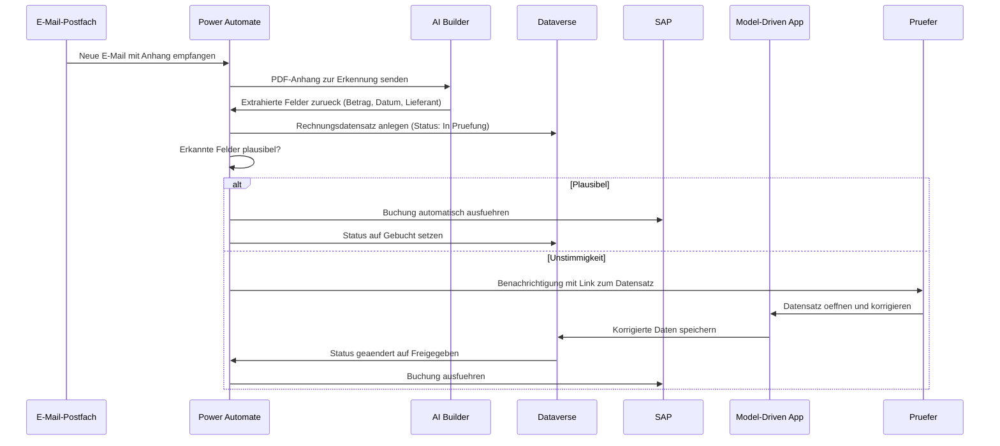

# Lab 2.1 - Loesung: Power Platform Komponenten einordnen

## Aufgabe 1: Komponentenzuordnung

**Szenario A: Aussendienstmitarbeiter Kundenbesuche**

Komponenten: Canvas App (mobil, offline-faehig) + Dataverse (Offline-Sync-Faehigkeit) + Power Automate (optional fuer Benachrichtigung bei Sync)

Begruendung: Canvas App wegen mobiler Nutzung und spezifischem einfachem Formular. Dataverse weil Offline-Synchronisation benoetigt wird. SharePoint hat keine native Offline-Sync-Faehigkeit fuer Power Apps.

**Szenario B: Rechnungsverarbeitung**

Komponenten: AI Builder (Formularerkennung fuer Rechnungsfelder) + Power Automate (E-Mail-Trigger, Workflow, SAP-Integration) + Dataverse (Rechnungsdatensaetze speichern) + Canvas App oder Model-Driven App (manuelle Pruefung bei Unstimmigkeiten)

Begruendung: AI Builder hat ein vorgefertigtes Rechnungserkennungsmodell. Power Automate verbindet E-Mail, AI Builder, Dataverse und SAP. Keine eigene KI-Entwicklung notwendig.

**Szenario C: HR Mitarbeiterdatenbank**

Komponenten: Dataverse (2.000 Datensaetze, komplexes Sicherheitsmodell) + Model-Driven App (40+ Felder, Sachbearbeitungskontext) + Power BI (Organigramm-Reports)

Begruendung: Das Row-Level-Sicherheitsmodell ("Sachbearbeiter sehen nur ihre Abteilung") erfordert zwingend Dataverse mit Business Units. SharePoint hat kein vergleichbares Sicherheitsmodell. Model-Driven App fuer viele Felder und komplexe Formulare.

## Aufgabe 2: Canvas vs. Model-Driven

1. **Wartungs-App fuer Techniker:** Canvas App. Die App muss mobil-optimiert sein und einfach bedienbar mit Handschuhen oder in schwierigen Umgebungen. Model-Driven Apps sind auf kleinen Bildschirmen unhandlich.

2. **Projektverwaltung mit 500 Projekten:** Model-Driven App. Viele Datensaetze, komplexe Formulare, Ansichten und Dashboards sind der Kern einer Model-Driven App. Canvas App waere hier ein erheblicher Mehraufwand ohne Mehrwert.

3. **Self-Service Stammdaten:** Canvas App. Einfaches Formular, wenige Felder, keine komplexen Ansichten. Canvas App liefert hier schnell eine benutzerfreundliche Loesung. Optional: Model-Driven App wenn der Datensatz bereits in Dataverse vorhanden ist.

## Aufgabe 3: Dataverse vs. SharePoint

1. **Antragslosung mit Row-Level-Security:** Dataverse. Das Sicherheitsmodell (Antragsteller sehen nur eigene Antraege, Genehmiger nur Antraege ihrer Mitarbeiter) kann nur mit Dataverse korrekt abgebildet werden. SharePoint bietet kein Row-Level-Sicherheitsmodell auf Listenebene.

2. **Dokumentensammlung Unternehmensrichtlinien:** SharePoint. Dokumente, keine strukturierten Daten. Alle lesen, kein komplexes Sicherheitsmodell. SharePoint ist ideal fuer Dokumentenmanagement und ist in den meisten M365-Lizenzen enthalten.

3. **Kundendatenbank mit CRM-Integration:** Dataverse. Wenn ein Microsoft CRM-System (Dynamics 365 Sales oder Customer Service) verwendet wird, ist Dataverse die Datenbasis. Bei 100.000 Datensaetzen und CRM-Integration ist Dataverse die einzige sinnvolle Wahl.

## Aufgabe 4: Architekturdiagramm Rechnungsverarbeitung

