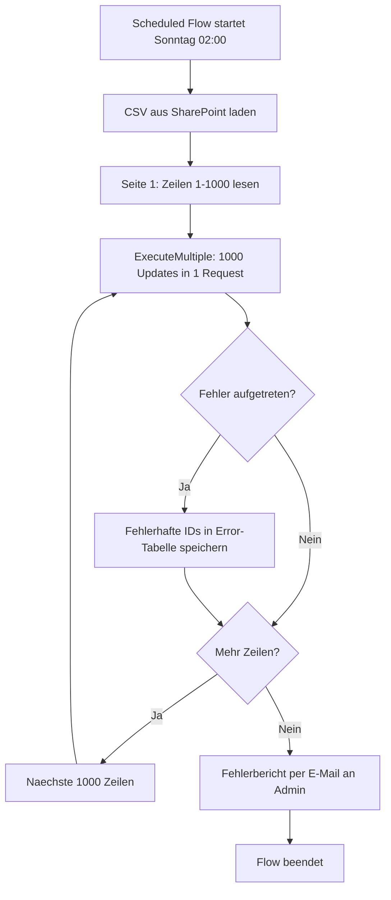

# Lab 2.4 - Loesung: Limit-bewusstes Architekturdesign

## Aufgabe 1: Limit-Risiken

| Anforderung | Moegliches Limit | Risikobewertung |
|---|---|---|
| 5.000 Bestellungen/Tag, 1.000 in 2h | Service Protection: 6.000 Requests in 5 Minuten. Bei 1.000 Bestellungen in 120 Minuten = 8 pro Minute x 5 Aktionen = 40 Requests/Minute. Weit unter Limit. | Niedrig |
| Fotos (2 MB, 200/Monat) | Dataverse File Storage: teuer. 200 x 2 MB x 12 Monate x 2 Jahre = 9,6 GB. | Mittel (Kostenfrage) |
| 100.000 Produkt-Updates monatlich | API-Request-Limit: 40.000/Tag fuer einen Nutzer. 100.000 Updates = mehr als ein Tag Verarbeitung ohne Batching. | Hoch |
| Canvas App mit 3.000 Datensaetzen | Delegation: 3.000 Datensaetze unter Limit von 2.000? Nein! Canvas App laedt ohne Delegation maximal 2.000 Datensaetze. | Hoch |
| Spitzenstunde 500 Bestellungen/Stunde | Kein Limit-Problem bei 5 Aktionen pro Bestellung. | Niedrig |

## Aufgabe 2: Batch-Design CSV-Import

**Gesamtplan:**
100.000 Datensaetze, ExecuteMultiple mit 1.000 Datensaetzen pro Batch = 100 API-Requests.
100 API-Requests fuer 100.000 Updates. Weit unter allen Limits.

**Flow-Design:**



**Fehlerbehandlung:** Jeder Batch wird einzeln versucht. Wenn ein Batch fehlschlaegt, werden die IDs der fehlgeschlagenen Datensaetze in eine separate Tabelle geschrieben. Nach dem Import laeuft ein zweiter Flow, der nur die fehlgeschlagenen IDs erneut versucht.

**Maximale Dauer:** 100 Batches mit ca. 1 Sekunde pro Batch = 100 Sekunden = unter 2 Minuten. Sehr zuverlaessig.

## Aufgabe 3: Datei-Strategie Reklamationsfotos

**Speicherberechnung:**

Option A (Dataverse File Storage):
200 Fotos x 2 MB x 12 Monate x 2 Jahre = 9.600 MB = 9,6 GB
Dataverse File Storage Preis: ca. 2 USD pro GB/Monat (als Richtwert)
Kosten nach 2 Jahren: laufend 9,6 x 2 = 19,20 USD/Monat

Option B (SharePoint):
SharePoint-Speicher ist in den meisten M365-Lizenzen enthalten oder sehr guenstig.
9,6 GB in SharePoint: praktisch kostenlos fuer Unternehmen mit M365 Business.

**Empfehlung:** SharePoint. Das Unternehmen hat nachweislich M365 (da Power Platform genutzt wird). SharePoint ist kostenguenstiger fuer Dateien, bietet Versionierung und Preview. Der Link zur SharePoint-Datei wird in Dataverse als URL-Feld gespeichert.

**Voraussetzung:** Das Sicherheitsmodell in SharePoint muss so konfiguriert sein, dass nur autorisierte Nutzer die Reklamationsfotos sehen koennen.

## Aufgabe 4: Canvas App Performance

**Massnahme 1: Paginierung statt Vollladung**

Statt alle 3.000 Bestellungen beim Start zu laden, wird eine Paginierung implementiert. Die App laedt beim Start nur die ersten 50 neuesten offenen Bestellungen. Schaltflaechen "Naechste Seite" laden je 50 weitere Datensaetze. Ladezeit: unter 1 Sekunde.

Implementierung: 
```
// ClearCollect beim Start - nur erste 50
ClearCollect(OffeneBestellungen, 
    FirstN(
        Filter(Bestellungen, Status = "Offen"),
        50
    )
)
```

**Massnahme 2: Filter-Optimierung mit delegierbaren Ausdrucken**

Sicherstellen, dass alle Filter delegierbar sind (keine IsBlank(), kein Left()). Alle Filterkriterien muessen auf indexierten Feldern basieren, damit Dataverse die Abfrage effizient ausfuehren kann.

**Massnahme 3: Start-Collections fuer Lookups**

Dropdown-Listen (Statustypen, Bearbeiter, Produkte) werden einmal beim App-Start in Collections geladen und dann lokal verwendet. Das vermeidet wiederholte Datenbankabfragen fuer Daten, die sich selten aendern.
