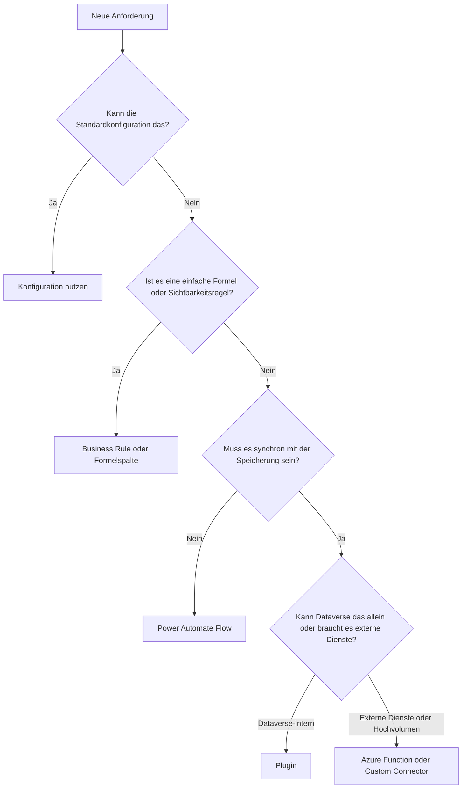

# Lab 2.5 - Loesung: Erweiterungsoptionen auswaehlen

## Aufgabe 1: Erweiterungs-Klassifikation

| Nr. | Anforderung | Erweiterungsebene | Begruendung |
|---|---|---|---|
| 1 | Lieferdatum automatisch setzen | Formelspalte oder Plugin PreOperation | Formelspalte wenn Werktags-Berechnung einfach. Plugin wenn Feiertage beruecksichtigt werden muessen. |
| 2 | SAP-Update bei Auftragsabschluss | Power Automate Flow | Asynchron akzeptabel. Power Automate mit SAP-Connector ist die richtige Wahl. |
| 3 | Duplikat-E-Mail verhindert Speicherung | Plugin PreValidation | Muss synchron sein (Speicherung verhindern). Dataverse Duplicate Detection alternativ pruefen. |
| 4 | Feld nur bei Geschaeftskunde sichtbar | Business Rule (Konfiguration) | Einfache Sichtbarkeitslogik ist der Kernzweck von Business Rules. |
| 5 | Naechtlich inaktive Kunden setzen | Power Automate Scheduled Flow | Zeitgesteuerter Flow mit Paginierung. Azure Function wenn Volumen sehr gross. |
| 6 | Creditreform-API anbinden | Custom Connector + Power Automate Flow | Kein Standard-Connector. Custom Connector definiert die API, Flow ruft sie auf. |
| 7 | Vollstaendiger Name = Vorname + Nachname | Formelspalte | Power Fx Formel: cr_Vorname & " " & cr_Nachname. Echtzeit, kein Code. |
| 8 | Aufgaben stornieren wenn Projekt abgelehnt | Power Automate Flow | Asynchron akzeptabel, da keine synchrone Validierung noetig. Kein Plugin erforderlich. |

## Aufgabe 2: Plugin-Pipeline

1. **Lagerbestand pruefen, Bestellung verhindern:** Plugin PreValidation. Muss synchron und vor der Speicherung ausgefuehrt werden. PreValidation kann die Speicherung mit einer Fehlermeldung abbrechen.

2. **Bestellnummer-Code automatisch setzen:** Plugin PreOperation. Der Wert muss gesetzt werden, bevor Dataverse speichert, damit der gespeicherte Datensatz die Bestellnummer enthaelt. PostOperation waere zu spaet, weil der Datensatz dann schon ohne Bestellnummer in der Datenbank steht.

3. **Kontakte archivieren nach Kundelloeschung:** Plugin PostOperation (oder Power Automate). Die Archivierung ist eine Folgeaktion nach dem Loeschen. PostOperation laeuft noch in der gleichen Transaktion. Alternativ: Power Automate Flow auf "Delete" Event.

4. **E-Mail bei Lieferdatum-Aenderung:** Power Automate Flow, kein Plugin. E-Mail-Versand ist asynchron und hat keine Anforderung, die Speicherung zu blockieren.

## Aufgabe 3: Entscheidungsbaum



## Aufgabe 4: Overengineering erkennen

**Probleme an dem Vorschlag:**

1. Unnoetige Komplexitaet: Die Berechnung von Urlaubstagen (Enddatum minus Startdatum) ist eine einfache Differenzberechnung. Diese kann als Formelspalte direkt in Dataverse implementiert werden: `DateDiff(cr_Startdatum, cr_Enddatum, TimeUnit.Days)`.

2. Unnoetige Infrastruktur: Eine Azure Function erfordert Azure-Hosting, Deployment-Pipeline, Monitoring und Kosten. Fuer eine Datumsberechnung ist das voellig unverhaaltnismaessig.

3. Latenz und Fehlerquellen: Plugin + Azure Function + Rueckschreibung sind drei Fehlerquellen. Jede kann fehlschlagen. Die Kette Plugin → HTTP-Aufruf → Azure Function ist synchron und blockiert die Speicherung waehrend die Azure Function antwortet.

**Richtige Loesung:**

Formelspalte cr_AnzahlUrlaubstage mit der Formel:
```
DateDiff(cr_Startdatum, cr_Enddatum, TimeUnit.Days) + 1
```

Diese Formel wird in Echtzeit berechnet, erfordert keinen Code, kein Deployment, keine Azure-Infrastruktur und kann nicht fehlschlagen.
