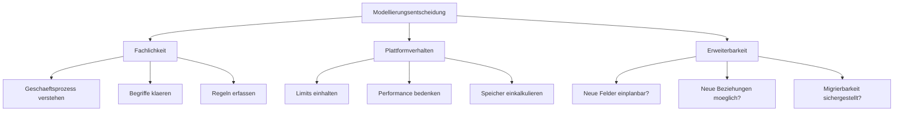
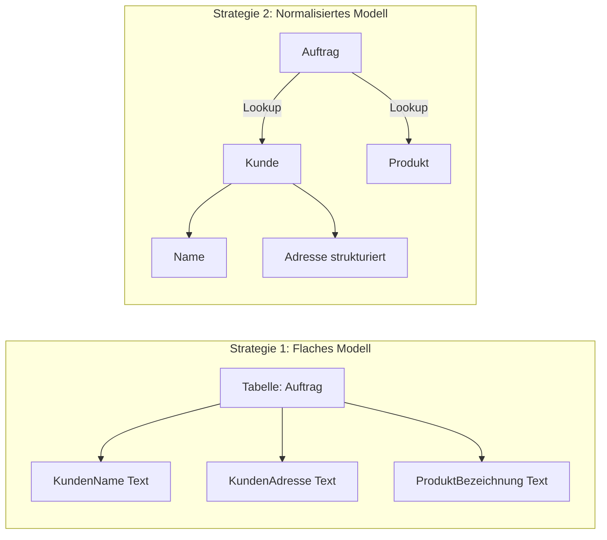
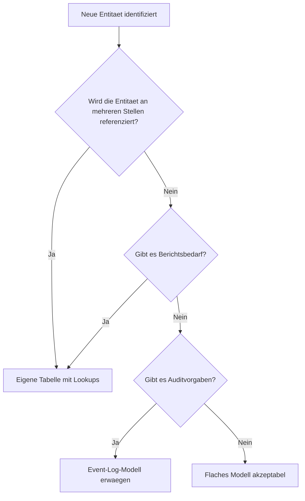
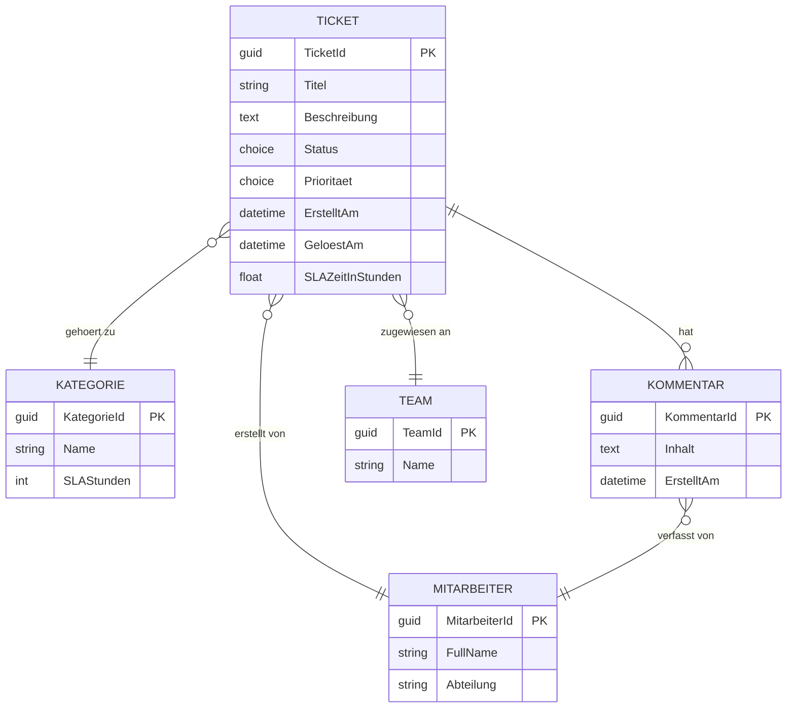

# Theorie: Datenmodell-Strategien fuer Loesungen entwickeln

## Was ist Datenmodellierung im Kontext der Power Platform?

Datenmodellierung ist die Disziplin, in der ein Solution Architect festlegt, wie Informationen strukturiert, gespeichert, miteinander verknuepft und abrufbar gemacht werden. Im Kontext der Power Platform bedeutet das konkret: Welche Tabellen entstehen in Dataverse, welche Felder enthalten sie, wie haengen sie zusammen und welche Auswirkungen hat diese Entscheidung auf Performance, Wartbarkeit, Kosten und Nutzerfreundlichkeit?

Ein Entwickler denkt in Feldern und Tabellen. Ein Solution Architect denkt in Konsequenzen. Die Entscheidung "Wir speichern Adressen als Freitext in einem einzigen Feld" klingt zuerst einfach. Spaeter wird klar, dass man nach Ort nicht filtern kann, keine Duplikatpruefung moeglich ist und Integrationen mit Drittsystemen scheitern, weil die Adressstruktur fehlt. Solche Fehler entstehen immer dann, wenn Modellierung ohne Blick auf spaetere Anforderungen passiert.

## Die drei Einflussfaktoren auf Modellierungsentscheidungen

Jede Modellierungsentscheidung wird von drei Kraefte-Paaren beeinflusst:

### Fachlichkeit

Fachlichkeit bedeutet: Das Modell bildet den echten Geschaeftsprozess ab. Es gibt keine gute Datenmodellierung ohne ein tiefes Verstaendnis der Geschaeftsprozesse. Ein Beispiel: Ein Unternehmen moechte "Kundenbesuche" erfassen. Klingt einfach. Doch was ist ein Besuch? Ist es ein Termin? Ein Protokoll? Eine Gespraeichsaufzeichnung? Hat ein Besuch einen Status? Kann ein Besuch mehrere Teilnehmer haben? Kann ein Besuch einem Auftrag zugeordnet werden?

Erst wenn diese Fragen geklart sind, entsteht ein tragfaehiges Modell. Der SA muss diese Fragen im Discovery systematisch erheben.

### Plattformverhalten

Dataverse hat konkrete technische Grenzen. Diese sind keine Softwarefehler, sondern Designentscheidungen der Plattform:

| Limit | Wert | Auswirkung auf Modellierung |
|---|---|---|
| Felder pro Tabelle | 1.000 | Viele kleine Felder koennen problematisch werden |
| Beziehungen pro Tabelle | 120 N:1, 200 1:N | Komplexe Graphen sind moeglich aber aufwaendig |
| Rollup-Berechnungen | Delay von bis zu 12 Stunden | Rollups nicht fuer Echtzeittransaktionen geeignet |
| Maximale Datensatzgroesse | 64 MB | Binary-Daten separat speichern |
| Such-Spalten (Lookup) in Formularen | Praktischer Limit ca. 30 pro Formular | Zu viele Lookups belasten Ladezeit |

### Erweiterbarkeit

Ein Modell das heute passt, muss in zwei Jahren noch erweiterbar sein. Das bedeutet: Felder sollten nicht zu eng definiert werden. Zum Beispiel ist ein Feld "Prioritaet" als Choice (1, 2, 3) leichter erweiterbar als als Boolean. Ein Modell das bereits heute mit "IstDringend: Ja/Nein" arbeitet, muss spaeter aufgebrochen werden, wenn drei Prioritaetsstufen gefordert werden.

## Vier Modellierungsstrategien im Vergleich

### Strategie 1: Flaches Modell

Alle Informationen in einer einzigen Tabelle. Einfach zu verstehen, schnell zu bauen, aber schlecht fuer Wiederverwendung. Wenn sich der Kundenname aendert, muss er in allen Auftraegen geaendert werden. Berichte ueber Kunden sind schwierig. Duplikate entstehen automatisch.

**Geeignet fuer:** Sehr einfache Erfassungsszenarien ohne Berichtswesen, einmalige Datenerfassung, Prototypen.

### Strategie 2: Normalisiertes Modell

Jede Information wird genau einmal gespeichert. Kunden, Produkte, Orte sind eigene Tabellen. Auftraege verweisen per Lookup auf diese Tabellen. Aenderungen am Kunden wirken sich automatisch auf alle Auftraege aus.

**Geeignet fuer:** Operative Geschaeftsanwendungen, Szenarien mit Berichtswesen, langfristige Datenpflege.

### Strategie 3: Erweiterungsmodell

Die Basistabelle bleibt schmal. Optionale Erweiterungen werden in verwandten Tabellen gespeichert. Beispiel: Jeder Auftrag hat eine Basistabelle. Auftrag-Spezialfelder fuer bestimmte Produktkategorien stehen in einer separaten Tabelle mit 1:1-Beziehung.

**Geeignet fuer:** Szenarien mit heterogenen Datenprofilen, wenn verschiedene Abteilungen unterschiedliche Felder benoetigen.

### Strategie 4: Event-Log-Modell

Statt Zustaende zu ueberschreiben werden Ereignisse protokolliert. Der aktuelle Zustand ergibt sich aus der Summe der Ereignisse. Beispiel: Statt "Kontostand = 1000 EUR" gibt es Buchungszeilen: +500, +800, -300. Der Kontostand ist immer berechenbar.

**Geeignet fuer:** Audit-relevante Prozesse, Finanzanwendungen, Szenarien in denen der Verlauf wichtig ist.

## Wie der SA die richtige Strategie waehlt

Die Wahl der Strategie haengt von konkreten Fragen ab:

1. Werden Daten wiederverwendet? (Wenn ja: Normalisierung)
2. Gibt es Berichtsbedarf ueber mehrere Datensaetze hinweg? (Wenn ja: keine flache Struktur)
3. Gibt es Auditvorgaben? (Wenn ja: Event-Log erwagen)
4. Sind die Daten homogen oder heterogen? (Wenn heterogen: Erweiterungsmodell)
5. Wie schnell wachsen die Daten? (Auswirkung auf Speicher und Performance)

## Praxisbeispiel: Modellierung eines Serviceticket-Systems

Ein Unternehmen moechte IT-Supportanfragen erfassen. Die Anforderungen:
- Mitarbeiter erstellen Tickets
- Tickets werden Supportteams zugewiesen
- Jedes Ticket hat eine Kategorie
- Tickets koennen mehrere Kommentare haben
- Tickets koennen dringlich sein oder nicht
- SLA-Zeiten muessen gemessen werden

Ein erfahrener SA wuerde folgendes Modell entwickeln:

Warum dieses Modell? Die Kategorie ist eine eigene Tabelle, weil daran SLA-Zeiten haengen und sie wiederverwendet wird. Das Team ist eine eigene Tabelle, weil Berichte ueber Teams erwartet werden. Kommentare sind eigene Datensaetze, weil es beliebig viele geben kann (1:N). Der Mitarbeiter ist eine eigene Tabelle, weil er bereits in Dataverse als SystemUser vorliegt.

## Was dieses Lab im Zusammenhang mit anderen Labs bedeutet

Dieses Lab bildet das Fundament fuer Lab 3.2 (Datentypen und Beziehungen), Lab 3.3 (Berechnungslogik) und Lab 3.4 (Speicher). Ohne ein durchdachtes Datenmodell koennen diese Einzelentscheidungen nicht sinnvoll getroffen werden.

Der Solution Architect verantwortet das Gesamtmodell. Einzelne Felder und Tabellen entscheiden Entwickler. Die Strategie und Struktur entscheidet der SA.

## Wo konfigurieren und überwachen?

| Thema | Navigation |
|---|---|
| Neue Tabelle anlegen | [make.powerapps.com](https://make.powerapps.com) → **Dataverse** → **Tables** → + **New table** |
| Publisher-Prefix festlegen (für Namespacing) | make.powerapps.com → **Solutions** → **Publishers** → + **New publisher** |
| Vorhandene Tabellen und Felder einsehen | make.powerapps.com → **Dataverse** → **Tables** → [Tabelle] → **Columns** |
| Lösung mit Publisher anlegen | make.powerapps.com → **Solutions** → + **New solution** → Publisher auswählen |
