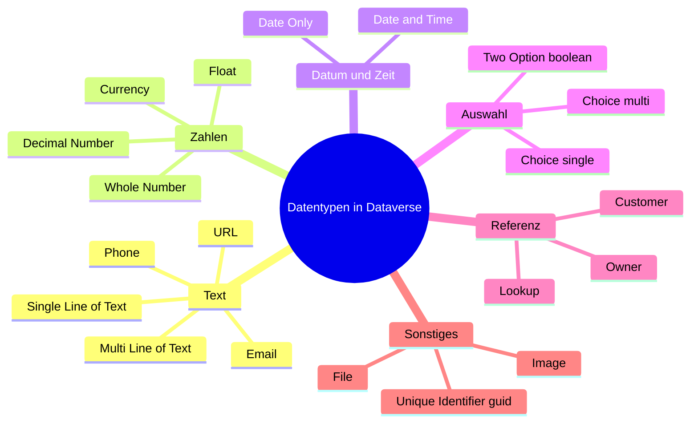
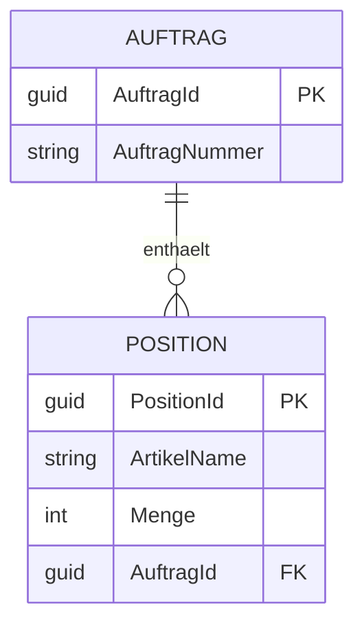
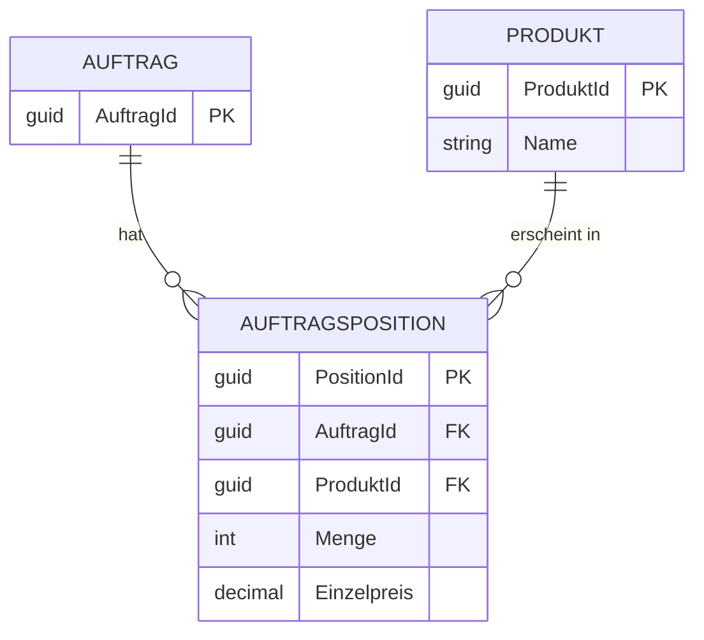
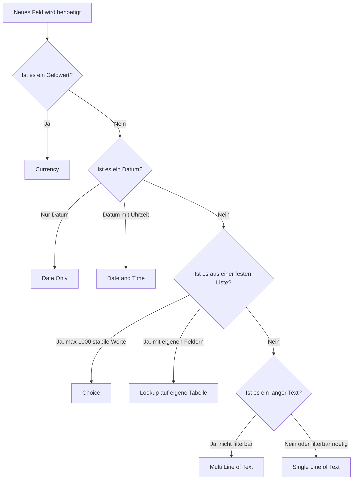

# Theorie: Datentypen, Beziehungen und Schluessel gezielt einsetzen

## Warum Datentypen eine Architekturentscheidung sind

Ein Datentyp ist nicht nur eine technische Eigenschaft eines Feldes. Er ist eine Entscheidung ueber das Verhalten der gesamten Anwendung. Wenn ein Architect ein Preisfeld als Text statt als Currency anlegt, kann spaeter nicht nach dem hoechsten Preis sortiert werden, keine Summe gebildet werden und keine Waehrungsumrechnung stattfinden. Der Fehler entsteht beim Entwurf, die Kosten entstehen beim Betrieb.



## Die wichtigsten Datentypen und ihre Fallstricke

### Text und seine Varianten

**Single Line of Text** ist der haeufigste Typ. Er hat eine einstellbare maximale Laenge (Standard 100 Zeichen, Maximum 4.000 Zeichen). Eine haeufige Fehlerquelle: Felder fuer Namen werden mit 100 Zeichen angelegt, obwohl spaeter Firmennamen mit Rechtsform eingegeben werden sollen. Grundregel: Lieber grosszuegig bemessen.

**Multi Line of Text** erlaubt beliebig langen Text (bis 1.048.576 Zeichen). Wichtig: Dieses Feld kann nicht in Views nach Inhalt sortiert oder gefiltert werden. Wenn ein Feld spaeter in einer Filteransicht erscheinen soll, muss es als Single Line angelegt werden.

**URL, Email und Phone** sind technisch Texte, erhalten aber in Model-Driven Apps eine spezielle Darstellung (klickbarer Link, anrufbarer Hyperlink). Diese Felder sollten immer dann gewaehlt werden, wenn es sich semantisch um diese Informationstypen handelt.

### Zahlen: Whole Number, Decimal und Currency

Diese drei Typen klingen aehnlich, haben aber entscheidende Unterschiede:

| Typ | Nachkommastellen | Geeignet fuer | Nicht geeignet fuer |
|---|---|---|---|
| Whole Number | Keine | Stueckzahlen, Mengen, Dauerfelder in Minuten | Preise, Gewichte, Berechnungen |
| Decimal Number | Bis zu 10 | Gewichte, Messwerte, Prozentzahlen | Waehrungsbetraege |
| Currency | Systemgesteuert, meist 2 | Alle Geldbetraege | Nicht-Geldwerte |

Der Typ Currency ist in Dataverse besonders: Er erstellt automatisch ein zweites Feld fuer die Basiswaehrung, wenn in der Umgebung mehrere Waehrungen aktiv sind. Das sollte bei Speicherplanung beruecksichtigt werden.

### Date Only versus Date and Time

Ein Fehler der haeufig vorkommt: Ein Lieferdatum wird als "Date and Time" angelegt. Jetzt speichert Dataverse intern UTC, und in Deutschland (UTC+2 im Sommer) wird der 1. Januar um 00:00 Uhr als 31. Dezember des Vorjahres angezeigt. Das Unternehmen sieht die Lieferungen falsch datiert.

Faustregel: Wenn nur das Datum relevant ist (Geburtstag, Lieferdatum, Faelligkeitsdatum), immer "Date Only" verwenden. "Date and Time" nur dann, wenn der Zeitpunkt relevant ist (Protokollereignisse, Terminbuchungen).

### Choice: Der unterschaetzte Datentyp

Ein Choice-Feld speichert einen oder mehrere Werte aus einer vordefinierten Liste. Technisch wird ein Integer gespeichert, der einem Label zugeordnet ist. Das hat wichtige Konsequenzen:

1. Choice-Felder koennen gut gefiltert und gruppiert werden
2. Labels koennen spaeter geaendert werden, ohne Datenverlust
3. Choices koennen global (wiederverwendbar in mehreren Tabellen) oder lokal (nur fuer eine Tabelle) sein

**Wann Choice, wann Lookup?**

| Kriterium | Choice | Lookup |
|---|---|---|
| Werte spaeter erweiterbar? | Ja (max. 1.000 Eintraege) | Ja (unlimitiert) |
| Werte haben eigene Felder? | Nein | Ja |
| Werte werden in Berichten analysiert? | Einfach moeglich | Moeglich aber komplexer |
| Nutzer sollen neue Werte anlegen koennen? | Nein, nur Admins | Ja |
| Werte haben eigene Beziehungen? | Nein | Ja |

**Praxisregel:** Wenn die Anzahl der moeglichen Werte begrenzt und stabil ist (Status, Prioritaet, Kategorie), dann Choice. Wenn die Werte eigene Eigenschaften haben oder von Nutzern gepflegt werden, dann Lookup.

## Beziehungstypen in Dataverse

### 1:N Beziehungen (One-to-Many)

Das ist die haeufigste Beziehungsart. Eine Zeile in Tabelle A (die uebergeordnete Tabelle) kann mit beliebig vielen Zeilen in Tabelle B (die untergeordnete Tabelle) verknuepft sein. Technisch wird das durch ein Lookup-Feld in der untergeordneten Tabelle realisiert.



**Kaskadierungsverhalten:** Bei 1:N-Beziehungen kann konfiguriert werden, was mit untergeordneten Datensaetzen passiert, wenn der uebergeordnete geloescht wird. Optionen:
- Cascade Delete: Alle untergeordneten Datensaetze werden mitgeloescht
- Restrict Delete: Loeschen verhindert, wenn untergeordnete Datensaetze existieren
- Remove Link: Lookup-Feld in untergeordneten Datensaetzen wird auf leer gesetzt

Die Wahl hat erhebliche Datensicherheitsauswirkungen. Cascade Delete sollte nur dann gewaehlt werden, wenn untergeordnete Datensaetze ohne den uebergeordneten keine Bedeutung haben.

### N:N Beziehungen (Many-to-Many)

Ein Auftrag kann mehrere Produkte enthalten, und ein Produkt kann in mehreren Auftraegen vorkommen. Diese Beziehung benoetigt technisch eine Zwischentabelle.

Dataverse erstellt diese Zwischentabelle automatisch bei einer N:N-Beziehung. Allerdings hat diese automatisch erstellte Zwischentabelle keine eigenen Felder. Wenn die Beziehung selbst Eigenschaften hat (z.B. "Menge" bei der Beziehung zwischen Auftrag und Artikel), muss eine manuelle Zwischentabelle erstellt werden.



### Lookup versus Customer versus Owner

Diese drei "Referenz-Typen" werden oft verwechselt:

**Lookup:** Verweist auf genau einen spezifischen Tabellentyp. "Dieser Auftrag gehoert zu diesem Kunden" (Lookup auf Account). Eindeutig, einfach, wartbar.

**Customer:** Verweist auf entweder einen Account ODER einen Contact. Wird verwendet, wenn ein Datensatz sowohl an Unternehmen als auch an Einzelpersonen haengen kann. Intern speichert Dataverse sowohl den Typ als auch die ID. Nachteil: Komplexer in Flows und API-Abfragen.

**Owner:** Spezielles Feld, das automatisch an jede Tabelle mit Eigentuemer-basiertem Zugriff angehaengt wird. Verweist auf SystemUser oder Team. Dient als Grundlage fuer das Sicherheitsmodell.

## Alternativschluessel: Wenn die Guid nicht reicht

Jeder Datensatz in Dataverse hat eine automatisch generierte GUID als Primaerschluessel. Diese GUID ist intern aber fuer Integrationen mit Drittsystemen ungeeignet, weil das externe System eine eigene ID hat.

**Beispiel:** Ein ERP-System hat Kunden mit der Kundennummer "KD-10045". Beim Import nach Dataverse erhaelt dieser Kunde eine neue GUID. Wenn das ERP spaeter eine Aenderung schickt, muss Dataverse wissen: "Kundennummer KD-10045 ist dieselbe wie GUID xyz".

Alternativschluessel loesen genau dieses Problem. Sie definieren ein Feld (oder eine Kombination von Feldern) als eindeutigen Identifier zusaetzlich zur GUID.

```
Alternativschluessel fuer Account:
  -> Feld: cr_ERP_KundenNummer
  -> Wert muss eindeutig sein in der gesamten Tabelle

Upsert-Aufruf der Integration:
  PATCH /api/data/v9.2/accounts(cr_ERP_KundenNummer='KD-10045')
  -> Wenn vorhanden: Update
  -> Wenn nicht vorhanden: Create
```

**Wichtige Einschraenkungen bei Alternativschluesseln:**
- Maximal 5 Alternativschluessel pro Tabelle
- Das Feld muss als "required" konfiguriert sein
- Alternativschluessel erzeugen einen Datenbankindex, was bei grossen Tabellen die Schreibperformance leicht verringern kann
- Nicht alle Feldtypen koennen als Alternativschluessel genutzt werden (z.B. kein Multi-Line Text, kein Image)

## Zusammenfassung: Entscheidungsregeln fuer den SA



## Wo konfigurieren und überwachen?

| Thema | Navigation |
|---|---|
| Spalte (Datentyp) anlegen | [make.powerapps.com](https://make.powerapps.com) → **Dataverse** → **Tables** → [Tabelle] → **Columns** → + **Column** |
| 1:N-Beziehung erstellen | make.powerapps.com → **Tables** → [Tabelle, übergeordnet] → **Relationships** → + **Relationship** → **One-to-many** |
| N:N-Beziehung erstellen | make.powerapps.com → **Tables** → [Tabelle] → **Relationships** → + **Relationship** → **Many-to-many** |
| Alternativschlüssel (Alternate Key) anlegen | make.powerapps.com → **Tables** → [Tabelle] → **Keys** → + **New key** |
| Kaskadierungsverhalten einer Beziehung ändern | make.powerapps.com → **Tables** → [Tabelle] → **Relationships** → [Beziehung] → **Advanced options** → Cascade type |
| Währungseinstellungen der Umgebung | PPAC → **Environments** → [Umgebung] → **Settings** → **Business** → **Currencies** |
