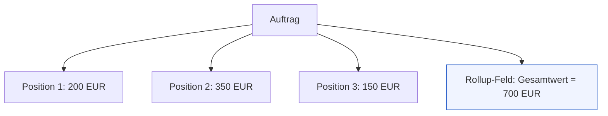
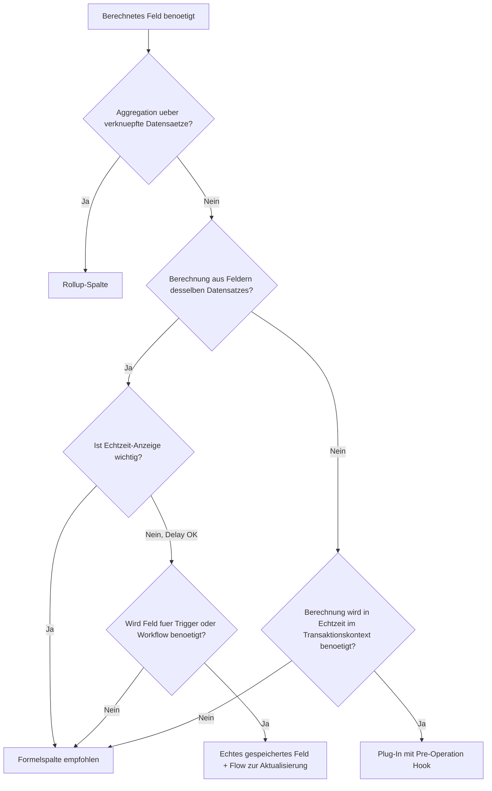

# Theorie: Berechnungslogik im Datenmodell korrekt bewerten

## Das Problem mit Berechnungen in Dataverse

In nahezu jeder Geschaeftsanwendung gibt es Felder, die sich aus anderen Feldern ergeben: Ein Gesamtpreis ergibt sich aus Einzelpreis mal Menge. Ein Alter ergibt sich aus dem Geburtsdatum und dem heutigen Datum. Die Anzahl offener Aufgaben eines Projekts ergibt sich aus der Summe aller Aufgaben mit Status "Offen".

Dataverse bietet drei verschiedene Mechanismen fuer solche Berechnungen an: Rollup-Spalten, berechnete Spalten (Calculated Columns) und Formelspalten (Formula Columns). Sie klingen aehnlich, verhalten sich aber grundlegend unterschiedlich. Die falsche Wahl fuehrt zu falschen Ergebnissen, schlechter Performance oder spaeterer Nichtmigrierbarkeit.

## Rollup-Spalten: Aggregation ueber verknuepfte Datensaetze

Eine Rollup-Spalte berechnet einen aggregierten Wert ueber eine 1:N-Beziehung hinweg. Typische Beispiele:
- Summe aller Positionen eines Auftrags
- Anzahl offener Tickets eines Kunden
- Maximaler Wert eines Angebots ueber alle Angebotspositionen



**Technisches Verhalten von Rollup-Spalten:**

Rollup-Spalten werden NICHT in Echtzeit berechnet. Sie werden von einem systeminternen Job aktualisiert, der alle 12 Stunden lauft. Das bedeutet: Wenn ein Nutzer eine neue Position anlegt, sieht er nicht sofort den aktualisierten Gesamtwert. Er sieht den Wert von der letzten Berechnung.

Es ist moeglich, eine manuelle Neuberechnung auszuloesen (ueber den Datensatz selbst oder per API), aber diese Moeglichkeit ist fuer Endnutzer nicht immer sichtbar.

**Einschraenkungen von Rollup-Spalten:**
- Aggregatfunktionen: SUM, COUNT, MIN, MAX, AVG
- Maximal 10 Rollup-Felder pro Tabelle
- Tiefe der Beziehung: nur direkte 1:N (kein "Enkel")
- Keine Echtzeitaktualisierung

**Wann Rollup-Spalten verwenden:**
- Wenn der Wert aggregiert ueber verknuepfte Datensaetze sein muss
- Wenn ein geringfuegiger Delay (bis zu 12 Stunden) akzeptabel ist
- Wenn die Aggregation fuer Berichte oder Ansichten genutzt wird, aber nicht fuer Transaktionsentscheidungen

## Berechnete Spalten (Calculated Columns): Felder die sich aus anderen Feldern ergeben

Eine berechnete Spalte berechnet ihren Wert aus anderen Feldern desselben Datensatzes oder aus direkt verknuepften Datensaetzen (ueber einen Lookup). Sie werden bei Datenbankabfragen berechnet, nicht zur Eingabezeit.

Beispiele:
- Vollstaendiger Name: `Vorname + " " + Nachname`
- Restlaufzeit: `Enddatum - Heute()`
- Mehrwertsteuer: `Nettobetrag * 0.19`

**Wichtige Einschraenkungen:**
- Calculated Columns koennen nicht in anderen Calculated Columns verwendet werden (keine Ketten)
- Sie werden nicht gespeichert, sondern bei jeder Abfrage neu berechnet
- Sie koennen nicht als Alternativschluessel verwendet werden
- Nicht alle Funktionen sind verfuegbar (z.B. kein komplexes String-Processing)

**Deprecation-Hinweis (Stand 2024/2025):**
Microsoft hat begonnen, berechnete Spalten in Richtung Formelspalten zu migrieren. Neue Loesungen sollten Formelspalten bevorzugen, da Calculated Columns langfristig abgeloest werden.

## Formelspalten (Formula Columns): Der moderne Ansatz

Formelspalten wurden 2022 eingefuehrt und nutzen die Power Fx Sprache, dieselbe Formelsprache wie in Excel und Power Apps Canvas. Sie loesen berechnete Spalten groesstenteils ab und bieten mehr Flexibilitaet.

```mermaid
comparison
title Berechnungsarten im Vergleich
accTitle: Vergleich Berechnungsarten Dataverse
accDescr: Vergleich der drei Berechnungsarten in Dataverse
    option1 Rollup-Spalte
        Quelle : verknuepfte Datensaetze
        Zeitpunkt : verzoegert bis 12h
        Sprache : einfache Aggregatfunktionen
        Gespeichert : Ja
    option2 Calculated Column
        Quelle : gleicher Datensatz
        Zeitpunkt : bei Abfrage
        Sprache : FetchXML-basiert
        Gespeichert : Nein
    option3 Formula Column
        Quelle : gleicher Datensatz + Lookup
        Zeitpunkt : bei Abfrage
        Sprache : Power Fx
        Gespeichert : Nein
```

**Praxisbeispiel Formelspalte:**

```
// Restlaufzeit eines Vertrags in Tagen
DateDiff(Today(), cr_VertragsEnde, TimeUnit.Days)

// Status-Label mit Bedingung
If(cr_Umsatz >= 10000, "Key Account", "Standard")

// Vollstaendiger Name mit Pruefung
If(IsBlank(cr_Vorname), cr_Nachname, cr_Vorname & " " & cr_Nachname)
```

**Vorteile von Formelspalten gegenueber Calculated Columns:**
- Power Fx ist lesbar und bekannt aus Excel
- Komplexere Bedingungen moeglich
- Bessere IDE-Unterstuetzung im Maker Portal
- Zukunftssicher (wird aktiv weiterentwickelt)

**Einschraenkungen von Formelspalten:**
- Koennen nicht in Rollup-Felder als Aggregatquelle dienen
- Koennen nicht geschrieben werden (read-only)
- Benoetigen Power Fx Kenntnisse

## Die Entscheidungsmatrix



## Praxisbeispiel: Wann ein gespeichertes Feld besser ist

Es gibt Situationen, in denen weder Rollup noch Formel die richtige Wahl sind. Wenn ein berechneter Wert:
- als Trigger fuer einen Power Automate Flow dienen soll
- in einem Index fuer schnelle Suchen liegen soll
- historisch korrekt sein muss (d.h. der damalige Wert soll unveraendert bleiben)

...dann muss ein echtes Feld mit einem Plug-In oder Flow befuellt werden.

**Beispiel:** Ein Unternehmen moechte einen Flow ausloesen, wenn der Gesamtwert eines Auftrags ueber 50.000 EUR steigt. Ein Rollup-Feld waere ungeeignet (Delay). Eine Formelspalte waere ungeeignet (kann keinen Trigger ausloesen). Die Loesung: Ein echtes Currency-Feld, das von einem synchronen Plug-In nach jeder Positionsspeicherung neu berechnet wird.

## Zusammenfassung

| Kriterium | Rollup | Calculated | Formula |
|---|---|---|---|
| Quelle | Verknuepfte Datensaetze | Selber Datensatz | Selber Datensatz + Lookup |
| Timing | Verzoegert (bis 12h) | Bei Abfrage | Bei Abfrage |
| Sprache | Einfache Aggregate | FetchXML-ahnlich | Power Fx |
| Zukunft | Stabil | Deprecated-Trend | Empfohlen |
| Als Trigger nutzbar | Nein | Nein | Nein |
| Gespeichert in DB | Ja | Nein | Nein |
