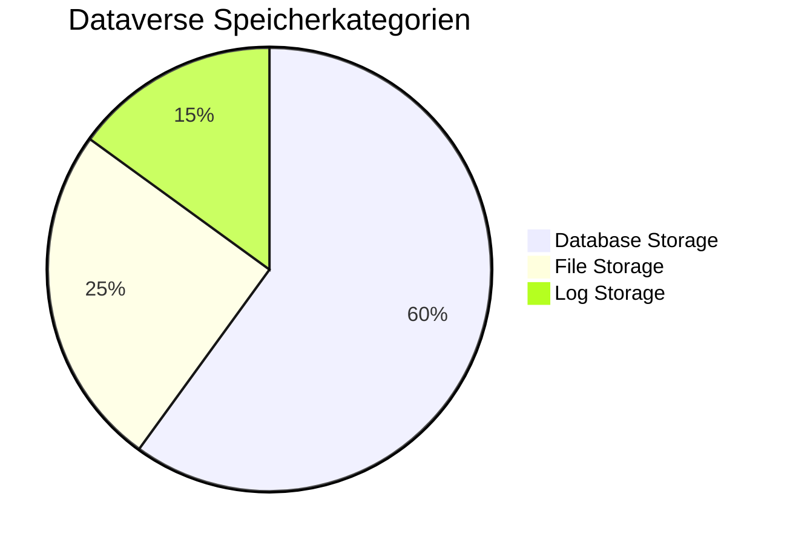
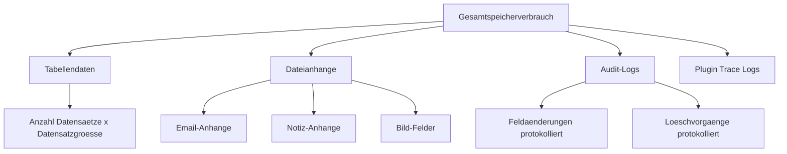
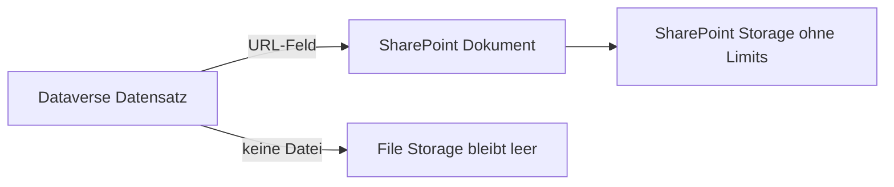
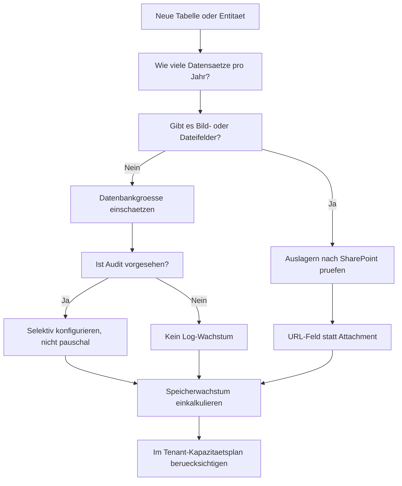

# Theorie: Speicher- und Kapazitaetsauswirkungen architektonisch beruecksichtigen

## Warum Speicher eine Architekturentscheidung ist

Dataverse-Speicher kostet Geld. Jede Power Platform Lizenz enthaelt ein bestimmtes Kontingent. Wenn das Kontingent erschoepft ist, koennen keine neuen Datensaetze mehr angelegt werden, bis Speicher freigegeben oder hinzugekauft wird.

Ein Solution Architect der bei Projektstart die Speicherwirkung seines Datenmodells nicht einkalkuliert, bekommt spaeter entweder eine unerwartete Rechnung oder ein Support-Ticket mit der Meldung "Neue Datensaetze koennen nicht angelegt werden".

## Die drei Speicherkategorien in Dataverse

**Database Storage:** Alle Tabellendaten, alle Textfelder, Zahlen, Choices, Lookups, Datum-Felder. Der Grossteil der Anwendungsdaten liegt hier.

**File Storage:** Bilder, Dateianhange, Anhange an E-Mails und Aktivitaeten. Dieses Kontingent wird schnell aufgebraucht, wenn Nutzer Dokumente anhangen.

**Log Storage:** Audit-Logs, Plugin-Trace-Logs, Systemlogs. Wachst mit aktiviertem Audit und intensiver Plugin-Nutzung.

## Speicherberechnung: Was wirklich Platz braucht

Entgegen der Intuition ist es nicht die Anzahl der Felder, die am meisten Speicher verbraucht, sondern:

1. Die Anzahl der Datensaetze
2. Die Groesse von Text-Feldern (insbesondere Multi Line)
3. Dateianhange und Bilder
4. Aktivitaeten und E-Mails (jede gespeicherte E-Mail in einer Aktivitaet belegt File Storage)
5. Audit-Logs (wenn Audit fuer Felder aktiviert ist)

## Praxisbeispiel: Speicherwachstum berechnen

Ein Unternehmen erwartet 50.000 Lieferauftraege pro Jahr. Jeder Auftrag hat:
- 20 Standardfelder (ca. 2 KB pro Datensatz)
- Pro Auftrag 3 Positionszeilen (ca. 0,5 KB pro Zeile)
- Pro Auftrag 2 PDF-Anhange a 500 KB

**Berechnung pro Jahr:**
- Auftraege: 50.000 x 2 KB = 100 MB (Database)
- Positionen: 150.000 x 0,5 KB = 75 MB (Database)
- Anhange: 100.000 x 500 KB = 50 GB (File Storage!)

Das Ergebnis zeigt: Die Datenbankdaten sind vernachlaessigbar. Die Anhange sind das Problem. Der SA muss fruehzeitig entscheiden: Werden PDFs in Dataverse gespeichert oder in SharePoint? Die Antwort veraendert die Kostenkalkulation um den Faktor 100.

## Strategien zur Speicheroptimierung

### Strategie 1: Bilder und Dateien auslagern

Anstatt Dateien als Dataverse-Attachment zu speichern, koennen sie in SharePoint oder Azure Blob Storage abgelegt werden. In Dataverse wird nur der Link gespeichert. Das entlastet den File Storage erheblich.

**Konsequenzen fuer das Datenmodell:**
- Statt Attachment-Felder: URL-Feld (Single Line of Text) mit dem SharePoint-Link
- Power Automate Flow kann beim Anlegen eines Datensatzes automatisch einen SharePoint-Ordner erstellen und die URL zurueckschreiben
- Vorteil: Kein Limit-Problem, bessere Dokumentenversionierung in SharePoint
- Nachteil: Datensatz und Datei sind getrennt, Loeschvorgaenge muessen koordiniert werden

### Strategie 2: Audit selektiv aktivieren

Wenn Audit aktiviert ist, protokolliert Dataverse jede Feldaenderung. Bei vielen Feldern und vielen Aenderungen kann das Log Storage schnell anwachsen.

Empfehlung: Audit nur fuer wirklich audit-relevante Felder aktivieren (Finanzdaten, Statussaenderungen, sicherheitsrelevante Felder), nicht pauschal fuer alle Tabellen.

### Strategie 3: Datenwachstum bei der Modellierung einkalkulieren

Felder die sehr grossen Text speichern koennen (Multi Line of Text bis 1 MB) sollten nur dann verwendet werden, wenn tatsaechlich grosse Texte erwartet werden. Wenn "Notizen" typischerweise kurz sind, genuegt ein Single Line Text mit 2.000 Zeichen.

### Strategie 4: Lebenszyklusverwaltung planen

Historische Daten die nicht mehr operativ benoetigt werden, sollten archiviert oder geloescht werden. Dataverse bietet Long Term Retention als Preview-Feature, das aeltere Datensaetze in guenstigeren Speicher verschiebt.

## Speicherkontingente verstehen (Stand 2025)

| Lizenz | Database | File | Log |
|---|---|---|---|
| Per User Plan | 250 MB | 2 GB | 2 GB |
| Power Apps Premium | 250 MB | 2 GB | 2 GB |
| Dynamics 365 Sales | 5 GB Basis + 20 MB pro Nutzer | 2 GB Basis | 2 GB Basis |

**Wichtig:** Die Kontingente werden pro Tenant (nicht pro Umgebung) summiert. Alle Dataverse-Umgebungen teilen sich das Gesamtkontingent des Tenants.

## Monitoring: Speicher im Blick behalten

Im Power Platform Admin Center steht unter "Resources > Capacity" eine Uebersicht des aktuellen Speicherverbrauchs bereit. Der SA sollte diesen Wert bei der Planung regelmaessig pruefen und als Referenzwert fuer Abschaetzungen verwenden.

Bei grossen Projekten empfiehlt sich ein monatliches Monitoring und eine Wachstumsprognose auf Basis der realen Datenmengen nach Go-Live.

## Zusammenfassung: Speicher-Checkliste fuer den SA

