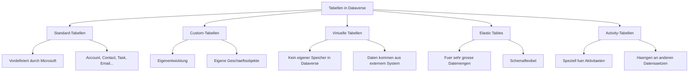
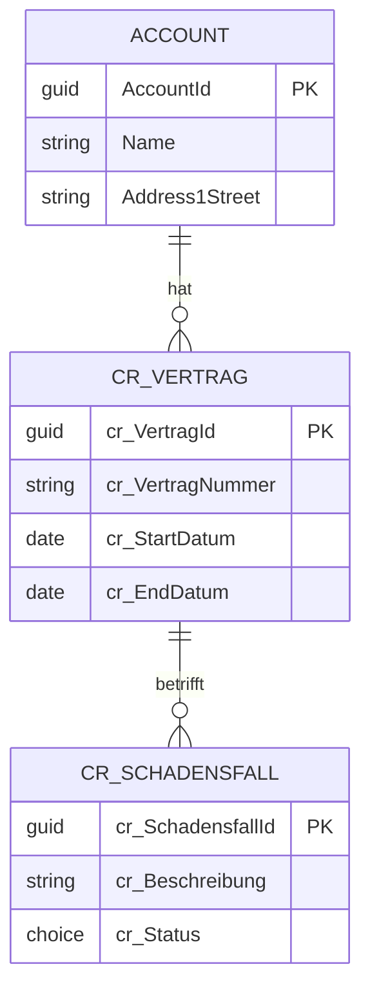
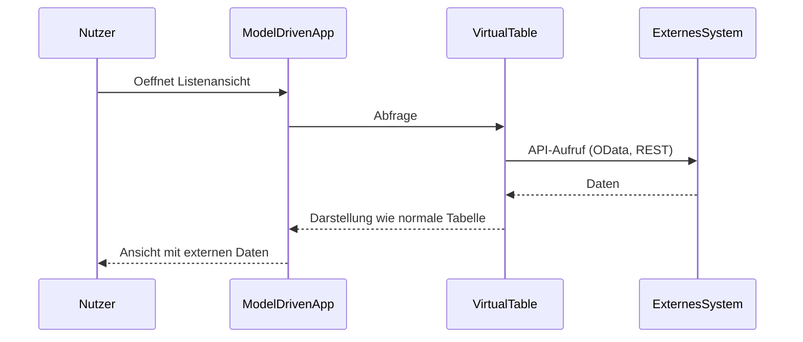
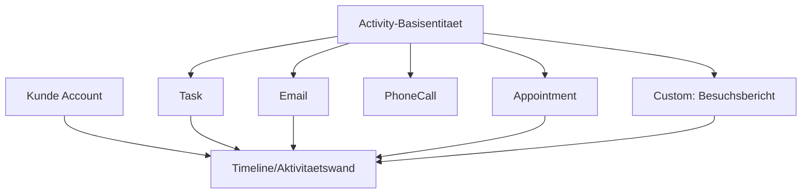
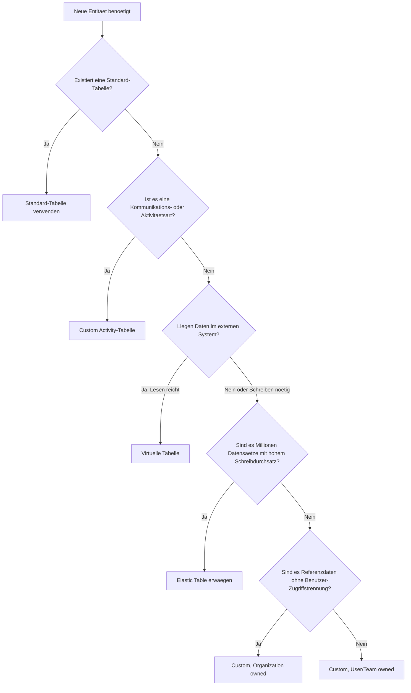

# Theorie: Tabellenarten architekturgerecht einordnen

## Warum die Wahl der Tabellenart eine Architekturentscheidung ist

In Dataverse gibt es nicht "die eine Tabelle". Stattdessen gibt es verschiedene Tabellenarten, die sich in ihrem Verhalten, ihren Faehigkeiten und ihren Einschraenkungen grundlegend unterscheiden. Die Wahl der falschen Tabellenart fuehrt zu Performance-Problemen, fehlenden Funktionen oder unnoetigem Entwicklungsaufwand.

## Ueberblick der Tabellenarten

## Standard-Tabellen: Die Basis des Dataverse-Oekosystems

Standard-Tabellen werden von Microsoft mitgeliefert. Die wichtigsten sind:

| Tabelle | Zweck | Besonderheit |
|---|---|---|
| Account | Firmen, Kunden, Lieferanten | Hat bereits Adressfelder, Telefon, Web |
| Contact | Personen, Ansprechpartner | Verknuepft mit Account |
| Opportunity | Verkaufschance | Kern des Sales-Prozesses |
| Task | Aufgabe | Activity-Tabelle |
| Email | E-Mail-Aktivitaet | Activity-Tabelle |
| SystemUser | Dataverse-Nutzer | Technisch intern, nicht direkt editierbar |
| Team | Nutzergruppen | Basis des Sicherheitsmodells |

**Warum Standard-Tabellen bevorzugen?**

Wenn eine Standard-Tabelle existiert, die den Anwendungsfall abdeckt, sollte sie verwendet werden. Die Gruende:
- Dynamics 365 Apps (Sales, Service, Field Service) bauen auf Standard-Tabellen auf
- Custom Connectors und externe Apps erwarten oft Standard-Tabellen
- Zukuenftige Migrationen zu Dynamics-Loesungen werden erleichtert
- Felder wie Adresse, Kontakt und Name sind bereits vorhanden

**Wann Standard-Tabellen nicht ausreichen:**
Wenn der Anwendungsfall kein Aequivalent in den Standard-Tabellen hat (z.B. "Maschinenpark", "Versicherungsvertrag", "Schadensmeldung"), werden Custom-Tabellen angelegt.

## Custom-Tabellen: Die eigene Geschaeftslogik

Custom-Tabellen sind vollstaendig durch den Entwickler definiert. Sie verhalten sich technisch identisch zu Standard-Tabellen, werden aber mit einem eigenen Schema-Praefix erstellt (z.B. "cr_" fuer den Publisher-Praefix "cr").

**Ownership-Typen bei Custom-Tabellen:**

Beim Erstellen einer Custom-Tabelle muss entschieden werden, wer "Eigentuemer" eines Datensatzes ist:

- **User oder Team owned:** Jeder Datensatz hat einen Eigentuemer (einen SystemUser oder ein Team). Das Sicherheitsmodell von Dataverse greift vollstaendig. Empfohlen fuer Geschaeftsdaten.
- **Organization owned:** Alle Datensaetze gehoeren der gesamten Organisation. Kein Benutzer-basierter Zugriff auf Zeilenebene. Empfohlen fuer Referenzdaten (Kategorien, Produkte, Preislisten).

Dieser Typ kann nach dem Erstellen der Tabelle NICHT mehr geaendert werden. Es handelt sich um eine einmalige und irreversible Entscheidung.

## Virtuelle Tabellen: Daten von ausserhalb, dargestellt wie Dataverse

Eine virtuelle Tabelle speichert keine Daten in Dataverse. Sie ist eine Schnittstelle zu einem externen Datensystem. Wenn ein Nutzer die Tabelle oeffnet, ruft Dataverse in Echtzeit die Daten vom externen System ab.

**Wann virtuelle Tabellen sinnvoll sind:**
- Das Quellsystem hat eine stabile API
- Daten sollen nicht dupliziert werden
- Lesezugriff genuegt (Schreiben ist technisch moeglich aber komplex)
- Daten sind nur gelegentlich relevant (kein hochfrequenter Zugriff)

**Einschraenkungen virtueller Tabellen:**
- Keine Offline-Faehigkeit (kein Netz = keine Daten)
- Kein Audit in Dataverse moeglich
- Kein Rollup ueber virtuelle Tabellen
- Performance abhaengig vom externen System
- Keine Beziehungen zu anderen virtuellen Tabellen moeglich
- Keine Plugin-Events auf virtuellen Tabellen (ausser mit Custom Virtual Table Provider)

**Technische Umsetzung:**
Virtuelle Tabellen benoetigen einen "Virtual Table Provider". Fuer OData-Quellen gibt es einen eingebauten Provider. Fuer andere Systeme kann ein Custom Provider (Azure Function oder Plugin) entwickelt werden.

## Elastic Tables: Fuer sehr grosse Datenmengen

Elastic Tables (Preview/GA je nach Tenant-Konfiguration) sind ein neuerer Tabellentyp, der auf Azure Cosmos DB basiert statt auf SQL Server. Sie sind gedacht fuer:
- Sehr grosse Datenmengen (Millionen von Datensaetzen)
- IoT-Daten, Sensor-Logs, Event-Streams
- Szenarien mit hohem Schreibdurchsatz

**Unterschiede zu Standard- und Custom-Tabellen:**
- Kein festes Schema erforderlich (schemaflexibel)
- Keine Beziehungen zu anderen Dataverse-Tabellen
- Kein Sicherheitsmodell auf Zeilenebene
- Keine Plugin-Events
- Unterschiedliche Abfragesprache (FetchXML eingeschraenkt)

Elastic Tables sind fuer die meisten Business-Anwendungen nicht die erste Wahl. Sie kommen in Betracht wenn normale Dataverse-Tabellen an Grenzen stossen.

## Activity-Tabellen: Kommunikation und Aufgaben

Activity-Tabellen sind eine spezielle Kategorie. Sie erben automatisch von der "Activity"-Basistabelle und bekommen dadurch:
- Ein "Regarding"-Feld (kann auf jeden Datensatz zeigen)
- Integration in die Aktivitaetswand (Timeline) anderer Datensaetze
- Automatische Verknuepfung mit E-Mail-Adressen

Standard-Activity-Tabellen sind: Task, Email, Appointment, PhoneCall. Custom Activity-Tabellen koennen fuer eigene Kommunikationstypen erstellt werden (z.B. "Besuchsbericht", "Angebot besprochen").

## Entscheidungsraster: Welche Tabellenart waehlen?

## Praxisbeispiel: Tabellenentscheidungen in einem Service-Szenario

Ein Unternehmen baut einen Kundendienst:
- Kunden: Standard-Tabelle Account und Contact (bereits vorhanden, wiederverwendbar)
- Servicevertraege: Custom-Tabelle cr_Servicevertrag (User/Team owned, da Verkauf pro Vertreter)
- Produktkatalog: Standard-Tabelle Product (vorhanden in Dataverse)
- ERP-Lagerdaten (Bestand): Virtuelle Tabelle (Lesen aus SAP via OData, keine Datenduplikation)
- Telefonate: Standard Activity-Tabelle PhoneCall (integriert in Timeline)
- Besuchsberichte: Custom Activity-Tabelle cr_Besuchsbericht (eigene Felder, in Timeline sichtbar)
- Kategorien: Custom-Tabelle cr_Kategorie (Organization owned, kein Benutzer-Zugriff noetig)

## Wo konfigurieren und überwachen?

| Thema | Navigation |
|---|---|
| Custom-Tabelle (User/Team owned) anlegen | [make.powerapps.com](https://make.powerapps.com) → **Dataverse** → **Tables** → + **New table** → **Advanced options** → Record ownership: **User or team** |
| Organization-owned Tabelle anlegen | make.powerapps.com → + **New table** → **Advanced options** → Record ownership: **Organization** |
| Custom Activity-Tabelle anlegen | make.powerapps.com → + **New table** → **Advanced options** → Type: **Activity table** |
| Virtuelle Tabelle erstellen | make.powerapps.com → + **New table** → **Advanced options** → Type: **Virtual** → External data source wählen |
| Elastic Table erstellen (wenn verfügbar) | make.powerapps.com → + **New table** → **Advanced options** → Type: **Elastic** |
| Standardtabellen einsehen | make.powerapps.com → **Dataverse** → **Tables** → Filter: **Standard** |
