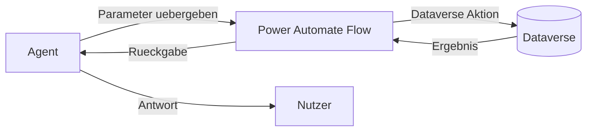
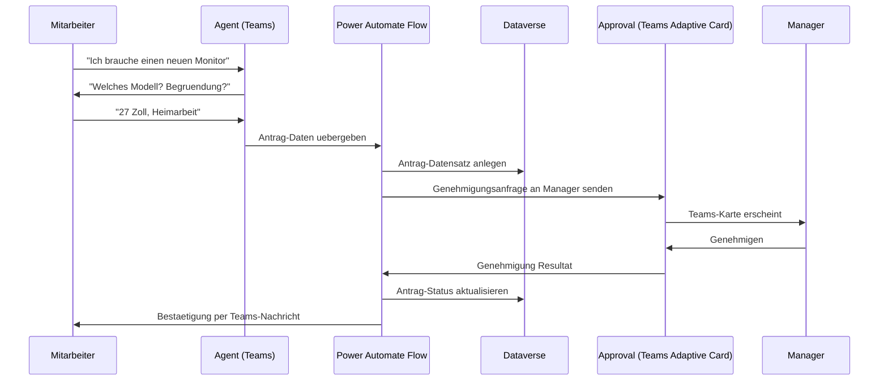
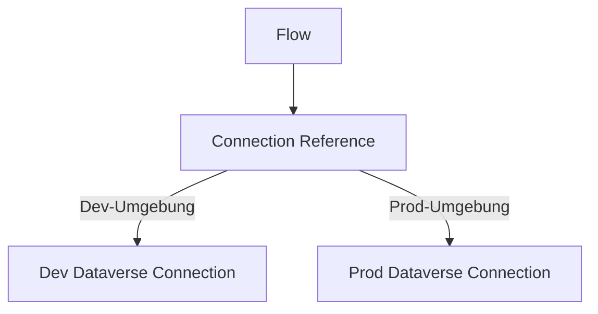

# Theorie: Copilot Studio in die Loesungsarchitektur integrieren

## Agents sind keine Inseln

Ein Agent in Copilot Studio ist in den seltensten Faellen eine eigenstaendige Loesung. Er ist ein Interaktionspunkt in einem groesseren System aus Daten, Prozessen und Anwendungen. Ein SA der einen Agent plant, muss gleichzeitig planen, wie der Agent mit Dataverse kommuniziert, welche Flows er ausloest und wo die Verantwortlichkeitsgrenzen verlaufen.

## Das Zusammenspiel mit Dataverse

Copilot Studio kann auf zwei Arten mit Dataverse interagieren:

### Weg 1: Direkter Connector

Copilot Studio hat einen eingebauten Dataverse-Connector. Damit kann ein Agent:
- Datensaetze lesen (z.B. "Welchen Status hat mein Ticket?")
- Datensaetze anlegen (z.B. "Erstelle einen Urlaubsantrag")
- Datensaetze aktualisieren (z.B. "Markiere die Aufgabe als erledigt")

Dieser direkte Weg ist einfacher zu bauen, aber hat eine wichtige Einschraenkung: Der Agent agiert mit den Berechtigungen des angemeldeten Nutzers. Wenn ein Nutzer keine Schreibrechte auf eine Tabelle hat, scheitert auch die Aktion des Agents.

### Weg 2: Power Automate Flow als Vermittler

Der Agent loest einen Flow aus und uebergibt Parameter. Der Flow fuehrt die Dataverse-Operation durch. Der Flow hat eigene Verbindungen (Connection References) und kann mit Service Principal oder eigenem Account agieren.

**Wann Weg 1 (direkter Connector)?**
Wenn die Operation einfach ist (lesen, einfaches Schreiben), wenn Echtzeit-Ergebnisse erwartet werden und wenn die Benutzerberechtigungen fuer die Operation ausreichen.

**Wann Weg 2 (Flow als Vermittler)?**
Wenn komplexe Logik benoetigt wird (mehrere Dataverse-Aktionen, Validierungen), wenn eine E-Mail-Benachrichtigung oder weitere Prozessschritte ausgefuehrt werden sollen, wenn der Agent im Auftrag des Nutzers mit erhoehten Rechten handeln muss.

## Integration in Prozesse: Der Agent als Eingangspunkt

Ein haeufiges Integrationsmuster ist der Agent als "Front Door" fuer einen laengeren Prozess:

In diesem Muster ist der Agent nur fuer die ersten drei Nachrichten zustaendig. Alles danach ist Flow und Dataverse.

## Schnittstellen und Verantwortlichkeiten klar definieren

Ein haeufiger Fehler in der Praxis: Die Grenze zwischen Agent-Verantwortung und Flow-Verantwortung ist unklar. Das fuehrt zu Systemen, die schwer zu warten sind.

**Empfehlung des SA: Klare Schnittstellendefinition**

Der Agent ist verantwortlich fuer:
- Dialog und Sprachverstaendnis
- Informationssammlung vom Nutzer
- Weiterleitung der gesammelten Daten an den Flow
- Anzeige der Ergebnisse aus dem Flow

Der Flow ist verantwortlich fuer:
- Validierung der Daten
- Dataverse-Operationen
- Benachrichtigungen
- Fehlerbehandlung bei Systemfehlern

Der Agent sollte KEINE Geschaeftslogik enthalten. Wenn ein Topic-Knoten eine if/else Entscheidung trifft die auf Geschaeftsdaten basiert ("Wenn Kreditwuerdigkeit > 5, dann..."), gehoert diese Logik in den Flow, nicht in den Agent.

## Verbindungen und Connection References

Wenn ein Agent ueber einen Flow auf Dataverse zugreift, haengt der Flow von einer Connection Reference ab. Connection References sind eine ALM-best-practice: Sie erlauben es, denselben Flow in verschiedenen Umgebungen (Dev, Test, Prod) mit unterschiedlichen Verbindungen zu betreiben.

Der SA muss bei der Planung sicherstellen, dass Connection References fuer alle Flows definiert sind, die der Agent nutzt.

## Authentifizierung des Agents

Ein Agent kann entweder anonym (ohne Login) oder authentifiziert (mit Login) betrieben werden. Diese Entscheidung hat weitreichende Konsequenzen:

| Modus | Beschreibung | Vorteil | Nachteil |
|---|---|---|---|
| Anonym | Jeder kann den Agent nutzen ohne Login | Einfach zugaenglich, z.B. auf der Firmenwebsite | Agent kennt Nutzer nicht, kann keine personalisierten Daten liefern |
| Microsoft Authentifizierung | Nutzer muss Microsoft-Konto haben | Agent kennt Nutzer-ID, kann auf Nutzerdaten zugreifen | Erfordert Microsoft-Account, nicht fuer externe Kunden |
| Andere OAuth-Provider | Eigener Identity Provider | Flexibel | Aufwaendiger zu konfigurieren |

Fuer interne Loesungen (Mitarbeiter-Agent) ist Microsoft Authentifizierung der Standard. Nur so kann der Agent wissen, wer spricht, und personalisierte Informationen ("Dein Resturlaub betraegt...") liefern.

## Copilot Studio und Dataverse Knowledge

Eine besondere Integrationsoption ist "Dataverse Knowledge": Eine Tabelle in Dataverse kann als Knowledge Source dienen. Das bedeutet: Wissensartikel werden in Dataverse gespeichert und gepflegt, der Agent liest sie und gibt sie als generative Antworten aus.

Das ist besonders geeignet, wenn:
- Wissensartikel von HR, Support oder anderen Teams regelmaessig gepflegt werden sollen
- Kein SharePoint vorhanden oder erwuenscht ist
- Eine strukturierte Inhaltsverwaltung mit Genehmigungsprozess gewuenscht ist

## Fehlerbehandlung: Was passiert wenn es schieflaeuft?

Flows koennen scheitern. APIs koennen nicht erreichbar sein. Dataverse kann voruellbergehend nicht verfuegbar sein. Ein gut integrierter Agent behandelt Fehler explizit:

- Flow gibt einen Fehler-Status zurueck
- Agent fangt diesen Status ab
- Agent zeigt eine verstaendliche Fehlermeldung ("Leider konnte Ihr Antrag gerade nicht gespeichert werden. Bitte versuchen Sie es in einigen Minuten erneut oder wenden Sie sich an den Support.")
- Optional: Agent loest ein Fallback-Topic aus (z.B. Ticket anlegen)

Diese Fehlerbehandlung muss bei der Konzeption geplant werden, nicht als Nachgedanke.
