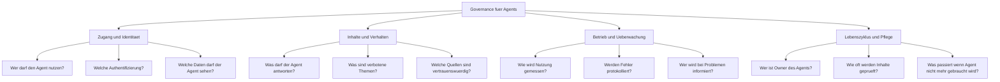

# Theorie: Governance-Anforderungen fuer Agents beruecksichtigen

## Warum Governance bei Agents besonders wichtig ist

Bei klassischen Apps und Flows ist das Verhalten deterministisch: Was programmiert wurde, passiert. Bei Agents mit generativer KI ist das anders. Ein Agent kann prinzipiell auf jede Nutzereingabe reagieren, auch auf solche, die nicht vorgesehen waren. Das schafft Risiken, die bei klassischen Anwendungen nicht existieren.

Governance bei Agents bedeutet: Sicherstellen, dass Agents nur das tun was erlaubt ist, nur von den Personen genutzt werden die berechtigt sind, und dass ihre Nutzung sichtbar und steuerbar bleibt.

## Die vier Governance-Dimensionen fuer Agents



## Dimension 1: Zugang und Identitaet

### Wer darf den Agent nutzen?

Diese Frage muss vor dem Bau geklart werden, nicht nach dem Deployment.

**Interne Agents:** Nur Mitarbeiter des Unternehmens. Technisch umgesetzt durch Microsoft Authentifizierung und optional durch Sicherheitsgruppen (welche Teams haben Zugriff auf welchen Agent).

**Externe Agents:** Kunden oder Partner. Hier entfaellt die Microsoft-Authentifizierung. Stattdessen kann der Agent anonym zugreifbar sein oder mit einem eigenen OAuth-Provider (z.B. B2C Azure AD) abgesichert werden.

**Hybride Agents:** Ein Agent der sowohl intern als auch extern zugaenglich ist, stellt erhoehte Risiken dar. Interne Informationen duerfen nicht an externe Nutzer fliessen. Das erfordert klare Knowledge-Source-Trennung und getrennte Agent-Konfigurationen.

### Datenzugriff des Agents

Was ein Agent antworten kann, haengt direkt davon ab, auf welche Datenquellen er Zugriff hat. Der SA muss festlegen, auf welche SharePoint-Ordner, welche Dataverse-Tabellen und welche externen Quellen der Agent zugreifen darf.

**Prinzip des minimalen Privilegs:** Der Agent bekommt nur Zugriff auf das, was er fuer seine Aufgabe benoetigt. Ein Mitarbeiter-FAQ-Agent braucht keine Zugriffsrechte auf die Gehaltsabrechnungsdaten.

## Dimension 2: Inhalte und Verhalten

### Was darf der Agent antworten?

In Copilot Studio gibt es zwei Ebenen der Inhaltskontrolle:

**Ebene 1: Themen-Filter (Content Moderation)**
Copilot Studio hat eingebaute Sicherheitsmechanismen, die verhindern dass der Agent explizite, schaedliche oder unangemessene Inhalte produziert. Diese sind standardmaessig aktiv und koennen nicht vollstaendig deaktiviert werden.

**Ebene 2: Custom Instructions (Generative AI Instructions)**
Der SA kann dem Agent eigene Anweisungen geben. Diese steuern das Verhalten des LLM:

Beispiel Custom Instruction:
```
Du bist ein HR-Assistent fuer interne Mitarbeiter. 
Du beantwortest nur Fragen zu HR-Themen (Urlaub, Benefits, Richtlinien). 
Wenn ein Nutzer nach Gehaeltern, Entlassungen, internen Konflikten oder anderen sensiblen Themen fragt, 
antworte: "Fuer diese Frage wende dich bitte direkt an deine HR-Ansprechperson."
Du gibst keine Rechts- oder Steuerberatung.
```

### Verbotene Themen (Off-Topic Handling)

Ohne Konfiguration koennte ein Agent auf Fragen wie "Wie baue ich eine Bombe?" oder "Erklaere mir, wie ich meine Kollegen manipuliere" antworten (auch wenn die eingebauten Filter vieles verhindern). Der SA sollte explizite Off-Topic-Rules definieren.

In Copilot Studio koennen Topics erstellt werden die auf missbraeuchliche Anfragen reagieren und den Nutzer hoeflich umleiten.

## Dimension 3: Betrieb und Ueberwachung

### Wie wird der Agent ueberwacht?

Copilot Studio bietet eingebaute Analytics:
- Anzahl Konversationen pro Tag/Woche
- Haeufigste Topics
- Eskalationsrate (Wie oft uebergibt der Agent an einen Menschen?)
- Satisfaction-Rate (Wenn Feedback-System aktiviert)
- Fehlerrate (Wie oft schlaegt ein Action-Aufruf fehl?)

Diese Metriken sind im Power Platform Admin Center und in den Agent Analytics in Copilot Studio verfuegbar.

### Konversationsverlauf und Datenschutz

Copilot Studio speichert standardmaessig Konversationsprotokolle. Das hat Datenschutzimplikationen:
- Nutzer koennen sensible Informationen in den Chat schreiben (Namen, Krankheiten, Finanzdaten)
- Diese Daten liegen im Microsoft-Rechenzentrum (EU oder US je nach Tenant-Konfiguration)
- Es muss geklart werden, ob eine Datenschutzfolgenabschaetzung benoetigt wird
- In manchen Faellen muss in der Datenschutzerklaerung auf den Agent hingewiesen werden

## Dimension 4: Lebenszyklus und Pflege

### Wer ist Owner des Agents?

Agents werden in einer Power Platform Umgebung gespeichert. Sie gehoeren einem Besitzer. Wenn dieser Besitzer das Unternehmen verlaesst, koennen Agents verwaist werden.

**Best Practice:** Agents sollten einem Team oder einer Service-Account-Identitaet gehoeren, nicht einem Einzelpersonen-Account.

### Wie oft werden Inhalte geprueft?

Ein Agent der auf SharePoint-Dokumente zeigt, gibt veraltete Antworten wenn die Dokumente nicht gepflegt werden. Der SA sollte zusammen mit den Fachabteilungen einen Review-Zyklus vereinbaren:
- Halbjährliche Pruefung aller Knowledge Sources auf Aktualitaet
- Pruefung ob neue Themen dazugekommen sind, die neue Topics erfordern
- Pruefung der Konversations-Analytics: Welche Fragen werden nicht beantwortet?

### Was passiert wenn ein Agent nicht mehr benoetigt wird?

Agents die nicht mehr genutzt werden, aber noch aktiv sind, stellen ein Risiko dar. Sie koennen unbemerkt auf veraltete Daten zeigen, sie verursachen Kosten und koennen als Angriffspunkt missbraucht werden.

**Empfehlung:** Regelmaessige Inventarisierung aller Agents im Tenant. Im Power Platform Admin Center sind alle Copilot Studio Agents aufgelistet. Agents ohne Nutzung in den letzten 90 Tagen sollten deaktiviert oder geloescht werden.

## Das Center of Excellence als Governance-Instrument

Das Power Platform Center of Excellence (CoE) Toolkit (ein Microsoft-bereitgestelltes Solution-Paket) bietet Governance-Faehigkeiten fuer den gesamten Power Platform Tenant:
- Uebersicht aller Environments, Apps, Flows und Agents
- Compliance-Reports (welche Ressourcen haben keinen Eigentuemer?)
- DLP-Policy-Management
- Quarantine-Funktion fuer nicht konforme Ressourcen

Ein reifes Unternehmen sollte das CoE Toolkit installiert haben und regelmaessig nutzen.

## Risiko durch unkontrollierten Agent-Einsatz

Das groeesste Governance-Risiko entsteht nicht durch einen einzigen unkontrollierten Agent, sondern durch "Shadow IT"-Agents: Fachabteilungen bauen eigene Agents ohne Wissen der IT, ohne Sicherheitspruefung und ohne Governance.

Mit Power Apps und Copilot Studio ist das einfacher denn je. Ein Mitarbeiter mit einer Power Apps Premium Lizenz kann in einer Stunde einen Agent bauen und in Teams deployed haben.

**Gegenmassnahme:** DLP-Richtlinien im Power Platform Admin Center koennen steuern, auf welche Connectoren und Datenquellen Agents zugreifen duerfen. Eine DLP-Richtlinie kann verhindern, dass Agents auf externe Systeme zugreifen oder bestimmte Connectors nutzen.
