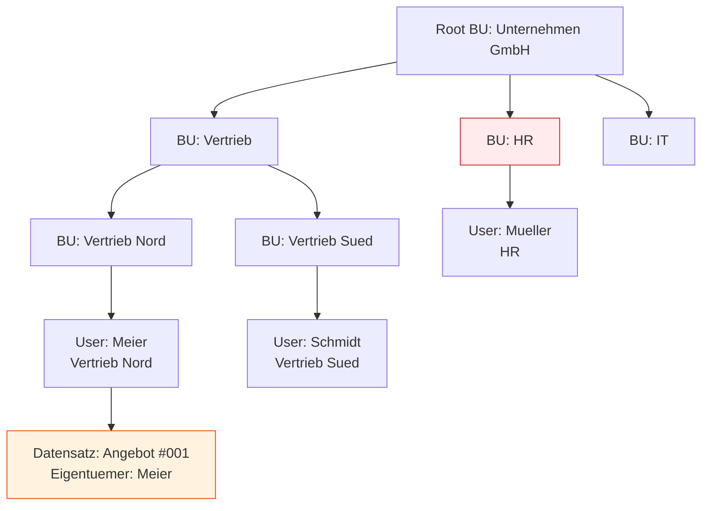
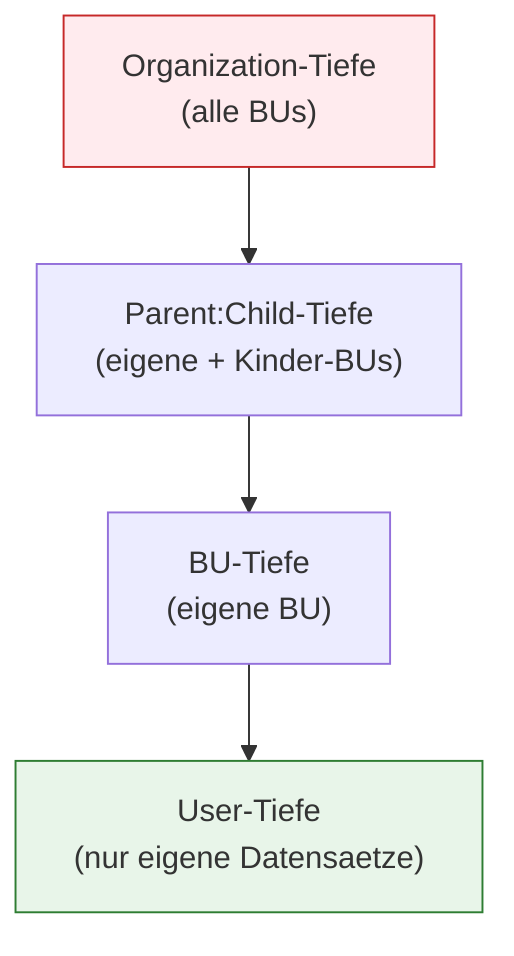

# Lab 5.2 - Business Units und Hierarchien strukturiert aufbauen

## Was sind Business Units?

Business Units (BUs) sind die organisatorische Grundstruktur des Dataverse-Sicherheitsmodells. Sie bilden die Aufbauorganisation des Unternehmens innerhalb einer Umgebung ab und bestimmen, welche Datensaetze ein Nutzer standardmaessig sehen kann.

Jede Dataverse-Umgebung hat genau eine Root-Business-Unit. Diese kann nicht geloescht werden und traegt standardmaessig den Namen des Tenants. Alle weiteren BUs haengen als Kinder oder Kindeskinder an dieser Wurzel.

## Das Eigentumsmodell: Wie Datensaetze und BUs zusammenhaengen

Jeder Dataverse-Datensatz gehoert entweder einem Nutzer oder einem Team. Nutzer und Teams gehoeren immer genau einer Business Unit an. Aus dieser Zugehoerigkeit ergibt sich, wer den Datensatz standardmaessig sehen darf.

**Schluesselprinzip:** Meier kann Angebot #001 sehen, weil er der Eigentuemer ist. Schmidt kann es standardmaessig nicht sehen, weil er in einer anderen BU ist. Mueller (HR) sieht es ebenfalls nicht, weil HR komplett getrennt ist.

Dieses Verhalten laesst sich durch Sicherheitsrollen beeinflussen (dazu Lab 5.3).

## Berechtigungstiefe in Bezug auf BUs

Sicherheitsrollen definieren unter anderem, auf welcher BU-Ebene ein Nutzer Datensaetze sehen darf. Die fuenf Tiefen sind:

| Tiefe                        | Bedeutung                                     |
| ---------------------------- | --------------------------------------------- |
| User                         | Nur eigene Datensaetze                        |
| Business Unit                | Eigene und alle Datensaetze in der eigenen BU |
| Parent: Child Business Units | Eigene BU + alle untergeordneten BUs          |
| Organization                 | Alle Datensaetze in der gesamten Umgebung     |
| None                         | Kein Zugriff                                  |

## BU-Design-Entscheidungen: Wann welche Granularitaet?

Die haeufigste Frage beim BU-Design ist: Wie tief soll die Hierarchie sein?

**Flache Hierarchie (1-2 Ebenen):**

- Geeignet wenn: Wenige Organisationseinheiten, kaum Datentrennung noetig
- Vorteil: Einfach zu verwalten, weniger Konfigurationsaufwand
- Nachteil: Grobe Zugriffssteuerung

**Tiefe Hierarchie (3+ Ebenen):**

- Geeignet wenn: Klare organisatorische Datentrennung gefordert, regulatorische Anforderungen
- Vorteil: Praezise Zugriffssteuerung
- Nachteil: Hoher Verwaltungsaufwand, Fehleranfaelligkeit bei BU-Umstrukturierungen

**Wichtige Warnung:** Eine BU kann nicht einfach verschoben werden, sobald Datensaetze ihr zugeordnet sind. BU-Umstrukturierungen sind aufwaendig. Das Design muss zum Beginn des Projekts stabil sein.

## BU vs. Sicherheitsrolle: Was steuert was?

Ein haeufiges Missverstaendnis: Sicherheitsrollen allein reichen nicht fuer Datenisolation.

| Aspekt                          | Business Unit                    | Sicherheitsrolle                                    |
| ------------------------------- | -------------------------------- | --------------------------------------------------- |
| Standardmaessige Datenisolation | Ja - BU-Grenze trennt Daten      | Nein - Rolle erweitert oder reduziert Zugriff       |
| Tabellenzugriff                 | Nein                             | Ja - welche Tabellen und mit welchen Rechten        |
| Datensatzsichtbarkeit           | Ja - ueber Eigentuemer-BU        | Ja - ueber Zugriffstiefe                            |
| Dynamische Aenderung            | Schwer (Datensaetze gehoeren BU) | Einfach (Rollen koennen jederzeit angepasst werden) |

## Der BU-Fallstrick bei Migrationen

Wenn ein Nutzer von einer BU in eine andere verschoben wird, aendern sich die Eigentuemer-Verhaeltnisse seiner Datensaetze nicht automatisch. Die Datensaetze gehoeren weiterhin der alten BU, bis sie manuell oder per Skript migriert werden. Das fuehrt haeufig zu Sichtbarkeitsproblemen nach Umstrukturierungen.

## Wo konfigurieren und überwachen?

| Thema | Navigation |
|---|---|
| Business Units verwalten | [admin.powerplatform.microsoft.com](https://admin.powerplatform.microsoft.com) → **Environments** → [Umgebung] → **Settings** → **Users + permissions** → **Business units** |
| Neue Business Unit anlegen | PPAC → ... → **Business units** → + **New** |
| Nutzer einer Business Unit zuweisen | PPAC → ... → **Users** → [Nutzer] → **Edit** → Feld **Business unit** |
| BU-Hierarchie einsehen | PPAC → ... → **Business units** → [Root-BU] → untergeordnete BUs aufklappen |
| Eigentümer-BU eines Datensatzes prüfen | Model-Driven App → [Datensatz] → Feld **Owning Business Unit** |
