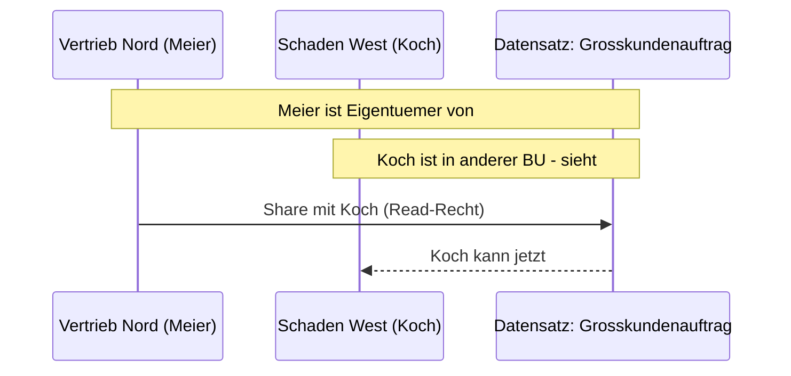
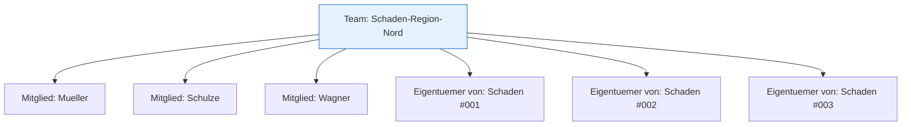

# Lab 5.4 - Row-Level-Zugriff, Besitz und Sharing bewerten

## Das Eigentuemermodell in Dataverse

Jeder Dataverse-Datensatz mit einem Eigentuemer-Typ (Owner-Type-Tabellen) hat ein Feld "Eigentuemer" (OwnerId). Dieser Eigentuemer ist entweder ein Nutzer oder ein Team. Das Eigentuemer-Feld ist die Grundlage fuer Row-Level-Security: Wer was sieht, haengt davon ab, wem der Datensatz gehoert.

**Tabellen ohne Eigentuemer:** Aktivitaetsbezogene Hilfstabellen (z.B. Anmerkungen/Notes) und einige Systemtabellen sind "Organization-owned" - sie gehoeren der gesamten Organisation und koennen nicht auf User-Ebene eingeschraenkt werden.

## Sharing: Einzelzugriff ausserhalb der Hierarchie

Sharing ermoeglicht es, einem bestimmten Nutzer oder Team Zugriff auf einen einzelnen Datensatz zu geben, auch wenn dieser Nutzer ihn aufgrund seiner BU-Position normalerweise nicht sehen wuerde.

**Wann Sharing verwenden:**

- Ausnahmen, nicht als Standard
- Einzelner Datensatz muss fuer einen bestimmten Nutzer sichtbar sein
- Kollaborationsszenarien (z.B. Uebergabe eines Falls)

**Wann Sharing nicht verwenden:**

- Als Ersatz fuer eine sauber konzipierte Rollenarchitektur
- Wenn viele Datensaetze systematisch geteilt werden muessen (dann ist die Rollenarchitektur falsch)
- Wenn die Uebersicht verloren geht (Sharing ist schwer zu auditieren)

## Teams als Eigentuemergruppe

Anstatt Datensaetze einzelnen Nutzern zu uebertragen, koennen Teams als Eigentuemer genutzt werden. Das hat mehrere Vorteile:

Wenn Mueller das Unternehmen verlaesst, bleiben Schaden #001-003 dem Team zugeordnet. Mueller wird aus dem Team entfernt. Schulze und Wagner sehen weiterhin die Datensaetze. Kein manuelles Reassigning noetig.

## Access Teams: Dynamisches Sharing fuer Prozesse

Neben statischen Owner-Teams gibt es Access Teams. Ein Access Team hat keinen festen Eigentuemer, sondern wird pro Datensatz dynamisch zusammengestellt.

| Merkmal                      | Owner Team               | Access Team                    |
| ---------------------------- | ------------------------ | ------------------------------ |
| Eigentuemer von Datensaetzen | Ja                       | Nein                           |
| BU-Zugehoerigkeit            | Hat eine BU              | Keine BU                       |
| Mitgliedschaft               | Manuell oder automatisch | Per Flow/Prozess/API           |
| Typischer Einsatz            | Abteilungsgruppen        | Fallorientierte Zusammenarbeit |
| Sicherheitsrolle             | Kann Rolle haben         | Kann Vorlage (Template) haben  |

**Beispiel Access Team:** Ein Supportfall wird geoeffnet. Ein Power Automate Flow fuegt den zust\u00e4ndigen Techniker, den Kundenverantwortlichen und den Abteilungsleiter automatisch zum Access Team dieses Falls hinzu. Alle drei koennen den Fall lesen und bearbeiten. Wenn der Fall geschlossen wird, wird das Team aufgeloest.

## Hierarchiesicherheit: Managerbasierter Zugriff

Die Hierarchiesicherheit ist ein optionales Zusatzmodell. Wenn aktiviert, kann ein Nutzer alle Datensaetze sehen, die seinen direkten Mitarbeitern gehoeren - basierend auf der Managerbeziehung im SystemUser-Datensatz.

**Voraussetzung:** Im Systembenutzer-Datensatz muss das Manager-Feld gepflegt sein.

**Einschraenkung:** Nur eine Hierarchietiefe ist standardmaessig konfigurierbar (der direkte Manager). Mehrstufige Hierarchien erfordern hoehere Tiefen-Konfiguration.

**Wann Hierarchiesicherheit sinnvoll ist:** Wenn die Organisationsstruktur exakt der BU-Struktur entspricht und Manager ihren Mitarbeiterdaten sehen muessen, aber keine separate BU-Konfiguration gewuenscht wird. Als Ergaenzung zu BUs, nicht als Ersatz.

## Wo konfigurieren und überwachen?

| Thema | Navigation |
|---|---|
| Owner Team erstellen | [admin.powerplatform.microsoft.com](https://admin.powerplatform.microsoft.com) → **Environments** → [Umgebung] → **Settings** → **Users + permissions** → **Teams** → + **New team** → Team type: **Owner** |
| Datensatz-Sharing in der App | Model-Driven App → [Datensatz öffnen] → **Share** (Befehlsleiste) |
| Access Teams für eine Tabelle aktivieren | [make.powerapps.com](https://make.powerapps.com) → **Dataverse** → **Tables** → [Tabelle] → **Settings** → **Access teams** (Checkbox aktivieren) |
| Access Team Template anlegen | make.powerapps.com → **Tables** → [Tabelle] → **Access team templates** → + **New template** |
| Eigentümer eines Datensatzes ändern | Model-Driven App → [Datensatz] → **Assign** (Befehlsleiste) |
