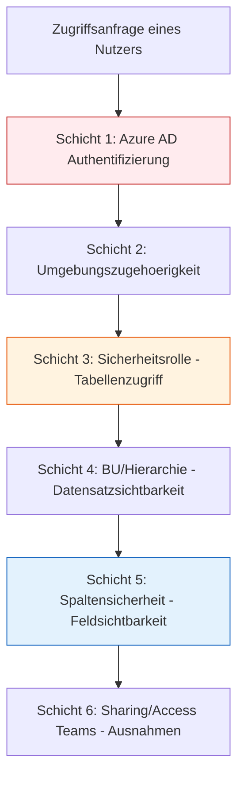
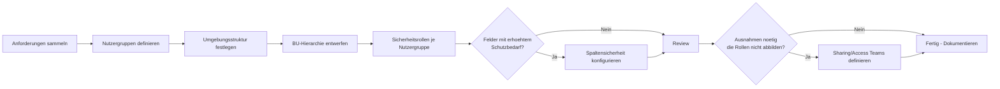

# Lab 6.4 - Sicherheitsmechanismen sinnvoll kombinieren

## Das Zusammenspiel der Sicherheitsschichten

Die Power Platform kennt mehrere Sicherheitsschichten, die unabhaengig voneinander konfiguriert werden, aber zusammenwirken. Ein SA muss verstehen, wie diese Schichten interagieren, um Luecken zu vermeiden und keine unnoetigen Komplexitaeten zu erzeugen.

Jede Schicht muss "passiert" werden. Ein Nutzer muss:

1. Im Azure AD authentifiziert sein
2. Mitglied der Umgebung sein
3. Eine Sicherheitsrolle haben, die die Tabelle erlaubt
4. Die richtige BU-Tiefe haben, um den konkreten Datensatz zu sehen
5. Im Spaltensicherheitsprofil sein, um gesicherte Felder zu sehen
6. Optional per Sharing direkte Ausnahmen nutzen

## Kombinationsregeln

**Sicherheitsrollen kumulieren, niemals einschraenken:**
Wenn einem Nutzer zwei Rollen zugewiesen sind, gilt die weitreichendere. Es gibt keine "Deny"-Regel.

**BU-Hierarchie und Sicherheitsrollen wirken zusammen:**
Die BU-Tiefe in der Sicherheitsrolle (User / BU / Parent:Child / Org) bestimmt, welche Datensaetze im Rahmen der BU-Hierarchie sichtbar sind. Ohne Sicherheitsrolle mit Read-Recht ist die BU-Tiefe irrelevant.

**Spaltensicherheit ist unabhaengig von Sicherheitsrollen:**
Eine Sicherheitsrolle mit Read-Org sieht alle Datensaetze - aber nicht die gesicherten Felder, wenn das Spaltensicherheitsprofil fehlt.

**Sharing kann keine Sicherheitsrollen ersetzen:**
Ein geteilter Datensatz ist nur sichtbar, wenn der Nutzer auch eine Sicherheitsrolle hat, die grundsaetzlich Read auf die Tabelle erlaubt.

## Typisches Sicherheitsdesign-Vorgehen

## Haeufige Kombinationsfehler

**Fehler 1: Sharing statt Rollendesign**
Teams teilen Datensaetze manuell, weil die Rollenarchitektur nicht stimmt. Nach 6 Monaten gibt es hunderte von Sharing-Beziehungen, die niemand mehr ueberblickt. Loesung: Rollenarchitektur ueberarbeiten.

**Fehler 2: Formular-Sichtbarkeit als Sicherheitsmassnahme**
Felder werden ausgeblendet statt per Spaltensicherheit gesichert. Loesung: Spaltensicherheit fuer alle Felder mit erhoehtem Schutzbedarf.

**Fehler 3: System-Customizer in Produktiv**
Nutzer haben die Rolle "System Customizer" in der Produktivumgebung, weil sie "manchmal mal schnell was anpassen". Diese Rolle gibt Vollzugriff auf die Datenbankstruktur. Loesung: Anpassungen nur in Dev-Umgebungen, ausgeliefert per Deployment.

**Fehler 4: Zu viele Rollen je Nutzer**
Jedes neue Anforderung wird mit einer neuen Rolle geloest. Nach einem Jahr hat ein Nutzer 15 Rollen. Performance-Impact, Unuebersichtlichkeit, Risiko von versehentlichen kumulierten Rechten. Loesung: Rollen konsolidieren und dokumentieren.

## Checkliste Sicherheitsarchitektur Review

- [ ] Gibt es Nutzer mit System-Administrator-Rolle in der Produktivumgebung ohne dokumentierte Notwendigkeit?
- [ ] Gibt es Rollen mit Organization-Tiefe auf sensiblen Tabellen?
- [ ] Sind alle Felder mit sensiblen Daten per Spaltensicherheit gesichert?
- [ ] Gibt es Datensaetze in der Root-BU statt in einer konkreten BU?
- [ ] Ist die Default-Umgebung durch DLP-Policies eingeschraenkt?
- [ ] Sind alle Sicherheitsrollen dokumentiert (wer benoetigt sie und warum)?
- [ ] Gibt es einen Prozess fuer Offboarding (Rollenentfernung bei Ausscheiden)?

## Wo konfigurieren und überwachen?

| Thema | Einstiegspunkt |
|---|---|
| Sicherheitsrollen | [admin.powerplatform.microsoft.com](https://admin.powerplatform.microsoft.com) → **Environments** → [Umgebung] → **Settings** → **Users + permissions** → **Security roles** |
| Business Units | PPAC → ... → **Users + permissions** → **Business units** |
| Spaltensicherheitsprofile | PPAC → ... → **Users + permissions** → **Column security profiles** |
| Hierarchiesicherheit | PPAC → ... → **Users + permissions** → **Hierarchy security** |
| Teams (Owner / Access / AAD Group) | PPAC → ... → **Users + permissions** → **Teams** |
| Nutzer-Sicherheitsrollen prüfen | PPAC → ... → **Users** → [Nutzer] → **Manage security roles** |
| Sharing eines einzelnen Datensatzes | Model-Driven App → [Datensatz] → **Share** |
| DLP-Richtlinien (Connector-Ebene) | PPAC → **Policies** → **Data policies** |
