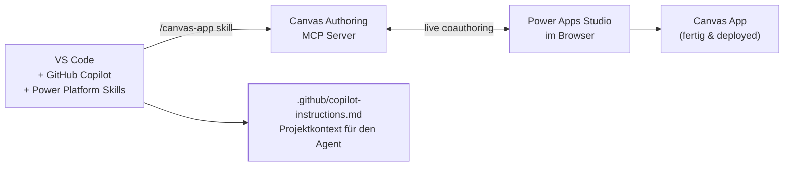
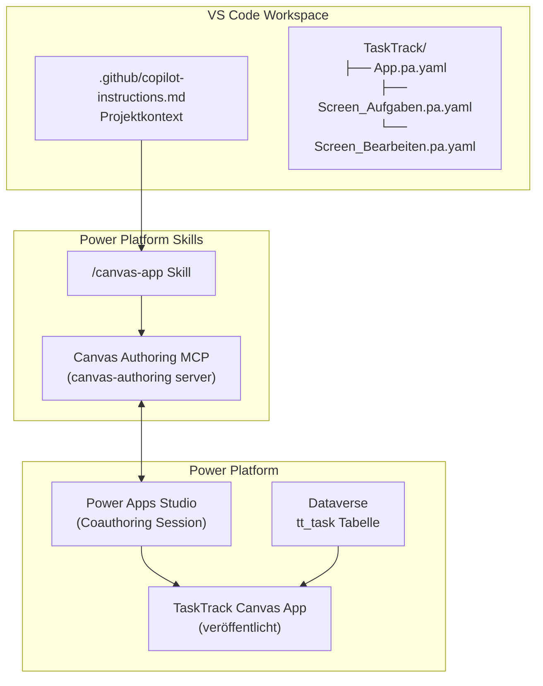

# Demo: Canvas App mit Agentic AI bauen

## Power Platform Skills — Schritt für Schritt für Einsteiger

> **Was wir bauen:** Eine Canvas App zur Aufgabenverwaltung — generiert von einem KI-Agenten in VS Code, live in Power Apps Studio veröffentlicht.
> **Dauer:** ca. 45 Minuten
> **Schwierigkeit:** Einsteiger ✦ (kein Code-Vorwissen nötig)

---

## Das Konzept in 30 Sekunden



**Was passiert:** VS Code Copilot erhält deinen Projektkontext via `copilot-instructions.md`, verbindet sich über einen MCP Server direkt mit Power Apps Studio im Browser, und generiert die App als YAML — live, während Studio geöffnet bleibt.

---

## Voraussetzungen — Was muss installiert sein?

Bevor wir starten: Checke diese Liste ab. Alles mit ✦ ist **zwingend erforderlich**.

| Was                          | Warum                         | Download                                                                                       |
| ---------------------------- | ----------------------------- | ---------------------------------------------------------------------------------------------- |
| ✦ VS Code                    | Unser Editor                  | [code.visualstudio.com](https://code.visualstudio.com)                                         |
| ✦ GitHub Copilot Erweiterung | Der KI-Agent                  | VS Code Extensions: `GitHub.copilot`                                                           |
| ✦ Node.js (v20+)             | Für den Installer             | [nodejs.org](https://nodejs.org)                                                               |
| ✦ .NET 10 SDK                | Für den MCP Server            | [dotnet.microsoft.com/download/dotnet/10.0](https://dotnet.microsoft.com/download/dotnet/10.0) |
| ✦ PAC CLI                    | Für Power Platform Auth       | `npm install -g pac` oder [aka.ms/pac](https://aka.ms/pac)                                     |
| ✦ Power Platform Environment | Wo die App lebt               | [make.powerapps.com](https://make.powerapps.com)                                               |
| Git                          | Für die manuelle Installation | [git-scm.com](https://git-scm.com)                                                             |

### Schnell-Check (Terminal öffnen → alles eintippen):

```powershell
# Alles auf einmal prüfen:
node --version     # Soll v20+ zeigen
dotnet --version   # Soll 10.x.x zeigen
pac --version      # Soll eine Version zeigen
```

> **Tipp:** Wenn `pac` nicht gefunden wird: `npm install -g pac` in PowerShell als Admin ausführen, dann Terminal neustarten.

---

## Phase 1: Workspace einrichten (10 Minuten)

### Schritt 1.1 — Projektordner anlegen

```powershell
# Irgendwo auf deinem Rechner — z.B. Dokumente
mkdir C:\demos\genapp
cd C:\demos\genapp
code .   # Öffnet VS Code in diesem Ordner
```

### Schritt 1.2 — `copilot-instructions.md` anlegen

Diese Datei ist das **Gedächtnis des Agenten** — sie sagt Copilot, was unser Projekt ist, ohne dass wir es jedes Mal neu erklären müssen.

Erstelle die Datei `.github/copilot-instructions.md` (Ordner `.github` anlegen falls nötig):

```markdown
# Projekt: TaskTrack — Power Platform Demo App

## Kontext

Demo-Projekt für Power Platform Solution Architecture Seminar.
Stack: Canvas Apps, Dataverse, Power Automate.
Ziel: Aufgabenverwaltung für Teams (max. 50 Nutzer).

## Konventionen

- Tabellenpräfix: tt\_ (Publisher: contoso)
- Power Fx: gbl* für globale Variablen, loc* für lokale, col\* für Collections
- Controls: btnX (Buttons), lblX (Labels), galX (Galerien), frmX (Forms), txtX (Texteingaben)
- Diagramme: immer Mermaid

## Arbeitsweise des Agenten

- Lizenzimplikationen erwähnen wenn Premium Connectors benötigt werden
- Einfache Lösungen bevorzugen — kein Over-Engineering
- Bei Dataverse: immer Row-Level Security beachten
```

> **Warum `.github/`?** GitHub Copilot erkennt diese Datei automatisch und lädt sie als Kontext für alle Antworten im Workspace. Einmal einrichten = dauerhaft wirksam.

### Schritt 1.3 — Test: Wirkt der Kontext?

Öffne **Copilot Chat** (Ctrl+Alt+I) und frage:

```
Schlage eine Tabellenstruktur für Aufgaben vor.
```

✓ **Erwartetes Ergebnis:** Copilot schlägt Tabellennamen mit `tt_`-Präfix vor und erwähnt Dataverse.

---

## Phase 2: Power Platform Skills installieren (5 Minuten)

Das ist das Herzstück — hier installieren wir das Plugin, das den Canvas App Generator aktiviert.

### Option A — Automatischer Installer (empfohlen)

Öffne PowerShell im VS Code Terminal (Ctrl+`) und führe aus:

```powershell
iwr https://raw.githubusercontent.com/microsoft/power-platform-skills/main/scripts/install.js -OutFile install.js; node install.js; del install.js
```

Der Installer:

1. Prüft ob `pac` CLI vorhanden ist
2. Erkennt VS Code Copilot / Claude Code automatisch
3. Registriert das Plugin-Marketplace
4. Installiert alle Plugins (canvas-apps, power-pages, model-apps, code-apps)
5. Aktiviert Auto-Update

> **Was passiert danach?** Copilot kennt jetzt neue Befehle: `/canvas-app`, `/configure-canvas-mcp`, `/add-data-source`

### Option B — Manuell via Plugin-Befehle

Falls Option A nicht klappt: Öffne Copilot Chat und tippe **exakt** diese Befehle (nacheinander):

```
/plugin marketplace add microsoft/power-platform-skills
```

```
/plugin install canvas-apps@power-platform-skills
```

### Schritt 2.2 — Installation prüfen

Öffne Copilot Chat und tippe:

```
/canvas-app
```

✓ **Erwartetes Ergebnis:** Copilot antwortet mit einer Frage, was für eine App du bauen möchtest — nicht mit einem Fehler.

---

## Phase 3: Power Apps Studio vorbereiten (5 Minuten)

Der MCP Server verbindet sich **live** mit einer geöffneten Studio-Session. Studio muss also im Browser offen bleiben, während wir arbeiten.

### Schritt 3.1 — In Power Platform einloggen (PAC CLI)

```powershell
# Im VS Code Terminal:
pac auth create --environment https://DEINE-ORG.crm.dynamics.com
# → Browser öffnet sich → mit deinem M365-Account einloggen
```

> Ersetze `DEINE-ORG` mit dem Namen deiner Organisation (findest du in der URL von make.powerapps.com, z.B. `https://contoso.crm.dynamics.com`).

Prüfen ob Login funktioniert hat:

```powershell
pac org who
# Soll deinen Namen + Environment-URL zeigen
```

### Schritt 3.2 — Leere Canvas App in Studio anlegen

1. Öffne [make.powerapps.com](https://make.powerapps.com) im Browser
2. Klicke **+ Erstellen** → **Leere App** → **Leere Canvas-App**
3. App-Name: `TaskTrack`
4. Format: **Tablet** (empfohlen für Desktop)
5. Klicke **Erstellen**

> ⚠️ **Wichtig:** Lass den Browser-Tab mit Power Apps Studio **offen** — nicht schließen! Die MCP-Verbindung bricht sonst ab.

### Schritt 3.3 — App-ID und Environment-ID herausfinden

Schau in die Browser-URL — sie sieht ungefähr so aus:

```
https://make.powerapps.com/environments/abc123-def456-ghi789/apps/xyz999-lmn000/edit
```

Notiere dir:

- **Environment-ID:** `abc123-def456-ghi789` (der Teil nach `/environments/`)
- **App-ID:** `xyz999-lmn000` (der Teil nach `/apps/`)

> **Tipp:** Kopiere einfach die ganze URL — Copilot kann die IDs selbst extrahieren wenn du sie einfügst.

---

## Phase 4: MCP Server konfigurieren (5 Minuten)

Jetzt verbinden wir den Agenten mit deiner offenen Studio-Session.

### Schritt 4.1 — MCP konfigurieren

Öffne Copilot Chat und tippe:

```
/configure-canvas-mcp
```

Copilot fragt dich nach:

- Environment-ID → eintragen (aus Schritt 3.3)
- App-ID → eintragen (aus Schritt 3.3)

> **Was passiert dabei?** Copilot registriert den `canvas-authoring` MCP Server und verbindet ihn mit deiner Studio-Session. Ab jetzt kann er die App direkt lesen und schreiben.

### Schritt 4.2 — Verbindung prüfen

Tippe in Copilot Chat:

```
List available controls in my Canvas App
```

✓ **Erwartetes Ergebnis:** Copilot listet verfügbare Controls (Button, Label, Gallery, Form, etc.) auf — diese kommen direkt aus dem MCP Server.

---

## Phase 5: Canvas App generieren lassen (10 Minuten)

Jetzt kommt das Herzstück — der Agent baut die App.

### Schritt 5.1 — App-Anforderungen formulieren

Öffne Copilot Chat und schreibe deinen Auftrag. Je klarer, desto besser:

```
/canvas-app

Baue eine Canvas App "TaskTrack" für Aufgabenverwaltung mit folgenden Screens:

1. Screen "Aufgaben" (Startscreen):
   - Gallery mit allen Aufgaben (Titel, Fälligkeitsdatum, Status-Badge)
   - Suchfeld oben
   - Button "+ Neue Aufgabe" (navigiert zu Screen 2)

2. Screen "Aufgabe bearbeiten":
   - Formular mit: Titel (Pflichtfeld), Beschreibung, Fälligkeitsdatum, Status (Dropdown: Offen/In Bearbeitung/Erledigt)
   - Button "Speichern" und "Abbrechen"

Datenquelle: Dataverse Tabelle tt_task
Stil: Modern, clean, Fluent Design
```

> **Was macht der Agent jetzt?**
>
> 1. `canvas-app-planner` Agent: Entdeckt verfügbare Controls und APIs, schreibt einen Plan
> 2. `canvas-screen-builder` Agent: Baut jeden Screen parallel als YAML-Datei
> 3. `compile_canvas`: Validiert die generierten YAML-Dateien gegen die live Studio-Session

### Schritt 5.2 — Warten & beobachten

Der Agent arbeitet selbstständig. Du siehst:

- `.pa.yaml` Dateien werden in deinem Workspace-Ordner erstellt
- Copilot Chat zeigt Fortschritte an
- Fehler werden automatisch korrigiert

> **Dauert ca. 3-5 Minuten** bei einer 2-Screen App.

### Schritt 5.3 — Ergebnis in Studio anschauen

Wechsle zu Power Apps Studio im Browser:

- Klicke im linken Panel auf **Screens** — du solltest jetzt 2 Screens sehen
- Klicke auf Screen "Aufgaben" — die Gallery und der Button sollten da sein
- Klicke auf **▶ Vorschau** (oben rechts) um die App zu testen

✓ **Erfolgskriterium:** App öffnet sich in der Vorschau, Gallery zeigt den Ladeindikator.

---

## Phase 6: Dataverse Datenquelle verbinden (5 Minuten)

Die App braucht echte Daten — wir verbinden sie mit Dataverse.

### Schritt 6.1 — Dataverse Tabelle erstellen (falls noch nicht vorhanden)

In Copilot Chat:

```
Erstelle mir die PAC CLI Befehle um eine Dataverse Tabelle tt_task anzulegen
mit den Spalten: Titel (Text, Pflichtfeld), Beschreibung (Multiline Text),
Fälligkeitsdatum (Datum), Status (Choice: Offen/In Bearbeitung/Erledigt)
```

Führe die generierten Befehle im Terminal aus:

```powershell
pac dataverse create-table --name tt_task --display-name "Aufgabe"
# ... (weitere Befehle die Copilot generiert)
```

### Schritt 6.2 — Datenquelle in Studio hinzufügen

Zurück in Copilot Chat:

```
/add-data-source

Füge die Dataverse Tabelle tt_task als Datenquelle hinzu.
```

Der Agent führt dich durch die Schritte in Studio:

1. Öffne **Daten** Panel (links in Studio)
2. Klicke **+ Daten hinzufügen**
3. Suche nach **Dataverse** → wähle deine Environment
4. Wähle die Tabelle **tt_task (Aufgabe)**

Der Agent prüft danach automatisch ob die Verbindung erfolgreich war.

### Schritt 6.3 — Gallery mit echter Datenquelle verbinden

Zurück in Copilot Chat:

```
Verbinde die Gallery auf dem Aufgaben-Screen mit der Dataverse Tabelle tt_task.
Items Property soll: Filter(tt_task, StartsWith(tt_title, SearchInput.Text))
```

---

## Phase 7: Veröffentlichen (5 Minuten)

### Schritt 7.1 — Letzte Validierung

In Copilot Chat:

```
Validiere meine Canvas App und zeige mir alle Fehler.
```

Der Agent führt `compile_canvas` aus und zeigt dir eventuelle Probleme.

### Schritt 7.2 — In Studio speichern und veröffentlichen

1. In Power Apps Studio: **Datei** → **Speichern** (oder Ctrl+S)
2. Dann: **Datei** → **Veröffentlichen** → **Diese Version veröffentlichen**
3. Warte ca. 30 Sekunden
4. Klicke **Apps** in der linken Navigation → TaskTrack sollte erscheinen

### Schritt 7.3 — App testen

Klicke auf **TaskTrack** → **App öffnen** — du siehst die fertige App!

---

## Was haben wir gebaut?



---

## Häufige Probleme & Lösungen

| Problem                                 | Ursache                      | Lösung                                                       |
| --------------------------------------- | ---------------------------- | ------------------------------------------------------------ |
| `/canvas-app` unbekannt                 | Skills nicht installiert     | `node install.js` nochmal ausführen, dann VS Code neustarten |
| MCP Verbindungsfehler                   | .NET 10 fehlt                | `dotnet --version` prüfen, ggf. neu installieren             |
| `pac auth create` öffnet keinen Browser | Kein Default-Browser         | Browser manuell öffnen, URL aus Terminal kopieren            |
| Studio zeigt keine Änderungen           | Coauthoring Session getrennt | Studio-Tab neu laden, `/configure-canvas-mcp` wiederholen    |
| `compile_canvas` Fehler                 | YAML Syntax falsch           | Copilot um Korrektur bitten: "Fix the YAML errors"           |
| Tabelle `tt_task` nicht gefunden        | Tabelle noch nicht erstellt  | Schritt 6.1 ausführen                                        |

---

## Nächste Schritte nach der Demo

- **Mehr Screens:** Tippe `/canvas-app` und beschreibe was du erweitern möchtest — der Agent erkennt automatisch ob es ein neuer oder bestehender App-Edit ist
- **Andere Plugins:** `/plugin install power-pages@power-platform-skills` für Web-Sites, `/plugin install model-apps@power-platform-skills` für Model-Driven App Seiten
- **agents.md hinzufügen:** Erstelle `agents.md` im Workspace-Root für spezialisierte Agent-Personas (Schema-Agent, Review-Agent, etc.)
- **Auto-Update aktiviert:** Der Installer hat Auto-Update eingeschaltet — die Skills bleiben automatisch aktuell

---

## Referenzen

- [Power Platform Skills GitHub](https://github.com/microsoft/power-platform-skills)
- [Canvas Apps Plugin README](https://github.com/microsoft/power-platform-skills/blob/main/plugins/canvas-apps/README.md)
- [PAC CLI Referenz](https://learn.microsoft.com/power-platform/developer/cli/reference)
- [Canvas App YAML Syntax](https://learn.microsoft.com/power-apps/maker/canvas-apps/yaml-formula-to-edit-apps)
- [Issues melden](https://aka.ms/power-skills-canvas-issues)
