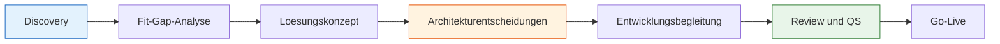

# Lab 1.1 - Rolle, Mandat und Verantwortung des Solution Architects

🎯 Einstiegsfragen — vor der Erklärung stellen

1. Was ist der Unterschied zwischen einem Solution Architect und einem Senior Developer auf der Power Platform?
2. Welche sechs Kernbereiche deckt ein SA auf der Power Platform ab?
3. Was meint man mit 'zwischen Fachlichkeit und Technik uebersetzen'?

💡 Musterlösung

**1.** Der Senior Developer loest konkrete technische Aufgaben. Der SA ist fuer das Gesamtbild verantwortlich: Datenmodell, Sicherheit, Integrationen, Umgebungen und ALM muessen zusammenpassen. Er trifft Designentscheidungen, die schwer rueckgaengig zu machen sind.

**2.** Datenmodell & Dataverse-Architektur | Sicherheitsarchitektur | Umgebungsstrategie | Integrationsstrategie | Erweiterungsstrategie | Governance & ALM.

**3.** Der SA hoert den Fachbereich in Geschaeftssprache und uebersetzt das in technische Entscheidungen (Tabellen, Flows, Rollen). Er erklaert technische Grenzen rueckwaerts in Businessauswirkungen — ohne Fachjargon.

## Was ist ein Solution Architect?

**Der SA ist verantwortlich dafuer, dass die gesamte Loesung zusammenhaelt** — nicht einzelne Features, nicht einzelne Flows, nicht einzelne Screens.

Die zentrale Frage: Wie passen Datenmodell, Sicherheit, Integrationen, Umgebungen und Benutzererfahrung so zusammen, dass das Ergebnis wartbar, skalierbar und korrekt ist?

- Breiter als ein Developer — traegt das Gesamtbild
- Tiefer als ein Projektmanager — trifft technische Designentscheidungen
- Uebersetzt zwischen Fachlichkeit und Technik in beide Richtungen

## Das Aufgabenbild im Detail

Ein Solution Architect traegt Verantwortung in sechs Kernbereichen:

| Bereich                                 | Kernfrage                                                                                             |
| --------------------------------------- | ----------------------------------------------------------------------------------------------------- |
| **Datenmodell & Dataverse-Architektur** | Welche Tabellen, welche Standardtabellen, welche Alternativschluessel? Schwer rueckgaengig zu machen. |
| **Sicherheitsarchitektur**              | Wer sieht, bearbeitet, loescht welche Datensaetze? Business Units, Rollen, Zugriffstiefen.            |
| **Umgebungsstrategie**                  | Wieviele Umgebungen? Dev / Test / Prod — und wie kommen Loesungen zwischen ihnen durch?               |
| **Integrationsstrategie**               | Welche externen Systeme? Ueber welche Schnittstelle? Synchron oder asynchron?                         |
| **Erweiterungsstrategie**               | Wann reicht Konfiguration? Wann Flow, wann Plugin, wann Azure Function?                               |
| **Governance & ALM**                    | Wie wird versioniert, getestet, ausgeliefert — ohne unkontrolliertes Chaos?                           |

## Abgrenzung zu anderen Rollen

| Rolle                 | Fokus                                           | Entscheidungstiefe          |
| --------------------- | ----------------------------------------------- | --------------------------- |
| Solution Architect    | Gesamtarchitektur, Datenmodell, Sicherheit, ALM | Strukturell und langfristig |
| Developer und Maker   | Implementierung von Features                    | Technisch und kurzfristig   |
| Business Analyst      | Anforderungsaufnahme, Prozessanalyse            | Fachlich                    |
| Projektmanager        | Zeitplan, Budget, Ressourcen                    | Organisatorisch             |
| Functional Consultant | Konfiguration von Standardfunktionen            | Fachlich-technisch          |

> **Der entscheidende Unterschied liegt nicht im Wissen, sondern im Zeithorizont.**
> Ein Developer entscheidet, wie ein Feature heute umgesetzt wird. Ein SA entscheidet, wie das System in zwei Jahren noch wartbar ist.

## Der SA im Projektablauf

Der SA ist in allen Phasen aktiv, nicht nur in der Konzeptionsphase. Er begleitet die Entwicklung, prueft ob Implementierungen den Architekturvorgaben entsprechen, und stellt sicher, dass Go-Live-Entscheidungen auf einer soliden Grundlage basieren.

## Was macht eine gute Architekturentscheidung aus?

- **Begruendet** — Es gibt einen nachvollziehbaren Grund, warum diese und keine andere Option gewaehlt wurde.
- **Dokumentiert** — Die Entscheidung ist fuer andere nachlesbar, damit sie nicht zweimal getroffen werden muss.
- **Konsequenzbewusst** — Der SA hat verstanden, welche anderen Bereiche der Loesung davon betroffen sind.

> **Beispiel:** Dateien in Dataverse speichern oder in SharePoint auslagern klingt wie eine Detailfrage — beeinflusst aber Speicherverbrauch, Lizenzkosten, Sicherheitsarchitektur und Offline-Faehigkeit der Anwendung.

## Typische SA-Situationen

> **Situation 1: Developer-Loesung passt nicht zum Datenmodell**
> Ein Developer speichert Zwischenergebnisse in lokalen Canvas-Variablen statt in Dataverse. Funktioniert in der Demo — Daten gehen verloren wenn die App abstuerzt. Der SA erkennt das Muster und korrigiert fruehzeitig.

> **Situation 2: Fachbereich fordert etwas, das die Plattform so nicht kann**
> Der Fachbereich will Echtzeitaggregation ueber 500.000 Datensaetze auf einem Dashboard. Der SA erklaert, warum Rollup-Spalten asynchron sind, und fuehrt das Gespraech in Richtung eines realisierbaren Designs.

> **Situation 3: Niemand hat ueber die Umgebungsstrategie nachgedacht**
> Das Projekt laeuft seit drei Monaten, alle entwickeln in der Produktivumgebung. Der SA erkennt diesen Zustand und etabliert eine Struktur, bevor der Schaden groesser wird.

## Kernfrage fuer jeden SA

> _„Wenn diese Loesung in zwei Jahren von jemandem uebernommen wird, der jetzt noch nicht im Projekt ist — versteht er, warum das so gebaut wurde, und kann er es ohne grossen Aufwand weiterentwickeln?"_
>
> Wenn die Antwort nein ist, ist die Architekturentscheidung noch nicht gut genug.

## Wo konfigurieren und überwachen?

| Thema                                                | Navigation                                                                                         |
| ---------------------------------------------------- | -------------------------------------------------------------------------------------------------- |
| Umgebungsübersicht                                   | [admin.powerplatform.microsoft.com](https://admin.powerplatform.microsoft.com) → **Environments**  |
| DLP-Richtlinien (Governance-Leitplanken)             | PPAC → **Policies** → **Data policies**                                                            |
| Lösungen (Solution-Struktur prüfen)                  | [make.powerapps.com](https://make.powerapps.com) → **Solutions**                                   |
| Sicherheitsrollen (wer hat welche Rechte)            | PPAC → **Environments** → [Umgebung] → **Settings** → **Users + permissions** → **Security roles** |
| Tenant-Einstellungen (wer darf Umgebungen erstellen) | PPAC → **Settings** → **Tenant settings**                                                          |
