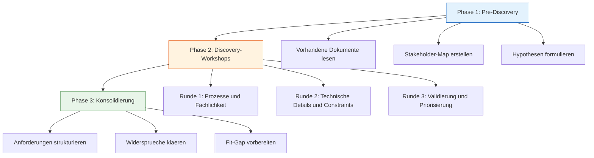
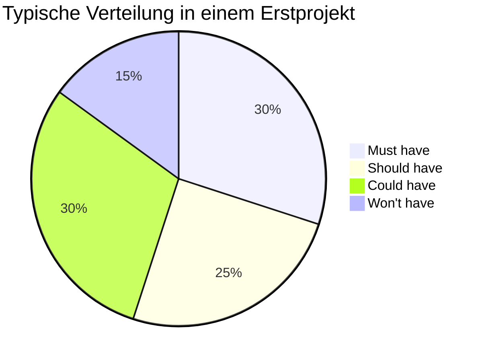

# Lab 1.2 - Anforderungen strukturiert erfassen und Discovery steuern

🎯 Einstiegsfragen — vor der Erklärung stellen

1. Was unterscheidet eine strukturierte Discovery von einem normalen Kundengespraech?
2. Welche drei Phasen hat eine typische Discovery?
3. Warum reicht eine einzige Workshop-Runde mit dem Fachbereich fast nie aus?

💡 Musterlösung

**1.** In einer strukturierten Discovery denkt der SA schon waehrend des Gespraechs an Datenmodell, Sicherheit, Integrationen und technische Grenzen. Er sammelt nicht Feature-Wuensche, sondern baut ein vollstaendiges Bild: funktionale Anforderungen, nicht-funktionale Anforderungen, Constraints und Stakeholder-Interessen.

**2.** Phase 1 - Pre-Discovery: Dokumente lesen, Stakeholder-Map erstellen, Hypothesen formulieren. Phase 2 - Discovery-Workshops (3 Runden: Prozesse, technische Details, Validierung). Phase 3 - Konsolidierung: Anforderungen strukturieren, Widersprueche klaeren, Fit-Gap vorbereiten.

**3.** In Runde 1 spricht der Fachbereich ueber Prozesse aus seiner Sicht. Technische Constraints kommen erst in Runde 2 heraus. Validierung und Priorisierung brauchen einen dritten Termin, wenn der Fachbereich die strukturierten Anforderungen schriftlich vorliegen hat.

## Was ist Discovery und warum ist sie Architektensache?

Discovery ist der Prozess, bei dem ein Projektteam herausfindet, was ein Kunde wirklich braucht. Der Unterschied zu einem normalen Gespraech liegt in der Systematik. Ein SA steuert die Discovery so, dass am Ende nicht eine Liste von Feature-Wuenschen steht, sondern ein vollstaendiges Bild der Anforderungen, das als Grundlage fuer Architekturentscheidungen taugt.

Discovery ist Architektensache, weil die Fragen, die der SA stellt, andere sind als die Fragen eines Consultants oder Analysts. Der SA denkt schon waehrend der Discovery an das Datenmodell, an Sicherheitsanforderungen, an Integrationen und an technische Grenzen. Er hoert anders zu.

## Der Discovery-Ablauf in drei Phasen

## Phase 1: Pre-Discovery

Bevor der erste Workshop stattfindet, bereitet sich der SA vor. Das ist keine Formalie, sondern eine echte Investition.

**Vorhandene Dokumente lesen:** Gibt es ein Lastenheft, ein altes System, Prozessbeschreibungen, Organigramme? Ein SA, der unvorbereitet in den ersten Workshop geht, verschwendet die Zeit aller Beteiligten.

**Stakeholder-Map erstellen:** Wer hat Einfluss auf das Projekt? Wer nutzt das System spaeter? Wer muss das Ergebnis genehmigen? Diese Personen muessen alle in den Discovery-Prozess eingebunden werden.

Eine einfache Stakeholder-Map hat vier Quadranten:

| | Hoher Einfluss | Geringer Einfluss |
|---|---|---|
| Hohes Interesse | Intensiv einbinden | Regelmaessig informieren |
| Geringes Interesse | Zufrieden halten | Minimal informieren |

**Hypothesen formulieren:** Basierend auf Vorabinformationen formuliert der SA erste Hypothesen. "Ich vermute, dass es ein komplexes Genehmigungsverfahren gibt." Diese Hypothesen steuern die Fragen in den Workshops.

## Phase 2: Discovery-Workshops

### Runde 1: Prozesse und Fachlichkeit

In der ersten Runde geht es um das grosse Bild. Der SA stellt Fragen wie:
- Beschreiben Sie mir den typischen Tag eines Nutzers, der dieses System spaeter benutzt.
- Was passiert heute in diesem Prozess, wenn etwas schieflaeuft?
- Welche Systeme werden heute fuer diesen Prozess genutzt?
- Was ist das groesste Schmerzpunkt im aktuellen Prozess?

In dieser Runde nimmt der SA keine Loesungen entgegen, sondern Probleme. Wenn ein Stakeholder sagt "Ich brauche einen Button, der automatisch eine E-Mail schickt", fragt der SA: "Was soll diese E-Mail ausloesen? Welches Problem loest sie?"

### Runde 2: Technische Details und Constraints

In der zweiten Runde geht es um die Grenzen. Der SA fragt:
- Welche Datenschutzanforderungen gelten? (DSGVO, besondere Datenkategorien?)
- Welche Systeme muessen integriert werden und was sind deren Schnittstellen?
- Wieviele Nutzer werden das System gleichzeitig verwenden?
- Gibt es regulatorische oder Compliance-Anforderungen?
- Welche Performanceanforderungen gibt es?

Diese Fragen klingen technisch, sind aber fachlich hochrelevant. Eine Anforderung "der Bericht muss in Echtzeit sein" hat andere Architekturkonsequenzen als "der Bericht wird einmal pro Nacht aktualisiert".

### Runde 3: Validierung und Priorisierung

In der dritten Runde werden die konsolidierten Anforderungen zurueck an die Stakeholder gegeben. Der SA praesentiert ein Anforderungsdokument und fragt:
- Haben wir alles richtig verstanden?
- Was haben wir vergessen?
- Was davon ist fuer den Go-Live unverzichtbar?

Hier wird mit der MoSCoW-Methode priorisiert.

## MoSCoW-Priorisierung

MoSCoW steht fuer vier Kategorien, die Anforderungen eingeordnet werden:

- **Must have (M)** — Diese Anforderungen sind fuer den Go-Live unverzichtbar. Ohne sie ist das System nicht nutzbar. Ein Beispiel: "Nutzer muessen sich anmelden koennen."
- **Should have (S)** — Diese Anforderungen sind wichtig, aber das System koennte kurzfristig ohne sie starten. Ein Beispiel: "Nutzer sollten ihre E-Mail-Benachrichtigungen konfigurieren koennen."
- **Could have (C)** — Nice-to-have. Diese Anforderungen werden umgesetzt, wenn Zeit und Budget es erlauben. Ein Beispiel: "Nutzer koennten ein Dashboard mit ihren persoenlichen Statistiken haben."
- **Won't have (W)** — Diese Anforderungen sind ausgeschlossen. Sie werden im naechsten Release oder gar nicht umgesetzt. Explizit "Won't have" zu definieren ist wichtig, weil es Scope-Creep verhindert.

## Die Stakeholder-Map im Detail

Nicht alle Stakeholder sind gleich. Ein SA unterscheidet:

- **Sponsor** — Der Person, die das Budget hat. Der SA muss mit ihr sicherstellen, dass die Architektur zu den Investitionsentscheidungen passt.
- **Key Users** — Die Personen, die das System taeglich nutzen werden. Ihre Anforderungen sind oft die realistischsten, weil sie den Prozess am besten kennen.
- **IT-Abteilung** — Sie hat Anforderungen bezueglich Sicherheit, Compliance und Betrieb. Diese Anforderungen klingen manchmal buerokratisch, sind aber architekturrelevant.
- **Indirekte Beteiligte** — Systeme und Prozesse, die vom neuen System beeinflusst werden, auch wenn ihre Nutzer nicht direkt betroffen scheinen.

## Was der SA mit den Discovery-Ergebnissen macht

Nach der Discovery hat der SA eine strukturierte Sammlung von Anforderungen. Diese Anforderungen werden in der naechsten Phase fuer die Fit-Gap-Analyse verwendet. Der SA prueft: Was davon kann die Power Platform von Haus aus? Was braucht Konfiguration? Was braucht Erweiterungen? Was kann die Plattform gar nicht?

Ein Discovery ohne diese Weiterverwertung ist Zeitverschwendung. Die Discovery ist kein Selbstzweck, sondern die Vorbereitung fuer alle folgenden Architekturentscheidungen.

## Haeufige Fehler in der Discovery

- **Anforderungen als Loesungen aufnehmen** — Stakeholder formulieren oft Loesungen statt Probleme. "Ich brauche einen Button" ist keine Anforderung. "Ich muss nach Abschluss eines Auftrags den Kunden benachrichtigen koennen" ist eine Anforderung. Der SA muss diese Umformulierung immer vornehmen.
- **Nur mit einem Stakeholder sprechen** — Die Perspektive des Managers ist nicht die Perspektive des Sachbearbeiters. Beide sind noetig.
- **Nicht-funktionale Anforderungen vergessen** — Performance, Sicherheit, Verfuegbarkeit, Datenschutz. Diese Anforderungen sind fuer die Architektur oft wichtiger als funktionale Anforderungen, werden aber selten spontan genannt.
- **Keine Priorisierung vornehmen** — Wenn alle Anforderungen gleich wichtig sind, kann keine Architekturentscheidung getroffen werden. Priorisierung ist Pflicht.

## Wo konfigurieren und überwachen?

| Thema | Navigation |
|---|---|
| Vorhandene Umgebungen und Apps (Ist-Zustand) | [admin.powerplatform.microsoft.com](https://admin.powerplatform.microsoft.com) → **Environments** |
| Vorhandene Lösungen und Komponenten prüfen | [make.powerapps.com](https://make.powerapps.com) → **Solutions** |
| Connector-Verfügbarkeit prüfen | [make.powerautomate.com](https://make.powerautomate.com) → **Connectors** |
| Capacity-Verbrauch (Tenant-Baseline) | PPAC → **Resources** → **Capacity** |
| Lizenzen im Tenant | [admin.microsoft.com](https://admin.microsoft.com) → **Billing** → **Licenses** |
