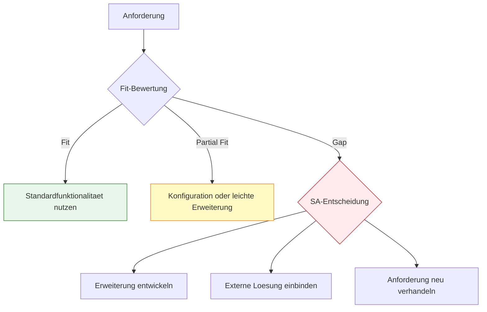

# Lab 1.3 - Fit-Gap-Analyse als Architekturwerkzeug

🎯 Einstiegsfragen — vor der Erklärung stellen

1. Was bedeuten Fit, Partial Fit und Gap in der Fit-Gap-Analyse?
2. Warum ist die Fit-Gap-Analyse eine Architekturentscheidung und keine Checkliste?
3. Wie kommuniziert man einen Gap dem Fachbereich, ohne Vertrauen zu verlieren?

💡 Musterlösung

**1.** Fit: Power Platform kann die Anforderung out-of-the-box erfuellen. Partial Fit: Konfiguration oder leichte Erweiterung noetig. Gap: Plattform kann die Anforderung nicht erfuellen — SA entscheidet: Erweiterung entwickeln, externe Loesung oder Anforderung neu verhandeln.

**2.** Weil jeder Gap eine Kosten-, Risiko- und Komplexitaetsentscheidung ausloest. Der SA waehlt nicht nur 'ob umsetzbar', sondern auch 'wie', 'mit welchem Aufwand' und 'welche Alternativen gibt es'. Das praegt das gesamte Projektbudget und den Zeitplan.

**3.** Nicht als Ablehnung, sondern als Entscheidungspunkt: 'Diese Anforderung geht nicht out-of-the-box. Wir haben drei Optionen: X kostet Y, Y kostet Z, oder wir passen die Anforderung so an, dass sie passt. Welche Option priorisieren Sie?'

## Was ist eine Fit-Gap-Analyse?

Nach der Discovery hat der SA eine Liste von Anforderungen. Die Fit-Gap-Analyse beantwortet nun fuer jede Anforderung eine einfache Frage: Kann die Power Platform das von Haus aus, braucht sie Konfiguration oder Erweiterung, oder kann sie es gar nicht?

Das Ergebnis dieser Analyse ist die Grundlage fuer alle Architekturentscheidungen, Kostenschaetzungen und Risikobewertungen im Projekt.

## Die drei Kategorien

- **Fit** — Die Plattform kann die Anforderung mit Standardfunktionalitaet abdecken. Keine Erweiterung noetig. Beispiel: Ein Genehmigungsworkflow mit zwei Stufen kann vollstaendig mit Power Automate und dem eingebauten Approval-Connector umgesetzt werden.
- **Partial Fit** — Die Plattform deckt die Anforderung teilweise ab. Konfiguration oder eine leichte Erweiterung ist noetig. Beispiel: Automatische Erinnerungen nach drei Tagen sind mit Power Automate loesbar, brauchen aber Konfigurationsarbeit.
- **Gap** — Die Plattform kann die Anforderung nicht erfuellen. Hier muss der SA entscheiden: Erweiterung entwickeln, externe Loesung einbinden oder mit dem Kunden verhandeln, die Anforderung zu aendern oder zu streichen. Beispiel: Eine Echtzeit-Vollvolltextsuche ueber 10 Millionen Datensaetze ist mit Dataverse allein nicht loesbar.

## Wie eine Fit-Gap-Analyse aufgebaut ist

Eine Fit-Gap-Analyse ist typischerweise eine strukturierte Tabelle. Jede Zeile ist eine Anforderung, die Spalten enthalten:

| Anforderungs-ID | Beschreibung | Kategorie | Power Platform Moeglichkeit | Luecke/Hinweis | SA-Empfehlung |
|---|---|---|---|---|---|
| ANF-001 | Urlaubsantrag digital stellen | Fit | Canvas App oder Model-Driven App | Keine | Standard-Formular |
| ANF-004 | SAP-Integration Personalstamm | Partial Fit | SAP Connector vorhanden | Datenmapping noetig | Custom Connector oder SAP-Connector evaluieren |
| ANF-012 | Echtzeit-Vollvolltextsuche ueber alle Antraege | Gap | Dataverse-Suche ist eingeschraenkt | Kein Echtzeit-Index | Azure Cognitive Search evaluieren |

## Warum die Fit-Gap-Analyse mehr als eine Tabelle ist

Eine Fit-Gap-Analyse in professioneller Qualitaet geht ueber die Tabelle hinaus.

- **Risikobewertung** — Gaps sind nicht gleich schwer. Ein Gap bei einer Must-have-Anforderung ist ein Projektstoprisiko. Ein Gap bei einer Could-have-Anforderung ist vernachlaessigbar. Der SA bewertet jeden Gap nach Schwere und Wahrscheinlichkeit.
- **Aufwandsschaetzung** — Fuer jeden Partial Fit und jeden Gap schlaegt der SA einen Loesungsweg vor und schaetzt den Umsetzungsaufwand grob. Diese Schoepfung ist ungenau, aber sie gibt dem Projektmanager und dem Kunden eine Entscheidungsgrundlage.
- **Priorisierungswirkung** — Eine Fit-Gap-Analyse kann die MoSCoW-Priorisierung verschieben. Eine Should-have-Anforderung kann zur Won't-have-Anforderung werden, wenn der SA feststellt, dass sie einen Gap darstellt, der unverhealtnismaessig viel Aufwand erzeugt.

## Typische Gaps in Power Platform Projekten

Es gibt wiederkehrende Muster, bei denen Standard-Power-Platform an Grenzen stosst:

- **Komplexe Druckvorlagen** — Power Platform hat keine native Funktion fuer formatierte PDF-Dokumente. Loesungsweg: Word-Templates in Power Automate, oder externe Dienste wie Encodian oder Plumsail.
- **Erweiterte Suche und Volltextindexierung** — Dataverse-Suche ist gut, aber nicht fuer komplexe Suchszenarien mit Facettierung und Ranking geeignet. Loesungsweg: Azure Cognitive Search.
- **Batch-Verarbeitung grosser Datenmengen** — Power Automate hat Limits bei der Anzahl von Loop-Iterationen und API-Calls pro Tag. Loesungsweg: Azure Functions oder Azure Data Factory.
- **Komplexe Berechnungen und Aggregationen in Echtzeit** — Rollup-Spalten in Dataverse sind asynchron und koennen bis zu 12 Stunden alt sein. Loesungsweg: Formel-Spalten fuer einfache Faelle, Azure Functions oder Power BI fuer komplexe Faelle.
- **Externe Authentifizierung ohne Entra ID** — Power Platform ist fest an Microsoft Identity gebunden. Gastnutzer ohne Microsoft-Konto brauchen Extraaufwand.

## Die SA-Empfehlung formulieren

Nach der Fit-Gap-Analyse formuliert der SA fuer jeden Gap eine Empfehlung. Eine gute Empfehlung hat folgende Struktur:

- **Ausgangslage** — Was ist die Anforderung, und warum ist sie ein Gap?
- **Optionen** — Welche Loesungswege gibt es? Typischerweise gibt es mehrere, mit unterschiedlichen Trade-offs.
- **Empfehlung** — Welche Option empfiehlt der SA, und warum?
- **Konsequenzen** — Was bedeutet diese Empfehlung fuer Kosten, Zeitplan, Wartbarkeit und zuekuenftige Aenderungen?

Ein Beispiel:

> **Anforderung ANF-012: Echtzeit-Vollvolltextsuche**
> 
> **Ausgangslage:** Dataverse bietet eine eingebaute Suche, die Standardfelder indexiert. Diese Suche ist jedoch nicht fuer komplexe Suchanfragen ueber mehrere Millionen Datensaetze mit Ranking und Facettierung ausgelegt.
> 
> **Optionen:**
> Option A: Dataverse-Standardsuche akzeptieren und Anforderung anpassen. Kein Zusatzaufwand.
> Option B: Azure Cognitive Search integrieren. Hohe Suchqualitaet, aber Integration und laufende Kosten.
> 
> **Empfehlung:** Option A fuer den initialen Go-Live. Die Anforderung wird als Should Have neu priorisiert. Im ersten Release nach Go-Live wird die tatsaechliche Nutzung beobachtet und dann entschieden, ob Option B notwendig ist.
> 
> **Konsequenzen:** Der Endnutzer akzeptiert eine weniger praezise Suche im ersten Release. Das spart ca. 20 Personentage Entwicklungsaufwand im initialen Scope.

## Fit-Gap vs. Scope-Creep

Eine Fit-Gap-Analyse schuetzt vor Scope-Creep. Wenn ein Stakeholder in der Entwicklungsphase eine neue Anforderung einbringt, kann der SA sie sofort durch die Fit-Gap-Analyse laufen lassen: Ist es ein Fit, kein Problem. Ist es ein Gap, muss der Stakeholder entscheiden, was dafuer aus dem Scope herausgenommen wird.

Diese klare Sprache verhindert, dass das Projekt endlos waechst.

## Wo konfigurieren und überwachen?

| Thema | Navigation |
|---|---|
| Connector-Katalog (verfügbare Standard-Connectors) | [make.powerautomate.com](https://make.powerautomate.com) → **Connectors** |
| Power Platform-Features je Umgebung prüfen | [make.powerapps.com](https://make.powerapps.com) → [Umgebung wählen] → **Tables / Flows / Apps** |
| AI Builder-Modelle evaluieren | [make.powerapps.com](https://make.powerapps.com) → **AI models** |
| SAP-Connector Details | [make.powerautomate.com](https://make.powerautomate.com) → **Connectors** → Suche: „SAP" |
| Lizenz-/Feature-Übersicht | [learn.microsoft.com/power-platform/admin/pricing-billing-skus](https://learn.microsoft.com/power-platform/admin/pricing-billing-skus) |
