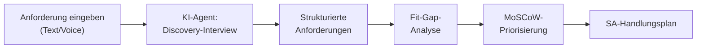

# Agentic AI — M01: Rolle & Methodik

> **Fokus:** Wie kann der Discovery & Requirements-Prozess mit KI-Agenten automatisiert und assistiert werden?  
> **Zielgruppe:** Solution Architects, die ihre Discovery- und Anforderungsanalyse beschleunigen möchten  
> **Lösung:** siehe `agentic-sol.md` (wird nachgefüllt)

---

## Die Rolle des Agents in der Discovery

Der traditionelle Discovery-Prozess ist zeitintensiv: Manuelle Interviews, Notizen sammeln, Fit-Gap-Analysen schreiben, MoSCoW-Priorisierungen pflegen — das alles händisch.

Mit einem **Agentic AI System** kann dieser Prozess unterstützt werden:



---

## Use Case 1: Interview-Assistent

### Problem

Eine VisitTrack-Discovery mit 5 Interviews à 2 Stunden = 10 Stunden. Afterwards müssen Notizen manuell verarbeitet werden.

### Agentic Lösung

Ein Agent, der:

1. **Live im Meeting dabei ist** (Teams, Zoom) → transkribiert
2. **In Echtzeit strukturiert** → Anforderung erkannt → in vorbereiteter Fit-Gap-Tabelle eingetragen
3. **Rückfragen stellt** → "Sie sagten, ADM arbeiten offline. Wie soll die Synchronisierung funktionieren?"
4. **Notizen in Echtzeit konsolidiert** → kein Post-Meeting-Durcheinander

**MCP-Integration:**

```
MCP Client (VS Code Agent)
  ↓
Copilot Studio Agent
  ├─ Teams Transcription MCP (Live-Transkript)
  ├─ Dataverse MCP (Anforderungen speichern)
  └─ SharePoint MCP (Fit-Gap-Doc aktualisieren)
```

---

## Use Case 2: Auto-generierte Fit-Gap & MoSCoW

### Problem

Nach jedem Interview: manuelle Fit-Gap-Analyse, manuelle MoSCoW-Priorisierung. Sehr fehleranfällig.

### Agentic Lösung

```plaintext
Agent-Input (Rohnotizen):
"Wir brauchen Offline-Unterstützung für die Außendienstmitarbeiter."

Agent-Verarbeitung:
1. Erkennt: "Offline" = technische Anforderung
2. Mappt auf Power Platform: "Canvas App + Offline-Datenbank"
3. Klassifiziert: "Power Platform kann das nativ" → Fit
4. Priorisiert: "Offline ist kritisch, ohne geht's nicht" → Must Have

Agent-Output (strukturiert):
| # | Anforderung | Kategorie | Plattform-Lösung | MoSCoW | Risiko |
|---|---|---|---|---|---|
| 1 | Offline-Unterstützung | Technical | Canvas + Offline DB | Must | Schema-Drift bei Offline-Sync |
```

**Ableitung:** Der Agent kann die gesamte Fit-Gap + MoSCoW in 30 Minuten generieren statt 3 Stunden manuell.

---

## Use Case 3: Requirements → Technical Roadmap

### Problem

"Anforderungen sind gesammelt, aber wie wird daraus ein technisches Konzept?" — SA sitzt danach wieder isoliert da.

### Agentic Lösung

Agent übernimmt die nächsten Schritte:

1. **Requirements durchdenken** → "Diese 3 Anforderungen = neue Dataverse Table"
2. **Datenmodell skizzieren** → "Account + Contact + Visit_Report (N:N)"
3. **Umgebungsstrategie ableiten** → "Du brauchst Dev, Test, Prod"
4. **Sicherheitskonzept vorschlagen** → "Manager sieht nur eigene Region = Business Unit + Row-Level Security"
5. **Integrationsplan erstellen** → "SAP-Export um 03:00 → Power Automate + Service Bus"

**Output:** Ein Canvas.md-ähnliches Dokument, das der SA nur noch validieren/verfeinern muss.

---

## Use Case 4: Knowledge Graph — "Was haben wir gelernt?"

### Problem

Nach vielen Projekten hat der SA riesige SharePoint-Leichen oder OneNote-Sammlungen, die niemand nutzt.

### Agentic Lösung

Ein Agent baut einen **Knowledge Graph**:

- Alle bisherigen VisitTrack-ähnlichen Projekte indexieren
- Ähnlichkeiten erkennen: "Das klingt wie das Pharma-Projekt von 2024"
- Instant Insights: "Bei ähnlichen Projekten hatte nur 1 von 5 Erfolg mit Offline-Sync, weil..."
- Reusable Components: "Hier ist ein Template-Datenmodell aus einem Projekt, das 85% deines Use Case deckt"

---

## Praktische Architektur: Agentic Discovery-System

```yaml
Agent: "VisitTrack Discovery Assistant"
Model: GPT-4o (oder Claude mit MCP)
Tools (MCPs):
  - teams-transcription-mcp: Transkribiert Live-Meetings
  - dataverse-mcp: Liest/schreibt Anforderungen
  - sharepoint-mcp: Aktualisiert Fit-Gap-Dokumente
  - bing-search-mcp: Recherchiert Best Practices
  - structuring-mcp: Konvertiert Freitext → JSON/Tables

Inputs:
  - Interview-Transkript (oder Live-Stream)
  - Bisherige Anforderungen (aus Dataverse)
  - Projekt-Template (SharePoint)

Outputs:
  - Strukturierte Anforderungen (Dataverse Table)
  - Fit-Gap-Analyse (SharePoint Doc)
  - MoSCoW-Priorisierung (Dataverse View)
  - Technisches Konzept (Canvas.md-ähnlich)
  - Risks & Mitigations (JSON → Power BI)
```

---

## Fallstudie: VisitTrack mit Agentic Discovery

**Szenario:** Neuer SA, erste Discovery zu VisitTrack.

### Klassischer Weg (3–4 Tage)

1. Tag 1: 5 Interviews × 2h = 10h Vor-Ort-Zeit
2. Tag 2–3: Notizen sortieren, Fit-Gap schreiben, Fragen sammeln, Nachfragen stellen
3. Tag 4: Finalisiertes Datenmodell & Konzept

### Agentic Weg (1–2 Tage)

1. Interview-Slot 1: Agent transkribiert live, strukturiert Anforderungen in Echtzeit → SA stellt nur Vertiefungsfragen
2. Sofort danach: Agent generiert Fit-Gap + MoSCoW (30 min)
3. Nächster Tag: Agent erzeugt Datenmodell-Vorschlag + Umgebungsstrategie
4. SA validiert, korrigiert Fehler, macht Anpassungen → Fertig

**Zeitersparnis:** ~80% weniger manuelle Arbeit, höhere Konsistenz, Fehlerrate ↓

---

## Erkannte Pattern — Was kann ein Agent hier _nicht_ gut?

⚠️ **Agent-Risiken in Discovery:**

| Problem                                       | Ursache                                               | Mitigation                                     |
| --------------------------------------------- | ----------------------------------------------------- | ---------------------------------------------- |
| Halluzinationen bei komplexen Abhängigkeiten  | Agent verknüpft falsch                                | SA muss finale Architektur validieren          |
| Übersieht kulturelle/organisatorische Nuancen | KI ist auf Code/Daten optimiert                       | Interview-Insights müssen vom SA betont werden |
| Zu schnelle Generalisierung                   | "3 Projekte mit Offline-Sync, also alle brauchen das" | SA parametrisiert die Agent-Prompts richtig    |

---

## Handlung für Adrian

**Niveau:** Intermediate (Agent-Entwicklung vorausgesetzt)

**Aufgabe:**  
Baue einen **VisitTrack Discovery Assistant** mit folgenden Features:

1. **Interview-Strukturierung:**

   - Akzeptiert Freitext-Notizen oder Transkripte
   - Extrahiert automatisch Anforderungen, Stakeholder, Risiken
   - Speichert strukturiert in Dataverse

2. **Fit-Gap Automation:**

   - Pro Anforderung: Power-Platform-Mapping
   - MoSCoW-Vorschlag basierend auf Anforderungs-Komplexität
   - SharePoint-Output für Stakeholder-Review

3. **Knowledge Graph Integration:**
   - Referenziert ähnliche Projekte aus SharePoint
   - Schlägt Reusable-Components vor
   - Warnt vor Known Pitfalls

**Bonus:** Canvas App mit Agent-Chat, in der Stakeholder selbst Anforderungen eingeben können statt Interviews.

---

## Checkpoint ✓

Am Ende dieses Moduls verstehst du:

- [ ] Wo Agents in der Discovery einen echten Mehrwert bringen
- [ ] Welche MCP-Integrationen nötig sind (Teams, Dataverse, SharePoint)
- [ ] Wie Agent-Outputs in SA-Workflows integriert werden
- [ ] Welche Limitations Agents in Complex Reasoning haben
