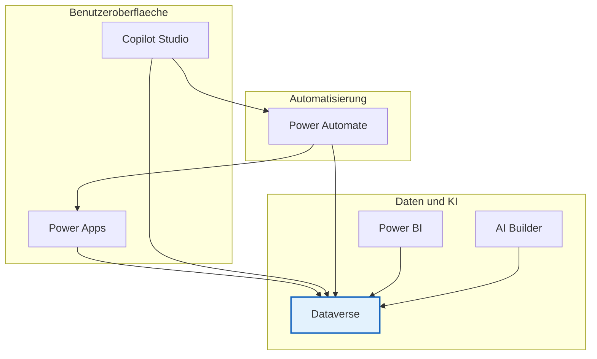
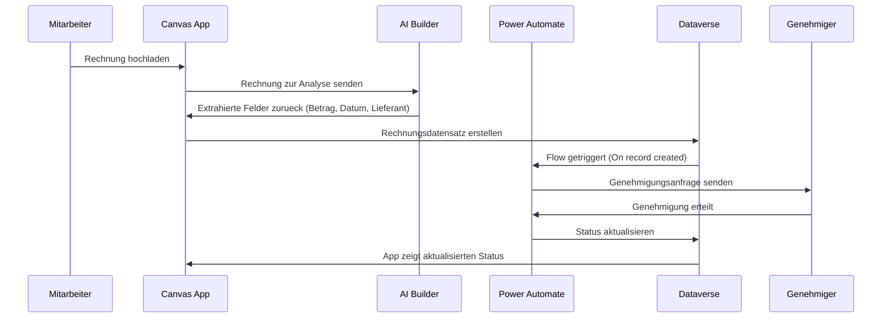

# Lab 2.1 - Die Kernkomponenten der Power Platform im Zusammenspiel

🎯 Einstiegsfragen — vor der Erklärung stellen

1. Nennen Sie die vier Hauptprodukte der Power Platform und ihre primaere Aufgabe.
2. Was ist Dataverse und warum ist es das Fundament der Power Platform?
3. Wann wuerden Sie SharePoint oder Excel statt Dataverse empfehlen?

💡 Musterlösung

**1.** Power Apps: Anwendungen bauen (Canvas App fuer flexibles UI, Model Driven fuer datengesteuerte Prozesse). Power Automate: Prozesse automatisieren. Power BI: Daten visualisieren. Copilot Studio: KI-Agents und Chatbots bauen.

**2.** Dataverse ist die relationale Datenbank der Power Platform mit integriertem Sicherheitsmodell, Geschaeftslogik, Auditing, API und Erweiterungspunkten. Ohne Dataverse: kein Row-Level Security, keine Model Driven Apps, keine Plugins.

**3.** Nur fuer sehr einfache Szenarien ohne Sicherheitsanforderungen, ohne relationale Daten, ohne Workflows und mit wenigen Nutzern. Sobald mehrere Nutzer gleichzeitig schreiben oder Berechtigungen noetig sind: Dataverse.

## Die Power Platform als integriertes System

Die Power Platform ist kein einzelnes Produkt, sondern eine Familie von Diensten, die so konzipiert sind, dass sie zusammenarbeiten. Jede Komponente hat eine klare Hauptverantwortung, aber die eigentliche Staerke entfaltet sich wenn sie kombiniert werden.

Ein SA, der nur einzelne Komponenten kennt, kann keine guten Architekturentscheidungen treffen. Er muss verstehen, wie die Komponenten ineinandergreifen, welche Daten zwischen ihnen fliessen und wo die Grenzen liegen.

## Die sechs Kernkomponenten

**Power Apps:** Erstellt Benutzeroberflaechen. Zwei Typen: Canvas Apps (frei gestaltbar, fuer einfache Interfaces und mobile Nutzung) und Model-Driven Apps (datenzentriert, automatisch generiert aus dem Dataverse-Datenmodell, fuer komplexe Sachbearbeitungsanwendungen).

**Power Automate:** Automatisiert Prozesse und verbindet Systeme. Cloud Flows (ausgeloest durch Ereignisse oder Zeitplan) und Desktop Flows (RPA fuer Legacy-Systeme ohne API).

**Dataverse:** Die Datenbankschicht der Power Platform. Relionale Datenbank mit integriertem Sicherheitsmodell, Geschaeftsregeln, Plugins und Auditing.

**Power BI:** Analysen und Berichte. Verbindet sich nativ mit Dataverse und anderen Datenquellen.

**Copilot Studio:** Erstellt konversationale Agents und Chatbots. Integriert mit Dataverse und Power Automate.

**AI Builder:** Vorgefertigte KI-Modelle (Formularerkennung, Sentimentanalyse, Objekterkennung) die direkt in Apps und Flows genutzt werden koennen.

## Zusammenspiel am Beispiel Rechnungsverarbeitung

Ein klassisches Szenario zeigt, wie alle Komponenten zusammenarbeiten:

## Canvas App vs. Model-Driven App: Die SA-Entscheidung

Diese Entscheidung ist eine der haeufigsten Architekturentscheidungen und wird oft falsch getroffen.

**Canvas App waehlen wenn:**
- Die Benutzeroberflaeche stark angepasst werden soll (spezifisches Design, branding)
- Die App auf mobilen Geraeten optimal funktionieren muss
- Daten aus mehreren verschiedenen Quellen kombiniert werden
- Der Anwendungsfall einfach ist (Formular ausfullen, einfache Liste)

**Model-Driven App waehlen wenn:**
- Viele Datensaetze verwaltet werden (Hunderte oder Tausende)
- Komplexe Formulare mit vielen Feldern und Abschnitten benoetigt werden
- Ansichten, Dashboards und Charts relevant sind
- Das Dataverse-Sicherheitsmodell tief in die App integriert sein muss
- Schnelle Entwicklung wichtiger ist als visuelles Design

**Falsche Entscheidungen in der Praxis:**

Haeufiger Fehler 1: Canvas App fuer eine Sachbearbeitungsanwendung mit 50+ Feldern. Das Ergebnis: die App ist schwer zu warten und langsamer als eine Model-Driven App.

Haeufiger Fehler 2: Model-Driven App fuer eine einfache mobile Datenerfassung im Feld. Das Ergebnis: Schlechte mobile Nutzungserfahrung, weil Model-Driven Apps auf kleinen Bildschirmen unhandlich sind.

## Dataverse als Architekturentscheidung

Dataverse ist nicht das einzige Datenspeichersystem, das mit der Power Platform genutzt werden kann. Power Apps kann sich auch mit SharePoint, SQL Server, Excel oder Hunderten anderer Quellen verbinden. Warum sollte man also Dataverse waehlen?

| Kriterium | Dataverse | SharePoint | SQL Server |
|---|---|---|---|
| Relationale Beziehungen | Vollstaendig (1:N, N:N, Hierarchie) | Begrenzt (Lookup-Spalten) | Vollstaendig |
| Integriertes Sicherheitsmodell | Ja (BU, Rollen, Row-Level) | Nur Listenebene | Nein (separat) |
| Geschaeftsregeln | Ja (ohne Code) | Nein | Nein |
| Plugins und Ereignisse | Ja | Nein | Nein |
| Audit-Trail | Eingebaut | Begrenzt | Separat |
| Offline-Synchronisation | Ja | Nein | Nein |
| Kosten | Lizenzbasiert | In M365 enthalten | Separat |

**SA-Entscheidungsregel:** Wenn die Loesung ein Row-Level-Sicherheitsmodell, Plugins, Auditing oder Offline-Faehigkeit braucht, ist Dataverse die richtige Wahl. Wenn es sich um eine einfache Datenliste ohne komplexe Anforderungen handelt und alle Nutzer bereits M365 haben, kann SharePoint die guenstigere Option sein.

## Wo konfigurieren und überwachen?

| Thema | Navigation |
|---|---|
| Canvas App erstellen | [make.powerapps.com](https://make.powerapps.com) → **+ Create** → **Canvas app** |
| Model-Driven App erstellen | [make.powerapps.com](https://make.powerapps.com) → **+ Create** → **Model-driven app** |
| Power Automate Flow erstellen | [make.powerautomate.com](https://make.powerautomate.com) → **+ New flow** |
| Dataverse-Tabellen verwalten | [make.powerapps.com](https://make.powerapps.com) → **Dataverse** → **Tables** |
| Power BI | [app.powerbi.com](https://app.powerbi.com) |
| Copilot Studio (Agents) | [copilotstudio.microsoft.com](https://copilotstudio.microsoft.com) |
| AI Builder-Modelle | [make.powerapps.com](https://make.powerapps.com) → **AI models** |
