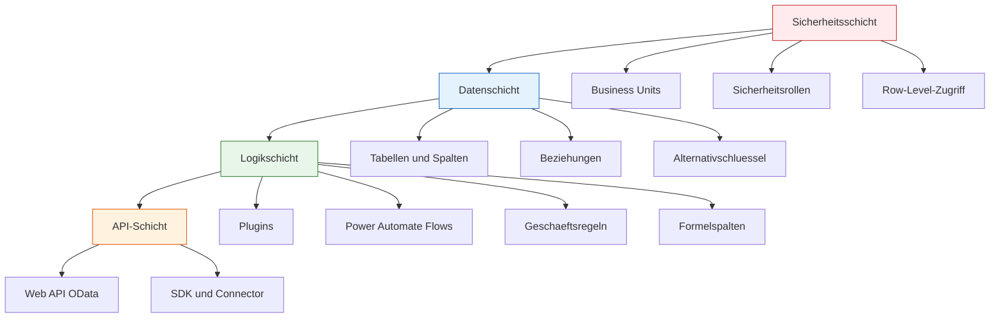

# Lab 2.2 - Dataverse als Fundament der Loesungsarchitektur

🎯 Einstiegsfragen — vor der Erklärung stellen

1. Welche eingebauten Faehigkeiten hat Dataverse, die eine einfache Datenbank nicht hat?
2. Was ist der Unterschied zwischen Standard-Tabelle, benutzerdefinierter Tabelle und Activity-Tabelle?
3. Warum ist die Wahl des Publisher-Praefixes bei der Solution-Erstellung wichtig?

💡 Musterlösung

**1.** Integriertes Sicherheitsmodell (Rollen, Row-Level, Column-Level) | Business Rules und Berechnungsfelder ohne Code | Auditing und Change Tracking | OData Web API | Plugin-Pipeline | Loesungscontainer fuer ALM.

**2.** Standard-Tabellen (z.B. Account, Contact): von Microsoft mitgeliefert, in andere Produkte integriert. Benutzerdefinierte Tabellen: vom SA angelegt. Activity-Tabellen: spezialisiert fuer Kommunikationsartefakte (Email, Aufgabe, Termin) mit Zeitstempeln.

**3.** Das Praefixes (z.B. 'vt_') wird vor alle benutzerdefinierten Felder und Tabellen gesetzt. Es verhindert Namenskonflikte. Einmal gesetzt, kann es nicht geaendert werden — alle abhaengigen Komponenten muessten umbenannt werden.

## Was ist Dataverse?

Dataverse ist die relationale Datenbank der Power Platform. Sie ist keine einfache Tabelle, sondern eine vollstaendige Datenbankplattform mit integriertem Sicherheitsmodell, Geschaeftslogik, Auditing, API und Erweiterungspunkten.

Dataverse ist das Herzstuck aller ernsthaften Power Platform-Loesungen. Wer Dataverse nicht versteht, kann auf der Power Platform keine tragfaehige Architektur bauen.

## Die vier integrierten Schichten von Dataverse

**Sicherheitsschicht:** Das Sicherheitsmodell ist in die Datenbank integriert. Es ist nicht moeglich, Dataverse-Daten abzurufen, ohne das Sicherheitsmodell zu respektieren. Ein Nutzer ohne Lesezugriff auf eine Tabelle sieht keine Datensaetze, auch nicht wenn er die Web API direkt aufruft.

**Datenschicht:** Tabellen, Spalten, Beziehungen und Schluessel. Sowohl Standardtabellen (Account, Contact, User) als auch Custom Tables koennen genutzt werden.

**Logikschicht:** Geschaeftslogik kann ohne Code (Geschaeftsregeln), mit Low Code (Power Automate) oder mit Code (Plugins) implementiert werden.

**API-Schicht:** Dataverse stellt eine standardisierte REST API (OData) bereit, die von jedem System aufgerufen werden kann.

## Standardtabellen und das Common Data Model

Dataverse kommt mit einer Sammlung von Standardtabellen, die haeufige Geschaeftsszenarien abbilden. Diese Tabellen sind Teil des Microsoft Common Data Model (CDM).

Wichtige Standardtabellen:

| Tabellenname | Zweck |
|---|---|
| Account | Kunden, Partner, Lieferanten |
| Contact | Ansprechpartner |
| SystemUser | Systembenutzer (Power Platform-Nutzer) |
| Team | Benutzergruppen |
| BusinesUnit | Organisationseinheiten |
| Queue | Arbeitswarteschlangen |
| Task, Email, PhoneCall | Aktivitaeten |
| Annotation | Notizen und Anhange |

**SA-Prinzip:** Bevor eine neue Custom Table erstellt wird, prueft der SA ob eine Standardtabelle die Anforderung erfullt. Standardtabellen haben bereits integrierte Funktionen (zum Beispiel kann Account eine Adresse mit Kartendarstellung speichern) und werden von anderen Microsoft-Produkten wie Dynamics 365 erkannt.

## Warum Dataverse und nicht SQL Server?

Eine haeufige Frage in Projekten: "Koennen wir nicht einfach eine SQL-Datenbank verwenden, auf die Power Apps zugreift?"

Die Antwort ist: technisch ja, architektonisch in den meisten Faellen nein.

Was SQL Server allein nicht kann:
- Integriertes Row-Level-Sicherheitsmodell mit Business Units
- Offline-Synchronisation in Power Apps ohne zusaetzliche Entwicklung
- Plugin-Events fuer serverseitige Logik
- Auditing ohne eigene Implementierung
- Native Integration in Power Automate ohne Custom Connector
- Keine Erweiterungspunkte fuer Dynamics 365

Was SQL Server kann, was Dataverse nicht (oder anders) kann:
- Beliebige SQL-Abfragen (FetchXML ist maechtiger als einfaches SQL, aber komplexe Joins sind in Dataverse aufwaendiger)
- Sehr niedrige Latenz bei Massendaten-Schreiboperationen
- Volle Kontrolle ueber Indizes und Datenbankstruktur
- Guenstiger bei sehr grossen Datenmengen (Dataverse-Speicher ist teuer)

**SA-Faustformel:** Power Platform-Loesung mit Sicherheitsanforderungen, Plugins oder Auditing? Dataverse. Einfache Datenbankintegration in bestehende IT-Infrastruktur? SQL Server kann sinnvoll sein.

## Dataverse Speichertypen

Dataverse hat drei verschiedene Speicherpools mit unterschiedlichen Preisen:

**Database Storage:** Zeilenbasierter Speicher fuer Tabellendaten. Standard-Datenspeicher fuer alle Felder in Custom Tables. Preis: Enthalten in der Basislizenz plus Zukauf.

**File Storage:** Fuer Dateianhange (File-Spalten und Notes/Annotations). Typisch fuer Bilder, PDFs, Dokumente. Preis: Geringerer Preis als Database Storage, aber teurer als SharePoint.

**Log Storage:** Fuer Audit-Logs. Wachst automatisch wenn Auditing aktiviert ist. Kann mit Retention Policies begrenzt werden.

**SA-Implikation:** Der SA plant den Speicherverbrauch. Eine Loesung mit vielen grossen Dateianhangen direkt in Dataverse kann teuer werden. Alternative: SharePoint fuer Dateien, Dataverse fuer strukturierte Daten mit Link-Verweis auf SharePoint.

## Wo konfigurieren und überwachen?

| Thema | Navigation |
|---|---|
| Tabellen anlegen und bearbeiten | [make.powerapps.com](https://make.powerapps.com) → **Dataverse** → **Tables** → + **New table** |
| Standardtabellen einsehen (Account, Contact, ...) | make.powerapps.com → **Dataverse** → **Tables** → Filter: **Standard** |
| Sicherheitsschicht (Rollen, BUs) | [admin.powerplatform.microsoft.com](https://admin.powerplatform.microsoft.com) → **Environments** → [Umgebung] → **Settings** → **Users + permissions** |
| Dataverse Web API aufrufen/testen | `https://[orgname].crm.dynamics.com/api/data/v9.2/` (Postman, Browser) |
| Speicherverbrauch überwachen | PPAC → **Resources** → **Capacity** |
| Audit-Einstellungen konfigurieren | PPAC → **Environments** → [Umgebung] → **Settings** → **Auditing** → **Manage audit settings and logs** |
