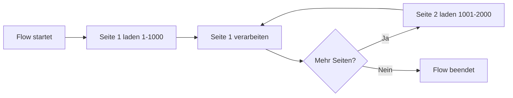
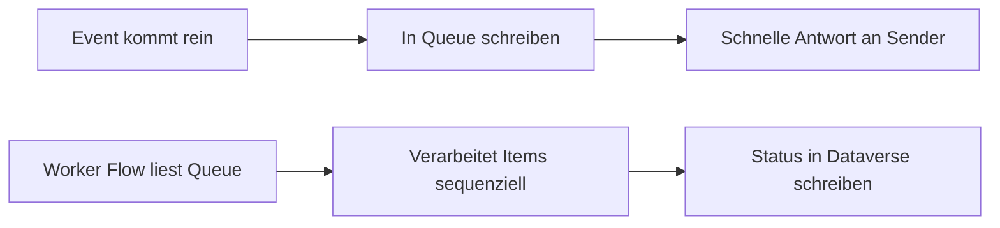
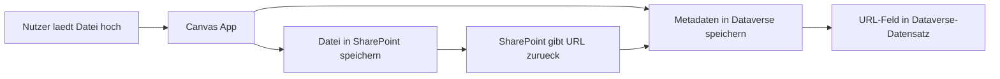

# Lab 2.4 - Architektur unter Beruecksichtigung von Plattformgrenzen entwerfen

🎯 Einstiegsfragen — vor der Erklärung stellen

1. Wie beeinflusst das 50.000-Zeilen-Limit von Dataverse das Design eines Flows, der alle Datensaetze verarbeiten soll?
2. Wann ist eine Canvas App die falsche Wahl?
3. Was ist Ihre Strategie, wenn ein Kunde eine Anforderung stellt, die an eine Plattformgrenze stoesst?

💡 Musterlösung

**1.** Der Flow darf nicht alle Datensaetze auf einmal laden. Loesung: Paging-Token verwenden, um seitenweise durch die Ergebnisse zu iterieren — oder Dataverse Bulk Delete Job / Azure Synapse Link fuer Massenverarbeitung nutzen.

**2.** Wenn viele Tabellen verknuepft sind, komplexe Rollenrechte auf Zeilenebene benoetigt werden oder viele gleichzeitige Nutzer erwartet werden. Dann: Model Driven App fuer strukturierte Datenprozesse, oder Power Pages fuer externe Nutzer.

**3.** Zuerst pruefen ob die Grenze wirklich getroffen wird. Dann Pattern suchen das die Grenze umgeht (Paging, Chunking, Caching). Wenn nicht moeglich: Azure-Komponente als Extension. Als letztes: Anforderung mit Kunden neu verhandeln.

## Von Limits zu Designentscheidungen

Technische Limits sind keine Hindernisse, um die man herumarbeiten muss. Sie sind Informationen, die das Design beeinflussen. Ein erfahrener SA kennt die Limits und entwirft von Anfang an Loesungen, die sie respektieren.

Dieser Ansatz hat einen Namen: Constraint-Driven Design. Statt eine ideale Loesung zu entwerfen und dann zu schauen ob sie in die Plattform passt, nimmt der SA die Plattformgrenzen als aktiven Entwurfsfaktor.

## Skalierungsdesign: Batch-Verarbeitung richtig planen

Wenn eine Loesung grosse Datenmengen verarbeiten muss, sind folgende Muster bewaehrt:

**Muster 1: Chunking mit Paginierung**

Statt alle Datensaetze auf einmal zu verarbeiten, teilt der Flow die Arbeit in kleine Stuecke auf.

**Muster 2: ExecuteMultiple fuer Bulk-Writes**

Statt 1.000 einzelne Dataverse-Updates zu schicken, werden sie in einem Batch zusammengefasst. ExecuteMultiple sendet bis zu 1.000 Operationen in einem einzigen API-Request.

Vorher: 1.000 API-Requests, jeder mit einem Update-Aufruf.
Nachher: 1 API-Request mit 1.000 Updates im Batch.

Dieses Muster ist nur per SDK/Plugin oder via HTTP Action in Power Automate nutzbar, nicht mit dem Standard-Dataverse-Connector.

**Muster 3: Asynchrone Verarbeitung mit Queues**

Fuer Szenarien wo viele Ereignisse gleichzeitig eintreffen:

Der Vorteil: Der Event-Produzent (z.B. ein Webshop der Bestellungen schickt) wird nicht gedrosselt, weil die Queue als Puffer wirkt. Der Verarbeitungs-Flow kann mit eigener Geschwindigkeit arbeiten.

## Datei-Auslagerung: SharePoint als Partner von Dataverse

Wenn Nutzer Dateien hochladen koennen, entstehen Speicherkosten in Dataverse. Die SA-Standardloesung ist eine hybride Architektur:

Der Datensatz in Dataverse enthaelt: Dateiname, Typ, Groesse, Hochladedatum, SharePoint-URL.
Die eigentliche Datei liegt in SharePoint, was kostengunstiger und fuer Dokumente optimiert ist.

**Herausforderung:** Wenn ein Nutzer in der Power App auf die Datei klickt, wird er zu SharePoint weitergeleitet. Das erfordert, dass der Nutzer SharePoint-Zugriff hat. Der SA muss sicherstellen, dass das Sicherheitsmodell in SharePoint und in Dataverse konsistent ist.

## Canvas App Performance: Design-Prinzipien

**Prinzip 1: Nur delegierbare Filter verwenden**
Alle Datenabfragen muessen an Dataverse delegiert werden. Nichtdelegierbare Filter werden durch Alternativansaetze ersetzt (zusaetzliche Spalten, Namensstandardisierung, Abfrage ueber Lookup).

**Prinzip 2: Anzahl der Datenabrufe minimieren**
Jeder Aufruf von Patch(), LookUp(), oder Filter() ist ein Netzwerkaufruf. Canvas Apps, die beim Oeffnen eines Formulars 10 verschiedene Abfragen starten, sind langsam. Der SA definiert, wie viele Datenbankaufrufe pro Seitenaufruf maximal zulaessig sind.

**Prinzip 3: Galleries lazy laden**
Wenn eine Gallery 1.000 Datensaetze anzeigen soll, muss nicht alle auf einmal geladen werden. Pagination in der Gallery mit Vor/Zurueck-Buttons reduziert die Lademenge und verbessert die Performance.

**Prinzip 4: Collections fuer wiederholte Daten nutzen**
Daten, die sich selten aendern (zum Beispiel eine Dropdown-Liste mit Laendern), werden beim App-Start einmal in eine Collection geladen und dann lokal verwendet, statt bei jedem Formular-Oeffnen neu abgefragt zu werden.

## Wartbarkeitsdesign: Der SA denkt an morgen

Eine Architektur, die heute funktioniert, aber in sechs Monaten niemand mehr verstehen kann, ist schlechte Architektur.

**Naming Conventions als Designentscheidung:**
Der Publisher-Prefix (z.B. "cr_" fuer Contoso) wird auf alle Custom Tables und Spalten angewendet. Das unterscheidet Custom von Standardkomponenten auf den ersten Blick.

Beispiel fuer gute Namen:
- Tabelle: cr_UrlaubsAntrag (nicht: Antrag, UrlaubsAntrag, Url_Antrag)
- Spalte: cr_Startdatum, cr_Enddatum, cr_Status (nicht: date1, date2, stat)
- Flow: "CR - Urlaubsantrag - Benachrichtigung Vorgesetzter bei Erstellung" (nicht: Flow1)

**Konfiguration in Umgebungsvariablen:**
Alle Werte, die sich zwischen Umgebungen unterscheiden, kommen in Umgebungsvariablen. URLs, E-Mail-Adressen, Konfigurationswerte. Nicht in Flows oder Apps hartkodiert.

**Solutions als Deployment-Einheit:**
Alle Komponenten einer Loesung gehoeren in eine Solution. Die Solution ist die Einheit, die zwischen Umgebungen transportiert wird. Eine Loesung ohne Solution ist nicht deploybar.

## Wo konfigurieren und überwachen?

| Thema | Navigation |
|---|---|
| Umgebungsvariablen anlegen | [make.powerapps.com](https://make.powerapps.com) → **Solutions** → [Lösung] → **+ Add** → **More** → **Environment variable** |
| Umgebungsvariable im Flow verwenden | Power Automate Flow → Aktion: **Get environment variable value (Dataverse)** |
| Connection References verwalten | make.powerapps.com → **Solutions** → [Lösung] → **Connection references** |
| Lösungen als Deployment-Einheit anlegen | make.powerapps.com → **Solutions** → + **New solution** |
| Publisher-Prefix festlegen | make.powerapps.com → **Solutions** → **Publishers** → + **New publisher** |
