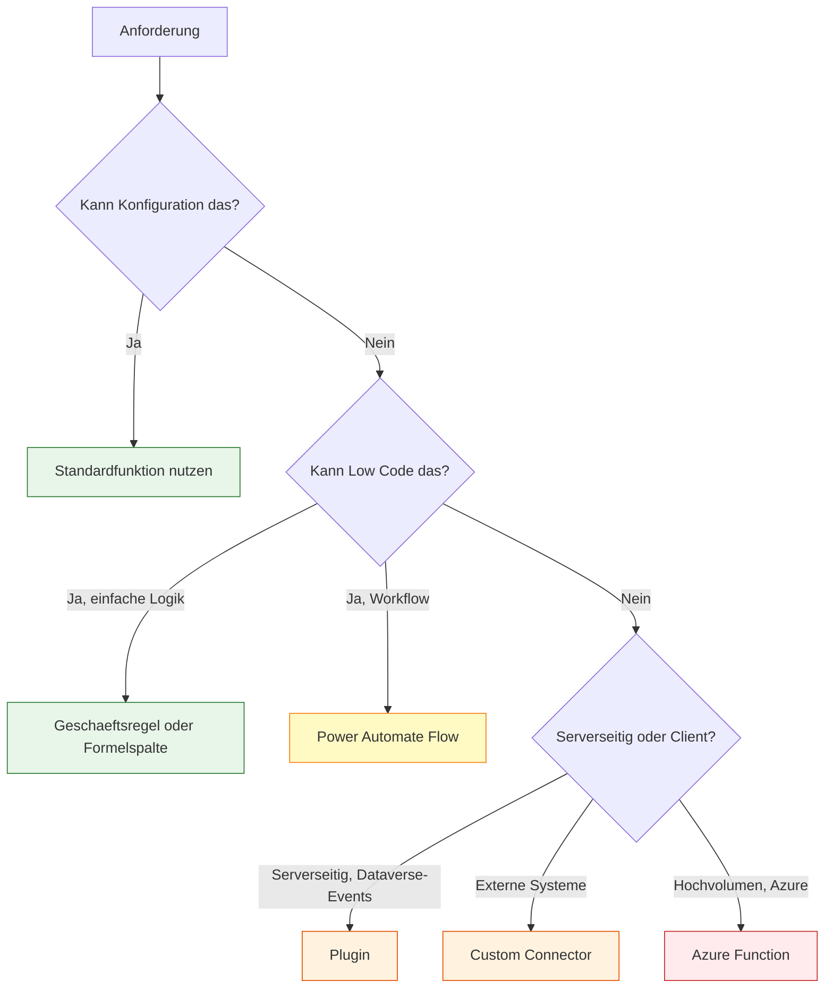
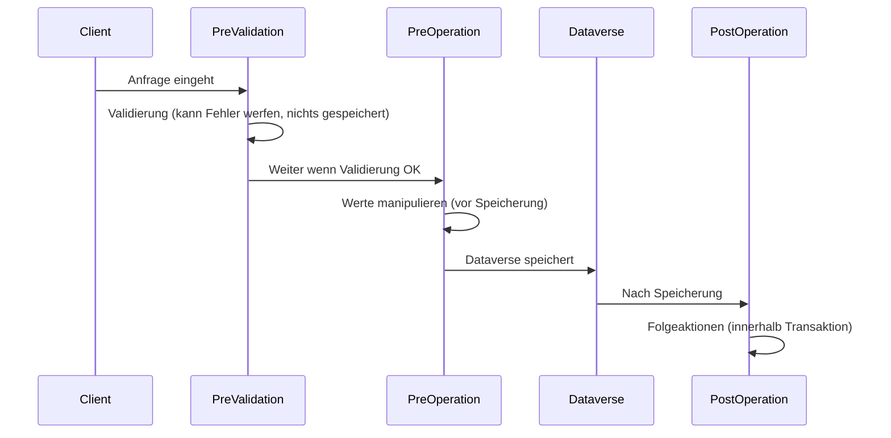

# Lab 2.5 - Erweiterungsoptionen systematisch auswaehlen

<details>
<summary>🎯 Einstiegsfragen — vor der Erklärung stellen</summary>


1. Nennen Sie die Erweiterungsoptionen der Power Platform von 'ohne Code' bis 'vollstaendige Custom-Entwicklung'.
2. Wann ist ein Plugin die richtige Wahl — und wann ist es die falsche?
3. Standard-Connector vs. Custom Connector: Wann welcher?

<details>
<summary>💡 Musterlösung</summary>

**1.** 1. Konfiguration (Business Rules, Calculated Fields) | 2. Power Automate Flow | 3. Canvas App mit PCF-Komponenten | 4. Plugin (.NET, serverseitig) | 5. Custom Connector (externe REST-API) | 6. Azure Function | 7. Azure Microservice mit Dataverse-Integration.

**2.** Richtig: Wenn Logik serverseitig erzwungen werden muss, unabhaengig vom Client — z.B. Validierung die nicht umgangen werden darf. Falsch: Wenn die Logik asynchron sein kann (dann: Power Automate) oder nur in einer App benoetigt wird (dann: Business Rule).

**3.** Standard-Connector: Bei einmaliger Nutzung, wenn der Connector existiert. Custom Connector: Bei Nutzung in mehreren Flows oder Canvas Apps — wiederverwendbar, Swagger-Dokumentation, Authentication zentral verwaltet, in Solutions transportierbar.

</details>

</details>


## Das Erweiterungs-Spektrum

Die Power Platform ist kein starres System. Sie bietet ein breites Spektrum von Erweiterungsmoeglichkeiten, vom einfachen Konfigurieren ohne Code bis hin zu vollstaendigen Azure-basierten Microservices.

Der SA muss wissen, wo auf diesem Spektrum eine Anforderung angesiedelt ist. Eine einfache Anforderung mit einem Plugin zu loesen ist Ueberengineering. Eine komplexe Anforderung mit einer Geschaeftsregel loesen zu wollen, ist zum Scheitern verurteilt.

## Das Erweiterungsraster



## Ebene 1: Konfiguration ohne Code

**Wann:** Standardfunktionen der Plattform loesen die Anforderung direkt.

**Was ist moeglich:**
- Formulare konfigurieren (sichtbare Felder, Pflichtfelder, Reihenfolge)
- Ansichten und Filter erstellen
- Dashboards und Charts
- Sicherheitsrollen konfigurieren
- Business Process Flows fuer geformte Prozesse
- Dataverse-Standardverhalten (Kaskadierung bei Loeschen)

**Praxisbeispiel:** Der Fachbereich moechte, dass das Feld "Genehmigungskommentar" nur sichtbar ist, wenn der Status "Abgelehnt" ist. Diese Logik kann direkt im Formular-Editor ohne Code konfiguriert werden.

## Ebene 2: Business Rules und Formelspalten

**Wann:** Einfache Validierung oder Berechnung, die ohne Workflow-Kontext auskommt.

**Business Rules:** Deklarative Regeln, die im Formular ausgefuehrt werden. Sie koennen Felder ein-/ausblenden, Fehlermeldungen anzeigen, Pflichtfelder setzen und einfache Werte berechnen. Business Rules laufen auf Client und optional auch auf Server-Ebene.

**Formelspalten:** Berechnete Spalten mit Power Fx-Syntax. Sie werden in Echtzeit aktualisiert wenn die Quelle sich aendert. Seit 2024 sind sie der Ersatz fuer die abgekuendigten Calculated Columns.

Beispiel Formelspalte:
```
// Volles Datum als Text
Text(cr_Startdatum, "[$-de-DE]DD.MM.YYYY") & " bis " & Text(cr_Enddatum, "[$-de-DE]DD.MM.YYYY")

// Kreditlimit-Anzeige
If(cr_Gesamtumsatz >= cr_Kreditlimit, "Limit ueberschritten", "OK")
```

**Grenzen:** Business Rules und Formelspalten koennen keine anderen Datensaetze abfragen, keine externen APIs aufrufen und nicht auf Trigger-Events reagieren.

## Ebene 3: Power Automate Flows

**Wann:** Workflow-Logik, die auf Events reagiert oder Aufgaben automatisiert.

**Cloud Flows:** Werden durch Trigger ausgeloest (Dataverse-Events, Timer, E-Mail, HTTP-Aufruf). Asynchron oder synchron moeglich.

**Was Flows koennen:**
- Auf Dataverse-Events reagieren (erstellen, aendern, loeschen)
- Andere Systeme aufrufen (via Connectors)
- E-Mails senden, Teams-Nachrichten schicken
- Daten transformieren und zurueckschreiben
- Genehmigungsprozesse steuern (Approval-Connector)

**Grenzen:** Flows sind nicht synchron mit dem Dataverse-Speichervorgang. Wenn eine Bestellung gespeichert wird und ein Flow ein Validierungsproblem erkennt, kann er die Speicherung nicht rueckgaengig machen. Fuer synchrone Validierung braucht es Plugins.

## Ebene 4: Plugins

**Wann:** Serverseitige Logik, die synchron mit Dataverse-Operationen ausgefuehrt werden muss.

Plugins sind C#-Code, der in der Dataverse-Pipeline ausgefuehrt wird. Es gibt drei Ausloesungszeitpunkte:



**PreValidation:** Laeuft vor der Datenbankoperation, ausserhalb der Transaktion. Geeignet fuer Validierungen, die abbrechen sollen. Kann keine Daten aendern, aber einen Fehler werfen der die Speicherung verhindert.

**PreOperation:** Laeuft innerhalb der Transaktion, vor dem Schreiben. Kann Feldwerte anpassen bevor sie gespeichert werden. Beispiel: Automatisch ein berechnetes Feld setzen.

**PostOperation:** Laeuft innerhalb der Transaktion, nach dem Schreiben. Fuer Folgeaktionen die im Kontext der gleichen Transaktion stattfinden sollen.

**Grenzen:** Plugins muessen in C# entwickelt und deployed werden. Das erfordert Entwicklungsaufwand und Testing. Plugins sind nicht visuell und schwer zu debuggen.

## Ebene 5: Custom Connectors und Azure Functions

**Custom Connectors:** Wenn eine externe API angebunden werden soll, fuer die es keinen Standard-Connector in Power Automate gibt, wird ein Custom Connector erstellt. Er definiert die API-Endpunkte, Authentifizierung und Datenschemas, sodass Power Automate und Canvas Apps ihn wie jeden anderen Connector nutzen koennen.

**Azure Functions:** Wenn komplexe Rechenlogik, hohe Performance oder Integration in Azure-Dienste benoetigt wird, ist eine Azure Function die richtige Wahl. Die Function kann per HTTP von Power Automate oder Plugins aufgerufen werden.

Wann Azure Function statt Plugin:
- Hochvolumen-Verarbeitung (Tausende von Operationen parallel)
- Komplexe Berechnungen (ML, Algorithmen)
- Integration mit Azure-Diensten (Event Hub, Blob Storage)
- Code, der unabhaengig von Dataverse-Events laufen soll

## Die SA-Entscheidung: Das richtige Werkzeug waehlen

Die wichtigste SA-Faustformel: "So wenig Code wie moeglich, so viel wie noetig."

Jede Erweiterungsebene hat einen Preis: Konfiguration ist guenstig und wartbar. Plugins sind teuer zu entwickeln und zu warten. Azure Functions sind teuer und erfordern Azure-Expertise.

Der SA waehlt die niedrigste Erweiterungsebene, die eine Anforderung zuverlaessig und wartbar erfullt.

| Anforderung | Falsche Wahl | Richtige Wahl |
|---|---|---|
| Feld bei Status ausblenden | Plugin | Business Rule |
| E-Mail bei Datensatzerstellung | Plugin | Power Automate Flow |
| Kreditlimit-Validierung bei Bestellerstellung | Power Automate | Plugin (PreValidation) |
| Naechtlicher Batch 100.000 Updates | Power Automate naiv | Azure Function + ExecuteMultiple |

## Wo konfigurieren und überwachen?

| Thema | Navigation |
|---|---|
| Business Rule erstellen | [make.powerapps.com](https://make.powerapps.com) → **Dataverse** → **Tables** → [Tabelle] → **Business rules** → + **New business rule** |
| Formelspalte (Formula Column) erstellen | make.powerapps.com → **Tables** → [Tabelle] → **Columns** → + **Column** → Datentyp: **Formula** |
| Power Automate Cloud Flow erstellen | [make.powerautomate.com](https://make.powerautomate.com) → **+ New flow** → **Automated cloud flow** |
| Custom Connector erstellen | make.powerautomate.com → **Data** → **Custom connectors** → + **New custom connector** |
| Plugin Registration Tool starten | Terminal: `pac tool prt` (pac CLI erforderlich) |
| Plugin in Solution einbinden | make.powerapps.com → **Solutions** → [Lösung] → **+ Add existing** → **More** → **Developer** → **Plug-in assembly** |
