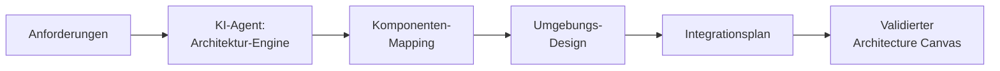

# Agentic AI — M02: Plattformarchitektur

> **Fokus:** Wie können Architekturentscheidungen automatisiert und mit KI assistiert werden?  
> **Zielgruppe:** SAs, die ihre Architektur-Designphase beschleunigen möchten  
> **Lösung:** siehe `agentic-sol.md` (wird nachgefüllt)

---

## Die Rolle des Agents in der Architektur-Entscheidung

Die Plattformarchitektur ist das **strategische Rückgrat** einer Lösung. Hier fallen Entscheidungen, die 80% der späteren Kosten & Risiken bestimmen.

Traditionell: SA sitzt mit 10+ Anforderungen hin und überlegt 4 Stunden, welche Komponenten zusammenpassen.

Mit **Agentic AI**: Agent analysiert Anforderungen → schlägt Architektur vor → warnt vor Pitfalls.



---

## Use Case 1: Auto-Architektur aus Requirements

### Problem

VisitTrack-Anforderungen:

- ADM erfasst Besuch auf Handy
- Manager sieht KPIs
- Tägliche SAP-Exports um 03:00 Uhr
- Offline-Modus notwendig
- 120 ADM, 219.000 Records pro Jahr

**Frage:** Welche Komponenten?  
**Klassisches Denken:** "Hm, Canvas App für Mobile, vielleicht Power BI für KPIs, Power Automate für SAP... warte, wie ist nochmal das mit Delegationslimits?"

### Agentic Lösung

Agent erhält:

```json
{
  "requirements": [
    { "id": 1, "text": "ADM erfasst Besuch mobil", "priority": "Must" },
    { "id": 2, "text": "Offline-Modus", "priority": "Must" },
    { "id": 3, "text": "Manager sieht KPIs", "priority": "Should" },
    { "id": 4, "text": "SAP-Export täglich 03:00", "priority": "Must" },
    { "id": 5, "text": "120 ADM, 219k records", "scale": "medium" }
  ]
}
```

Agent-Analyse:

1. **"Mobil + Offline"** → Canvas App (nicht Model-Driven, da Offline weniger getestet bei MDA)
2. **"Manager sieht KPIs"** + **"219k Records"** → Power BI (nicht Canvas, wegen Delegationslimit)
3. **"SAP täglich um 03:00"** → Power Automate Flow + Service Bus Queue
4. **"120 ADM"** → Business Units oder Teams-Integration für Row-Level Security?

Agent-Output:

```yaml
Architecture:
  Frontend:
    - Canvas App (Model: "Visit Report Capture")
      - Offline Data: Local SQLite Sync
      - Reasoning: "Offline + Mobile = Canvas App is standard"
  Data:
    - Dataverse Tables: Account, Contact, Visit_Report
    - Delegation Check: "219k records will hit delegation limit if Filter not optimized"
      - Mitigation: "Add CreatedDate > Today() - 30 to Canvas Filter"
  Analytics:
    - Power BI (Real-time semantic model on Dataverse)
    - Reasoning: "KPIs + 219k records = Power BI > Canvas"
  Integration:
    - Power Automate Flow (scheduled, daily 03:00)
    - Service Bus Topic (async, reliable)
    - SAP Connector (or REST if SAP Connector not available)
  Security:
    - Business Units (Region-based)
    - Row-Level Security on Visit_Report
  Environments:
    - Dev (Admin full access, test data)
    - Test (Realistic data volume)
    - Prod (Backup strategy, SLA 99.5%)

Risks Detected:
  - HIGH: Offline sync can cause conflicts if same visit edited offline
  - MEDIUM: SAP export will fail if Power Automate service is down
  - LOW: KPI calculations might be slow with 219k records (mitigate with aggregation table)
```

**Zeit:** Agent generiert in 2 Minuten, SA validiert in 30 Minuten (statt 4 Stunden raten).

---

## Use Case 2: Template-basierte Umgebungsstrategie

### Problem

"Wir brauchen eine Umgebungsstrategie" — aber welche?

- Dev, Test, Prod?
- Oder Dev, Test, Staging, Prod?
- Wer bekommt wo Zugriff?
- Wie wird deployt?

Klassisch: SA schaut sich andere Projekte an, schreibt ein Template, 2 Stunden Overhead.

### Agentic Lösung

Agent kennt Best Practices & analysiert dein Projekt:

```plaintext
Agent-Input:
- Projekt-Komplexität: "Medium" (5 Anforderungen, 3 integrations)
- Risiko-Profil: "Medium" (Produktionsdaten, aber nicht kritisch)
- Team-Größe: "Small" (2 Maker, 1 SA)
- Deployment-Frequenz: "Weekly"
- Compliance: "GDPR (aber nicht Fintech)"

Agent-Analyse & Output:

✓ RECOMMENDED: 3-Stufenmodell
  Dev (Sandbox)
    ├─ Owner: Dev Maker
    ├─ Data: Test data only
    ├─ Deploy: Manual (Pull Request Review)
    └─ Refresh: Daily from Prod

  Test (Sandbox)
    ├─ Owner: QA + Stakeholder
    ├─ Data: Realistic (sanitized Prod)
    ├─ Deploy: Manual (after Dev validation)
    └─ Refresh: Weekly from Prod

  Prod (Production)
    ├─ Owner: SA + Ops
    ├─ Data: Real
    ├─ Deploy: Scheduled Power Automate (every Sunday 02:00)
    ├─ Backup: Daily to Azure Storage
    └─ SLA: 99.5%

WHY NOT 4-Stufig (Dev, Test, Staging, Prod)?
- Too much overhead for team size (Staging würde leerstehen)
- Weekly deployment frequency reicht für 3 Stufen aus

Access Matrix (auto-generated):
│ Role         │ Dev │ Test │ Prod │
├──────────────┼─────┼──────┼──────┤
│ Dev Maker    │ ✓   │ ✓    │ ✗    │
│ QA / Tester  │ ✗   │ ✓    │ ✗    │
│ End-User     │ ✗   │ ✗    │ ✓    │
│ SA           │ ✓   │ ✓    │ ✓    │
│ Ops          │ ✗   │ ✗    │ ✓    │
```

**Zeit:** 5 Minuten statt 2 Stunden.

---

## Use Case 3: Delegation-Limits & Performance-Risks automatisch erkannt

### Problem

Canvas-Apps mit großen Datensätzen sind tückisch.

Entwickler baut eine Canvas App für die 219k Visit Records. Alles läuft super in Dev (100 Test Records). In Prod: **App wird geladen, hängt 30 Sekunden, dann Error "Row limit exceeded".**

Agent-Prävention:

```plaintext
Agent erhält:
- Canvas App Screenshot + Anforderung

Agent-Analyse:
1. Erkennt: "Visit_Report Table wird direkt in Gallery used"
2. Zählt: "Ist Delegation-kompatibel?"
   - Filter: CreatedDate > Today() - 30? ✗ (Keine Filter)
   - Daher: Delegation-Limit von 2000 wird überschritten
3. Warnung: "CRITICAL: Canvas App will fail in Prod"
4. Empfehlung:
   - Nutze Power BI für Large Datasets
   - Oder: Caching mit Dataverse Virtuelles Table
   - Oder: Paginated Canvas mit DateFilter

Action: Agent erzeugt Code-Schnipsel mit Filtering-Best-Practice
```

---

## Use Case 4: Datenstrategie-Assistent

### Problem

"Welche Daten gehören in Dataverse, welche in SharePoint, welche in Azure Data Lake?"

Klassisch: SA überlegt, schreibt ein Excel-Sheet mit Kriterien.

### Agentic Lösung

Agent analysiert alle Anforderungen & empfiehlt automatisch:

```plaintext
Agent-Analyse:

Requirement: "Manager sieht KPIs (219k Records)"
├─ Data Volume: 219k = Large
├─ Query Patterns: Aggregations (Group By Region, Sum Visits)
├─ Real-time?: Yes (Daily at 03:00)
├─ Integration: Yes (SAP Export)
└─ Conclusion: Dataverse + Power BI Semantic Model
   (Real-time für Daily-Aggregate ist OK)

Requirement: "ADM erfasst Besuch offline"
├─ Data Volume: ~10 Records per Session
├─ Query Patterns: Insert/Update (Transactional)
├─ Real-time?: No (Batch sync)
├─ Integration: Yes (SAP)
└─ Conclusion: Dataverse + Offline Sync
   (Dataverse is standard für Power Platform Offline)

Requirement: "Document Management (Anhänge pro Besuch)"
├─ Data Volume: 500MB projected
├─ Query Patterns: Upload / Download
├─ Real-time?: No
├─ Integration: No
└─ Conclusion: SharePoint Document Library
   (Dataverse für Files ist teuer, SharePoint ist billiger)
```

---

## Praktische Architektur: Agentic Architecture-Engine

```yaml
Agent: "Architecture Design Assistant"
Model: Claude 3.5 (context window + reasoning)
Tools (MCPs):
  - dataverse-mcp: Schaut sich Datenmodelle an
  - power-platform-limits-mcp: Kennt Delegationslimits, Datenvolumen-Grenzen
  - best-practices-mcp: SharePoint, Dataverse, Power BI Knowledge Base
  - azure-mcp: Azure Compute, Networking Decisions
  - monitoring-mcp: Performance-Metriken aus bestehenden Projekten

Input-Schema:
  requirements: [] # Strukturierte Anforderungen
  team_size: int
  risk_profile: enum # LOW | MEDIUM | HIGH
  compliance_needs: [] # GDPR, HIPAA, etc.
  budget_constraints: [] # Optional

Output-Schema:
  component_map: {} # Was nutze ich wo?
  environment_strategy: {} # Dev/Test/Prod Design
  data_residency_plan: {} # Dataverse/SharePoint/Azure
  performance_risks: [] # Delegation-Limits, Skalierung
  cost_estimate: {} # Approximate CCM / Power BI premium
  deployment_pipeline: {} # Wie deploy ich das?
```

---

## Fallstudie: VisitTrack Architektur in 30 Minuten

**Szenario:** Großes Team (10 Personen), komplexes Projekt, schneller Delivery erwartett.

### Klassischer Weg (8+ Stunden)

1. Discovery-Output lesen (1h)
2. Teams-Meeting: "Welche Komponenten?" (2h)
3. Whiteboard-Diskussionen zu Delegation-Limits, Offline-Sync (2h)
4. Umgebungsstrategie überlegen (1h)
5. Dokumentieren & Visualisieren in Visio/Miro (2h)

### Agentic Weg (1 Stunde)

1. Requirements in JSON eingeben (10 min)
2. Agent generiert Architecture Canvas (5 min)
3. Team diskutiert Agent-Vorschlag, macht Tweaks (30 min)
4. Agent aktualisiert basierend auf Feedback (5 min)
5. Fertig, in Markdown & Visio

**Zeitersparnis:** 87% weniger reine Architektur-Design-Zeit.

---

## Limitations & Fallstricke

| Fallstrick                                   | Grund                             | Mitigation                                    |
| -------------------------------------------- | --------------------------------- | --------------------------------------------- |
| Agent ignoriert Custom Connector Limits      | KI kennt nur Standard-Limits      | SA prüft alle Custom Integrations manuell     |
| Zu aggressive Datenvirtualisierung empfohlen | Performance ist Hard zu predicten | Load-Test Agent-Vorschlag vor Prod-Deployment |
| Agent weiß nichts über Legacy-Systeme        | Nur Power-Platform Docs           | Legacy-Systeme manuell eingeben (Constraints) |

---

## Handlung für Adrian

**Niveau:** Advanced (Agent + MCP + Datenmodellierung)

**Aufgabe:**  
Baue einen **VisitTrack Architecture Assistant**, der:

1. **Komponenten-Mapping:**

   - Liest Anforderungen
   - Mappt auf Canvas App / Power BI / Dataverse / Power Automate
   - Warnt vor Delegation-Limits & Performance-Risks

2. **Umgebungsstrategie Automation:**

   - Analysiert Team-Größe, Deployment-Frequenz, Risiko-Profil
   - Empfiehlt 3-Stufen oder 4-Stufen-Modell
   - Erzeugt Access-Matrix für Dataverse/Power Apps

3. **Best-Practice Validation:**
   - Checkt: Ist mein Architektur-Design sicher?
   - Warnt vor Anti-Patterns (z.B. "Großer Dataset direkt in Canvas Gallery")

**Bonus:** REST API, die andere SAs aufrufen können → "Gib mir Architektur für mein Projekt"

---

## Checkpoint ✓

Am Ende verstehst du:

- [ ] Wie Agents Architektur-Entscheidungen unterstützen
- [ ] Welche Common Pitfalls ein Agent automatisch erkennen kann
- [ ] Wie man Umgebungsstrategien standardisiert
- [ ] Wie MCP-Integration für Limits & Best Practices funktioniert
