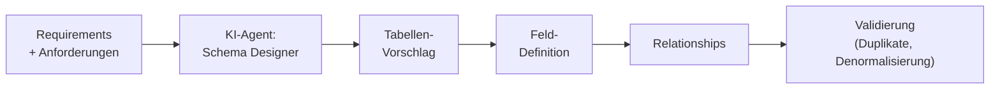

# Agentic AI — M03: Datenmodellierung

> **Fokus:** Wie können Datenschemata automatisiert designed und validiert werden?  
> **Zielgruppe:** SAs & Developers, die ihre Datenmodellierung beschleunigen möchten  
> **Lösung:** siehe `agentic-sol.md` (wird nachgefüllt)

---

## Die Rolle des Agents in der Datenmodellierung

Datenmodellierung ist das **Herz** einer Lösung. Fehler hier führen zu Remodeling-Kosten um 10-20x später.

Klassisch: SA sitzt hin, überlegt, zeichnet ER-Diagramme, merkt nach 2h "wait, ich habe eine Relation vergessen" → von vorne.

Mit **Agentic AI**: Agent schlägt Tabellen vor → generiert Felder → warnt vor Denormalisierung.



---

## Use Case 1: Auto-Schema aus natürlicher Sprache

### Problem

Anforderung: "ADM erfasst einen Besuch bei einem Arzt. Der Besuch hat Datum, Uhrzeit, Dauer, Notizen, und attachment. Der Arzt hat einen Namen, Adresse, Spezialität."

**Klassische Frage:** "Brauche ich eine Besuchs-Tabelle und separate Ärzte-Tabelle, oder kombiniert?"

### Agentic Lösung

Agent erhält Anforderung → analysiert Entities → generiert Schema:

```plaintext
Agent-Input:
"ADM erfasst einen Besuch bei einem Arzt. Der Besuch hat
Datum, Uhrzeit, Dauer, Notizen, und Attachment. Der Arzt hat
Namen, Adresse, Spezialität."

Agent-Parsing:
Entities erkannt:
  - ADM (möglicherweise System User)
  - Besuch (Event, transaktional)
  - Arzt (Master-Daten)
  - Attachment (File)

Agent-Analyse:
  - Besuch hat 1:N Relation zu Arzt? → Nein, 1:1 (pro Besuch ein Arzt)
  - Wird Arzt wiederverwendet? → Ja (mehrere Besuche bei selben Arzt)
  - Also: Separate Tabellen mit Foreign Key

Agent-Generated Schema:
┌──────────────────────────┐
│ physician (Master)        │
├──────────────────────────┤
│ PK: physician_id          │
│ name (Text)               │
│ address (Text)            │
│ specialty (Lookup/Choice) │
│ phone (Text)              │
│ email (Email)             │
└──────────────────────────┘
        ↑ 1:N
        │
┌──────────────────────────┐
│ visit (Transactional)     │
├──────────────────────────┤
│ PK: visit_id              │
│ physician_id (Lookup)     │
│ visited_date (Date)       │
│ visited_time (Time)       │
│ duration_minutes (Int)    │
│ notes (Text)              │
│ attachment_url (Link)     │
│ created_by (User)         │
│ created_on (DateTime)     │
└──────────────────────────┘

Why this design?
  ✓ Normalisiert (Physician nicht redundant)
  ✓ Skalierbar (1000+ Visits zu 100 Physicians)
  ✓ Abfragbar (Alle Visits of Physician X)
  ✗ Denormalisierung vermieden (Physician Name wird nicht dupliziert)
```

**Zeit:** 2 Minuten statt 1 Stunde Whiteboarding.

---

## Use Case 2: Automatische Denormalisierung Detection

### Problem

SA denkt: "Ich speichere Physician Name direkt im Visit-Datensatz, ist schneller zum Lesen."

**Risiken:**

- Wenn Physician Namen ändert → muss ich alle alten Visits aktualisieren
- Data Inconsistency: "Besuch zeigt 'Dr. Mueller', aber Physician-Tabelle sagt 'Dr. Müller'"
- Speicherverschwendung: Name wird 1000x dupliziert

### Agentic Lösung

Agent lädt das proposed Schema → analysiert Denormalisierung:

```plaintext
Agent-Analyse:

Schema Check:
  ✓ physician.name → speichert Name
  ✗ visit.physician_name → redundant!

Agent-Warnung:
CRITICAL: Redundant data detected!
  Problem:
    - physician.name updated → visit.physician_name outdated
    - Speicherabfall: ~10KB pro 1000 Besuche
    - Query-Ambiguity: Welche Quelle ist authoritative?

Empfehlung:
  Option A (Empfohlen): Entferne visit.physician_name
    - Nutze JOIN beim Lesen
    - Einzige Quelle der Wahrheit: physician.name

  Option B (Caching): Aktualisiere visit.physician_name via Flow
    - Nur wenn Performance-kritisch (sehr häufige Reads)
    - Implementiere Trigger: When physician updated → update visits
    - Trade-off: Komplexität vs Performance Gain (meist nicht nötig)

Best Practice für VisitTrack:
  SELECT v.*, p.name as physician_name
  FROM visit v
  INNER JOIN physician p ON v.physician_id = p.physician_id
  (One source of truth, keine Redundanz)
```

---

## Use Case 3: Calculation Fields & Computed Columns

### Problem

Anforderung: "Show Total Visits per Physician this Month"

**Frage:** Speichere ich das als Feld, oder berechne es zur Laufzeit?

### Agentic Lösung

Agent analysiert Performance & Anforderung:

```plaintext
Agent-Input:
  - Anforderung: "Total Visits per Physician this Month"
  - Query Frequency: "Daily (Dashboards load hourly)"
  - Data Volume: 219k visits total, ~500 this month
  - User Tolerance: "Sub-second load"

Agent-Analyse:

Option A: Calculated (zur Laufzeit)
  SELECT COUNT(*) FROM visit
  WHERE physician_id = X AND visited_date >= THIS_MONTH_START

  Performance:
    - Indexiert auf (physician_id, visited_date)? → Ja
    - OK für <100k records
    - ~50-200ms pro Abfrage

Option B: Denormalized (Pre-calculated)
  physician.visits_this_month = 150

  Performance:
    - Sub-10ms (Direct lookup)
    - Aber muss monatlich aktualisiert werden
    - Oder via Flow: Jeden Tag um 23:59 berechnet

Agent-Empfehlung für VisitTrack:
  ✓ CALCULATED (Option A) ist OK
  Begründung:
    - 500 Besuche pro Monat sind nicht viel
    - Power BI macht Aggregation effizienter
    - Keine Redundanz, keine Sync-Komplexität
    - Wenn langsam → Power BI Aggregation Table verwenden

Wenn Besuche > 1M pro Monat:
  ✓ Pre-calculated (Option B) würde besser sein
```

---

## Use Case 4: Row-Level Security (RLS) Modeling

### Problem

"Manager sieht nur Besuche der eigenen Region."

**Frage:** Wie modelliere ich das in Dataverse, damit RLS funktioniert?

### Agentic Lösung

Agent schlägt eine Security-Layer vor:

```plaintext
Agent-Input:
  Anforderung: "Manager sieht nur eigene Region"
  Team-Struktur: "Hierarchical (Manager → Regional Manager → ADM)"

Agent-Design:

┌─────────────────────────────────────────┐
│ user (Dataverse)                        │
├─────────────────────────────────────────┤
│ user_id (System User)                   │
│ business_unit_id (Lookup to BU)         │
│ region (Choice: North, South, East)     │
└─────────────────────────────────────────┘
        ↓
┌─────────────────────────────────────────┐
│ visit                                   │
├─────────────────────────────────────────┤
│ visit_id                                │
│ physician_id                            │
│ business_unit_id (Lookup to BU)         │
│ region (Denormalized for RLS)           │
│ adm_user_id (Created By)                │
└─────────────────────────────────────────┘

Dataverse RLS Rule:
  IF User.region == Visit.region:
    ALLOW READ
  ELSE:
    DENY READ

Caveat (Agent Warning!):
  ⚠️ Denormalisierung von region in Visit ist NICHT ideal!
  Aber für RLS-Performance notwendig.
  (Dataverse RLS ist langsam wenn Lookup-Jump erforderlich)

Alternative (wenn möglich):
  Nutze Business Units statt region Feld
  - RLS Performance: 10x besser
  - Aber weniger flexible (Hierarchie ist starrer)

Agent-Recommendation:
  ✓ Nutze business_unit_id für RLS
  ✗ Nur fallback zu region Denormalisierung wenn BU nicht reicht
```

---

## Use Case 5: Data Volume & Performance Modeling

### Problem

"Wir haben 219k Besuche. Wird das schnell genug sein?"

### Agentic Lösung

Agent modelliert Indexierungsstrategie:

```plaintext
Agent-Input:
  - Record Count: 219k
  - Primary Access Pattern: "Get visits for ADM X in last 30 days"
  - Secondary: "KPI Dashboard (grouped by Region)"

Agent-Analysis:

Recommended Indexes:
  1. ON visit(adm_user_id, visited_date DESC)
     Why: Primary access pattern (ADM X, last 30 days)
     Selectivity: ~200 records (220k / 120 ADM)

  2. ON visit(region, visited_date DESC, physician_id)
     Why: Dashboard grouping
     Selectivity: ~50k records (220k / 4 regions)

  3. ON visit(visited_date DESC)
     Why: Export jobs (daily dumps)
     Selectivity: Lower priority

Estimated Performance:
  Query: "SELECT * FROM visit WHERE adm_user_id = X AND visited_date >= TODAY-30"
  Estimated Time: ~50ms (with index) vs 500ms (without)

Caching Strategy:
  Query Result Cache (Power BI Semantic Model):
    - Cache KPI aggregations for 1 hour
    - Live refresh: True (for critical metrics)
    - Estimated saving: 80% fewer DB queries

Agent-Red Flags:
  ⚠️ WATCH OUT: 219k records will hit Canvas Gallery Delegation Limit!
     Mitigation: Power BI for analytics, Canvas for CRUD only (< 100 records per session)
```

---

## Praktische Architektur: Agentic Data Modeler

```yaml
Agent: "Data Model Designer"
Model: Claude 3.5 (good at schema reasoning)
Tools (MCPs):
  - dataverse-mcp: Kennt Datentypen, Limits
  - sql-generation-mcp: SQL Queries generieren
  - normalization-mcp: Normalisierung prüfen
  - index-advisor-mcp: Indexierungsstrategie
  - scaling-calculator-mcp: Performance vorhersagen

Input:
  requirements: [string] # Natürlichsprachig
  existing_schema: [table] # Falls Migration
  data_volume_estimate: int
  performance_sla: enum # sub-second, <1s, <5s

Output:
  schema: [table] # Vollständig mit Felder, Typen
  relationships: [relation] # Foreign Keys, Cardinality
  indexes: [index] # Recommended
  normalization_score: float # 0.0 (fully denormalized) to 1.0 (fully normalized)
  denormalization_warnings: [warning] # Redundanzen erkannt
  performance_estimate: { query_patterns } # Geschätzte Query-Zeiten
  rls_strategy: string # Business Unit vs Field-based
```

---

## Fallstudie: VisitTrack Schema in 45 Minuten

### Klassischer Weg (6+ Stunden)

1. Anforderungen lesen & Entities extrahieren (1.5h)
2. ER-Diagram zeichnen (Visio/Lucidchart) (1.5h)
3. "Warte, ist Physician 1:1 oder 1:N zu Visit?" Diskussion (1h)
4. Datentypen festlegen (Email, Phone, etc.) (0.5h)
5. RLS-Strategie überlegen (1h)
6. Dokumentieren (0.5h)

### Agentic Weg (1 Stunde)

1. Anforderungen in natürlicher Sprache eingeben (10 min)
2. Agent generiert Schema + ER-Diagramm (5 min)
3. Team diskutiert & macht Tweaks (30 min)
4. Agent erzeugt normalisierte Version + Performance-Estimates (5 min)
5. Fertig, in JSON/Dataverse Import Format

**Zeitersparnis:** 83% weniger Zeit, + weniger manuelle Fehler.

---

## Limitations & Fallstricke

| Fallstrick                                 | Grund                    | Mitigation                      |
| ------------------------------------------ | ------------------------ | ------------------------------- |
| Agent fügt zu viele Zwischentabellen hinzu | Over-normalization       | SA muss Pragmatismus einbringen |
| Denormalisierung für Performance vergessen | KI optimiert für Theorie | Load-Test nach Deployment       |
| RLS-Modellierung ist zu komplex            | Depends on Org structure | SA parametrisiert Agent-Prompts |

---

## Handlung für Adrian

**Niveau:** Advanced (Schema Design + Performance Tuning)

**Aufgabe:**  
Baue einen **VisitTrack Data Modeler**, der:

1. **Schema Generation:**

   - Liest Anforderungen
   - Generiert Dataverse Tables
   - Erstellt ER-Diagramm (Mermaid oder Visio)
   - Checkt auf Normalisierung

2. **Denormalisierung Detection:**

   - Warnt vor redundanten Feldern
   - Schlägt Lösungen vor (RLS-Modeling, Caching)

3. **Performance Advisory:**

   - Schätzt Query-Zeiten
   - Empfiehlt Indizes
   - Prüft auf Delegation-Limits (Canvas)

4. **RLS Strategy:**
   - Analysiert Sicherheitsanforderung
   - Modeliert Business-Unit Struktur
   - Generiert RLS-Rules

**Bonus:** Integration mit Power Platform CLI → `pac solution create-from-schema` → Tabellen auto-deployed

---

## Checkpoint ✓

Am Ende verstehst du:

- [ ] Wie Agents Datenmodelle aus natürlichsprachigen Anforderungen generieren
- [ ] Wann Denormalisierung OK ist, wann nicht
- [ ] Wie RLS in der Datenmodellierung designed wird
- [ ] Wie Performance-Modeling für große Datensätze funktioniert
