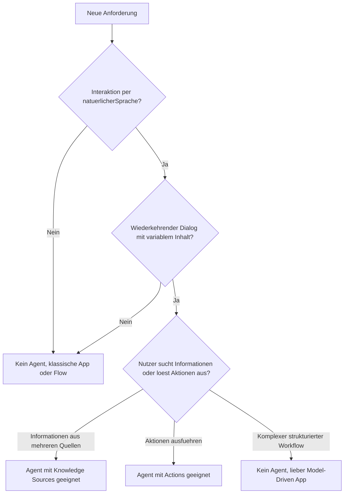
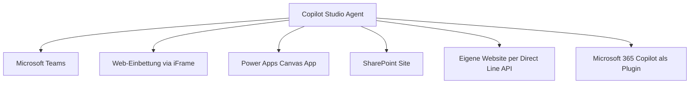
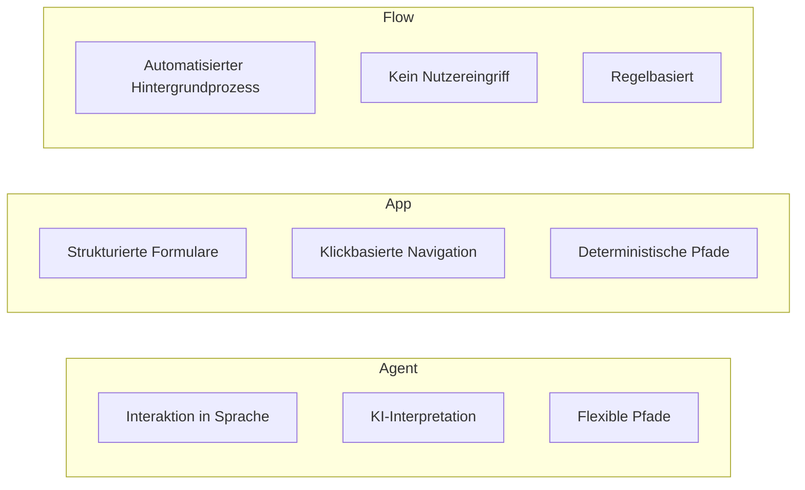
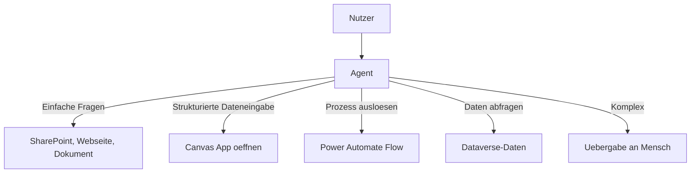

# Theorie: Den Einsatz von Agents architektonisch bewerten

🎯 Einstiegsfragen — vor der Erklärung stellen

1. Wann ist ein Agent (Copilot Studio) die richtige Wahl — und wann Overengineering?
2. Welche Risiken bringt ein KI-Agent in einer Produktionsumgebung?
3. Was ist der Unterschied zwischen einem 'klassischen' Chatbot und einem generativen Agent?

💡 Musterlösung

**1.** Richtig: Wenn Nutzer in natuerlicher Sprache Informationen abfragen oder Prozesse anstossen muessen. Overengineering: Wenn die Interaktion strukturiert und vorhersehbar ist — dann ist eine Canvas App effizienter und kontrollierbarer.

**2.** Halluzinationen (falsche Informationen als Antworten) | Datenlecks wenn der Agent auf zu viele Quellen zugreifen kann | Unerwartetes Verhalten bei Edge-Cases | Compliance-Risiken bei regulierten Daten (DSGVO).

**3.** Klassischer Bot: Folgt vordefinierten Topics/Dialogen — deterministisch, kontrollierbar. Generativer Agent: Nutzt LLM um frei zu antworten — flexibel, natural language, aber nicht deterministisch. In Copilot Studio kann man beides kombinieren.

## Was ist ein Agent und warum ist das keine triviale Frage?

Ein "Agent" in Copilot Studio ist ein KI-gestuetztes System, das in natuerlicherSprache mit Nutzern interagiert, Informationen aus verschiedenen Quellen abruft und Aktionen ausfuehren kann. Seit der Umbenennung von "Copilot Studio" aus dem ehemaligen "Power Virtual Agents" ist der Begriff "Agent" der offizielle Terminus fuer das, was frueher als Chatbot, Bot oder Copilot bezeichnet wurde.

Die entscheidende Frage fuer den Solution Architect ist nicht "Wie baue ich einen Agent?", sondern "Sollte hier ein Agent gebaut werden?". Ein Agent ist ein Werkzeug mit konkreten Staerken und klaren Schwaechen. Den falschen Werkzeugtyp zu waehlen kostet Zeit, Geld und Vertrauen.

## Wann ist ein Agent das richtige Werkzeug?

**Agents sind stark wenn:**
- Nutzer unterschiedliche Fragen in freier Sprache stellen
- Antworten aus Dokumenten, SharePoint oder Webseiten kommen sollen
- Haeufig wiederkehrende Fragen automatisiert beantwortet werden sollen (FAQ)
- Nutzer eine Aktion ausloesen sollen, ohne ein Formular auszufuellen (z.B. "Erstelle ein Ticket fuer mein Problem mit dem Drucker")
- Der Einstieg in einen Prozess dialogbasiert sein soll

**Agents sind schwach wenn:**
- Strukturierte Dateneingabe mit vielen Feldern benoetigt wird
- Komplexe Validierungsregeln und Pflichtfelder existieren
- Datenschutzanforderungen strenge Kontrolle ueber Ausgaben erfordern
- Der Prozess immer deterministisch sein muss (keine Varianz)
- Offline-Nutzung erwartet wird

## Die drei Kernfragen vor jeder Agent-Entscheidung

### Frage 1: Ist die Interaktion dialogbasiert?

Ein Agent ist optimiert fuer Gespraeche. Er erwartet Eingaben in Textform (oder Sprache) und gibt Antworten in Textform. Wenn die Anforderung ist: "Nutzer soll Maschinendaten eingeben und senden", dann ist ein Formular in einer Canvas App oder Model-Driven App besser als ein Agent.

Ein gutes Signal fuer einen Agent: Der Nutzer weiss nicht genau, was er eingeben soll. Er formuliert sein Anliegen, und der Agent hilft ihm, die richtige Aktion zu finden. Das ist Dialog.

### Frage 2: Welche Art von Intelligenz wird benoetigt?

Nicht jeder Agent braucht generative KI. Es gibt zwei Grundmodi:

| Modus | Beschreibung | Wann geeignet |
|---|---|---|
| Klassischer Topic-basierter Agent | Vordefinierte Konversationspfade, triggerbasiert | Wenn der Dialog vorhersehbar und kontrollierbar sein muss |
| Generativer Agent mit LLM | GPT-5 beantwortet Fragen basierend auf Knowledge Sources | Wenn Fragen unvorhersehbar sind und Dokumente ausgewertet werden sollen |

Ein Versicherungsunternehmen, das sicherstellen muss, dass Nutzer nur genehmigte Antworten bekommen, sollte einen klassischen Topic-basierten Agent bevorzugen. Ein Unternehmen, das seinen Mitarbeitern erlaubt, beliebige Fragen an das Unternehmens-SharePoint zu stellen, kann generative Antworten nutzen.

### Frage 3: Wer sind die Nutzer und wo befinden sie sich?

Agents in Copilot Studio koennen in verschiedene Umgebungen veroeffentlicht werden:

Wenn die Nutzer Teams verwenden, ist Teams die naheliegende Kanalwahl. Wenn der Agent auf der Unternehmenswebsite fuer externe Kunden zugaenglich sein soll, ist der Web-Kanal geeignet.

## Abgrenzung: Agent versus App versus Flow

**Konkrete Abgrenzungsbeispiele:**

"Ich moechte wissen, ob mein Antrag genehmigt wurde" -> Agent (Suchanfrage in natuerlicherSprache)

"Ich moechte einen neuen Urlaub beantragen mit Start, Ende, Vertretung" -> App (Formular mit Pflichtfeldern)

"Nach der Genehmigung soll eine E-Mail an den Vorgesetzten gehen" -> Flow (Automatisierung, kein Dialog)

"Ich moechte einen Urlaub beantragen" mit Dialog "Wann soll der Urlaub starten?" -> Agent der einen Flow ausloest

## Agents als Teil einer Gesamtarchitektur

Ein Agent ist selten die gesamte Loesung. Er ist ein Einstiegspunkt. In der Praxis funktionieren Agents oft als "Front Door":

Der Agent uebernimmt die erste Konversationsebene. Wenn es komplex wird, uebergibt er an eine App (fuer strukturierte Eingabe) oder an einen Menschen (wenn KI nicht ausreicht).

## Risiken bei der Agent-Entscheidung

Der groesste Fehler, den ein SA machen kann, ist, einen Agent als Allzweckloesung zu behandeln. Konkrete Risiken:

- **Halluzination** — Generative Agents koennen Antworten produzieren, die inhaltlich falsch sind. In sensiblen Bereichen (Rechtsfragen, Finanzberatung, medizinische Informationen) ist das inakzeptabel.
- **Kontrollverlust** — Wenn ein Agent im generativen Modus Fragen beantwortet, kann nicht zu 100% garantiert werden, welche Antwort er gibt. Fuer Unternehmen mit strengen Compliance-Vorgaben ist das ein Problem.
- **Nutzererlebnis bei Komplexitaet** — Ein Agent wird frustrant, wenn er zu viele Fragen stellt oder Anliegen nicht versteht. Wenn der Prozess komplex ist (viele Felder, viele Abhaengigkeiten), ist eine App die bessere Wahl.
- **Wartungsaufwand** — Ein klassischer Topic-basierter Agent muss kontinuierlich gepflegt werden (neue Fragen, geaenderte Prozesse). Das ist kein Einmal-Projekt.

## Wo konfigurieren und überwachen?

| Thema | Navigation |
|---|---|
| Agent erstellen und testen | [copilotstudio.microsoft.com](https://copilotstudio.microsoft.com) → + **New agent** |
| Agent aus Power Apps heraus erstellen | [make.powerapps.com](https://make.powerapps.com) → **+ Create** → **Agent** |
| AI Builder-Modelle evaluieren | [make.powerapps.com](https://make.powerapps.com) → **AI models** |
| Wer darf Agents erstellen (Tenant-Einschränkung) | PPAC → **Settings** → **Tenant settings** → Abschnitt **Copilot Studio** |
| DLP-Policies für Copilot Studio Connectors | PPAC → **Policies** → **Data policies** |
