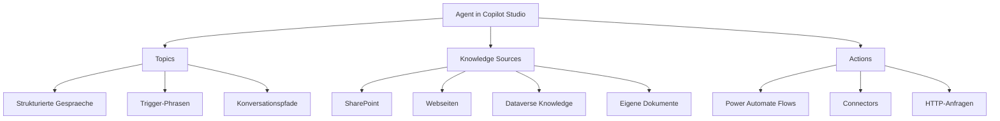
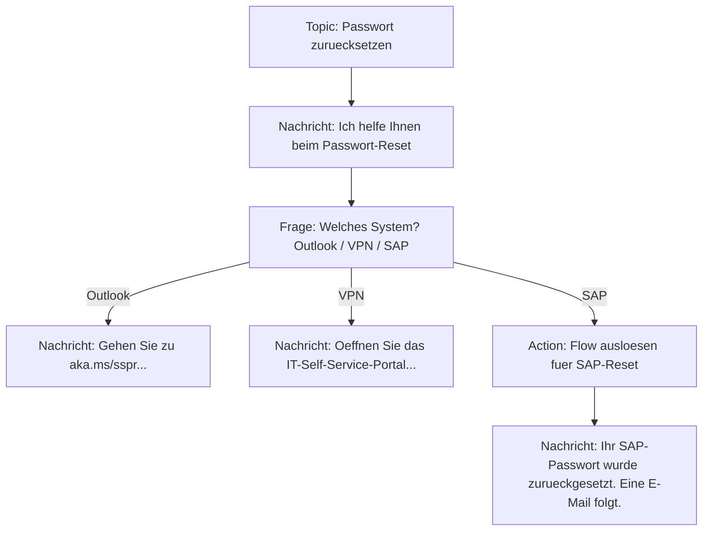
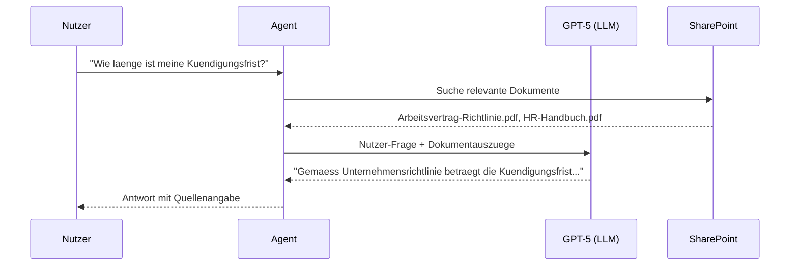
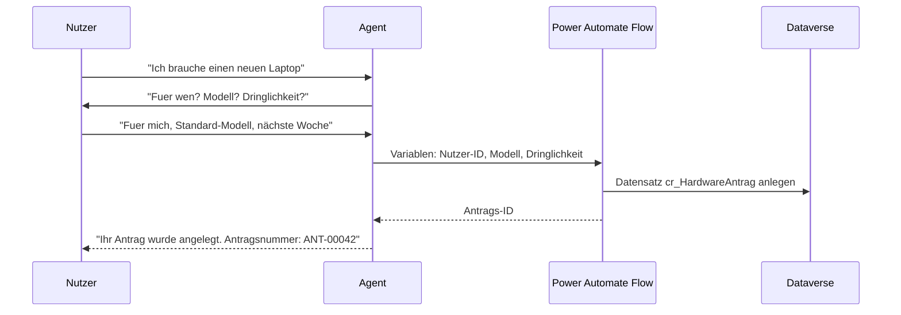
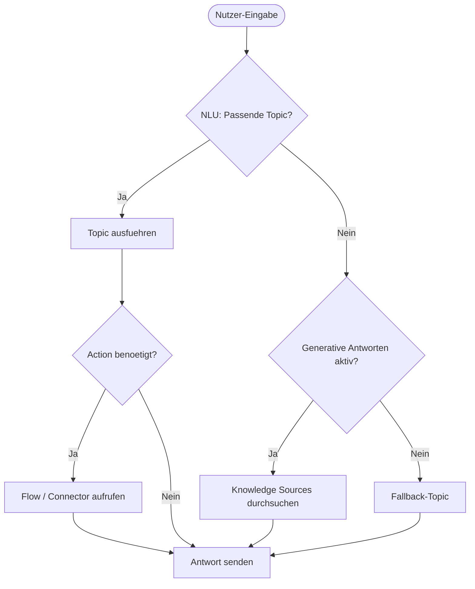

# Theorie: Grundkonzepte in Copilot Studio verstehen

🎯 Einstiegsfragen — vor der Erklärung stellen

1. Welche drei Grundbausteine hat jeder Agent in Copilot Studio?
2. Was ist ein Topic-Trigger und wie funktioniert Routing?
3. Wie testen Sie einen Agent, bevor er in Produktion geht?

💡 Musterlösung

**1.** Topics: Strukturierte Gespraemsthemen mit Trigger-Phrasen. Knowledge Sources: Wissensdatenbanken (SharePoint, Websites) die der Agent durchsucht. Actions: Power Automate Flows oder Connectors, die der Agent ausfuehren kann.

**2.** Ein Trigger ist eine Liste von Phrasen, die den Nutzer in dieses Topic leiten. Copilot Studio nutzt NLU (Natural Language Understanding) um die Nutzereingabe einem Topic zuzuordnen. Fallback-Topic: wenn kein Topic passt.

**3.** Im eingebauten Test-Chat im Studio. Dann: Publish in eine Test-Umgebung, reale Tester einladen. Metriken: Eskalationsrate und Topic-Abschlussrate. Logs in Application Insights auswerten.

## Die Bausteine eines Agents

Ein Agent in Copilot Studio besteht aus drei Grundbausteinen: Topics, Knowledge Sources und Actions. Wer diese drei Konzepte versteht, kann jeden Agent einordnen, unabhaengig davon, wie er heisst oder was er tut.

## Topics: Die Gespraeche des Agents

Ein Topic ist ein Gespraeach-Szenario. Es wird ausgeloest, wenn ein Nutzer eine bestimmte Phrase eingibt. Jedes Topic hat:

- **Trigger-Phrasen:** Beispielphrasen, die das Topic aktivieren ("Ich habe ein Problem mit meinem Passwort", "Passwort vergessen", "Login klappt nicht")
- **Konversationsknoten:** Schritte des Gespraechs (Nachrichten senden, Fragen stellen, Entscheidungen treffen, Aktionen ausfuehren)
- **Variablen:** Informationen die im Verlauf des Gespraechs gesammelt werden

### System-Topics: Automatisch vorhandene Topics

Jeder Agent hat System-Topics, die automatisch vorhanden sind und nicht geloescht werden koennen:

| System-Topic | Funktion |
|---|---|
| Greeting | Begruessungsnachricht beim Start |
| Goodbye | Verabschiedung am Ende |
| Escalate | Wenn Nutzer nach echtem Menschen fragt |
| Fallback | Wenn kein Topic matched |
| Error | Bei technischen Fehlern |

Der SA sollte sicherstellen, dass zumindest Greeting und Fallback angepasst sind, damit der Agent professionell wirkt.

### Trigger-Phrasen und das NLU-Modell

Copilot Studio nutzt NLU (Natural Language Understanding), um zu erkennen, welches Topic gemeint ist. Das Modell wird mit den Trigger-Phrasen trainiert. Mehr Phrasen und variantenreiche Formulierungen erhoehen die Treffsicherheit.

Empfehlung: Pro Topic mindestens 5 bis 10 verschiedene Trigger-Phrasen definieren. Die Phrasen sollten semantisch variieren, nicht nur Synonyme sein.

Schlecht: "Passwort zuruecksetzen", "Passwort reset", "Passwort neu setzen" (zu aehnlich)

Besser: "Ich komme nicht mehr rein", "Login geht nicht", "Passwort vergessen", "Wie kann ich mein Passwort aendern?", "Konto gesperrt" (semantisch divers)

## Knowledge Sources: Das Wissen des Agents

Knowledge Sources sind Datenquellen, aus denen der Agent generative Antworten erstellt. Im Unterschied zu Topics sind Knowledge Sources unstrukturiert: Der Agent liest Dokumente und generiert Antworten auf Basis des Inhalts.

### Unterstuetzte Knowledge Sources (Stand 2025)

| Quelle | Beschreibung | Einschraenkung |
|---|---|---|
| SharePoint | Dokumente und Seiten | Nur Quellen, auf die der Agent-Dienstkonto Zugriff hat |
| Webseiten | Oeffentliche URLs | Max. 2 Ebenen tief, kein JavaScript-Rendering |
| Eigene Dokumente | Hochgeladene Dateien (PDF, DOCX) | Max. 3 MB pro Datei |
| Dataverse Knowledge | Wissensdatenbank-Tabelle in Dataverse | Erfordert Customer Service Workspace |

### Wie generative Antworten funktionieren

Der Agent zitiert die Quellen standardmaessig, sodass der Nutzer die Information pruefen kann. Das erhoecht die Transparenz und reduziert das Risiko von unkritisch akzeptierten falschen Antworten.

## Actions: Was der Agent tun kann

Actions ermoeglicht es dem Agent, nicht nur zu antworten, sondern auch etwas zu tun. Dazu gehoeren:

### Power Automate Flows ausloesen

Der Agent kann einen Flow starten und dabei Parameter uebergeben. Der Flow kann:
- Datensaetze in Dataverse anlegen oder aendern
- E-Mails senden
- Genehmigungsprozesse starten
- In externe Systeme schreiben

### Connector-Actions

Copilot Studio kann direkt mit Power Platform Connectors interagieren. Damit koennen ohne Flow-Entwicklung einfache Aktionen ausgefuehrt werden (z.B. E-Mail senden per Outlook Connector, Dateien in SharePoint lesen).

### HTTP-Actions (fuer Fortgeschrittene)

Wenn ein externes System eine REST-API hat, kann der Agent direkt HTTP-Anfragen stellen. Das erfordert technisches Wissen aber kein zusaetzliches Entwicklungswerkzeug.

## Wie Topics, Knowledge Sources und Actions zusammenspielen

In der Praxis arbeiten alle drei Konzepte zusammen:

1. Nutzer startet Gespraech -> Agent zeigt Greeting-Topic
2. Nutzer stellt Frage -> NLU prueft alle Topics
3. Wenn ein Topic matched: Topic-Pfad wird durchlaufen
4. Wenn kein Topic matched und generative Antworten aktiviert: Knowledge Sources werden durchsucht
5. Wenn im Topic-Pfad eine Aktion benoetigt wird: Action wird aufgerufen
6. Wenn der Agent nicht weiterkommt: Escalate-Topic (Uebergabe an Mensch)

## Einen einfachen Agent planen

Bevor ein SA mit dem Bau beginnt, sollte folgende Checkliste abgearbeitet werden:

1. Welche Fragen stellen Nutzer am haeufigsten? (Top-10-Themen definieren = 10 Topics)
2. Welche Aktionen soll der Agent ausfuehren koennen? (Flows vorplanen)
3. Welche Dokumente sollen als Knowledge Source dienen? (SharePoint-Ordner identifizieren)
4. Wer darf den Agent nutzen? (Authentifizierung: Offen, Microsoft-Login, oder andere)
5. Welcher Kanal wird genutzt? (Teams, Web, Mobil)
6. Was passiert, wenn der Agent nicht helfen kann? (Escalation-Pfad zu Mensch oder Ticket-System)

Ein Agent der ohne diese Planungsphase gebaut wird, endet oft in einem "Frankenstein-System" das fuer bestimmte Fragen gut funktioniert und fuer andere voellig versagt.

## Wo konfigurieren und überwachen?

| Thema | Navigation |
|---|---|
| Agent anlegen | [copilotstudio.microsoft.com](https://copilotstudio.microsoft.com) → + **New agent** |
| Topics verwalten | [Agent] → **Topics** → + **Add a topic** |
| Trigger Phrases hinzufügen | [Agent] → **Topics** → [Topic] → **Trigger phrases** |
| Knowledge Sources hinzufügen (Dataverse, Docs, Web) | [Agent] → **Knowledge** → + **Add knowledge** |
| Agent im Test-Canvas testen | [Agent] → **Test your agent** (rechte Seitenleiste) |
| Agent veröffentlichen | [Agent] → **Publish** → **Publish** |
| Kanäle konfigurieren (Teams, Website, ...) | [Agent] → **Channels** → Kanal auswählen |
