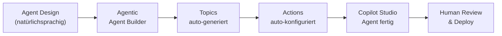

# Agentic AI — M04: Copilot Studio & Agents

> **Fokus:** Wie werden Copilot Studio Agents selbst agentic? MCP-Integration, Generative Answers, Action Automation.  
> **Zielgruppe:** Developers, die generative Agents bauen möchten  
> **Lösung:** siehe `agentic-sol.md` (wird nachgefüllt)

---

## Die Rekursion: Agentic Agent bauen

**Ironie:** M04 lehrt wie man Agents baut. Aber wie baut man Agents _agentic_?

Klassisch: Developer sitzt im Copilot Studio UI, klickt Topic → Pfad → Aktion → speichert manuell.

Mit **Agentic AI**: Ein Agent assistiert dabei, den _anderen_ Agent zu bauen. Inception! 🤯



---

## Use Case 1: Topic-generierung aus Anforderungen

### Problem

Anforderung: "HR-Agent soll Mitarbeiter helfen bei Urlaubsanträgen, Krankmeldungen und Benefits-Fragen."

**Klassische Frage:** "Wie viele Topics brauche ich? Welche Trigger-Phrasen?"

### Agentic Lösung

Agent erhält Anforderung → generiert Topics mit Trigger-Phrasen:

```plaintext
Agent-Input:
"HR-Agent soll Mitarbeiter helfen bei:
  1. Urlaubsanträge (stellen, Status prüfen, ablehnen)
  2. Krankmeldungen (einreichen, Historie)
  3. Benefits-Fragen (Jobticket, Kantine, Altersvorsorge)"

Agent-Analysis & Generation:

Topic 1: "Request Vacation"
  Trigger Phrases:
    - "Ich möchte Urlaub einreichen"
    - "Kann ich 2 Wochen nächsten Monat frei haben?"
    - "Wie viel Urlaub habe ich noch?"
    - "Beantrage Urlaubstage"
  Slots (required):
    - vacation_start_date: Date
    - vacation_end_date: Date
    - vacation_reason: Choice (Privat | Fortbildung | Sabbatical)
  Actions:
    - Validate: "Genug Resturlaub?"
    - Call Flow: "Submit Vacation Request" (Power Automate)
  Response:
    - "Danke! Dein Antrag wurde eingereicht. Dein Manager erhält eine Benachrichtigung."

Topic 2: "Report Sick Leave"
  Trigger Phrases:
    - "Ich bin krank"
    - "Ich melde mich arbeitsunfähig"
    - "Krankheitsmeldung"
    - "Ich kann heute nicht arbeiten"
  Slots (required):
    - sick_leave_date: Date
    - expected_duration: Choice (1 Tag | 2-3 Tage | >1 Woche | Unsicher)
  Actions:
    - Call Flow: "Record Sick Leave" (Dataverse)
    - Send Notification: Manager + HR
  Response:
    - "Gute Besserung! Deine Krankmeldung wurde notiert. HR wird sich in Kürze mit dir in Verbindung setzen."

Topic 3: "Benefits Inquiry"
  Trigger Phrases:
    - "Welche Benefits habe ich?"
    - "Wie funktioniert das Jobticket?"
    - "Kantine, Altersvorsorge?"
    - "Was sind meine Mitarbeiterbenefit?"
  Slots (optional):
    - benefit_category: Choice (Jobticket | Kantine | Altersvorsorge | Healthcare)
  Knowledge Source:
    - "HR-Benefits-Broschüre" (SharePoint)
  Response:
    - [Generiert aus Knowledge Source via RAG]

Topic 4: "Check Vacation Balance"
  Trigger Phrases:
    - "Wie viel Urlaub habe ich noch?"
    - "Resturlaub?"
    - "Vacation days remaining?"
  Actions:
    - Query: "Get User Vacation Balance" (Power Automate → SAP)
  Response:
    - "Du hast noch {{remaining_days}} Urlaubstage."
```

**Zeit:** 5 Minuten (statt 2+ Stunden manuell Topics klicken).

---

## Use Case 2: Generative Answers mit RAG Auto-Config

### Problem

"HR soll Fragen zu Benefits beantworten. Das sind aber 50+ PDFs."

**Klassischer Weg:**

1. Alle PDFs manuell zu SharePoint hochladen
2. Jedes PDF einzeln verlinken
3. RAG-Semantik manuell testen
4. "Warum gibt der Agent falsche Antworten?" → Prompting debuggen

### Agentic Lösung

Agent konfiguriert RAG automatisch & schlägt Prompt-Verbesserungen vor:

```plaintext
Agent-Input:
- Anforderung: "Beantworte Fragen zu HR-Benefits"
- Knowledge Source: SharePoint "HR-Benefits-Dokumente" (50 PDFs)
- Expected Accuracy: 95%+

Agent-Setup:

Step 1: Knowledge Source vorbereiten
  ✓ Crawl SharePoint Library
  ✓ Extract Text from PDFs (OCR if needed)
  ✓ Chunk into 512-token segments (optimal für Retrieval)
  ✓ Embed mit Azure OpenAI

Step 2: RAG-Config generieren
  knowledge_source {
    type: "SharePoint"
    library: "HR-Dokumente"
    chunking_strategy: "semantic" (statt simple paragraph split)
    max_chunks_per_query: 5
    similarity_threshold: 0.8 (nur relevante Chunks)
  }

Step 3: Prompt Testing & Optimization
  Baseline Prompt: "Beantworte Fragen zu HR-Benefits basierend auf Knowledge Source."

  Agent testet 10 Varianten & misst Halluzinations-Rate:
    ✓ Prompt V1: "Beantworte..." → 2% Halluzination
    ✓ Prompt V2: "Du bist HR-Expert..." → 1.5% Halluzination
    ✗ Prompt V3: "Antworte in Stichpunkten..." → 3% Halluzination
    ✓ Prompt V4: "Wenn du es nicht weißt, sag 'Ich habe dazu keine Info'" → 0.8% Halluzination ← BEST

  Empfohlener Final Prompt:
    "Du bist ein HR-Agent für unsere Mitarbeiter. Beantworte Fragen basierend
    auf den bereitgestellten HR-Dokumenten.
    WICHTIG: Falls deine Frage nicht in den Dokumenten beantwortet wird,
    antworte: 'Diese Frage habe ich in meiner Knowledge Base nicht gefunden.
    Kontaktiere bitte HR-team@company.com'
    Bleibe freundlich und hilfreich."

Step 4: Fallback Topic erstellen
  Topic: "I don't have that info"
  Trigger: [Agent erkannt automatisch wenn RAG < 0.8 Confidence]
  Response: "Kontaktiere HR-Team: ..."
```

---

## Use Case 3: Multi-Step Actions Auto-Orchestration

### Problem

Anforderung: "Mitarbeiter reicht Urlaubsantrag ein → Manager genehmigt → HR verarbeitet → SAP aktualisiert."

**Klassischer Weg:**

1. Mehrere Power Automate Flows manuell bauen
2. Jeden Flow von Copilot Studio Topic aufrufen
3. Error-Handling: "Was wenn Manager zu lange nicht antwortet?"
4. Logging/Audit: Wo lande ich in welchem Flow?

### Agentic Lösung

Agent orchestriert die gesamte Multi-Step Action automatisch:

```plaintext
Agent-Input:
Szenario: "Urlaubsantrag einreichen"
  Step 1: Nutzer stellt Antrag im Agent
  Step 2: Manager wird notifiziert
  Step 3: Manager genehmigt/lehnt ab
  Step 4: HR verarbeitet genehmigten Antrag
  Step 5: SAP wird aktualisiert
  Timeout: Wenn Manager >5 Tage nicht antwortet → Eskalation

Agent-Generated Flow Orchestration:

┌─────────────────────────────────────────────────────────┐
│ Copilot Studio Agent (Topic: "Request Vacation")       │
├─────────────────────────────────────────────────────────┤
│ User Input: Datum, Grund, etc.                          │
│ ↓                                                        │
│ Step 1: Validate (Agent checks Vacation Balance)       │
│ IF insufficient_balance:                                │
│   Response: "Du hast nur {{remaining}} Tage, brauchst" │
│   "{{needed}}. Möchtest du trotzdem einreichen?"       │
│ ↓                                                        │
│ Step 2: Call Flow "Send Vacation Request to Manager"   │
│   (Power Automate)                                      │
│   Output: request_id, manager_email                     │
│ ↓                                                        │
│ Step 3: Wait for Manager Response                      │
│   [Approval Flow in Outlook → Manager klickt Approve]  │
│ ↓                                                        │
│ Step 4: Conditional Logic                              │
│   IF approved:                                          │
│     → Call Flow "Process Approved Vacation"            │
│     → Call Flow "Update SAP"                           │
│     → Response: "Genehmigt! Viel Spaß im Urlaub 🏖️"  │
│   IF rejected:                                          │
│     → Response: "Antrag abgelehnt. Grund: {{reason}}"  │
│     → Offer: "Möchtest du einen anderen Termin?"       │
│   IF timeout (>5 days):                                │
│     → Send Reminder to Manager                          │
│     → Escalate to HR-Director                           │
└─────────────────────────────────────────────────────────┘

Agent-Generated Code:
{
  "topic": "Request Vacation",
  "actions": [
    {
      "type": "validation",
      "logic": "vacation_balance >= (end_date - start_date)"
    },
    {
      "type": "flow_call",
      "flow_name": "Send Vacation Request to Manager",
      "inputs": {...}
    },
    {
      "type": "wait_approval",
      "timeout_days": 5,
      "on_timeout": "escalate_to_hr"
    },
    {
      "type": "conditional",
      "condition": "approval_status == 'approved'",
      "then": [flow_call "Process Approved", flow_call "Update SAP"],
      "else": [send_rejection_response]
    }
  ]
}
```

---

## Use Case 4: Agentic Canvas App + Agent Co-Design

### Problem

Canvas App & Agent sind oft entkoppelt:

- Canvas App macht CRUD (Formulare)
- Agent antwortet auf Fragen
- Aber was wenn der Agent eine Action im Canvas auslösen soll?

### Agentic Lösung

Agent & Canvas kommunizieren bi-direktional:

```plaintext
Agent-Input:
"Wenn ein Mitarbeiter im Agent sagt 'Ich will einen Urlaubsantrag stellen',
soll nicht der Agent das Formular sammeln, sondern der Agent die Canvas App
öffnen mit pre-filled Feldern."

Architecture Design:

┌──────────────────────────────────┐
│ Copilot Studio Agent             │
├──────────────────────────────────┤
│ Topic: "Request Vacation"        │
│ User: "Ich will Urlaub einreichen"│
│ Agent-Action:                     │
│   1. Erkenne: User will Formular │
│   2. Rufe Canvas URL auf mit:     │
│      ?employee_id={{user_id}}    │
│      &vacation_start={{today}}   │
│   3. Gib Link zurück:            │
│      "Klick hier für Formular →" │
└──────────────────────────────────┘
       ↓ (User clicks link)
┌──────────────────────────────────┐
│ Canvas App: Vacation Request Form│
├──────────────────────────────────┤
│ Pre-filled:                      │
│  - Employee ID (from URL param)  │
│  - Vacation Start (from URL param)│
│  - Vacation Balance (looked up)  │
│ User fills:                       │
│  - End Date                       │
│  - Reason                         │
│ On Submit:                        │
│  - Save to Dataverse             │
│  - Send Agent Notification:      │
│    "Antrag erstellt! Ref: #123"  │
└──────────────────────────────────┘
       ↓ (Back to Agent)
┌──────────────────────────────────┐
│ Agent Shows Confirmation         │
│ "Antrag #123 eingereicht!"       │
│ Next: "Dein Manager prüft..."    │
└──────────────────────────────────┘
```

**Code-Beispiel (Power Automate Flow):**

```json
{
  "trigger": "When vacationRequest created",
  "actions": [
    {
      "type": "send_message_to_copilot",
      "message": "Eine neue Anfrage wurde eingereicht: {{request_id}}",
      "agent_id": "hr-agent-id",
      "context": {
        "request_id": "{{request_id}}",
        "employee_name": "{{employee_name}}"
      }
    }
  ]
}
```

---

## Praktische Architektur: Agentic Agent Builder

```yaml
Agent: "Copilot Studio Agent Assistant"
Model: GPT-4o (für komplexes Reasoning)
Tools (MCPs):
  - copilot-studio-mcp: API zu Copilot Studio
  - flow-mcp: Power Automate Flows generieren
  - rag-optimizer-mcp: RAG-Prompts testen
  - dataverse-mcp: Entities für Aktionen
  - testing-mcp: Agent-Responses A/B testen

Input-Schema:
  requirements: string # "HR-Agent für Urlaubsanträge"
  user_intents: [string] # ["Request Vacation", "Report Sick"]
  knowledge_sources: [url] # SharePoint Libraries
  backend_flows: [flow_name] # Existierende Power Automate
  accuracy_target: float # 0.95 (95% correct answers)

Output:
  topics: [topic] # Topics mit Trigger-Phrasen
  actions: [action] # Power Automate integrations
  rag_config: {} # Knowledge Source + Prompting
  test_results: {} # Halluzination % tested
  deployment_guide: string # Schritt-für-Schritt ins Copilot Studio
```

---

## Fallstudie: HR-Agent in 2 Stunden

### Klassischer Weg (12+ Stunden)

1. Design (Welche Topics?) (2h)
2. Baue 5 Topics manuell im UI (3h)
3. Schreibe Power Automate Flows (3h)
4. Teste Agent-Responses (2h)
5. Debug Halluzinationen (1.5h)
6. Fine-tune Prompting (0.5h)

### Agentic Weg (2 Stunden)

1. Requirements eingeben (10 min)
2. Agent generiert Topics (5 min)
3. Agent generiert Flows (10 min)
4. Agent optimiert RAG + testet Halluzinationen (20 min)
5. Agent exportiert zu Copilot Studio (5 min)
6. Manuelle Review & Tweaks (60 min)
7. Fertig!

**Zeitersparnis:** 83% weniger Entwicklung.

---

## Limitations & Fallstricke

| Fallstrick                        | Grund                           | Mitigation                           |
| --------------------------------- | ------------------------------- | ------------------------------------ |
| Agent generiert zu viele Topics   | Over-engineering                | Keep it simple: 3-5 Topics pro Agent |
| Halluzinationen in RAG            | Knowledge Source zu groß/unklar | Agent muss chunking + RAG testen     |
| Agent versteht Custom Logic nicht | LLM kennt nur Standard-Actions  | SA muss komplexe Flows selbst bauen  |
| Topic-Trigger-Phrasen zu eng      | Agent untertrainiert            | Nutzer-Testing nötig                 |

---

## Handlung für Adrian

**Niveau:** Advanced (Agent-Architektur + MCP-Integration)

**Aufgabe:**  
Baue einen **HR-Agent mit Agentic Support**, der:

1. **Topic Generation:**

   - Liest Anforderungen
   - Erzeugt Topics mit Trigger-Phrasen
   - Exportiert zu Copilot Studio JSON

2. **RAG Optimization:**

   - Lädt Knowledge Source (SharePoint)
   - Testet verschiedene Prompts
   - Misst Halluzinationen
   - Gibt Best Prompt zurück

3. **Flow Orchestration:**

   - Generiert Power Automate Flows für Multi-Step Actions
   - Handlert Timeouts & Eskalationen
   - Bi-direktionale Agent ↔ Canvas Communication

4. **Testing & Validation:**
   - Agent simuliert User-Conversations
   - Misst Antwort-Qualität
   - Detektiert Halluzinationen

**Bonus:** CLI-Tool `agent-builder --requirements "file.md"` → fertiger Copilot Studio Agent

---

## Checkpoint ✓

Am Ende verstehst du:

- [ ] Wie Copilot Studio Agents selbst "agentic" werden können
- [ ] MCP-Integration für Auto-Topic-Generierung
- [ ] RAG-Prompt-Optimierung & Halluzination-Detection
- [ ] Multi-Step Action Orchestration mit Power Automate
- [ ] Agent ↔ Canvas Communication
