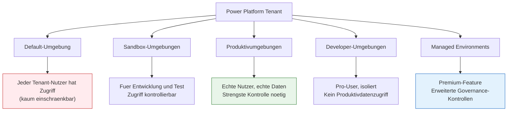
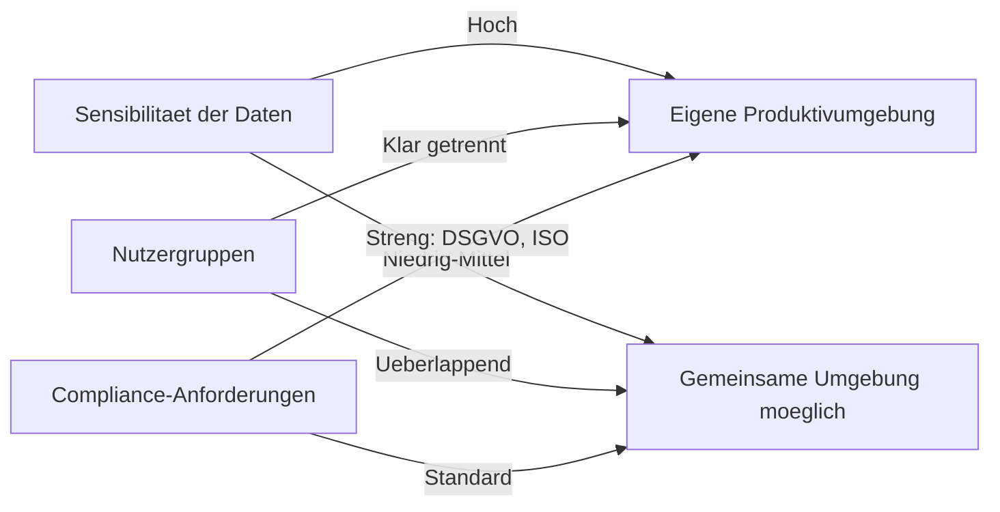

# Lab 5.1 - Umgebungen als erste Sicherheitsgrenze verstehen

🎯 Einstiegsfragen — vor der Erklärung stellen

1. Warum sind Umgebungen in der Power Platform mehr als nur Dev/Test/Prod?
2. Was passiert, wenn zu viele Nutzer System Administrator-Rechte in der Produktionsumgebung haben?
3. Wann wuerde man eine separate Sandbox-Umgebung statt der Dev-Umgebung fuer Tests nutzen?

💡 Musterlösung

**1.** Umgebungen sind die haerteste Sicherheitsgrenze: Daten einer Umgebung sind fuer Nutzer anderer Umgebungen nicht sichtbar, unabhaengig von Rollen. Sie trennen auch Lizenzen, DLP-Richtlinien und Ressourcenlimits. Falsche Umgebungsstrategie = Datenlecks oder Compliance-Verstoesse.

**2.** System Admins koennen alle Datensaetze lesen und aendern, Sicherheitskonfigurationen aendern, Daten exportieren und Plugins deaktivieren. Prinzip der minimalen Rechte: In Produktion maximal 2-3 Service Accounts mit Admin-Rechten.

**3.** Wenn echte Produktionsdaten fuer Tests benoetigt werden (Backup-Restore aus Prod) | wenn ein Hotfix getestet werden muss ohne die laufende Entwicklung zu stoeren | wenn ein neuer Connector risikofrei ausprobiert werden soll.

## Warum Umgebungen keine reine ALM-Entscheidung sind

Umgebungen werden haeufig als Entwicklungs-, Test- und Produktivumgebungen diskutiert. Das ist richtig, aber unvollstaendig. Umgebungen sind gleichzeitig die haerteste Sicherheitsgrenze in der gesamten Power Platform. Wer Zugriff auf eine Umgebung hat, kann im schlimmsten Fall alle Daten darin lesen, aendern oder loeschen, unabhaengig davon, welche Sicherheitsrollen konfiguriert wurden.

Ein Solution Architect muss Umgebungen sowohl aus ALM-Perspektive als auch aus Sicherheitsperspektive bewerten.

## Umgebungstypen und ihre Sicherheitsimplikationen

### Die Default-Umgebung: Das groesste Sicherheitsrisiko

Die Default-Umgebung existiert in jedem Tenant automatisch. Sie hat eine besondere Eigenschaft: Jeder lizenzierte Power Platform Nutzer des Tenants wird automatisch Mitglied dieser Umgebung. Das bedeutet, dass kein Umgebungsadministrator explizit Zugriff gewaehren muss.

**Konsequenz fuer die Architektur:** In der Default-Umgebung duerfen keine Geschaeftsdaten gespeichert werden, die nicht fuer alle Nutzer des Tenants sichtbar sein sollen. In der Praxis wird die Default-Umgebung haeufig durch Maker missbraucht, die schnell eine App bauen und dabei nicht ueber Datenisolation nachdenken.

### Managed Environments: Governance-Kontrollen auf Umgebungsebene

Managed Environments sind ein Premium-Feature (erfordert Power Apps Premium oder Power Platform Premium Lizenz fuer alle Nutzer der Umgebung). Sie ermoeglichen:

- **Maker-Willkommensinhalt:** Benutzerdefinierte Richtlinien werden Makern beim ersten Login angezeigt
- **Solution Checker Enforcement:** Loesungen werden automatisch auf Qualitaet geprueft
- **Sharing-Limits:** Einschraenkung, wie breit Maker ihre Apps teilen koennen
- **Wochentliche Digest-E-Mails:** Admins erhalten Uebersichten ueber Aktivitaeten
- **IP-Firewall:** Zugriff auf Umgebungsdaten nur von bestimmten IP-Adressen

## Zugriffskontrolle auf Umgebungsebene

Der Zugriff auf eine Umgebung wird durch Umgebungsrollen gesteuert. Diese sind von Sicherheitsrollen zu unterscheiden:

| Umgebungsrolle          | Zweck                                                 | Wann vergeben              |
| ----------------------- | ----------------------------------------------------- | -------------------------- |
| Environment Admin       | Vollzugriff auf die Umgebungskonfiguration            | Nur an SA und IT-Admins    |
| Environment Maker       | Kann Ressourcen erstellen (Apps, Flows, Verbindungen) | An autorisierte Entwickler |
| (kein explizites Recht) | Kann nur zugeteilte Apps nutzen                       | Endnutzer                  |

**Wichtig:** Ein Nutzer kann eine Canvas App nutzen, ohne Umgebungs-Maker-Rechte zu haben. Die Unterscheidung zwischen "Nutzungsrecht" und "Erstellungsrecht" ist architektonisch bedeutsam.

## Umgebungsisolation als Datenschutzmassnahme

Eine Umgebung in Power Platform ist technisch so konzipiert, dass Daten aus einer Umgebung nicht direkt in einer anderen Umgebung sichtbar sind. Das gilt fuer:

- **Dataverse-Daten:** Tabellen und Datensaetze aus Umgebung A sind in Umgebung B nicht ohne explizite Integration sichtbar.
- **Verbindungen:** Power Automate Flows koennen Verbindungen aus anderen Umgebungen nicht direkt nutzen.
- **Loesungen:** Eine Loesung muss explizit in eine Umgebung importiert werden.

**Ausnahme: Cross-Environment Connectors.** Bestimmte Connectors (z.B. der Dataverse-Connector) ermoeglichen theoretisch den Zugriff auf andere Umgebungen, sofern der Nutzer dort Rechte hat. DLP-Policies koennen dies nicht vollstaendig verhindern.

## Architektonische Entscheidungsmatrix: Wie viele Umgebungen?

Eine haeufige Fehlentscheidung: Pro Projekt eine eigene Produktivumgebung, was zu Lizenz- und Verwaltungskosten fuehrt. Eine bessere Strategie ist es, Umgebungen nach Domaine oder Business Unit zu strukturieren, nicht nach Projekt.

## Die Frage, die der SA stellen muss

"Wenn ein Angreifer die Zugangsdaten eines beliebigen Mitarbeiters kompromittiert, was kann er in dieser Umgebung sehen und tun?"

Die Antwort auf diese Frage treibt die Umgebungs- und Sicherheitsarchitektur.

## Wo konfigurieren und überwachen?

| Thema | Navigation |
|---|---|
| Neue Umgebung erstellen | [admin.powerplatform.microsoft.com](https://admin.powerplatform.microsoft.com) → **Environments** → + **New** |
| Umgebungstyp einsehen (Sandbox, Production, Default) | PPAC → **Environments** → Spalte **Type** |
| Managed Environment aktivieren | PPAC → **Environments** → [Umgebung] → **Enable Managed Environment** |
| Security Group für Umgebungszugriff setzen | PPAC → **Environments** → [Umgebung] → **Edit** → **Security group** |
| Default-Umgebung durch DLP absichern | PPAC → **Policies** → **Data policies** → Scope: **Add default environment** |
