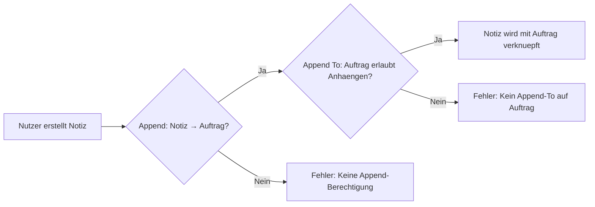
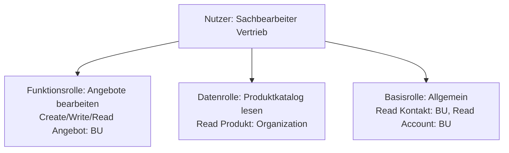

# Lab 5.3 - Sicherheitsrollen und Berechtigungstiefe sicher einsetzen

🎯 Einstiegsfragen — vor der Erklärung stellen

1. Was sind die vier Zugriffsebenen (Scope-Tiefen) bei Dataverse-Sicherheitsrollen?
2. Was ist der Unterschied zwischen 'Lesen' und 'Anhaengen' als Berechtigung?
3. Warum ist eine einzige 'Super-User'-Sicherheitsrolle fuer alle Nutzer schlechte Architektur?

💡 Musterlösung

**1.** User (Basic): Nur eigene Datensaetze. Business Unit: Alle Datensaetze der eigenen BU. Parent:Child Business Units: Eigene BU + untergeordnete BUs. Organization: Alle Datensaetze in der Umgebung.

**2.** Lesen (Read): Datensatz oeffnen und Felder sehen. Anhaengen (Append): Einen Datensatz mit einem anderen verknuepfen (z.B. Notiz an Reklamation). Anhaengen-An (AppendTo): Die Tabelle erlaubt es, dass andere Datensaetze angehaengt werden. Beide muessen passen fuer eine Verknuepfung.

**3.** Verletzt Prinzip der minimalen Rechte. Im Schadensfall ist der Schaden maximal. Auditierung wird sinnlos. Compliance-Anforderungen (DSGVO) koennen nicht erfuellt werden.

## Was ist eine Sicherheitsrolle?

Eine Sicherheitsrolle in Dataverse ist eine Sammlung von Berechtigungen, die einem Nutzer oder Team zugewiesen werden. Sie definiert:

- **Welche Tabellen** der Nutzer zugreifen darf
- **Welche Aktionen** er durchfuehren darf (Erstellen, Lesen, Schreiben, Loeschen, Anhaengen, Anhaengen an, Zuweisen, Freigeben)
- **Auf welcher Tiefe** (User, Business Unit, Parent:Child, Organization)

Eine Sicherheitsrolle ist kumulativ. Wenn ein Nutzer mehrere Rollen hat, addieren sich die Berechtigungen - die restriktivste Regel gewinnt nicht. Das ist ein haeufiger Irrtum.

## Die acht Berechtigungstypen

| Berechtigung | Bedeutung                                                    |
| ------------ | ------------------------------------------------------------ |
| Create       | Neuen Datensatz erstellen                                    |
| Read         | Datensatz lesen                                              |
| Write        | Bestehenden Datensatz bearbeiten                             |
| Delete       | Datensatz loeschen                                           |
| Append       | Datensatz an einen anderen anhaengen (z.B. Notiz an Auftrag) |
| Append To    | Erlaubt, dass andere Datensaetze an diesen angehaengt werden |
| Assign       | Eigentuemer eines Datensatzes aendern                        |
| Share        | Datensatz mit einem anderen Nutzer teilen                    |

**Wichtig:** Append und Append To sind beide noetig. Ein haeufia uebersehener Grund fuer Berechtigungsfehler bei Beziehungen.

## Rollen kumulieren sich - nie einschraenken

Dies ist einer der am haeufigsten falsch verstandenen Aspekte von Dataverse-Sicherheitsrollen.

**Beispiel:**

- Rolle A gibt "Read: Organization" auf Tabelle Kontakt
- Rolle B gibt "Read: User" auf Tabelle Kontakt
- Nutzer hat beide Rollen → Ergebnis: "Read: Organization" (die weitreichendere Berechtigung gewinnt)

Es gibt keine Moeglichkeit, eine Berechtigung durch eine zweite Rolle einzuschraenken. Wenn ein Nutzer zu viel sieht, muss die Rolle angepasst werden - nicht eine neue restriktivere Rolle hinzugefuegt.

## Rollen-Design-Prinzipien fuer den SA

### Minimalprinzip (Principle of Least Privilege)

Jede Rolle enthaelt nur die Berechtigungen, die fuer die jeweilige Funktion tatsaechlich benoetigt werden. Das klingt selbstverstaendlich, wird in der Praxis aber regelmaessig verletzt, wenn unter Zeitdruck konfiguriert wird.

**Typischer Anti-Pattern:** Eine Rolle mit "Organization"-Tiefe auf alle Tabellen, weil das Testen damit einfacher ist. Diese Rolle landet dann in der Produktivumgebung.

### Funktionsrollen vs. Datenrollen

Eine bewaehrte Strategie ist die Trennung von Funktionsrollen (was darf der Nutzer tun?) und Datenrollen (auf welche Daten darf er zugreifen?).

### Systemrollen vs. Custom-Rollen

Dataverse kommt mit vorkonfigurierten Systemrollen. Diese dienen als Orientierung, sollten aber in Produktivumgebungen nie direkt zugewiesen werden:

| Systemrolle          | Berechtigungsumfang        | Empfehlung                     |
| -------------------- | -------------------------- | ------------------------------ |
| System Administrator | Alles                      | Nur technische Admins          |
| System Customizer    | Konfigurieren und Anpassen | Nur Entwickler in Dev-Umgebung |
| Basic User           | Minimale Basisrechte       | Als Vorlage fuer eigene Rollen |
| Service Reader       | Nur Lesen                  | Fuer Integrationsnutzer        |

## Rollen dokumentieren

Eine haeufig vernachlaessigte SA-Aufgabe: die Rollenlandschaft dokumentieren. In Projekten mit 5+ Rollen verliert das Team schnell den Ueberblick. Empfohlene Dokumentationsform: eine Berechtigungsmatrix (Tabellen vs. Rollen) als lebendiges Dokument.

| Tabelle | Sachbearbeiter | Teamleiter           | Admin         | Integrations-User |
| ------- | -------------- | -------------------- | ------------- | ----------------- |
| Angebot | R/W/C (BU)     | R/W/C (Parent:Child) | R/W/C/D (Org) | R (Org)           |
| Kontakt | R (BU)         | R (Parent:Child)     | R/W/C/D (Org) | R (Org)           |
| Produkt | R (Org)        | R (Org)              | R/W/C/D (Org) | R (Org)           |

## Wo konfigurieren und überwachen?

| Thema | Navigation |
|---|---|
| Sicherheitsrollen verwalten | [admin.powerplatform.microsoft.com](https://admin.powerplatform.microsoft.com) → **Environments** → [Umgebung] → **Settings** → **Users + permissions** → **Security roles** |
| Neue Rolle erstellen | PPAC → ... → **Security roles** → + **New role** |
| Bestehende Rolle kopieren | PPAC → ... → **Security roles** → [Rolle] → **Actions** → **Copy role** |
| Rolle einem Nutzer zuweisen | PPAC → ... → **Users** → [Nutzer] → **Manage security roles** |
| Rolle einem Team zuweisen | PPAC → ... → **Teams** → [Team] → **Manage security roles** |
| Rollen eines Nutzers prüfen | PPAC → ... → **Users** → [Nutzer] → **Manage security roles** (zeigt aktuelle Rollen) |
