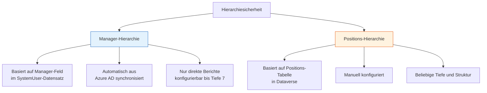
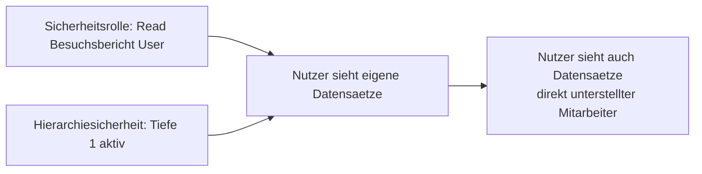

# Lab 6.1 - Hierarchiesicherheit gezielt einsetzen

🎯 Einstiegsfragen — vor der Erklärung stellen

1. Was ist Hierarchiesicherheit und wie unterscheidet sie sich von der BU-Struktur?
2. Was sind die zwei Hierarchie-Typen in Dataverse?
3. Welche Tiefenbegrenzung gibt es bei der Hierarchiesicherheit?

💡 Musterlösung

**1.** Hierarchiesicherheit ist personenbezogen: Ein Manager sieht die Datensaetze seiner direkten Untergebenen, unabhaengig von deren BU. BU-Struktur ist organisationsbezogen. Beides kann kombiniert werden.

**2.** Manager-Hierarchie: Basiert auf dem 'Manager'-Feld im Nutzerdatensatz. Positions-Hierarchie: Basiert auf definierten Positionen (z.B. Regionalleiter > Teamleiter > Techniker) — flexibler, da unabhaengig von der tatsaechlichen Manager-Zuordnung.

**3.** Maximal 7 Ebenen. Datensaetze von Nutzern die mehr als 7 Ebenen entfernt sind, werden nicht angezeigt. Bei grossen Konzernen mit tiefen Hierarchien muss das geprueft werden.

## Was ist Hierarchiesicherheit?

Hierarchiesicherheit ist ein optionaler Sicherheitsmechanismus in Dataverse, der auf der Manager-Mitarbeiter-Beziehung basiert. Er wird auf Umgebungsebene aktiviert und erweist das BU-Modell um eine personenbezogene Dimension: Ein Manager kann die Datensaetze seiner direkt unterstellten Mitarbeiter sehen, auch wenn diese in anderen BUs sind oder die BU-Tiefe das normalerweise nicht zuliesse.

## Zwei Modi der Hierarchiesicherheit

**Manager-Hierarchie:** Wird automatisch aus Azure AD uebernommen, sofern das Manager-Feld im SystemUser synchronisiert ist. Einfach einzurichten, aber abhaengig von der AD-Pflege.

**Positions-Hierarchie:** Wird manuell ueber eine Positions-Tabelle in Dataverse konfiguriert. Flexibler, aber aufwaendiger. Sinnvoll wenn die Organisationsstruktur komplexer ist als eine einfache Berichtsbeziehung.

## Tiefenkonfiguration

Standardmaessig gilt Hierarchiesicherheit nur fuer direkte Mitarbeiter (Tiefe 1). Es koennen bis zu 7 Hierarchieebenen konfiguriert werden. Das bedeutet: Ein Manager auf Ebene 3 sieht bei Tiefe 3 auch die Datensaetze der Mitarbeiter seiner Mitarbeiter.

**Warnung:** Je hoeher die Tiefe, desto mehr Datensaetze werden sichtbar, und desto schwerer ist die Konfiguration nachzuvollziehen. Tiefe > 3 ist in der Praxis selten sinnvoll.

## Interaktion mit Sicherheitsrollen

Hierarchiesicherheit erweitert, was ein Nutzer durch seine Sicherheitsrollen sehen kann. Sie kann keine Zugriffe entziehen. Die Logik:

Das bedeutet: Wenn ein Manager die Sicherheitsrolle "Read: User" hat, sieht er normalerweise nur seine eigenen Datensaetze. Mit aktivierter Hierarchiesicherheit sieht er auch die Datensaetze seiner direkten Mitarbeiter.

## Typische Einsatzbereiche

**Sinnvoll wenn:**

- Flache Organisationsstruktur (max. 2-3 Fuehrungsebenen)
- Manager-Feld in Azure AD zuverlaessig gepflegt
- Einfacher Use-Case: Manager sieht Daten seiner Mitarbeiter
- Vermeidung von BU-Komplexitaet gewuenscht

**Nicht sinnvoll wenn:**

- Komplexe Matrixorganisation
- AD-Pflege ist unzuverlaessig oder verzoegert
- Querbeziehungen (z.B. Projektleiter sieht Daten ohne Managementlinie)
- Compliance-Anforderungen verlangen explizite, auditierbare Zugriffsrechte

## Hierarchiesicherheit auditieren

Da Hierarchiesicherheit implizit wirkt (kein expliziter Rolleneintrag), ist sie schwieriger zu auditieren als Rollen. Tools wie Power Platform Admin Center zeigen nicht direkt, welche Datensaetze ein Nutzer durch Hierarchiesicherheit sieht. Das ist ein Argument gegen den Einsatz in stark regulierten Umgebungen.

## Wo konfigurieren und überwachen?

| Thema | Navigation |
|---|---|
| Hierarchiesicherheit aktivieren und konfigurieren | [admin.powerplatform.microsoft.com](https://admin.powerplatform.microsoft.com) → **Environments** → [Umgebung] → **Settings** → **Users + permissions** → **Hierarchy security** |
| Hierarchietyp wählen (Manager / Position) | PPAC → ... → **Hierarchy security** → Feld **Hierarchy type** |
| Tiefe (Depth) konfigurieren | PPAC → ... → **Hierarchy security** → Feld **Hierarchy depth** (Standard: 1) |
| Manager-Zuweisung eines Nutzers prüfen | PPAC → ... → **Users** → [Nutzer] → Feld **Manager** |
| Positionshierarchie verwalten | PPAC → ... → **Hierarchy security** → **Manage positions** |
