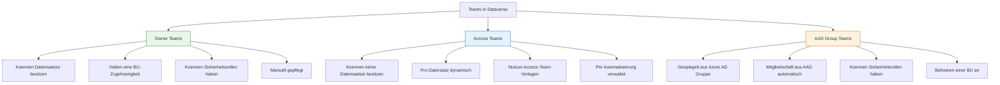
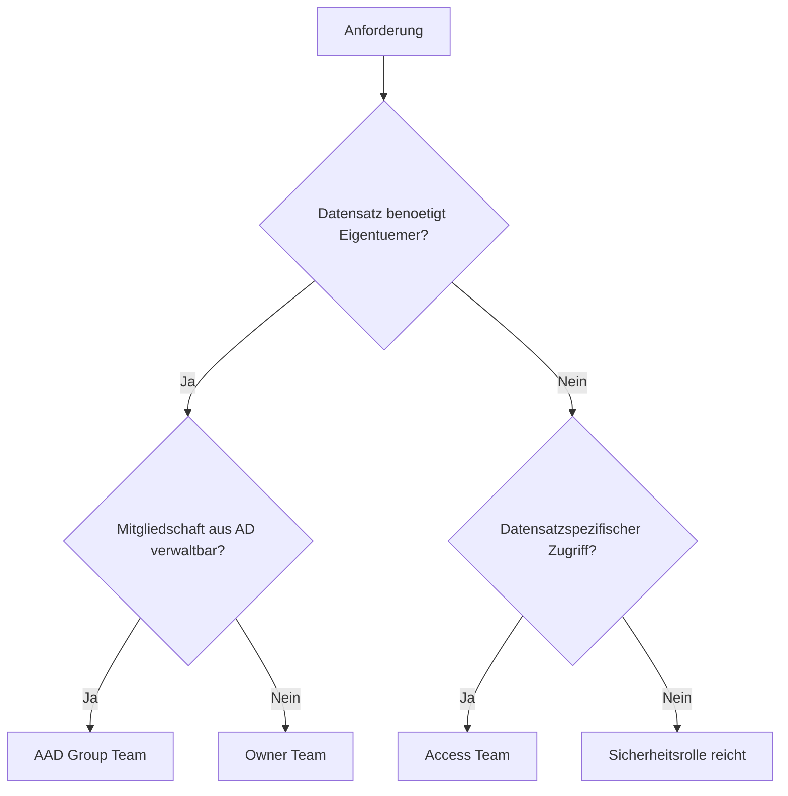

# Lab 6.2 - Teams als Sicherheits- und Kollaborationswerkzeug bewerten

🎯 Einstiegsfragen — vor der Erklärung stellen

1. Welche drei Team-Typen gibt es in Dataverse und wann nutzt man welchen?
2. Was ist der Unterschied zwischen Sicherheitsrolle die einem Nutzer vs. einem Team zugewiesen wird?
3. Warum sind Access Teams keine dauerhafte Loesung fuer strukturelle Sicherheitsanforderungen?

💡 Musterlösung

**1.** Owner Team: Kann Datensatzbesitzer sein — fuer stabile Gruppenverantwortung. Access Team: Dynamisch pro Datensatz zusammengestellt — fuer ad-hoc Sharing. Entra ID-Team (AAD-Team): Gespiegelt aus Azure AD Gruppen — fuer zentrale Benutzerverwaltung.

**2.** Nutzer erbt alle Rollen die direkt ihm und allen seinen Teams zugewiesen sind — additive Berechtigung (immer die hoechste). Wenn Rollen nur Teams zugewiesen werden: Zugriffsaenderungen zentral ueber Teamzugehoerigkeit steuern, nicht jeden Nutzer einzeln.

**3.** Access Teams existieren pro Datensatz und werden dynamisch erstellt. Gut fuer Ausnahmen, aber nicht fuer systematische Zugriffsregeln. 10.000 Datensaetze mit je einem Access Team: Performance-Problem und Wartungsalptraum.

## Die drei Team-Typen in Dataverse

Dataverse kennt drei verschiedene Team-Typen, die sich in Zweck, Konfiguration und Verhalten grundlegend unterscheiden.

## Owner Teams: Bestaendige Eigentuemer

Owner Teams sind die haeufigste Team-Verwendung. Sie dienen als stabiler Eigentuemer fuer Datensaetze und koennen Sicherheitsrollen erhalten, die dann fuer alle Teammitglieder gelten.

**Wichtig:** Wenn ein Owner Team eine Sicherheitsrolle erhaelt, erhaelt jedes Mitglied diese Rolle zusaetzlich zu seinen persoenlichen Rollen. Rollen kumulieren sich (s. Lab 5.3).

**Typische Einsatzszenarien:**

- Abteilungsteam als Eigentuemer aller Abteilungsdatensaetze
- Support-Team als Eigentuemer offener Tickets
- Regionales Team fuer geographisch gebundene Daten

## Access Teams: Datensatzspezifische Kollaboration

Access Teams existieren nicht als eigenstaendige Entitaet wie Owner Teams. Sie entstehen pro Datensatz auf Basis einer Access-Team-Vorlage. Die Vorlage definiert, welche Rechte Mitglieder des Access Teams auf genau diesen Datensatz erhalten.

**Einrichtungsschritte:**

1. Access-Team-Vorlage in den Tabelleneinstellungen aktivieren
2. Pro Datensatz Mitglieder hinzufuegen (manuell oder per Flow/API)
3. Mitglieder erhalten die in der Vorlage definierten Rechte auf genau diesen Datensatz

**Einschraenkungen:**

- Access Teams koennen maximal 1.000 Mitglieder pro Datensatz haben
- Nicht geeignet fuer Massenoperationen (z.B. 50.000 Datensaetze alle mit Access Teams)
- Schwer zu auditieren: Welche Nutzer haben Zugriff auf welche Datensaetze per Access Team?

## AAD Group Teams: Synchronisierung aus Azure AD

AAD Group Teams spiegeln eine Azure AD-Gruppe in Dataverse. Wenn jemand in Azure AD zur Gruppe hinzugefuegt oder entfernt wird, aendert sich seine Dataverse-Mitgliedschaft automatisch.

**Vorteile:**

- Single Source of Truth: Gruppen werden zentral in Azure AD verwaltet
- IT-Prozesse wie Onboarding/Offboarding greifen automatisch
- Keine separate Dataverse-Pflege der Mitgliedschaften noetig

**Einschraenkungen:**

- Synchronisierung ist nicht sofort: Azure AD Aenderungen koennen bis zu 12 Stunden brauchen, um in Dataverse anzukommen
- Die BU-Zugehoerigkeit des Teams muss trotzdem manuell in Dataverse gesetzt werden
- Lizenzpruefungen: Nutzer in der AAD-Gruppe brauchen trotzdem Dataverse-Lizenzen

## Entscheidungsbaum: Welches Team fuer welchen Use Case?

## Teams und BU-Zugehoerigkeit

Jedes Owner Team und jedes AAD Group Team gehoert genau einer BU. Das bestimmt, in welchem BU-Kontext Datensaetze gesehen werden, die dem Team gehoeren. Ein Team in BU "Vertrieb Nord" macht seine Datensaetze fuer Nutzer mit BU-Tiefe in "Vertrieb Nord" sichtbar.

Das bedeutet: Bei der Einrichtung eines Teams muss der SA aktiv entscheiden, welcher BU das Team zugehoert - nicht die Standardzuweisung zur Root-BU akzeptieren.

## Wo konfigurieren und überwachen?

| Thema | Navigation |
|---|---|
| Alle Teams einer Umgebung verwalten | [admin.powerplatform.microsoft.com](https://admin.powerplatform.microsoft.com) → **Environments** → [Umgebung] → **Settings** → **Users + permissions** → **Teams** |
| Owner Team erstellen | PPAC → ... → **Teams** → + **New team** → Team type: **Owner** |
| AAD Group Team erstellen (Entra ID-Gruppe) | PPAC → ... → **Teams** → + **New team** → Team type: **AAD Security Group** → Entra-Gruppen-ID eingeben |
| Access Teams aktivieren (pro Tabelle) | [make.powerapps.com](https://make.powerapps.com) → **Tables** → [Tabelle] → **Settings** → **Access teams** (Checkbox) |
| BU-Zugehörigkeit eines Teams ändern | PPAC → ... → **Teams** → [Team] → **Edit** → Feld **Business unit** |
