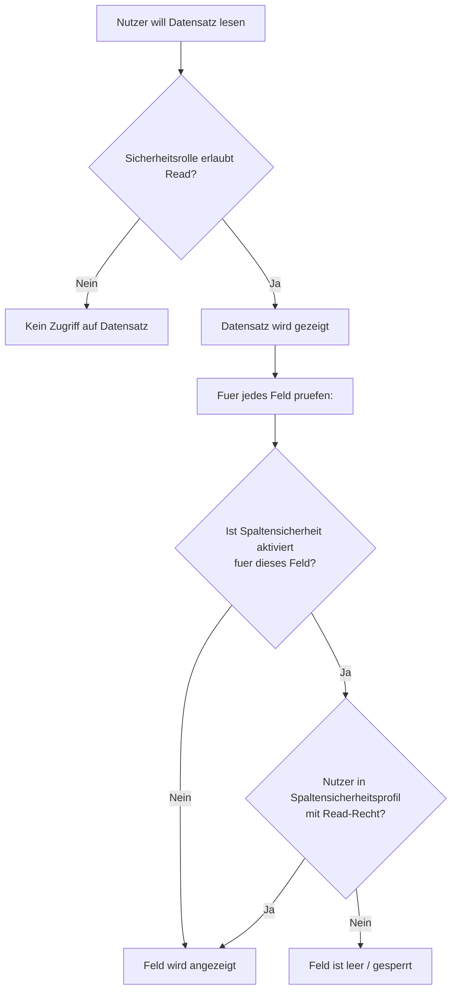

# Lab 6.3 - Spaltensicherheit fuer sensible Daten konfigurieren

🎯 Einstiegsfragen — vor der Erklärung stellen

1. Was ist Column-Level Security und wann braucht man sie?
2. Wie konfiguriert man Column-Level Security in Dataverse?
3. Was ist ein haeufiger Fehler bei der Implementierung von Column-Level Security?

💡 Musterlösung

**1.** Schraenkt Zugriff auf einzelne Felder ein — unabhaengig davon, ob der Nutzer den Datensatz lesen darf. Einsatz: Gehaltsfelder, Einkaufspreise, Sozialversicherungsnummern (DSGVO-relevant). Der Nutzer sieht den Datensatz, aber gesperrte Felder zeigen leer.

**2.** 1. Feld als 'Spaltensicherheit aktivieren' markieren. 2. Column Security Profile erstellen. 3. Nutzer oder Teams dem Profil zuweisen. 4. Lese-/Schreib-/Erstell-Berechtigung pro Profil konfigurieren. Ohne Profil-Zuweisung: Feld fuer alle gesperrt.

**3.** Das Feld wird in einem Flow gelesen der unter einem Service Account laeuft — der kein Column Security Profil hat. Ergebnis: Der Flow schreibt leere Werte. Loesung: Service Account einem Column Security Profil zuweisen.

## Was ist Spaltensicherheit (Column-Level Security)?

Spaltensicherheit ist ein Mechanismus in Dataverse, der den Zugriff auf einzelne Felder einer Tabelle einschraenkt - unabhaengig davon, ob der Nutzer den Datensatz lesen darf. Ein Nutzer kann also einen Datensatz sehen, aber bestimmte Felder sind fuer ihn leer oder gesperrt.

**Standardverhalten ohne Spaltensicherheit:** Wer Read-Zugriff auf einen Datensatz hat, sieht alle Felder, fuer die keine Spaltensicherheit konfiguriert ist.

**Mit Spaltensicherheit:** Einzelne Felder koennen nur von Nutzern gelesen oder bearbeitet werden, die einem Sicherheitsprofil fuer dieses Feld zugeordnet sind.

## Wie Spaltensicherheit funktioniert

## Konfigurationsschritte

1. **Spaltensicherheit fuer das Feld aktivieren:** In den Feldeigenschaften der Tabelle "Feldsicherheit aktivieren" einschalten. Ab diesem Moment sehen Nutzer ohne Profil das Feld nicht mehr.

2. **Spaltensicherheitsprofil erstellen:** Ein Profil buendelt die Berechtigungen fuer ein oder mehrere Felder. Pro Feld: Lesen, Erstellen, Aktualisieren (jeweils Ja/Nein).

3. **Nutzer oder Teams dem Profil hinzufuegen:** Nur Nutzer oder Teams, die einem Profil zugeordnet sind, koennen das Feld sehen/bearbeiten.

## Typische Einsatzfelder

| Feldtyp                | Beispiel                         | Warum Spaltensicherheit             |
| ---------------------- | -------------------------------- | ----------------------------------- |
| Finanzielle Daten      | Gehalt, Marge, Einkaufspreis     | Nur Berechtigte sollen Zahlen sehen |
| Persoenliche Daten     | Geburtsdatum, Sozialversicherung | DSGVO-Minimalprinzip                |
| Geschaeftsgeheimnisse  | Rabattstaffel, Sonderkonditionen | Wettbewerbsschutz                   |
| Interne Bewertungen    | Kreditrisiko, Bonitaetsscore     | Nur interne Entscheider             |
| Passwort-/Token-Felder | API-Keys, Zugangsdaten           | Technische Notwendigkeit            |

## Einschraenkungen und Fallstricke

- **Performance** — Spaltensicherheit wirkt sich auf die Abfrageperformance aus. Wenn viele Felder gesichert sind, erhoehen sich die Pruefvorgaenge je Datensatz. Bei grossen Datensaetzen und vielen gesicherten Spalten kann das spaerbar sein.
- **Export/API** — Spaltensicherheit gilt auch fuer API-Aufrufe und Excel-Exporte. Wer per API das Feld nicht lesen darf, erhaelt es auch per Web API nicht. Das ist ein Vorteil gegenr manuellen Prueflungen im Frontend.
- **Backup/Migration** — Wenn gesicherte Felder in einer Loesung enthalten sind, muessen Spaltensicherheitsprofile ebenfalls in die Loesung eingepflegt werden. Ein haeufiger Fehler bei Deployments: Die Loesung kommt an, aber das Profil ist nicht enthalten.
- **Readonly-Felder per Spaltensicherheit** — Oft wird Spaltensicherheit verwendet, um Felder sichtbar, aber nicht editierbar zu machen. Das ist ein valider Anwendungsfall (Lesen = Ja, Aktualisieren = Nein).

## Abgrenzung zu Feldsichtbarkeit in Formularen

Formular-Feldausblendung und Spaltensicherheit sind verschiedene Dinge:

| Mechanismus                 | Gilt fuer                                | Umgehbar durch                       |
| --------------------------- | ---------------------------------------- | ------------------------------------ |
| Formular: Feld ausgeblendet | Nur das spezifische Formular             | Advanced Find, API, anderes Formular |
| Spaltensicherheit           | Alle Zugangswege (Formular, API, Export) | Nicht umgehbar ohne Profilzuweisung  |

Wenn wirklich sensible Daten gesschuetzt werden sollen, ist Spaltensicherheit die einzige technisch belastbare Option. Formularausblendung ist keine Sicherheitsmassnahme.

## Wo konfigurieren und überwachen?

| Thema | Navigation |
|---|---|
| Spaltensicherheit für eine Spalte aktivieren | [make.powerapps.com](https://make.powerapps.com) → **Dataverse** → **Tables** → [Tabelle] → **Columns** → [Spalte] → **Edit** → **Enable column security** (Checkbox) |
| Column Security Profile erstellen | [admin.powerplatform.microsoft.com](https://admin.powerplatform.microsoft.com) → **Environments** → [Umgebung] → **Settings** → **Users + permissions** → **Column security profiles** → + **New profile** |
| Berechtigungen im Profil konfigurieren (Read/Create/Update) | PPAC → ... → **Column security profiles** → [Profil] → **Column permissions** |
| Profil einem Nutzer zuweisen | PPAC → ... → **Column security profiles** → [Profil] → **Users** → + **Add users** |
| Profil einem Team zuweisen | PPAC → ... → **Column security profiles** → [Profil] → **Teams** → + **Add teams** |
| Deployment-Check: Profil in Zielumgebung vorhanden? | PPAC (Zielumgebung) → ... → **Column security profiles** → Profil + Zuweisungen prüfen |
