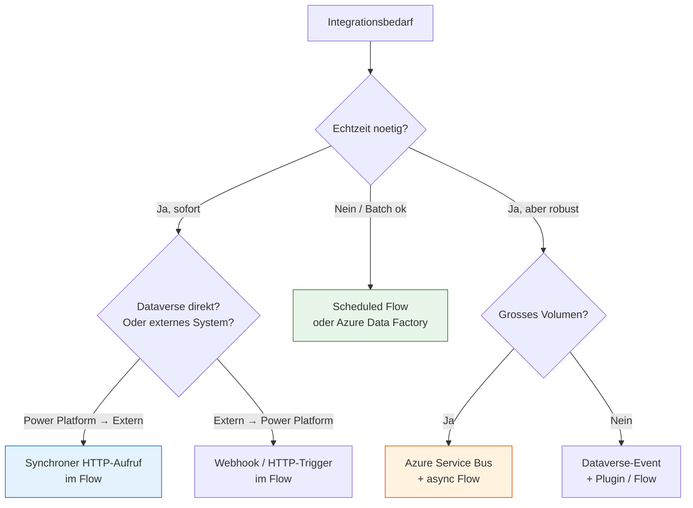

# Lab 7.1 - Integrationsmuster systematisch auswaehlen

🎯 Einstiegsfragen — vor der Erklärung stellen

1. Nennen Sie drei grundlegende Integrationsmuster und wann Sie welches waehlen.
2. Was ist der Unterschied zwischen Standard-Connector und Custom Connector?
3. Wann ist Power Automate die falsche Wahl fuer eine Integration?

💡 Musterlösung

**1.** Request/Response (synchron): Wenn die Antwort sofort benoetigt wird. Event-Driven (asynchron): Wenn das Quellsystem eine Aenderung meldet ohne den Aufrufer zu blockieren. Batch: Wenn grosse Datenmengen in definierten Zeitfenstern uebertragen werden (Nacht-Import aus ERP).

**2.** Standard-Connector: Von Microsoft vorgefertigt — keine Entwicklung noetig. Custom Connector: Sie definieren die API-Endpunkte selbst anhand OpenAPI/Swagger — volle Kontrolle, Entwicklungsaufwand. Custom Connector ist in Solutions transportierbar.

**3.** Wenn Echtzeit-Latenz unter 1 Sekunde gefordert ist | wenn komplexe Fehlerbehandlung noetig ist | wenn Millionen von Datensaetzen taeglich verarbeitet werden muessen. Alternative: Azure Logic Apps, Azure Functions, direkte API-Anbindung.

## Warum Integrationsmuster eine Architekturentscheidung sind

Integrationen sind der haeufigste Quelle von Architekturproblemen in Power Platform Projekten. Nicht weil Integrationen schwierig zu bauen sind, sondern weil sie unter Zeitdruck mit dem erstbesten Ansatz umgesetzt werden, der dann skaliert, Performance-Probleme erzeugt oder bei Systemausfaellen das gesamte System blockiert.

Der SA waehlt das Integrationsmuster, bevor der Entwickler anfaengt zu bauen.

## Die drei Grunddimensionen einer Integration

Jede Integration laesst sich entlang drei Achsen einordnen:

**1. Richtung**

- **Inbound:** Externes System schreibt Daten in Power Platform (z.B. SAP sendet Bestellungen nach Dataverse)
- **Outbound:** Power Platform schreibt Daten in externes System (z.B. Flow sendet Bestellung an SAP)
- **Bidirektional:** Beide Richtungen, oft mit Konfliktrisiko

**2. Zeitlichkeit**

- **Synchron:** Aufrufer wartet auf Antwort. Geeignet fuer kleine Mengen, zeitkritische Operationen.
- **Asynchron:** Aufrufer sendet und wartet nicht. Geeignet fuer grosse Mengen, robustere Systeme.

**3. Ausloeser**

- **Event-getrieben:** Ein Ereignis loest die Integration aus (Datensatz geaendert, Formular gespeichert)
- **Batch:** Regelmaessiger Zeitplan (jeden Tag um 02:00 Uhr alle neuen Datensaetze)
- **Request-Response:** Auf Anforderung (Nutzer klickt "Daten laden")

## Integrationsmuster im Ueberblick

## Synchrones vs. Asynchrones Muster: Wann was?

| Kriterium                            | Synchron      | Asynchron              |
| ------------------------------------ | ------------- | ---------------------- |
| Antwort sofort noetig                | Ja            | Nein                   |
| Fehler sofort sichtbar               | Ja            | Nein (Fehler in Queue) |
| Externes System koennte langsam sein | Problematisch | Kein Problem           |
| Hohes Volumen (1000+ gleichzeitig)   | Problematisch | Geeignet               |
| Einfache Implementierung             | Einfacher     | Komplexer              |
| Robustheit bei Ausfall               | Gering        | Hoch (Retry in Queue)  |

**Faustregel:** Wenn das Ergebnis der Integration sofort im UI sichtbar sein muss → synchron. Wenn es "irgendwann" in den naechsten Minuten oder Stunden passiert sein darf → asynchron.

## Power Platform-spezifische Integrationswege

| Weg                         | Richtung        | Einsatz                                           |
| --------------------------- | --------------- | ------------------------------------------------- |
| Standard-Connector (1000+)  | Beide           | Erste Wahl fuer bekannte Systeme                  |
| Custom Connector            | Beide           | REST-APIs ohne Standard-Connector                 |
| Dataverse Web API           | Beide           | Direkte Dataverse-Operationen                     |
| Virtual Table               | Inbound (Lesen) | Externe Daten als native Dataverse-Tabelle        |
| Plugin                      | Event-getrieben | Serverseitige Logik bei Dataverse-Events          |
| Azure Service Bus Connector | Asynchron       | Hochvolumen, Entkopplung                          |
| Azure Logic Apps            | Beide           | Enterprise-Integration, komplexe Transformationen |

## Die Entscheidung dokumentieren

Fuer jede Integration sollte der SA in einem kurzen ADR (Architecture Decision Record) festhalten:

- Welches Muster wurde gewaehlt?
- Welche Alternativen wurden bewertet?
- Warum wurde diese Entscheidung getroffen?

Das erspart spaetere Diskussionen und hilft neuen Teammitgliedern, das System zu verstehen.

## Wo konfigurieren und überwachen?

| Thema | Navigation |
|---|---|
| Standard-Connectors suchen | [make.powerautomate.com](https://make.powerautomate.com) → **Connectors** |
| Custom Connector erstellen | make.powerautomate.com → **Data** → **Custom connectors** → + **New custom connector** |
| Automated Cloud Flow (Event-getrieben) erstellen | make.powerautomate.com → **+ New flow** → **Automated cloud flow** |
| Scheduled Cloud Flow (Timer) erstellen | make.powerautomate.com → **+ New flow** → **Scheduled cloud flow** |
| HTTP-Trigger für eingehende Integrationen | Neuer Flow → Trigger: **When a HTTP request is received** |
| Flow-Ausführungshistorie und Fehler | make.powerautomate.com → **My flows** → [Flow] → **Run history** |
