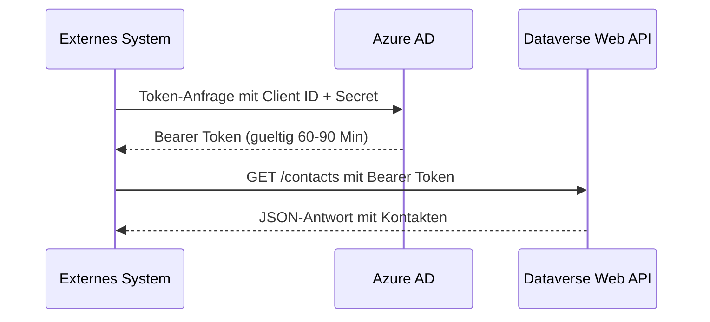

# Lab 7.2 - Die Dataverse Web API im Architekturkontext einordnen

<details>
<summary>🎯 Einstiegsfragen — vor der Erklärung stellen</summary>


1. Was ist die Dataverse Web API und wie ist sie standardisiert?
2. Wie authentifiziert sich eine externe Anwendung gegen die Dataverse Web API?
3. Was ist ein OData $batch-Request und wann nutzen Sie ihn?

<details>
<summary>💡 Musterlösung</summary>

**1.** Eine RESTful-Schnittstelle basierend auf OData v4. Jede Tabelle ist als OData-Entityset erreichbar. Authentifizierung: OAuth 2.0 mit Entra ID. Unterstuetzt: CRUD, Batch-Anfragen, $filter, $select, $expand.

**2.** 1. App Registration in Entra ID. 2. Client ID + Client Secret ausstellen. 3. Application User in Dataverse anlegen und Sicherheitsrolle zuweisen. 4. OAuth 2.0 Client Credentials Flow: Token von Entra ID holen, im Authorization-Header jedes API-Calls nutzen.

**3.** Ein $batch-Request fasst mehrere OData-Operationen in einer HTTP-Anfrage zusammen. Statt 100 einzelne CREATE-Aufrufe: eine $batch-Anfrage. Reduziert HTTP-Overhead und hilft beim Service Protection Limit (1 Batch-Anfrage = 1 API-Call aus SPL-Sicht).

</details>

</details>


## Was ist die Dataverse Web API?

Die Dataverse Web API ist eine RESTful-Schnittstelle basierend auf dem OData v4 Standard. Sie ermoeglicht externen Systemen, Anwendungen und Diensten den Zugriff auf Dataverse-Daten - lesend und schreibend - ohne Power Platform-Lizenzen nutzen zu muessen.

Jede Dataverse-Umgebung stellt die Web API automatisch bereit. Die Basis-URL ist:

```
https://<umgebungsname>.api.crm<region>.dynamics.com/api/data/v9.2/
```

## Authentifizierung: Azure AD ist Pflicht

Die Dataverse Web API akzeptiert ausschliesslich Azure AD Bearer Tokens. Es gibt keine Basic Authentication oder API-Keys. Das hat Konsequenzen fuer die Architektur:



**App-Registrierung in Azure AD:** Jedes externe System, das auf Dataverse zugreifen soll, benoetigt eine App-Registrierung in Azure AD mit entsprechenden Berechtigungen. Der SA ist fuer das Design dieser Registrierungen verantwortlich.

**Application User in Dataverse:** Fuer Dienst-zu-Dienst-Kommunikation (S2S) ohne menschliche Anmeldung wird ein "Application User" in Dataverse angelegt, der die App-Registrierung repraesentiert und Sicherheitsrollen erhaelt.

## OData-Abfragen: Was man als SA wissen muss

Die Web API unterstuetzt OData-Abfrageparameter, die bestimmen, wie viele und welche Daten zurueckgegeben werden.

| Parameter | Zweck                             | Beispiel                   |
| --------- | --------------------------------- | -------------------------- |
| $select   | Nur bestimmte Felder zurueckgeben | $select=name,emailaddress1 |
| $filter   | Datensaetze filtern               | $filter=statecode eq 0     |
| $top      | Anzahl begrenzen                  | $top=100                   |
| $orderby  | Sortieren                         | $orderby=createdon desc    |
| $expand   | Verknuepfte Datensaetze laden     | $expand=primarycontactid   |

**Architektonisch wichtig:** Ohne $select werden alle Felder zurueckgegeben. Bei Tabellen mit vielen Spalten oder Spaltensicherheit ist das ineffizient und kann Performance-Probleme verursachen. Immer $select verwenden.

## Batch-Requests

Fuer grosse Mengen von Operationen unterstuetzt die Web API Batch-Requests: Mehrere Abfragen oder Schreiboperationen werden in einen einzigen HTTP-Request gebuendelt. Das reduziert den Overhead und umgeht teilweise die Service-Protection-Limits.

```
POST https://<env>/api/data/v9.2/$batch
Content-Type: multipart/mixed; boundary=batch_AAA

--batch_AAA
Content-Type: application/http

GET /api/data/v9.2/contacts?$select=fullname
--batch_AAA
Content-Type: application/http

POST /api/data/v9.2/accounts
{ "name": "Neuer Kunde" }
--batch_AAA--
```

## Typische Architekturentscheidungen rund um die Web API

**Wer darf die Web API aufrufen?**
Jeder Azure AD authentifizierte App-User mit entsprechender Dataverse-Sicherheitsrolle. Der SA definiert, welche externen Systeme App-Registrierungen bekommen und welche Rechte sie erhalten.

**Minimalprinzip fuer App-User:**
Ein App-User fuer SAP-Integration sollte nicht dieselben Rechte haben wie ein Admin. Nur die Tabellen und Operationen, die die Integration tatsaechlich braucht.

**Rate Limits und Service Protection:**
Die Web API hat eingebaute Rate Limits (Service Protection Limits). Bei zu vielen Anfragen in kurzer Zeit gibt die API 429-Responses zurueck. Das muss in der Integrationsstrategie beruecksichtigt werden (dazu Lab 7.5).

**Versionierung:**
Die API-Version (v9.2) ist explizit im Pfad. Microsoft aendert APIs selten breaking, aber neue Features kommen in neueren Versionen. Versionsnummer in der Architektur festhalten.

## Wo konfigurieren und überwachen?

| Thema | Navigation |
|---|---|
| App-Registrierung erstellen (Azure/Entra ID) | [portal.azure.com](https://portal.azure.com) → **Microsoft Entra ID** → **App registrations** → + **New registration** |
| API-Berechtigung „Dynamics CRM user_impersonation" | portal.azure.com → [App-Registrierung] → **API permissions** → + **Add a permission** → **Dynamics CRM** |
| Application User in Dataverse anlegen | [admin.powerplatform.microsoft.com](https://admin.powerplatform.microsoft.com) → **Environments** → [Umgebung] → **Settings** → **Users + permissions** → **Application users** → + **New app user** |
| Dataverse Web API testen | `https://[orgname].crm.dynamics.com/api/data/v9.2/` (Postman, Browser, curl) |
| OData-Metadaten einsehen | `https://[orgname].crm.dynamics.com/api/data/v9.2/$metadata` |
| API-Aufrufstatistiken überwachen | PPAC → **Analytics** → **Dataverse** → **API calls** |
