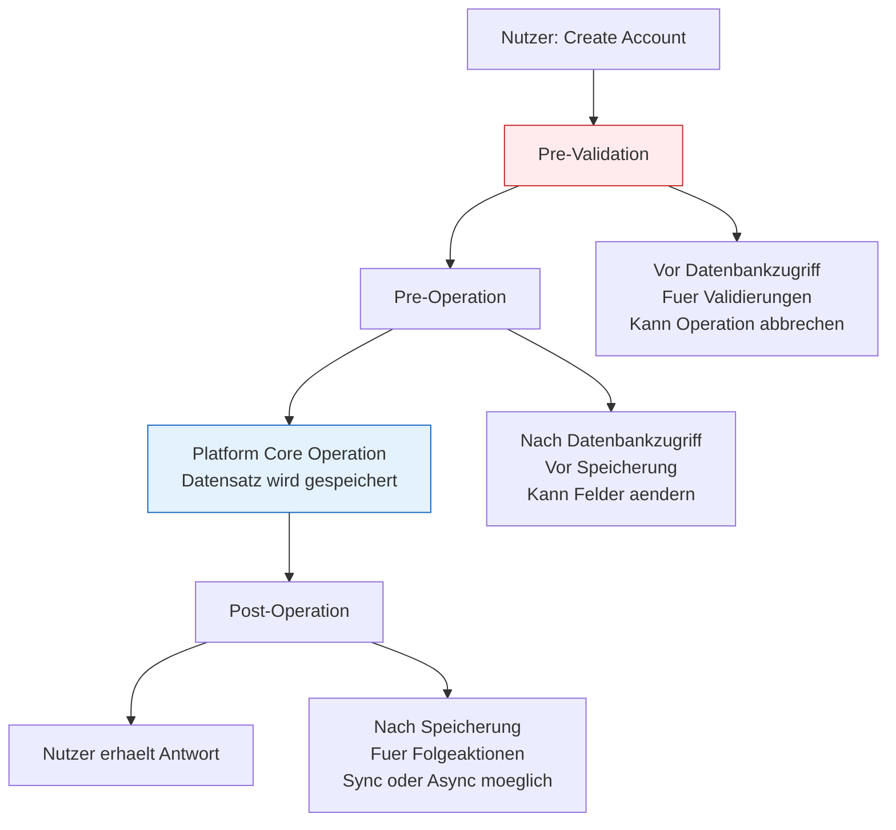
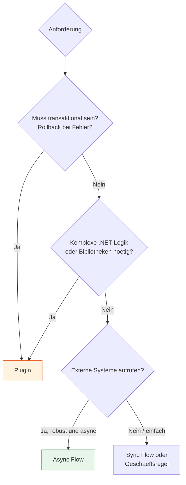

# Lab 7.3 - Plug-In-Pipeline und Ausfuehrungsmodelle verstehen

🎯 Einstiegsfragen — vor der Erklärung stellen

1. Was ist die Dataverse Plugin-Pipeline und in welchen Phasen kann man eingreifen?
2. Was ist der Unterschied zwischen synchronem und asynchronem Plugin?
3. Warum ist ein Plugin, das eine externe HTTP-API aufruft, in einem synchronen Pre-Operation-Step problematisch?

💡 Musterlösung

**1.** Die Plugin-Pipeline ist eine serverseitige Verarbeitungskette bei jedem Dataverse-Vorgang. Phasen: Pre-Validation (vor Datenbankvalidierung, ausserhalb Transaktion) | Pre-Operation (vor dem Schreiben, innerhalb Transaktion) | Post-Operation (nach dem Schreiben, optional asynchron).

**2.** Synchron: Laeuft innerhalb der Transaktion — Fehler rollt zurueck. Nachteil: Blockiert Nutzer bis fertig (max. 2 Min Timeout). Asynchron: Laeuft nach dem Schreiben in separatem Prozess — kein Rollback. Fuer Benachrichtigungen und externe Systemaufrufe.

**3.** Wenn die externe API langsam oder nicht erreichbar ist, blockiert das gesamte Dataverse-Save bis zum Timeout. Bei hohem Transaktionsvolumen warten alle Nutzer. Loesung: HTTP-Calls immer in asynchronen Post-Operation-Steps — oder in Power Automate auslagern.

## Was ist die Plugin-Pipeline?

Wenn ein Nutzer oder eine Anwendung einen Dataverse-Datensatz erstellt, aendert oder loescht, durchlaeuft dieser Vorgang eine interne Verarbeitungspipeline. In diese Pipeline koennen Plugins eingehaengt werden - benutzerdefinierter .NET-Code, der serverseitig auf dem Dataverse-Server ausgefuehrt wird.

Der entscheidende Unterschied zu Power Automate Flows: Ein Plugin laeuft innerhalb der Datenbanktransaktion. Wenn das Plugin einen Fehler wirft, wird die gesamte Operation rueckgaengig gemacht.

## Die Pipeline-Phasen

## Synchron vs. Asynchron bei Plugins

Plugins koennen synchron oder asynchron registriert werden:

| Modus                      | Verhalten                                      | Einsatz                                                |
| -------------------------- | ---------------------------------------------- | ------------------------------------------------------ |
| Synchron (Pre-Validation)  | Laeuft vor der Transaktion, kann abbrechen     | Validierungen, die externe Daten pruefen               |
| Synchron (Pre-Operation)   | Innerhalb der Transaktion, kann Felder aendern | Felder berechnen, Werte umschreiben                    |
| Synchron (Post-Operation)  | Nach der Transaktion, kann Rollback ausloesen  | Folgeaktionen die transaktional sein muessen           |
| Asynchron (Post-Operation) | In einer Queue nach der Transaktion            | Benachrichtigungen, externe Aufrufe, lange Operationen |

**Wichtige Regel:** Synchrone Post-Operation Plugins, die externe API-Aufrufe machen, sind ein Anti-Pattern. Wenn die externe API langsam oder nicht verfuegbar ist, blockiert das den Speichervorgang des Nutzers.

## Plugin vs. Power Automate Flow: Wann was?

| Kriterium                             | Plugin bevorzugen            | Power Automate bevorzugen |
| ------------------------------------- | ---------------------------- | ------------------------- |
| Transaktionssicherheit noetig         | Ja                           | Nein                      |
| Komplexe Berechnungen, Algorithmen    | Ja                           | Nein                      |
| Externe HTTP-Aufrufe                  | Nein (Anti-Pattern synchron) | Ja                        |
| Niedrige Latenz, Performance-kritisch | Ja                           | Nein                      |
| Low-Code-Wartbarkeit                  | Nein                         | Ja                        |
| Fehlerbehandlung und Monitoring       | Schwieriger                  | Einfacher (eingebaut)     |

## Der Execution Context

Plugins erhalten beim Aufruf einen ExecutionContext, der die gesamte Information ueber die ausloesende Operation enthaelt:

- **PrimaryEntityId:** GUID des betroffenen Datensatzes
- **InputParameters:** Die Werte, die gespeichert werden sollen (vor Post-Operation)
- **OutputParameters:** Die Werte nach der Operation
- **PreEntityImages:** Snapshot des Datensatzes vor der Aenderung
- **PostEntityImages:** Snapshot des Datensatzes nach der Aenderung

**SA-relevante Entscheidung:** Images muessen explizit in der Plugin-Registrierung konfiguriert werden. Wenn ein Entwickler PreImages braucht aber vergisst sie zu registrieren, sind sie zur Laufzeit null.

## Sandbox vs. Isolation

Plugins laufen in einem Sandbox-Prozess (Isolation Mode: Sandbox). Das bedeutet:

- Kein direkter Dateisystemzugriff
- Kein direkter Netzwerkzugriff ohne explizite Konfiguration
- Limitierte .NET-Bibliotheken

Fuer komplexe Logik mit externen Bibliotheken oder Netzwerkzugriffen empfehlen sich Azure Functions als Alternative.

## Wo konfigurieren und überwachen?

| Thema | Navigation |
|---|---|
| Plugin Registration Tool starten | Terminal: `pac tool prt` (pac CLI muss installiert sein) |
| Plugin-Assembly registrieren | Plugin Registration Tool → **Register** → **Register New Plugin** |
| Plugin-Schritt konfigurieren (Stage, Message, Entity) | Plugin Registration Tool → [Assembly] → **Register New Step** |
| Plugin in Solution einbinden | [make.powerapps.com](https://make.powerapps.com) → **Solutions** → [Lösung] → **+ Add existing** → **More** → **Developer** → **Plug-in assembly** |
| Plugin-Trace-Logs aktivieren | PPAC → **Environments** → [Umgebung] → **Settings** → **Business** → **Plug-in and custom workflow activity tracing** |
| Plugin-Trace-Logs einsehen | make.powerapps.com → **Dataverse** → **Tables** → Tabelle: **Plug-in trace log** → Zeilen anzeigen |
