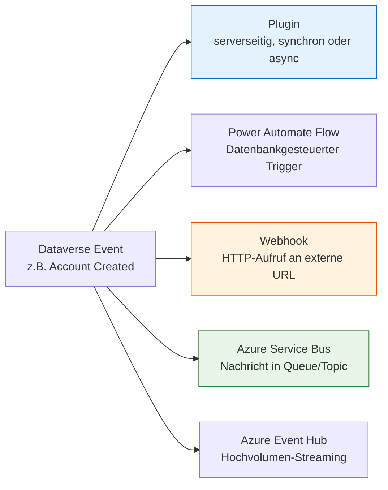
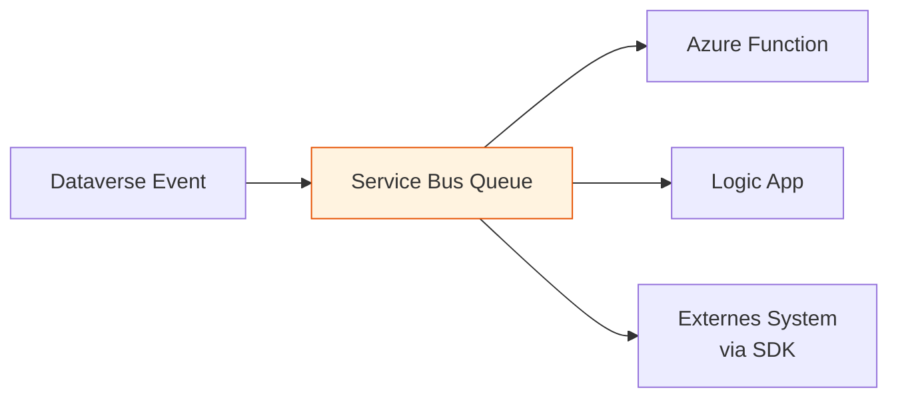

# Lab 7.4 - Event-getriebene Integrationen entwerfen

🎯 Einstiegsfragen — vor der Erklärung stellen

1. Was ist der Unterschied zwischen Polling und Event-getriebener Integration?
2. Was ist Dataverse Event Publishing und wie nutzt man es fuer externe Integrationen?
3. Wann brauchen Sie Azure Service Bus als Middleware — wann reicht ein direkter Webhook?

💡 Musterlösung

**1.** Polling: Zielsystem fragt regelmaessig ab ('Hat sich etwas geaendert?') — einfach, aber ineffizient. Event-getrieben: Quellsystem meldet aktiv wenn etwas passiert — effizienter, geringere Latenz, aber Quellsystem muss Events senden koennen.

**2.** Dataverse kann bei Datensatzaenderungen Nachrichten an Azure Service Bus oder einen Webhook senden. Konfiguration: Service Endpoint Registration → Nachrichten-Typ (Create/Update/Delete) → Ziel. Das externe System abonniert den Service Bus und reagiert auf Nachrichten.

**3.** Direkter Webhook: Wenn Zielsystem immer verfuegbar und schnell antwortet. Service Bus: Wenn Zielsystem manchmal offline ist (Nachrichten gepuffert) | mehrere Systeme auf dasselbe Event reagieren sollen | Retry-Logik und Dead Letter Queue benoetigt werden.

## Was ist Event-getriebene Integration?

Bei event-getriebener Integration reagiert das System auf Ereignisse (Events), anstatt in regelmaessigen Abstaenden nach Aenderungen zu suchen (Polling). Das Quellsystem meldet aktiv, wenn etwas passiert. Das Zielsystem verarbeitet die Nachricht, wenn sie ankommt.

Vorteile:

- Geringere Latenz (kein Warten auf naechsten Poll-Zeitpunkt)
- Weniger Last auf dem Quellsystem (keine staendigen Abfragen)
- Lose Kopplung (Sender und Empfaenger koennen unabhaengig skalieren)

## Dataverse als Event-Quelle

Dataverse kann Events ueber mehrere Mechanismen nach aussen melden:

## Webhooks: Dataverse ruft externe Systeme an

Ein Webhook ist eine HTTP-Endpunkt-Registrierung in Dataverse. Wenn ein bestimmtes Ereignis eintritt (z.B. Account wird erstellt), sendet Dataverse einen HTTP-POST an die konfigurierte URL.

**Konfiguration:**

- Registrierung ueber Plugin Registration Tool oder Code
- URL muss HTTPS sein
- Dataverse sendet ein JSON-Payload mit dem Execution Context
- Authentifizierung per Webhook-Key (HTTP-Header) oder Azure AD

- **Timeout** — Dataverse erwartet innerhalb von 60 Sekunden eine HTTP 200/201/202-Antwort. Bei Ueberschreitung wird die Anfrage als fehlgeschlagen markiert.
- **Retries** — Bei Fehler wird Dataverse bis zu 12 Mal erneut versuchen (exponential backoff).
- **Wann Webhooks** — Wenn ein externes System direkt benachrichtigt werden soll und es einen zuverlaessigen HTTPS-Endpunkt anbietet.

## Azure Service Bus: Entkoppelte, zuverlaessige Weiterleitung

Azure Service Bus ist ein Message Broker. Dataverse kann Events als Nachrichten in eine Service Bus Queue oder ein Topic schreiben. Externe Systeme (Azure Functions, Logic Apps, etc.) lesen die Nachrichten.

**Vorteile gegenueber direktem Webhook:**

- Nachrichten werden gepuffert, wenn der Empfaenger nicht verfuegbar ist
- Mehrere Empfaenger (Topics mit Subscriptions)
- Transaktionale Verarbeitung: Nachricht bleibt in der Queue bis sie erfolgreich verarbeitet wurde
- Dead Letter Queue fuer nicht verarbeitbare Nachrichten

**Konfiguration:** Service Bus Namespace + Queue/Topic wird in den Dataverse-Einstellungen als Service Endpoint registriert. Dann wird ein Plugin oder Flow-Step mit diesem Endpoint verknuepft.

## Dataverse als Event-Empfaenger

Power Automate Flows mit Dataverse-Trigger (When a row is added/modified/deleted) sind de facto event-getrieben - Dataverse pusht Events intern an die Flow-Engine. Das ist fuer viele Anwendungsfaelle ausreichend und ohne externe Infrastruktur.

**Einschraenkung:** Power Automate Flows sind nicht fuer Hochvolumen ausgelegt. Bei Tausenden von Events gleichzeitig koennen Concurrency-Limits greifen.

## Architektonisches Entscheidungsframework

| Szenario                                                                                | Empfehlung          |
| --------------------------------------------------------------------------------------- | ------------------- |
| Externes System soll bei Dataverse-Event benachrichtigt werden, Volumen niedrig         | Webhook             |
| Externes System soll benachrichtigt werden, Volumen hoch oder Zuverlaessigkeit kritisch | Azure Service Bus   |
| Interne Folgelogik in Power Platform                                                    | Power Automate Flow |
| Hochvolumen-Streaming (Logs, Telemetrie)                                                | Azure Event Hub     |
| Transaktionale Folgelogik, muss im selben Commit sein                                   | Plugin              |

## Wo konfigurieren und überwachen?

| Thema | Navigation |
|---|---|
| Webhook registrieren (Dataverse → externes System) | Plugin Registration Tool (`pac tool prt`) → **Register** → **Register New Web Hook** |
| Service Endpoint registrieren (Dataverse → Azure Service Bus) | Plugin Registration Tool → **Register** → **Register New Service Endpoint** |
| Azure Service Bus Namespace erstellen | [portal.azure.com](https://portal.azure.com) → **Service Bus** → + **Create** |
| Shared Access Policy für Service Bus | portal.azure.com → [Service Bus Namespace] → **Shared access policies** |
| Power Automate Flow mit Dataverse-Trigger | [make.powerautomate.com](https://make.powerautomate.com) → Trigger: **When a row is added, modified or deleted (Dataverse)** |
| Eingehender HTTP-Webhook-Empfang | make.powerautomate.com → Trigger: **When a HTTP request is received** |
