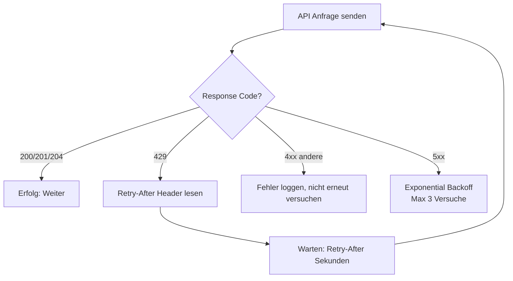

# Lab 7.5 - Service-Protection-Limits und Bulk-Muster beruecksichtigen

🎯 Einstiegsfragen — vor der Erklärung stellen

1. Was sind Service Protection Limits in Dataverse und welche drei Grenzen gibt es?
2. Was passiert, wenn ein Power Automate Flow die Service Protection Limits erreicht?
3. Wie entwerfen Sie einen Bulk-Import von 100.000 Datensaetzen so, dass keine Limits ueberschritten werden?

💡 Musterlösung

**1.** Schuetzen die Plattform vor Ueberlastung. Drei Grenzen pro Nutzer: 1. Anzahl API-Anfragen pro 5-Minuten-Fenster (6.000). 2. Maximale Ausfuehrungszeit pro 5-Minuten-Fenster (20 Min). 3. Anzahl gleichzeitiger Anfragen (52 parallel). Bei Ueberschreitung: HTTP 429.

**2.** Der Flow bekommt HTTP 429 zurueck. Power Automate hat eingebautes Auto-Retry mit Exponential Backoff. Problem: Wenn das Limit strukturell ueberschritten wird (z.B. Loop mit 10.000 Iterationen), hilft Retry nicht — das Design muss geaendert werden.

**3.** Batch-API ($batch) statt Einzel-Aufrufe. Pausen zwischen Batches einbauen (Concurrency-Steuerung). Dataverse Bulk Import Job nutzen wenn moeglich. Alternativ: Azure Data Factory mit Dataverse-Connector — fuer echte Bulk-Szenarien gebaut.

## Was sind Service Protection Limits?

Service Protection Limits (SPL) sind eingebaute Schutzmechanismen in Dataverse, die verhindern, dass einzelne Anwendungen oder Integrationen die Plattform fuer alle anderen Nutzer unbrauchbar machen. Sie begrenzen die Anzahl der API-Anfragen pro Nutzer und Zeitfenster.

Die Limits gelten pro **Nutzer/Application User** und **Umgebung** und werden serverseitig erzwungen.

## Die drei Limit-Dimensionen

| Dimension              | Limit (Standard)  | Messzeitraum                 |
| ---------------------- | ----------------- | ---------------------------- |
| Anzahl Anfragen        | 6.000             | 5 Minuten gleitendes Fenster |
| Ausfuehrungszeit       | 20 Minuten gesamt | 5 Minuten gleitendes Fenster |
| Gleichzeitige Anfragen | 52                | Zu jedem Zeitpunkt           |

Wenn ein Limit ueberschritten wird, antwortet die API mit **HTTP 429 Too Many Requests** und einem `Retry-After`-Header, der angibt, wie lange gewartet werden soll.

**Wichtig fuer den SA:** Diese Limits gelten pro Nutzer/App-User. Eine Integration, die unter einem einzigen Application User laeuft und 10.000 Anfragen/Minute sendet, wird gedrosselt. Die Loesung ist nicht, das Limit zu ignorieren, sondern das Muster zu aendern.

## Bulk-Operationen: ExecuteMultiple

Statt 1.000 separate Create-Anfragen zu senden, koennen mehrere Operationen in einer einzigen Anfrage gebuendelt werden: `ExecuteMultiple`.

**Vorteile:**

- Deutlich weniger API-Anfragen (1 statt 1.000)
- Geringerer Overhead durch reduzierte HTTP-Verbindungen
- Bessere Verarbeitung durch Dataverse (batched transactions moeglich)

**Einschraenkungen:**

- Pro ExecuteMultiple-Request: max. 1.000 Operationen
- Bei Fehlern in einer Operation koennen alle weiteren abgebrochen werden (ContinueOnError-Flag steuert das)
- Nicht fuer Echtzeit-Anforderungen geeignet

## Elastic Tables: Fuer Hochvolumen-Szenarien

Fuer Szenarien mit sehr grossen Datenmengen (Millionen von Datensaetzen, IoT-Daten, Logs) bietet Dataverse seit 2023 Elastic Tables an - Tabellen, die auf Azure Cosmos DB basieren und nicht denselben Limits wie Standard-Dataverse-Tabellen unterliegen.

| Merkmal                   | Standard Table                 | Elastic Table          |
| ------------------------- | ------------------------------ | ---------------------- |
| Datenbanktyp              | Relationale DB (Azure SQL)     | NoSQL (Cosmos DB)      |
| Geeignet fuer             | Transaktionale Geschaeftsdaten | Hochvolumen, Logs, IoT |
| Beziehungen               | Vollstaendig                   | Eingeschraenkt         |
| Service Protection Limits | Standard                       | Hoeher                 |
| Kosten                    | Standard-Speicher              | Cosmos-basiert, hoeher |

## Retry-Logik: Pflicht fuer jede Integration

Jede Integration, die die Dataverse Web API aufruft, muss mit 429-Antworten umgehen koennen. Ohne Retry-Logik schlaegt die Integration bei Spitzenlasten fehl.

**Retry-After beachten:** Der `Retry-After`-Header gibt die genaue Wartezeit an. Wer kuerzer wartet, loest direkt die naechste 429 aus.

## Architektonische Massnahmen gegen SPL-Probleme

1. **Mehrere Application Users:** Statt einer zentralen Integration einen Application User, mehrere nutzen. Das Limit gilt pro User.
2. **Batch statt Einzeloperationen:** ExecuteMultiple, Bulk Delete, Bulk Import statt Loops.
3. **Asynchrone Verarbeitung:** Spitzenlasten per Queue puffern, dann gleichmaessig verarbeiten.
4. **Vermeidung von Leseschleifen:** Statt N Datensaetze einzeln lesen - eine OData-Abfrage mit $expand.
5. **Caching:** Referenzdaten (Produkte, Kategorien) nicht bei jeder Operation neu laden.

## Wo konfigurieren und überwachen?

| Thema | Navigation |
|---|---|
| API-Aufrufstatistiken überwachen (429-Fehlerrate) | [admin.powerplatform.microsoft.com](https://admin.powerplatform.microsoft.com) → **Analytics** → **Dataverse** → **API calls** |
| Flow-Fehler durch HTTP 429 einsehen | [make.powerautomate.com](https://make.powerautomate.com) → **My flows** → [Flow] → **Run history** → [fehlgeschlagenen Run öffnen] |
| Mehrere Application Users für hohe Last anlegen | PPAC → **Environments** → [Umgebung] → **Settings** → **Users + permissions** → **Application users** → + **New app user** |
| Elastic Table erstellen (Hochvolumen-Szenarien) | [make.powerapps.com](https://make.powerapps.com) → **Dataverse** → **Tables** → + **New table** → **Advanced options** → Type: **Elastic** |
| API-Limits-Dokumentation | [learn.microsoft.com/power-apps/developer/data-platform/api-limits](https://learn.microsoft.com/power-apps/developer/data-platform/api-limits) |
