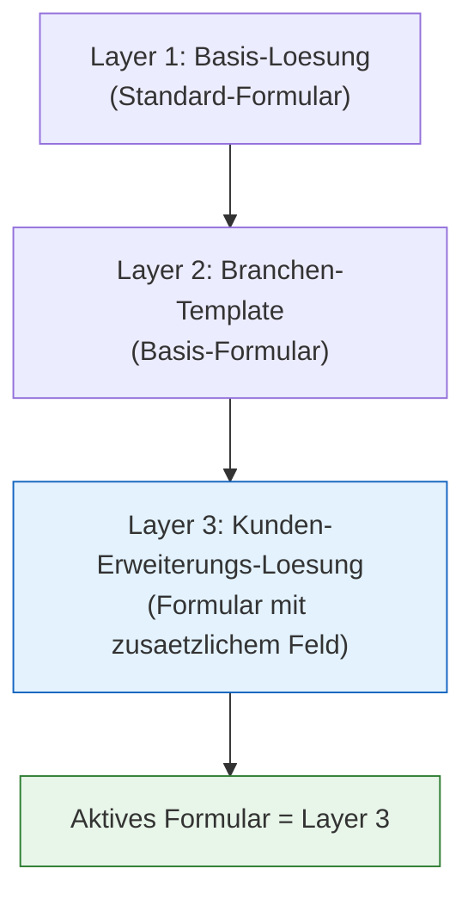

# Lab 8.1 - Loesungen und Solution Layering sicher beherrschen

<details>
<summary>🎯 Einstiegsfragen — vor der Erklärung stellen</summary>


1. Was ist eine Power Platform Solution und warum ist alles ausserhalb von Solutions fuer ALM wertlos?
2. Was ist der Unterschied zwischen Managed und Unmanaged Solution?
3. Was ist Solution Layering und welches Problem loest es?

<details>
<summary>💡 Musterlösung</summary>

**1.** Eine Solution ist ein Container fuer alle transportierbaren Komponenten (Tabellen, Flows, Apps, Rollen). Nur was in einer Solution ist, kann kontrolliert von Dev nach Test nach Prod deployed werden. Alles in der Default Solution: nicht transportierbar, kein Versionsstand, kein Rollback.

**2.** Unmanaged: Komponenten koennen direkt bearbeitet werden — fuer Entwicklungsumgebungen. Managed: Komponenten sind schreibgeschuetzt — fuer Test und Produktion. Managed Solution kann deinstalliert werden (Rollback).

**3.** Solution Layering schichtet mehrere Solutions uebereinander. Base Solution enthaelt Datenmodell, Feature Solution enthaelt Flows und Apps. Aenderungen an oberen Schichten ueberschreiben gezielt Teile der unteren Schicht. Hotfixes koennen in separater Solution deployed werden.

</details>

</details>


## Was sind Loesungen (Solutions) in Power Platform?

Loesungen sind Container, die Anpassungen und Komponenten buendeln. Alles, was transportiert werden soll (Tabellen, Flows, Apps, Sicherheitsrollen, Umgebungsvariablen etc.), muss in einer Loesung enthalten sein. Ohne Loesung kein kontrolliertes Deployment.

**Managed vs. Unmanaged:**

| Typ       | Einsatz                     | Verhalten                                             |
| --------- | --------------------------- | ----------------------------------------------------- |
| Unmanaged | Entwicklungsumgebung        | Frei editierbar, keine Einschraenkungen               |
| Managed   | Test- und Produktivumgebung | Geschuetzt, Aenderungen nur durch Updates der Loesung |

**Kritische Regel:** Managed Loesungen in der Produktivumgebung direkt bearbeiten ist ein Anti-Pattern. Aenderungen muessen immer in der Dev-Umgebung beginnen und per Deployment transportiert werden.

## Solution Layering: Mehrere Loesungen ueber- und untereinander

In einer Umgebung koennen mehrere Loesungen gleichzeitig installiert sein. Wenn mehrere Loesungen dieselbe Komponente enthalten (z.B. dasselbe Formular), entsteht ein Layer-Stack. Die Loesung mit dem hoechsten Layer gewinnt.



**Publisher und Customization Prefix:** Jede Loesung gehoert einem Publisher. Der Publisher definiert das Customization Prefix (z.B. "cr*" oder "contoso*"). Alle benutzerdefinierten Tabellen und Felder in dieser Loesung bekommen dieses Praefix. Der SA legt das Praefix am Anfang des Projekts fest - es kann spaeter nicht mehr geaendert werden.

## Solution Segmentation: Was gehort in welche Loesung?

Ein haeufiger Fehler: Alles in eine einzige Loesung packen. Das verursacht Probleme bei:

- Paralleler Entwicklung (Konflikte beim Zusammenfuehren)
- Selektivem Deployment (eine Aenderung deployen ohne alles andere mitzunehmen)
- Abhaengigkeiten zwischen Teams

**Empfohlene Strategie: Mehrere funktionale Loesungen**

```
Basis-Loesung          → Tabellen, Spalten, Beziehungen (stabiles Fundament)
Sicherheits-Loesung    → Sicherheitsrollen, BU-Konfiguration
App-Loesung            → Canvas Apps, Model-Driven Apps
Automatisierungs-Loesung → Flows, Plugins
Konfigurations-Loesung  → Umgebungsvariablen, Connection References
```

**Abhaengigkeiten:** Loesungen koennen Abhaengigkeiten zu anderen Loesungen haben. Wenn Loesung B eine Tabelle aus Loesung A nutzt, muss Loesung A zuerst installiert werden. Diese Reihenfolge muss dokumentiert sein.

## Environment Variables: Konfiguration ohne Code-Aenderung

Umgebungsvariablen (Environment Variables) sind benannte Werte, die in Loesungen gespeichert werden koennen und sich zwischen Umgebungen unterscheiden duerfen.

**Typischer Einsatz:**

- Sharepoint-Site-URL (Dev vs. Prod unterschiedlich)
- API-Endpunkt-URLs
- Konfigurationswerte (Schwellenwerte, Timeouts)

**Wichtig:** Environment Variables muessen in der Loesung enthalten sein. Die Werte selbst koennen umgebungsspezifisch sein. Bei der Installation einer Managed Loesung in einer neuen Umgebung werden fehlende Variable-Werte abgefragt.

## Connection References: Verbindungen in Loesungen

Flows in Loesungen duerfen keine "hardcodierten" Verbindungen haben. Stattdessen verwenden sie Connection References - Platzhalter, die in jeder Umgebung mit einer konkreten Verbindung befuellt werden.

Bei der Installation einer Managed Loesung in einer neuen Umgebung muessen Connection References mit bestehenden Verbindungen verknuepft werden. Das ist ein haeufiger Deployment-Stolperstein.

## Wo konfigurieren und überwachen?

| Thema | Navigation |
|---|---|
| Lösungen verwalten | [make.powerapps.com](https://make.powerapps.com) → **Solutions** |
| Neue Lösung erstellen | make.powerapps.com → **Solutions** → + **New solution** |
| Publisher anlegen (mit Prefix) | make.powerapps.com → **Solutions** → **Publishers** → + **New publisher** |
| Komponenten zu einer Lösung hinzufügen | make.powerapps.com → **Solutions** → [Lösung] → **+ Add existing** |
| Environment Variable anlegen | make.powerapps.com → **Solutions** → [Lösung] → **+ Add** → **More** → **Environment variable** |
| Connection Reference anlegen | make.powerapps.com → **Solutions** → [Lösung] → **+ Add** → **More** → **Connection reference** |
| Solution Layers einsehen | make.powerapps.com → **Tables** → [Tabelle] → **...** → **Solution layers** |
| Lösung exportieren (Managed / Unmanaged) | make.powerapps.com → **Solutions** → [Lösung] → **Export solution** |
