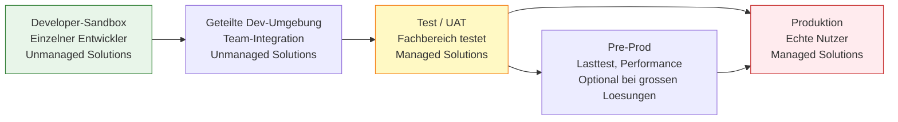

# Lab 8.2 - Umgebungsstrategie fuer professionelle Auslieferung aufbauen

<details>
<summary>🎯 Einstiegsfragen — vor der Erklärung stellen</summary>


1. Warum reicht Dev-Test-Prod fuer professionelle Power Platform Projekte oft nicht aus?
2. Wie gehen Sie mit Konfigurationsdaten beim Deployment um?
3. Was ist Ihre Rollback-Strategie wenn ein Deployment in Produktion einen Fehler einfuehrt?

<details>
<summary>💡 Musterlösung</summary>

**1.** Bei mehreren parallelen Entwicklungsstroaengen braucht man getrennte Dev-Umgebungen oder Feature-Branches. UAT braucht eine eigene Umgebung mit Produktionsdaten und echten Fachbereichstestern — nicht identisch mit der Test-Umgebung des Entwicklungsteams.

**2.** Konfigurationsdaten (Status-Codes, Kategorien) gehoeren nicht in die Solution-ZIP. Separat migrieren: Configuration Migration Tool oder ein Seed-Flow der beim Deployment Stammdaten anlegt. Dokumentation: Welche Konfigurationsdaten muessen in jeder Umgebung vorhanden sein.

**3.** Managed Solutions koennen deinstalliert werden — sauberster Rollback. Voraussetzung: Vorherige Version als Managed Solution archiviert (Azure DevOps Artefakt). Wenn Deinstallation Datenverlust riskiert: vorher Backup. Immer: Deployment-Fenster und Rollback-Plan vor jedem Prod-Deployment definieren.

</details>

</details>


## Warum eine Umgebungsstrategie mehr ist als "Dev-Test-Prod"

Die Grundstruktur mit drei Umgebungen (Dev, Test, Prod) ist bekannt. Eine professionelle Umgebungsstrategie geht jedoch darueber hinaus: Sie definiert wer in welcher Umgebung was tun darf, wie Daten zwischen Umgebungen fliessen, und wie Loesungen kontrolliert transportiert werden.

## Umgebungstypen und ihre Zwecke



## Datenisolation zwischen Umgebungen

**Produktivdaten in Dev oder Test: Verboten**
In der Praxis werden haeufig Produktivdaten in die Test-Umgebung kopiert "damit der Test realistisch ist". Das ist ein DSGVO-Problem: Testnutzer haben Zugriff auf echte Personendaten.

**Alternative:**

- Anonymisierte oder generierte Testdaten verwenden
- Microsoft-Tools wie Power Platform-eigene Datenmaskierung oder externe Tools fuer Datengenerierung
- Referenzdaten (Produktkatalog, Laenderliste) koennen aus Prod kopiert werden, Transaktionsdaten nie

## Wer hat Zugang zu welcher Umgebung?

| Umgebung          | Entwickler          | Fachbereich       | IT-Admin | End-Nutzer |
| ----------------- | ------------------- | ----------------- | -------- | ---------- |
| Developer-Sandbox | Vollzugriff (Maker) | Nein              | Admin    | Nein       |
| Geteilte Dev      | Maker-Rechte        | Nein              | Admin    | Nein       |
| Test / UAT        | Read-only           | Testnutzer-Rechte | Admin    | Nein       |
| Produktion        | Nein                | Nein              | Admin    | Ja         |

**Kritisch:** Entwickler duerfen keine Maker-Rechte in der Produktivumgebung haben. Konfigurationsaenderungen in Prod nur per Deployment - nie direkt.

## Refresh-Strategie: Umgebungen aktuell halten

Test-Umgebungen driften mit der Zeit von Prod ab, wenn sie nicht regelmaessig aufgefrischt werden. Empfohlene Strategie:

- **Test-Umgebung:** Wird vor jedem UAT-Zyklus aus der aktuellen Prod-Loesung neu aufgebaut (Loesungen neu importiert, Konfiguration geprueft)
- **Dev-Umgebungen:** Werden regelmaessig mit dem aktuellen Stand der Prod-Loesungen synchronisiert

## Sandbox-Refresh: Automatisierung mit pac CLI

```bash
# Umgebung aus einer Vorlage-Umgebung kopieren (als Reset)
pac admin backup --environment <Test-Env-URL>
pac admin restore --environment <Test-Env-URL> --selected-backup <Backup-ID>

# Loesung in Umgebung importieren
pac solution import --path solution.zip --environment <Test-Env-URL>
```

## Umgebungsstrategien fuer verschiedene Teamgroessen

**Kleines Team (1-3 Entwickler):**

- 1 geteilte Dev-Umgebung + 1 Test + 1 Prod
- Loesungen manuell deployt mit pac CLI
- Einfach, ausreichend fuer kleine Projekte

**Mittleres Team (4-10 Entwickler):**

- Je Entwickler eine eigene Sandbox + geteilte Dev + Test + Prod
- Automatisierte Deployments per Pipeline
- Git-Integration fuer Source Control

**Grosses Team / Enterprise:**

- Feature-Branch-Umgebungen + Integration + Performance-Test + UAT + Pre-Prod + Prod
- Vollautomatisierte CI/CD-Pipelines
- Governance durch Managed Environments erzwungen

## Wo konfigurieren und überwachen?

| Thema | Navigation |
|---|---|
| Umgebungen anlegen (Dev, Test, Prod) | [admin.powerplatform.microsoft.com](https://admin.powerplatform.microsoft.com) → **Environments** → + **New** |
| Umgebung kopieren (Sandbox-Refresh) | PPAC → **Environments** → [Quell-Umgebung] → **Copy** |
| Managed Environment aktivieren | PPAC → **Environments** → [Umgebung] → **Enable Managed Environment** |
| Security Group für Umgebungszugriff setzen | PPAC → **Environments** → [Umgebung] → **Edit** → **Security group** |
| Lösung manuell exportieren | [make.powerapps.com](https://make.powerapps.com) → **Solutions** → [Lösung] → **Export solution** |
| Lösung manuell importieren | make.powerapps.com → **Solutions** → **Import solution** |
| pac CLI: Umgebung kopieren | `pac admin copy --source-environment [URL] --target-environment [URL]` |
