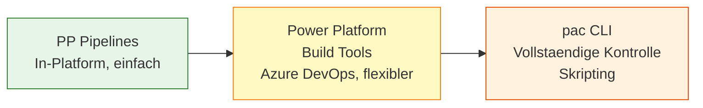

# Lab 8.3 - Power-Platform-Pipelines und Azure DevOps Build Tools einordnen

<details>
<summary>🎯 Einstiegsfragen — vor der Erklärung stellen</summary>


1. Was ist der Unterschied zwischen Power Platform Pipelines (eingebaut) und Azure DevOps Pipelines?
2. Was sind die drei Stages in einer typischen Azure DevOps Pipeline fuer Power Platform?
3. Wie authentifiziert sich eine Azure DevOps Pipeline gegen Power Platform?

<details>
<summary>💡 Musterlösung</summary>

**1.** PP Built-in Pipelines: Einfach, im Admin Center konfiguriert, keine Code-Kenntnisse — fuer einfache DEV>TEST>PROD ohne benutzerdefinierte Logik. Azure DevOps: Vollstaendig skriptbar via YAML, Git-integriert, unterstuetzt Tests und Genehmigungen — fuer professionelle ALM-Setups.

**2.** Stage 1 - Export: Solution aus Dev exportieren (unmanaged), in Git-Quellcode entpacken. Stage 2 - Build: Entpackten Source als Managed Solution verpacken. Stage 3 - Deploy: Managed Solution in Zielumgebung importieren. Zwischen Stages: Artefakte als Pipeline-Artifacts uebergeben.

**3.** Ueber Service Principal (App Registration in Entra ID) + Service Connection in Azure DevOps. Service Principal als Application User in Dataverse-Umgebung registrieren mit Sicherheitsrolle. Pipeline nutzt 'PowerPlatformSPN' als Authentication Type in den Build Tool Tasks.

</details>

</details>


## Das ALM-Werkzeugspektrum

Fuer automatisierte Deployments in Power Platform gibt es drei Hauptwerkzeuge, die sich in Komplexitaet und Kontrolle unterscheiden:



## Power Platform Pipelines: Der einfache Einstieg

Power Platform Pipelines sind eine In-Platform-Loesung (in der Admin-Oberflaeche konfigurierbar), die Deployments zwischen Umgebungen automatisiert - ohne Azure DevOps oder externe CI/CD-Tools.

**Wie es funktioniert:**

1. Eine "Host-Umgebung" wird als Pipeline-Controller konfiguriert
2. Zielumgebungen (Test, Prod) werden als Deployment-Ziele definiert
3. Per Klick oder automatisch werden Loesungen von Umgebung zu Umgebung transportiert
4. Approval-Gates koennen konfiguriert werden (ein Genehmiger muss klicken bevor es weitergeht)

**Vorteile:**

- Keine externe Infrastruktur noetig
- Konfiguration in der Power Platform Admin-Oberflaeche
- Deployment-Historie und Status direkt einsehbar
- Fuer kleine bis mittlere Teams ausreichend

**Einschraenkungen:**

- Begrenzte Anpassbarkeit (keine benutzerdefinierten Skripte)
- Kein automatisches Testing eingebaut
- Keine Branch-Strategien
- Benoetigt Dataverse for Teams oder Power Platform Premium

## Azure DevOps mit Power Platform Build Tools

Fuer komplexere Anforderungen bieten sich Azure DevOps Pipelines mit den Power Platform Build Tools (eine Erweiterung im Azure DevOps Marketplace) an.

**Typische Pipeline-Struktur:**

```yaml
# Vereinfacht - Build Pipeline
stages:
  - stage: Export
    jobs:
      - job: ExportSolution
        steps:
          - task: PowerPlatformExportSolution@2
            inputs:
              Environment: $(DevEnvironmentUrl)
              SolutionName: MyProject_Foundation
              Managed: false

  - stage: Deploy_Test
    jobs:
      - job: DeployToTest
        steps:
          - task: PowerPlatformImportSolution@2
            inputs:
              Environment: $(TestEnvironmentUrl)
              SolutionFile: MyProject_Foundation_managed.zip

  - stage: Deploy_Prod
    condition: and(succeeded(), eq(variables['Build.SourceBranch'], 'refs/heads/main'))
    jobs:
      - job: DeployToProd
        steps:
          - task: PowerPlatformImportSolution@2
            inputs:
              Environment: $(ProdEnvironmentUrl)
              SolutionFile: MyProject_Foundation_managed.zip
```

**Wichtige Tasks:**

- `PowerPlatformExportSolution` - Loesung exportieren
- `PowerPlatformImportSolution` - Loesung importieren
- `PowerPlatformPublishCustomizations` - Anpassungen veroeffentlichen
- `PowerPlatformRunSolutionChecker` - Qualitaetscheck

## pac CLI: Die Kommandozeilen-Grundlage

Die Power Platform CLI (pac) ist das Grundwerkzeug fuer alle ALM-Operationen. Sowohl PP Pipelines als auch Azure DevOps Tasks nutzen pac CLI im Hintergrund.

**Wichtige Befehle:**

```bash
# Authentifizieren
pac auth create --url https://org.crm.dynamics.com --clientId <id> --secret <secret>

# Solution exportieren
pac solution export --name MySolution --path ./output --managed false

# Solution importieren
pac solution import --path ./MySolution_managed.zip

# Solution in Source Control entpacken (human-readable)
pac solution unpack --zipfile MySolution.zip --folder ./src/MySolution

# Solution aus Source Control packen
pac solution pack --zipfile MySolution.zip --folder ./src/MySolution
```

## Solution als Source Code: Unpack/Pack

Ein entscheidender Schritt fuer echtes ALM: Solutions koennen "entpackt" werden in einzelne XML-Dateien, die in Git versioniert werden koennen.

```
MySolution/
├── Entities/
│   ├── contact/
│   │   ├── FormXml/
│   │   └── Views/
│   └── account/
├── Workflows/
├── WebResources/
└── Solution.xml
```

Diese Dateien koennen in Git eingecheckt werden. Entwickler arbeiten in Branches. Merge-Konflikte sind in XML schwieriger zu loesen als in Quellcode - aber moeglich.

## Wann welches Werkzeug?

| Szenario                                        | Empfehlung                           |
| ----------------------------------------------- | ------------------------------------ |
| Kleines Team, 1-3 Entwickler, kein Azure DevOps | PP Pipelines                         |
| Mittleres Team mit Azure DevOps vorhanden       | Azure DevOps + Build Tools           |
| Vollautomatisierung, CI/CD, Tests               | Azure DevOps + Build Tools + pac CLI |
| Skripting, lokale Automatisierung               | pac CLI direkt                       |

## Wo konfigurieren und überwachen?

| Thema | Navigation |
|---|---|
| Power Platform Pipelines einrichten – Schritt 1 (Hosting-Umgebung) | [admin.powerplatform.microsoft.com](https://admin.powerplatform.microsoft.com) → **Environments** → + **New** (als Production-Umgebung) |
| Power Platform Pipelines konfigurieren – Schritt 2 (Konfigurationsapp) | [make.powerapps.com](https://make.powerapps.com) → [Hosting-Umgebung wählen] → **Apps** → **Deployment Pipeline Configuration** |
| Pipeline-Deployment aus der Lösung anstoßen | make.powerapps.com → **Solutions** → [Lösung] → **Deploy** |
| Azure DevOps Build Tools Extension installieren | [marketplace.visualstudio.com](https://marketplace.visualstudio.com) → Suche: „Power Platform Build Tools" |
| Azure DevOps Pipeline erstellen | [dev.azure.com](https://dev.azure.com) → [Organisation] → [Projekt] → **Pipelines** → + **New pipeline** |
| pac CLI installieren | Terminal: `dotnet tool install --global Microsoft.PowerApps.CLI.Tool` |
| pac CLI Authentifizierung | Terminal: `pac auth create --url https://[orgname].crm.dynamics.com` |
| pac CLI Lösung exportieren | Terminal: `pac solution export --path ./solution.zip --name [SolutionName]` |
