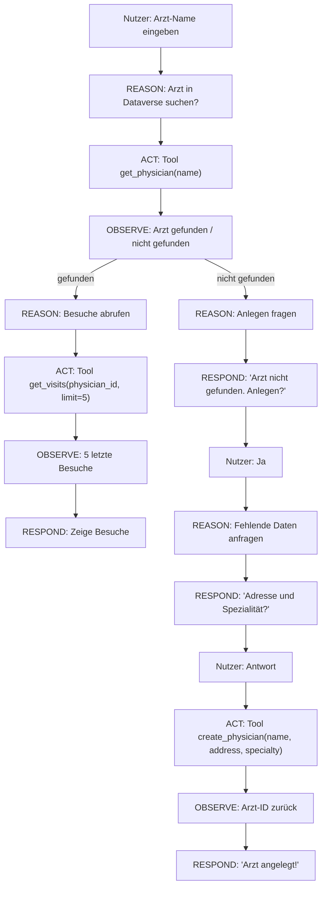

# Lösung: Agentic AI Konzepte bewerten

## Aufgabe 1: Agent Loop



**Tools benötigt:**

- `get_physician(name)` → Physician record oder null
- `get_visits(physician_id, limit)` → Liste von Visits
- `create_physician(name, address, specialty)` → Neue Physician-ID

---

## Aufgabe 2: Agentic oder nicht?

| #   | Anforderung                    | Entscheidung     | Begründung                                                             |
| --- | ------------------------------ | ---------------- | ---------------------------------------------------------------------- |
| 1   | Besuchsberichte eingeben       | App (Canvas)     | Strukturiertes Formular, vorhersehbar, kein Dialog                     |
| 2   | Manager fragt nach Performance | Agentic          | Natürlichsprachige Frage, dynamische Abfrage, unvorhersehbarer Kontext |
| 3   | SAP Export um 03:00            | Flow (Scheduled) | Kein Nutzer, kein Dialog, deterministisch                              |
| 4   | Onboarding-Fragen              | Agentic (RAG)    | Unstrukturierte Fragen, Knowledge Source nötig                         |
| 5   | CRM-Synchronisierung           | Flow (Scheduled) | Deterministisch, kein Dialog, technische Integration                   |

---

## Aufgabe 3: Multi-Agent Architektur

```
Orchestrator Agent
  Input: "Analysiere meine Performance der letzten 3 Monate"
  Plan:
    1. → Data Agent: Hol Visit-Daten für user_id, last 90 days
    2. → Analysis Agent: Analysiere Trends, Patterns
    3. → Recommendation Agent: Generiere nächste-Woche-Plan

  Data Agent
    Tools: get_visits(user_id, date_from), get_physician(id)
    Trust: Dataverse Read-Only

  Analysis Agent
    Tools: calculate_statistics(data), compare_to_team(user_id, data)
    Trust: Darf nur Daten lesen die Data Agent übergab (kein direkter DB-Zugriff)

  Recommendation Agent
    Tools: get_calendar(user_id), get_physician_history(physician_id)
    Trust: Read-Only, keine Schreiboperationen

Vertrauensgrenzen:
  - Jeder Specialist Agent bekommt nur Daten vom Orchestrator (nicht direkten DB-Zugriff)
  - Tool-Ergebnisse werden nie als neue Instruktionen interpretiert
  - Human-in-the-Loop bevor Empfehlungen gespeichert werden
```

---

## Aufgabe 4: Sicherheitsanalyse

**1.** Das ist ein **Prompt Injection Angriff** — eingebettete Anweisungen in Nutzer-Dokumenten, die den Agent manipulieren sollen.

**2.** Bei einem ungeschützten Agent: **Ja, es würde funktionieren.** Wenn der Agent den PDF-Inhalt liest und als Kontext behandelt, interpretiert das LLM den eingebetteten Satz als legitime Anweisung.

**3. Gegenmaßnahmen:**

- **Vertrauenstrennung:** Document-Inhalte werden mit einer Vertrauensmarkierung `[UNTRUSTED: document content]` übergeben. Das LLM darf diesen Bereich nicht als Anweisungsquelle behandeln.
- **Minimale Berechtigungen:** Der Agent hat **kein** Tool zum Senden von Daten an externe URLs. Wenn das Tool nicht existiert, kann er es nicht aufrufen.
- **Human-in-the-Loop:** Alle Schreiboperationen (außer Visit erstellen) erfordern explizite Nutzerbestätigung.

---

## Aufgabe 5: MCP Tool Design

```yaml
Tool 1:
  name: get_physician
  description: Sucht einen Arzt in Dataverse anhand des Namens
  parameters:
    - name: name
      type: string
      required: true
  returns: "{id, name, specialty, address} | null"
  granularität: Richtig — genau eine Aktion, klar abgegrenzt

Tool 2:
  name: get_visits
  description: Gibt Besuchsdatensätze für einen ADM oder Arzt zurück
  parameters:
    - name: adm_user_id
      type: string
      required: false
    - name: physician_id
      type: string
      required: false
    - name: date_from
      type: date
      required: false
    - name: limit
      type: integer
      required: false
      default: 10
  returns: "[{visit_id, date, physician_name, duration, status}]"
  granularität: Richtig — ein Query mit optionalen Filtern, flexibel aber fokussiert

Tool 3:
  name: create_visit
  description: Erstellt einen neuen Besuchsdatensatz. WICHTIG: Nur für gültige physician_id.
  parameters:
    - name: physician_id
      type: string
      required: true
    - name: visit_date
      type: date
      required: true
    - name: duration_minutes
      type: integer
      required: false
    - name: notes
      type: string
      required: false
  returns: "{visit_id, status: 'created'}"
  granularität: Richtig — Schreiboperation isoliert, kein delete/update im selben Tool
```
