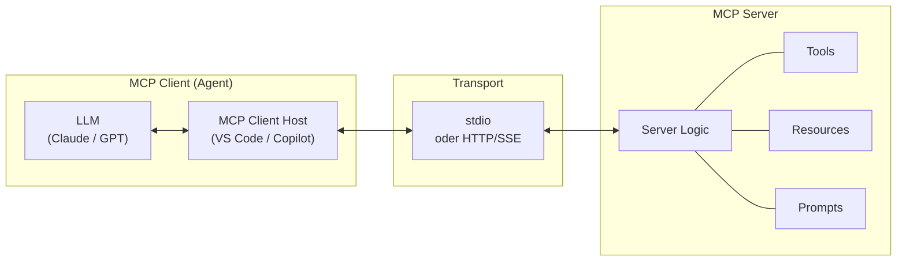

# Theorie: MCP Entwicklung — Custom Tools bauen

<details>
<summary>🎯 Einstiegsfragen — vor der Erklärung stellen</summary>

1. Was ist der Unterschied zwischen einem MCP Server und einem REST-API?
2. Warum brauche ich MCP wenn ich auch direkt mit der Dataverse API sprechen könnte?
3. Welche drei Dinge kann ein MCP Server einem Agent anbieten?

<details>
<summary>💡 Musterlösung</summary>

**1.** Eine REST-API hat kein Schema das ein LLM selbst interpretieren kann. MCP exponiert Tools mit Machine-readable Beschreibungen (name, description, input schema) — das LLM kann selbst entscheiden wann und wie es das Tool aufruft. REST-API braucht immer explizite Instruktionen wie man es nutzt.

**2.** Kapselung und Wiederverwendbarkeit. Ein MCP-Server kapselt Dataverse-Logik (Authentifizierung, Fehlerhandling, Pagination) einmal — jeder Agent nutzt dieselbe Implementierung. Ohne MCP müsste jeder Agent-Prompt diese Details erklären.

**3.** Tools (aufrufbare Funktionen), Resources (lesbare Daten/Dokumente), Prompts (wiederverwendbare Prompt-Templates).

</details>
</details>

## Was ist MCP?

Das **Model Context Protocol** (MCP) ist ein offener Standard von Anthropic (2024), der definiert wie Agents mit externen Tools kommunizieren. Es ist das "USB-Protokoll für KI-Tools".

```
Ohne MCP:                          Mit MCP:
  Agent A → eigene Dataverse-        Agent A ─┐
             Integration                       ├─→ MCP Server (Dataverse)
  Agent B → eigene Dataverse-        Agent B ─┤
             Integration             Agent C ─┘
  Agent C → eigene Dataverse-
             Integration
  (3x doppelter Code)                (1x implementiert, 3x genutzt)
```

## MCP Architektur



**Transport-Optionen:**

- `stdio` — Lokaler Prozess, Low-Latency (VS Code, Desktop Agents)
- `HTTP + SSE` — Remote Server, skalierbar (Azure, Cloud-Hosting)

## Einen MCP Server bauen (TypeScript)

Ein minimaler MCP Server braucht drei Dinge: Server-Instanz, Tool-Definition, Handler.

```typescript
import { McpServer } from "@modelcontextprotocol/sdk/server/mcp.js";
import { StdioServerTransport } from "@modelcontextprotocol/sdk/server/stdio.js";
import { z } from "zod";

const server = new McpServer({
  name: "visittrack-mcp",
  version: "1.0.0",
});

// Tool definieren
server.tool(
  "get_visits",
  "Gibt Besuchsdatensätze für einen ADM zurück",
  {
    adm_user_id: z.string().describe("User ID des ADM"),
    date_from: z.string().optional().describe("Startdatum im ISO-Format"),
    limit: z.number().default(10).describe("Max. Anzahl Ergebnisse"),
  },
  async ({ adm_user_id, date_from, limit }) => {
    // Dataverse OData-Abfrage
    const filter = date_from
      ? `_ownerid_value eq '${adm_user_id}' and vt_visitdate ge ${date_from}`
      : `_ownerid_value eq '${adm_user_id}'`;

    const response = await fetch(
      `${process.env.DATAVERSE_URL}/api/data/v9.2/vt_visits?$filter=${filter}&$top=${limit}`,
      {
        headers: {
          Authorization: `Bearer ${await getDataverseToken()}`,
          "OData-MaxVersion": "4.0",
        },
      }
    );

    const data = await response.json();
    return {
      content: [
        {
          type: "text",
          text: JSON.stringify(data.value, null, 2),
        },
      ],
    };
  }
);

// Server starten
const transport = new StdioServerTransport();
await server.connect(transport);
```

## Resource und Prompt (erweitert)

```typescript
// Resource: Dataverse Tabellen-Schema lesbar machen
server.resource(
  "visittrack-schema",
  "dataverse://schema/visittrack",
  async (uri) => ({
    contents: [
      {
        uri: uri.href,
        mimeType: "application/json",
        text: JSON.stringify({
          tables: ["vt_visit", "vt_physician", "vt_adm"],
          relationships: [
            { from: "vt_visit", to: "vt_physician", type: "N:1" },
          ],
        }),
      },
    ],
  })
);

// Prompt: Wiederverwendbare Analyse-Anleitung
server.prompt(
  "analyze-performance",
  "Analysiert die Besuchsperformance eines ADM",
  { adm_user_id: z.string() },
  ({ adm_user_id }) => ({
    messages: [
      {
        role: "user",
        content: {
          type: "text",
          text: `Analysiere die Besuchsdaten für ADM ${adm_user_id}. 
Berechne: Besuche pro Woche, häufigste Ärzte, längste/kürzeste Besuche.
Gib eine strukturierte Zusammenfassung und 3 Empfehlungen.`,
        },
      },
    ],
  })
);
```

## MCP Server deployen

**Option 1: Lokal via stdio** (VS Code, Desktop)

```json
// .vscode/mcp.json
{
  "servers": {
    "visittrack": {
      "command": "node",
      "args": ["./dist/server.js"],
      "env": {
        "DATAVERSE_URL": "https://yourorg.crm.dynamics.com",
        "TENANT_ID": "your-tenant-id"
      }
    }
  }
}
```

**Option 2: Remote via HTTP** (Azure Container App)

```typescript
import { StreamableHTTPServerTransport } from "@modelcontextprotocol/sdk/server/streamableHttp.js";
import express from "express";

const app = express();
app.use(express.json());

app.all("/mcp", async (req, res) => {
  const transport = new StreamableHTTPServerTransport({
    sessionIdGenerator: undefined,
  });
  await server.connect(transport);
  await transport.handleRequest(req, res, req.body);
});

app.listen(3000);
```

**Option 3: Azure Functions** (Serverless, skaliert automatisch)

```typescript
// azure-function/mcp-handler/index.ts
export default async function handler(
  context: InvocationContext,
  req: HttpRequest
) {
  // MCP Server als Azure Function
  const transport = new AzureFunctionServerTransport(req, context);
  await server.connect(transport);
}
```

## Fehlerhandling & Sicherheit im MCP Server

```typescript
server.tool(
  "create_visit",
  "Erstellt einen neuen Besuch",
  { physician_id: z.string(), visit_date: z.string(), ... },
  async ({ physician_id, visit_date }) => {

    // 1. Input Validation
    if (!isValidGuid(physician_id)) {
      return { isError: true, content: [{ type: "text", text: "Ungültige physician_id" }] };
    }

    // 2. Authorization — prüfe ob Nutzer Schreibrecht hat
    const token = await getUserToken();
    if (!hasWritePermission(token, "vt_visit")) {
      return { isError: true, content: [{ type: "text", text: "Keine Schreibberechtigung" }] };
    }

    // 3. Ausführung
    try {
      const result = await createDataverseRecord("vt_visit", { physician_id, visit_date });
      return { content: [{ type: "text", text: `Visit erstellt: ${result.id}` }] };
    } catch (error) {
      // 4. Fehler: Nie interne Details preisgeben
      console.error("Create visit failed:", error);
      return { isError: true, content: [{ type: "text", text: "Fehler beim Erstellen. Bitte erneut versuchen." }] };
    }
  }
);
```

## Agents.md — MCP Konfiguration als Code

```markdown
# agents.md (im Repo-Root)

## MCP Servers

### visittrack-dataverse

- **Purpose:** Dataverse Zugriff für VisitTrack
- **Connection:** stdio → `node ./mcp-servers/dataverse/dist/index.js`
- **Tools:** get_visits, get_physician, create_visit, update_visit
- **Auth:** User-delegated OAuth (MSAL)

### visittrack-sharepoint

- **Purpose:** HR-Dokumentation lesen
- **Connection:** stdio → `node ./mcp-servers/sharepoint/dist/index.js`
- **Tools:** search_documents, get_document
- **Auth:** App-Registration (Read-Only)

## Deployment

- Dev: Local stdio
- Prod: Azure Container Apps (HTTP/SSE)
```
