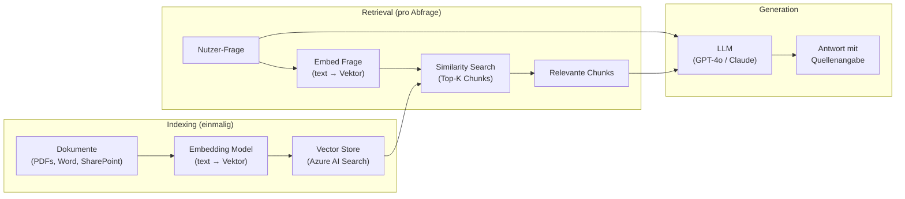
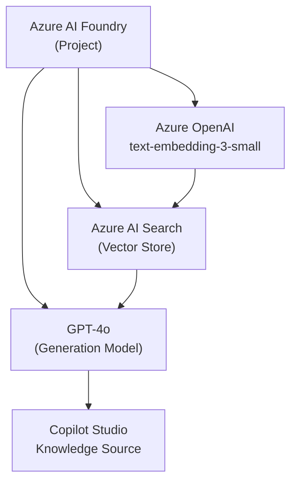
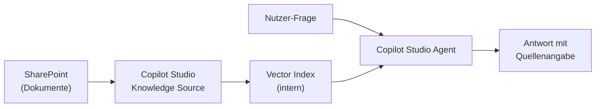
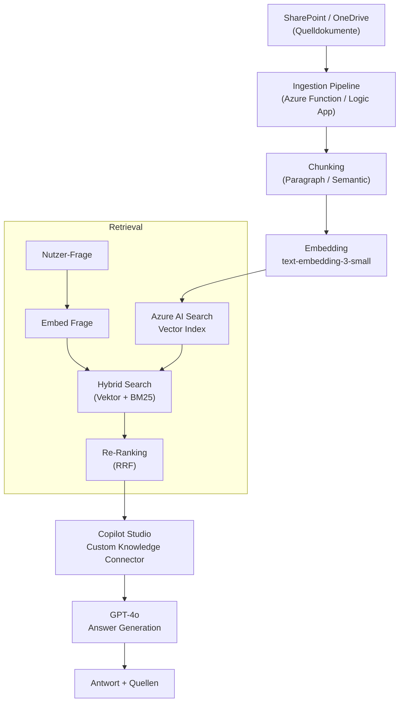

# Theorie: RAG Systeme — Retrieval Augmented Generation

<details>
<summary>🎯 Einstiegsfragen — vor der Erklärung stellen</summary>

1. Was passiert wenn ein LLM eine Frage beantwortet, die nicht in seinen Trainingsdaten war?
2. Was ist der Unterschied zwischen Fine-Tuning und RAG?
3. Welche Probleme entstehen wenn Chunks zu groß oder zu klein sind?

<details>
<summary>💡 Musterlösung</summary>

**1.** Das Modell halluziniert — es generiert eine plausibel klingende Antwort, die aber faktisch falsch ist, weil es die Information nicht kennt.

**2.** Fine-Tuning verändert die Modellgewichte dauerhaft — teuer, erfordert Retraining bei Änderungen, kein Zugriff auf aktuellen Stand. RAG holt zur Laufzeit relevante Dokumente aus einem Index — kein Retraining nötig, immer aktuell, Kosten pro Abfrage.

**3.** Zu groß: Chunk enthält irrelevante Passagen → Kontext "verdünnt" → schlechtere Antwortqualität. Zu klein: Chunk verliert Kontext (ein Satz ohne vorherigen/nächsten Kontext ergibt keinen Sinn) → LLM kann nicht sinnvoll antworten.

</details>
</details>

## RAG Architektur

RAG besteht aus zwei getrennten Phasen:



**Phase 1 — Indexing:**

1. Dokumente laden (PDF, Word, SharePoint)
2. In Chunks aufteilen (z.B. 512 Token)
3. Jeden Chunk zu einem Embedding-Vektor konvertieren
4. Vektoren + Original-Text in Vector Store speichern

**Phase 2 — Retrieval & Generation:**

1. Nutzerfrage → Vektor konvertieren
2. Similarity-Suche: Top-K ähnlichste Chunks finden
3. Chunks + Frage an LLM übergeben
4. LLM generiert Antwort **basierend auf den Chunks** (nicht aus Training)

## Chunking Strategien

Die Chunk-Strategie bestimmt die RAG-Qualität stark:

| Strategie             | Beschreibung                  | Geeignet für                                      |
| --------------------- | ----------------------------- | ------------------------------------------------- |
| **Fixed Size**        | Immer N Tokens, kein Kontext  | Schnell, einfach — für homogene Texte             |
| **Paragraph/Section** | Split bei Absatz/Überschrift  | Strukturierte Dokumente (Word, PDFs mit Struktur) |
| **Semantic**          | Split bei Bedeutungsänderung  | Unstrukturierte Texte, höchste Qualität           |
| **Hierarchical**      | Grobe + feine Chunks parallel | Wenn Kontext + Detail beides nötig ist            |
| **Sliding Window**    | Overlap zwischen Chunks       | Wenn Kontext über Chunk-Grenzen wichtig ist       |

**Empfehlung für Power Platform:**

- SharePoint-Dokumente (Word/PDF): Paragraph Chunking, 512 Tokens, 50 Token Overlap
- Kurze Richtlinien-Abschnitte: Fixed Size 256 Tokens
- Sehr lange technische Handbücher: Hierarchical (Summary + Detail)

## Azure AI Foundry Setup



**Setup in Azure AI Foundry:**

1. **AI Project** erstellen in Azure Portal
2. **Azure OpenAI** Deployment: `text-embedding-3-small` (Embeddings)
3. **Azure OpenAI** Deployment: `gpt-4o` (Generation)
4. **Azure AI Search** verbinden (Vector Index)
5. Index erstellen → Dokumente hochladen → Indexing auslösen

## RAG in Copilot Studio vs. Custom

```
Copilot Studio Knowledge Source (Low-Code):
  ✓ Einfach konfigurieren (SharePoint-URL eingeben, fertig)
  ✓ Automatic Chunking + Embedding
  ✓ Integriert in Agent-Kontext
  ✗ Wenig Kontrolle über Chunking-Strategie
  ✗ Kein benutzerdefiniertes Embedding-Modell
  ✗ Keine Preprocessing-Pipeline
  Geeignet: Standard-RAG für interne Dokumente

Custom RAG mit Azure AI Foundry (Pro-Code):
  ✓ Vollständige Kontrolle (Chunking, Embedding, Retrieval)
  ✓ Custom Pre/Post-Processing
  ✓ Hybrid Search (Vektor + Keyword)
  ✓ Eigene Relevanz-Scoring-Logik
  ✗ Mehr Aufwand (Setup + Wartung)
  ✗ Kosten für Azure AI Search
  Geeignet: Große Dokumentkorpora, hohe Qualitätsanforderungen
```

## Halluzinationen bekämpfen

RAG reduziert Halluzinationen, eliminiert sie aber nicht:

```typescript
// System Prompt: Halluzinationen begrenzen
const systemPrompt = `
Du bist ein VisitTrack-Assistent.

Beantworte Fragen NUR basierend auf den bereitgestellten Dokumenten.
Wenn die Antwort nicht in den Dokumenten steht: 
  "Diese Information ist in meiner Knowledge Base nicht verfügbar."
Erfinde KEINE Informationen.
Gib für jede Aussage die Quelle an: (Quelle: Dokument X, Seite Y)
`;

// Grounding Check: Prüfe ob Antwort aus Chunks ableitbar
async function validateGrounding(
  answer: string,
  chunks: string[],
): Promise<boolean> {
  const allChunksText = chunks.join("\n");
  const checkPrompt = `
Ist diese Antwort vollständig durch den Kontext belegt?
Antwort: ${answer}
Kontext: ${allChunksText}
Antworte nur mit "JA" oder "NEIN".
  `;
  const result = await callLLM(checkPrompt);
  return result.trim() === "JA";
}
```

## Evaluierung

```typescript
// RAG-Qualität messen
const evalMetrics = {
  // Wie viele der Top-K Chunks sind relevant?
  precision_at_k: relevantChunksRetrieved / k,

  // Wurden alle relevanten Chunks gefunden?
  recall: relevantChunksRetrieved / totalRelevantChunks,

  // Ist die Antwort durch die Chunks belegbar?
  groundedness: answeredFromChunks / totalAnswers,

  // Beantwortet die Antwort die Frage?
  answer_relevance: relevantAnswers / totalAnswers,
};
```

Zielwerte für Produktionssysteme:

- Precision@5: > 0.8
- Groundedness: > 0.95
- Answer Relevance: > 0.85

---

## RAG mit Power Platform umsetzen

Power Platform bietet zwei Wege RAG umzusetzen — der SA entscheidet basierend auf Kontrollbedarf und Komplexität:

```
Low-Code (Copilot Studio):        Pro-Code (Azure AI Foundry):
  SharePoint/Dateien              SharePoint / PDF / beliebige Quellen
        ↓                                   ↓
  Copilot Studio                    Chunking + Embedding Pipeline
  Knowledge Source                          ↓
  (automatisch)                     Azure AI Search (Vector Index)
        ↓                                   ↓
  Agent beantwortet                 Custom Connector / Cloud Flow
  Fragen direkt                             ↓
                                    Copilot Studio Agent oder Canvas App
```

### Option 1: Copilot Studio Knowledge Source (Low-Code)

**Wann:** Standard-Use-Case, SharePoint-Dokumente, keine besonderen Chunking-Anforderungen.

**Setup (unter 15 Minuten):**

```
1. Copilot Studio → Agent erstellen oder öffnen
   ↓
2. "+ Knowledge" → "SharePoint" oder "Upload files"
   ↓
3. SharePoint-URL oder lokale PDFs auswählen
   ↓
4. Automatisches Processing:
   - Chunking: 512 Token, Paragraph-basiert
   - Embedding: Azure OpenAI text-embedding-3-small
   - Vector Index: intern verwaltet
   ↓
5. Agent nutzt Knowledge bei jeder relevanten Frage automatisch
```

**Architekturdiagramm:**



**Einschränkungen:**

- Kein Control über Chunking-Strategie (immer 512 Token)
- Kein Custom Embedding-Modell
- Knowledge Source aktualisiert nicht automatisch — manueller Refresh nötig
- Keine Hybrid-Suche (nur Vektor, kein BM25-Keyword)
- Geeignet für: interne Wikis, HR-Dokumente, Produkt-FAQs

### Option 2: Azure AI Search + Copilot Studio (Pro-Code)

**Wann:** Große Dokumentkorpora, eigene Chunking-Strategie, Hybrid-Suche, hohe Qualitätsanforderungen.

**Architekturdiagramm:**



**Integration in Copilot Studio:**

```
Copilot Studio Agent → "Knowledge" → "Custom"
→ Power Automate Cloud Flow aufrufen
→ Flow: Azure AI Search Query (HTTP Action)
→ Flow gibt Top-K Chunks zurück
→ Agent nutzt Chunks als Kontext für Antwort
```

**Azure AI Search — Hybrid Query (REST):**

```json
POST https://<search-instance>.search.windows.net/indexes/rag-index/docs/search
{
  "search": "Nebenwirkungen Produkt X",
  "vectorQueries": [
    {
      "kind": "vector",
      "vector": [0.123, -0.456, ...],
      "fields": "content_vector",
      "k": 5
    }
  ],
  "queryType": "semantic",
  "semanticConfiguration": "default",
  "top": 5
}
```

### Entscheidungsmatrix: Welche Option wann?

| Kriterium          | Copilot Studio Knowledge    | Azure AI Search                            |
| ------------------ | --------------------------- | ------------------------------------------ |
| Setup-Zeit         | 15 Minuten                  | 2-3 Tage                                   |
| Chunking-Kontrolle | Keine                       | Vollständig                                |
| Hybrid-Suche       | Nein                        | Ja                                         |
| Dokumentgröße      | < 100 Dokumente             | Unbegrenzt                                 |
| Aktualität         | Manueller Refresh           | Automatische Pipelines                     |
| Kosten             | Im Copilot Studio enthalten | Azure AI Search (ab ca. 80 €/Monat)        |
| Geeignet für       | Interne Wikis, FAQs         | Produktkataloge, Compliance, große Korpora |

### Halluzinationen in Power Platform bekämpfen

Der System Prompt ist die wirkungsvollste Maßnahme:

```
# System Prompt für VisitTrack Knowledge Agent (Copilot Studio)

Du bist der VisitTrack Wissens-Assistent für Außendienstmitarbeiter der MedPharma GmbH.

WICHTIG: Antworte ausschließlich basierend auf den Informationen in deiner Knowledge Base
(Produktdokumentation, Compliance-Handbuch, interne Prozesse).

Wenn eine Information nicht in deiner Knowledge Base steht:
  → "Diese Information habe ich in meiner Wissensdatenbank nicht.
     Wende dich bitte an dein Regionalbüro."

Zitiere immer die Quelle: (Quelle: [Dokumentname], Abschnitt [X])

Wenn die Frage außerhalb deines Bereichs liegt:
  → "Das liegt außerhalb meines Bereichs. Ich helfe bei Produkten, Compliance und Prozessen."

Sprache: Deutsch, freundlich, klar — kein Fachjargon ohne Erklärung.
```
