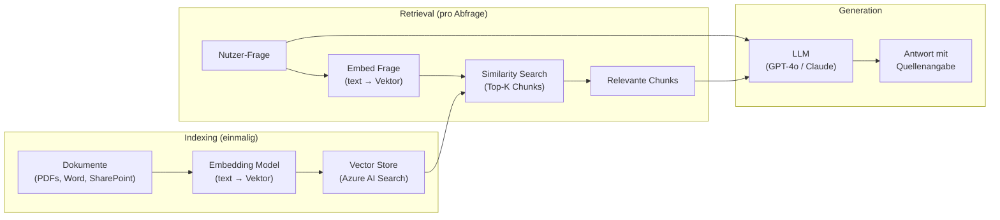
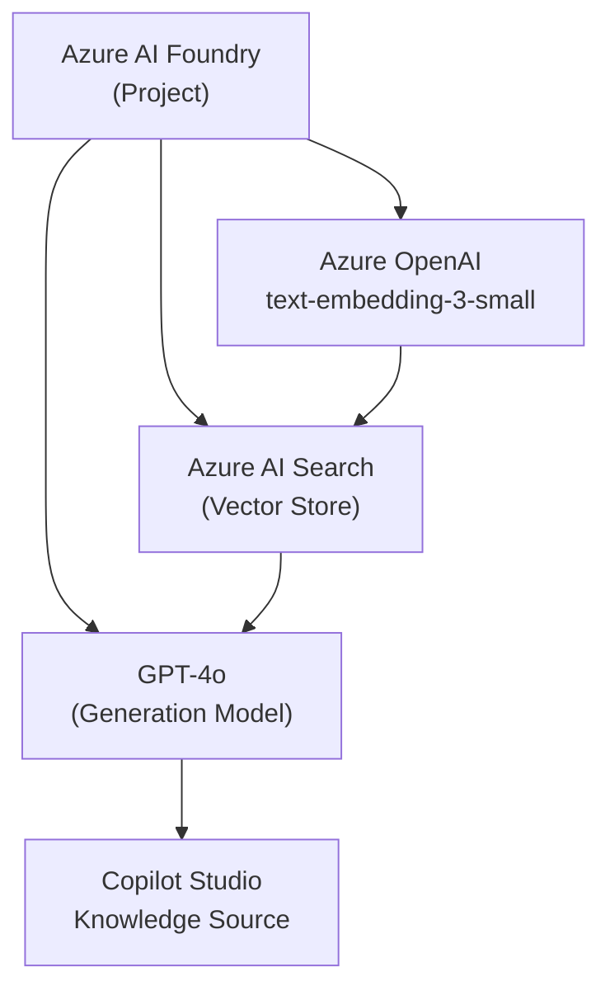
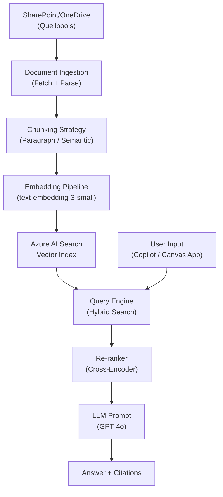

# Theorie: RAG Systeme — Retrieval Augmented Generation

<details>
<summary>🎯 Einstiegsfragen — vor der Erklärung stellen</summary>

1. Was passiert wenn ein LLM eine Frage beantwortet, die nicht in seinen Trainingsdaten war?
2. Was ist der Unterschied zwischen Fine-Tuning und RAG?
3. Welche Probleme entstehen wenn Chunks zu groß oder zu klein sind?

<details>
<summary>💡 Musterlösung</summary>

**1.** Das Modell halluziniert — es generiert eine plausibel klingende Antwort, die aber faktisch falsch ist, weil es die Information nicht kennt.

**2.** Fine-Tuning verändert die Modellgewichte dauerhaft — teuer, erfordert Retraining bei Änderungen, kein Zugriff auf aktuellen Stand. RAG holt zur Laufzeit relevante Dokumente aus einem Index — kein Retraining nötig, immer aktuell, Kosten pro Abfrage.

**3.** Zu groß: Chunk enthält irrelevante Passagen → Kontext "verdünnt" → schlechtere Antwortqualität. Zu klein: Chunk verliert Kontext (ein Satz ohne vorherigen/nächsten Kontext ergibt keinen Sinn) → LLM kann nicht sinnvoll antworten.

</details>
</details>

## RAG Architektur

RAG besteht aus zwei getrennten Phasen:



**Phase 1 — Indexing:**

1. Dokumente laden (PDF, Word, SharePoint)
2. In Chunks aufteilen (z.B. 512 Token)
3. Jeden Chunk zu einem Embedding-Vektor konvertieren
4. Vektoren + Original-Text in Vector Store speichern

**Phase 2 — Retrieval & Generation:**

1. Nutzerfrage → Vektor konvertieren
2. Similarity-Suche: Top-K ähnlichste Chunks finden
3. Chunks + Frage an LLM übergeben
4. LLM generiert Antwort **basierend auf den Chunks** (nicht aus Training)

## Chunking Strategien

Die Chunk-Strategie bestimmt die RAG-Qualität stark:

| Strategie             | Beschreibung                  | Geeignet für                                      |
| --------------------- | ----------------------------- | ------------------------------------------------- |
| **Fixed Size**        | Immer N Tokens, kein Kontext  | Schnell, einfach — für homogene Texte             |
| **Paragraph/Section** | Split bei Absatz/Überschrift  | Strukturierte Dokumente (Word, PDFs mit Struktur) |
| **Semantic**          | Split bei Bedeutungsänderung  | Unstrukturierte Texte, höchste Qualität           |
| **Hierarchical**      | Grobe + feine Chunks parallel | Wenn Kontext + Detail beides nötig ist            |
| **Sliding Window**    | Overlap zwischen Chunks       | Wenn Kontext über Chunk-Grenzen wichtig ist       |

**Empfehlung für Power Platform:**

- SharePoint-Dokumente (Word/PDF): Paragraph Chunking, 512 Tokens, 50 Token Overlap
- Kurze Richtlinien-Abschnitte: Fixed Size 256 Tokens
- Sehr lange technische Handbücher: Hierarchical (Summary + Detail)

## Azure AI Foundry Setup



**Setup in Azure AI Foundry:**

1. **AI Project** erstellen in Azure Portal
2. **Azure OpenAI** Deployment: `text-embedding-3-small` (Embeddings)
3. **Azure OpenAI** Deployment: `gpt-4o` (Generation)
4. **Azure AI Search** verbinden (Vector Index)
5. Index erstellen → Dokumente hochladen → Indexing auslösen

## RAG in Copilot Studio vs. Custom

```
Copilot Studio Knowledge Source (Low-Code):
  ✓ Einfach konfigurieren (SharePoint-URL eingeben, fertig)
  ✓ Automatic Chunking + Embedding
  ✓ Integriert in Agent-Kontext
  ✗ Wenig Kontrolle über Chunking-Strategie
  ✗ Kein benutzerdefiniertes Embedding-Modell
  ✗ Keine Preprocessing-Pipeline
  Geeignet: Standard-RAG für interne Dokumente

Custom RAG mit Azure AI Foundry (Pro-Code):
  ✓ Vollständige Kontrolle (Chunking, Embedding, Retrieval)
  ✓ Custom Pre/Post-Processing
  ✓ Hybrid Search (Vektor + Keyword)
  ✓ Eigene Relevanz-Scoring-Logik
  ✗ Mehr Aufwand (Setup + Wartung)
  ✗ Kosten für Azure AI Search
  Geeignet: Große Dokumentkorpora, hohe Qualitätsanforderungen
```

## Halluzinationen bekämpfen

RAG reduziert Halluzinationen, eliminiert sie aber nicht:

```typescript
// System Prompt: Halluzinationen begrenzen
const systemPrompt = `
Du bist ein VisitTrack-Assistent.

Beantworte Fragen NUR basierend auf den bereitgestellten Dokumenten.
Wenn die Antwort nicht in den Dokumenten steht: 
  "Diese Information ist in meiner Knowledge Base nicht verfügbar."
Erfinde KEINE Informationen.
Gib für jede Aussage die Quelle an: (Quelle: Dokument X, Seite Y)
`;

// Grounding Check: Prüfe ob Antwort aus Chunks ableitbar
async function validateGrounding(
  answer: string,
  chunks: string[]
): Promise<boolean> {
  const allChunksText = chunks.join("\n");
  const checkPrompt = `
Ist diese Antwort vollständig durch den Kontext belegt?
Antwort: ${answer}
Kontext: ${allChunksText}
Antworte nur mit "JA" oder "NEIN".
  `;
  const result = await callLLM(checkPrompt);
  return result.trim() === "JA";
}
```

## Evaluierung

```typescript
// RAG-Qualität messen
const evalMetrics = {
  // Wie viele der Top-K Chunks sind relevant?
  precision_at_k: relevantChunksRetrieved / k,

  // Wurden alle relevanten Chunks gefunden?
  recall: relevantChunksRetrieved / totalRelevantChunks,

  // Ist die Antwort durch die Chunks belegbar?
  groundedness: answeredFromChunks / totalAnswers,

  // Beantwortet die Antwort die Frage?
  answer_relevance: relevantAnswers / totalAnswers,
};
```

Zielwerte für Produktionssysteme:

- Precision@5: > 0.8
- Groundedness: > 0.95
- Answer Relevance: > 0.85

---

## RAG in Power Apps umsetzen

### Option 1: Copilot Studio Knowledge Source (Low-Code)

**Schnellstart (15 Minuten):**

```
1. Copilot Studio → Agent erstellen
   ↓
2. "+" Knowledge → "Upload files"
   ↓
3. SharePoint-Folder / Local PDFs auswählen
   ↓
4. System macht alles:
   - Automatisches Chunking (512 Token)
   - Embedding (Azure OpenAI text-embedding-3-small)
   - Vector Index
   ↓
5. Agent kann jetzt: 
   "Nutzer: Was steht in der SLA?"
   Agent ruft Knowledge ab → antwortet
```

**Workflow:**

```
User Input ("Was sind die Supportzeiten?")
         ↓
Copilot Agent [Understand Intent]
         ↓
Knowledge Search
  - Embed Frage: text-embedding-3-small
  - Vector Search in Index: Top-5 Chunks
  - Chunks zurück zu Agent
         ↓
Agent [Reason]
  "Ich habe diese 5 Chunks. Die Supportzeiten sind..."
         ↓
Answer Generation (GPT-4o)
         ↓
Response: "Supportzeiten sind Mo-Fr 08:00-18:00."
```

**Limitations dieser Methode:**

- ❌ Kein Control über Chunking-Strategie
- ❌ Knowledge Source updatet nicht automatisch (manuell neu hochladen)
- ❌ Keine Hybrid-Suche (nur Vektor)
- ✅ Aber: Super schnell für Standard-Use-Cases

### Option 2: Custom RAG mit Azure AI Foundry (Pro-Code)

**Vollständige Kontrolle — für komplexe Dokumente:**



**Implementation — Indexing Pipeline:**

```python
# Azure AI Foundry Project - Python Script
from azure.ai.projects import AIProjectClient
from azure.search.documents import SearchClient
from azure.identity import DefaultAzureCredential
import tiktoken

# 1. Connect zu Azure-Ressourcen
credential = DefaultAzureCredential()
project_client = AIProjectClient.from_config(credential)
search_client = SearchClient(
    endpoint="https://<search-instance>.search.windows.net",
    index_name="rag-index",
    credential=credential
)

# 2. Dokumente laden
def load_documents_from_sharepoint(folder_url):
    """Ruft Word/PDF von SharePoint ab"""
    # Mit Office365-REST API oder SharePoint SDK
    docs = []
    for file in sharepoint_folder:
        content = extract_text(file)  # PDF/Word → Text
        docs.append({
            'source': file.name,
            'content': content,
            'path': file.web_url
        })
    return docs

# 3. Chunking (Paragraph-basiert)
def chunk_by_paragraph(doc, chunk_size=512, overlap=50):
    """Split document bei Absätzen/Überschriften"""
    chunks = []
    tokenizer = tiktoken.encoding_for_model("gpt-4o")
    
    paragraphs = doc['content'].split('\n\n')
    current_chunk = []
    current_tokens = 0
    
    for para in paragraphs:
        para_tokens = len(tokenizer.encode(para))
        
        if current_tokens + para_tokens > chunk_size:
            # Flush current chunk
            if current_chunk:
                chunk_text = '\n\n'.join(current_chunk)
                chunks.append({
                    'text': chunk_text,
                    'source': doc['source'],
                    'tokens': current_tokens
                })
                # Overlap: letzte Absätze behalten
                current_chunk = current_chunk[-2:] if len(current_chunk) > 2 else current_chunk
                current_tokens = sum(len(tokenizer.encode(p)) for p in current_chunk)
        
        current_chunk.append(para)
        current_tokens += para_tokens
    
    # Letzter Chunk
    if current_chunk:
        chunks.append({
            'text': '\n\n'.join(current_chunk),
            'source': doc['source'],
            'tokens': current_tokens
        })
    
    return chunks

# 4. Embedding + Indexing
async def index_chunks(chunks):
    """Embeddings erzeugen + in Vector Index speichern"""
    embeddings_client = project_client.inference
    
    documents_to_index = []
    
    for chunk in chunks:
        # Embedding erzeugen
        embedding = embeddings_client.embed(
            model="text-embedding-3-small",
            input=chunk['text']
        ).data[0].embedding
        
        documents_to_index.append({
            'id': f"{chunk['source']}_{len(documents_to_index)}",
            'content': chunk['text'],
            'source_file': chunk['source'],
            'vector': embedding,
            'tokens': chunk['tokens']
        })
    
    # Upload zu Azure AI Search
    search_client.upload_documents(documents_to_index)
    print(f"✓ {len(documents_to_index)} Chunks indexiert")

# 5. Retrieval Pipeline
async def rag_query(user_question: str, top_k=5):
    """RAG-Abfrage mit Hybrid Search"""
    
    # Frage embedden
    question_embedding = project_client.inference.embed(
        model="text-embedding-3-small",
        input=user_question
    ).data[0].embedding
    
    # Hybrid Search (Vektor + Keyword)
    search_results = search_client.search(
        search_text=user_question,  # Keyword
        vector=question_embedding,  # Vector
        top=top_k
    )
    
    chunks = [
        {
            'text': result['content'],
            'source': result['source_file'],
            'score': result['@search.score']
        }
        for result in search_results
    ]
    
    # Optional: Re-ranking (Cross-Encoder für bessere Relevanz)
    # chunks = rerank_chunks(user_question, chunks)
    
    return chunks

# 6. Generation
async def generate_answer(user_question: str, retrieved_chunks: list):
    """LLM generiert Antwort mit Kontext"""
    
    context = "\n\n---\n\n".join([
        f"[{chunk['source']}]\n{chunk['text']}"
        for chunk in retrieved_chunks
    ])
    
    system_prompt = """Du bist ein FAQ-Assistant. 
    Beantworte Fragen NUR basierend auf dem Kontext.
    Gib Quellenangaben an: (Quelle: Dateiname, Position)
    Wenn Antwort nicht im Kontext: 'Diese Info ist nicht verfügbar.'
    """
    
    response = project_client.inference.complete(
        model="gpt-4o",
        messages=[
            {"role": "system", "content": system_prompt},
            {"role": "user", "content": f"Frage: {user_question}\n\nKontext:\n{context}"}
        ],
        temperature=0.1  # Niedrig für faktische Genauigkeit
    )
    
    return {
        'answer': response.choices[0].message.content,
        'sources': [c['source'] for c in retrieved_chunks]
    }

# Main: Vollständiger Workflow
async def main():
    print("1️⃣  Dokumente laden...")
    docs = load_documents_from_sharepoint("https://tenant.sharepoint.com/sites/knowledge")
    
    print("2️⃣  Chunking...")
    all_chunks = []
    for doc in docs:
        chunks = chunk_by_paragraph(doc, chunk_size=512)
        all_chunks.extend(chunks)
    print(f"   → {len(all_chunks)} Chunks erzeugt")
    
    print("3️⃣  Indexing (Embedding + Vector Store)...")
    await index_chunks(all_chunks)
    
    # Jetzt ist die RAG bereit
    print("4️⃣  RAG bereit!")
    
    # Test Query
    user_question = "Was sind die Supportzeiten?"
    retrieved = await rag_query(user_question)
    answer = await generate_answer(user_question, retrieved)
    
    print(f"\n🤖 Q: {user_question}")
    print(f"📄 Gefundene Chunks: {len(retrieved)}")
    print(f"A: {answer['answer']}")
    print(f"Quellen: {', '.join(answer['sources'])}")
```

### Option 3: RAG in Canvas App integrieren

**Pattern: "Ask your documents"**

```powerapps
// Canvas App: Document Q&A

OnVisible:
  Set(gblDocumentSource, "Company Policy Handbook");
  Set(gblQueryHistory, Table());

// TextInput: Frage stellen
OnChange(TextInput_Question):
  Set(gblSuggestions, 
    Filter(
      'FAQ Database',
      Search(question, TextInput_Question.Value)
    )
  );

// Button: "Frage stellen"
OnSelect:
  Set(gblLoading, true);
  
  // Call Cloud Flow → Azure AI Foundry RAG
  Set(
    gblRAGResult,
    'Cloud Flow - Document RAG'.Run(
      TextInput_Question.Value,
      gblDocumentSource,
      5  // top_k
    )
  );
  
  // Ergebnis speichern
  Collect(
    gblQueryHistory,
    {
      question: TextInput_Question.Value,
      answer: gblRAGResult.answer,
      sources: gblRAGResult.sources,
      timestamp: Now()
    }
  );
  
  Set(gblLoading, false);

// Ausgabe: Antwort + Quellen
OutputArea.Items: 
  {
    text: gblRAGResult.answer,
    type: "answer"
  }

SourcesList.Items:
  Split(gblRAGResult.sources, ",")
```

**Cloud Flow — RAG Backend:**

```yaml
Trigger: CloudFlow
Inputs:
  - question: string
  - source_collection: string (z.B. "Policies")
  - top_k: integer

Steps:
  1. Call Azure Function: "RAG Query"
     Payload:
       question: @{inputs('question')}
       collection: @{inputs('source_collection')}
       limit: @{inputs('top_k')}
     
  2. Parse Response
     Set variable answer = body('Azure Function')['answer']
     Set variable sources = body('Azure Function')['sources']
  
  3. Log Query (Audit Trail)
     Create in 'Query History' table:
       question: @{inputs('question')}
       answer: @{variables('answer')}
       sources: @{variables('sources')}
       queried_by: @{user().email}
  
  4. Return
     Output:
       answer: @{variables('answer')}
       sources: @{variables('sources')}
```

### Entscheidungshilfe: Welche RAG-Option?

| Kriterium                | Copilot Studio Knowledge | Azure AI Foundry |
| ------------------------ | ----------------------- | ------------------ |
| Setup-Aufwand            | 5 Min                   | 1–2 Std            |
| Kontrolle über Chunking  | ❌ Keine                | ✅ Vollständig     |
| Hybrid Search (Vec+Text) | ❌ Nur Vektor           | ✅ Ja              |
| Knowledge-Updates        | ❌ Manuell              | ✅ Automatisch     |
| Multi-Source RAG         | Begrenzt                | ✅ Unbegrenzt      |
| Dokumentgröße            | < 100 MB ideal          | Beliebig           |
| Kosten pro Query         | Gering                  | Mittel–Hoch        |
| Geeignet für             | Standard-Use-Cases      | Enterprise-RAG     |

**Faustregel:**
- 1–5 Dokumente, selten updatert → Copilot Studio Knowledge ✅
- 10+ Dokumente, häufig updates, komplexe Queries → Azure AI Foundry ✅
