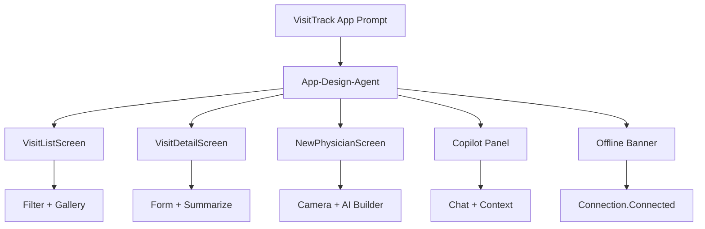

# Lösung: Canvas App mit KI-Integration

## Aufgabe 1: KI-Feature Priorisierung

| Feature                       | AI-Technologie             | Complexity | Business Value | Offline-fähig? | Empfehlung               |
| ----------------------------- | -------------------------- | ---------- | -------------- | -------------- | ------------------------ |
| Visitenkarte → Arzt autofill  | AI Builder Form Recognizer | Medium     | High           | Nein           | Implementieren (Phase 1) |
| Chat: "Zeige Besuche bei..."  | Copilot Studio + Canvas    | Medium     | Medium         | Nein           | Implementieren (Phase 2) |
| Besuchsnotizen zusammenfassen | Power Fx `Summarize()`     | Low        | Medium         | Nein           | Implementieren (Phase 1) |
| Stimmungsanalyse für Manager  | AI Builder Sentiment       | Low        | Low            | Nein           | Optional (nice to have)  |
| Spracheingabe für Notiz       | Native OS Spracherkennung  | Low        | High           | Ja (lokal)     | Implementieren (Phase 1) |

## Aufgabe 2: Agentischer App-Blueprint

```text
Input an den App-Design-Agenten:
- App-Ziel: VisitTrack für Außendienstmitarbeiter
- Kern-Use-Cases: Besuche erfassen, Arzt anlegen, Besuche prüfen
- Datenquelle: Dataverse
- KI-Funktionen: Visitenkarten-Scan, Copilot Chat, Zusammenfassung
- Offline: Ja

Output:
- Screens: VisitListScreen, VisitDetailScreen, NewPhysicianScreen
- Navigation: Bottom Bar oder Left Nav
- Controls: Gallery, Form, Camera/Add Media, Copilot Panel, Offline Banner
- Formeln: Filter, Patch, Summarize, Connection.Connected
- Review-Punkte: Security, RLS, Kosten, Offline-Fallback
```



---

## Aufgabe 2: Visitenkarten-Scanner Power Fx

```powerfx
// Button: "Visitenkarte scannen"
OnSelect =
    Set(isScanning, true);

    // Foto aufnehmen oder auswählen
    Set(capturedPhoto, UploadedImage1.Image);

    // AI Builder aufrufen (oder Mock wenn nicht verfügbar)
    If(
        Connection.Connected,
        Set(
            cardData,
            'BusinessCard'.Predict(capturedPhoto)
        ),
        // Mock-Daten für Offline-Testing
        Set(cardData, {
            Name: {Value: "Dr. Anna Bauer"},
            MobilePhone: {Value: "+49 89 12345678"},
            Email: {Value: "a.bauer@praxis-bauer.de"},
            Address: {Value: "Maximilianstr. 12, 80539 München"}
        })
    );

    // Felder befüllen
    UpdateContext({
        newName: cardData.Name.Value,
        newPhone: cardData.MobilePhone.Value,
        newEmail: cardData.Email.Value,
        newAddress: cardData.Address.Value
    });

    Set(isScanning, false);

// Button: "Arzt speichern"
OnSelect =
    Patch(
        vt_physicians,
        Defaults(vt_physicians),
        {
            vt_name: newName,
            vt_phone: newPhone,
            vt_email: newEmail,
            vt_address: newAddress
        }
    );
    Navigate(VisitListScreen, ScreenTransition.Slide)
```

---

## Aufgabe 4: Offline Graceful Degradation

```powerfx
// OfflineBanner Label
Text = "⚠️ Offline-Modus — KI-Funktionen (Scan, Chat) nicht verfügbar"
Visible = !Connection.Connected
Fill = RGBA(255, 200, 0, 0.9)

// KI-Buttons verstecken wenn offline
ScanCardButton.Visible = Connection.Connected
CopilotPanel.Visible = Connection.Connected

// Standard-Felder bleiben immer sichtbar
PhysicianNameInput.Visible = true
PhysicianPhoneInput.Visible = true
```

---

## Aufgabe 5: Architekturentscheidungen Referenz

```
Feature: Visitenkarten-Scanner
  Technologie: AI Builder Form Recognizer (Business Card Modell)
  Begründung: Kein Custom Training nötig, Modell ist vortrainiert für Visitenkarten
  Alternative: Custom Computer Vision Modell (Azure AI)
  Warum nicht Alternative: Signifikant mehr Aufwand für gleiche Qualität
  Risiko: AI Builder Credits Verbrauch (~2 Credits pro Scan)
  Kosten-Schätzung: 120 ADM × 2 neue Ärzte/Monat × 2 Credits = 480 Credits/Monat ≈ minimal

Feature: Copilot Chat Panel
  Technologie: Copilot Studio Agent (embedded in Canvas)
  Begründung: Wiederverwendung des VisitTrack Agents aus M04; kein separates System
  Alternative: Custom Chat-UI + direkte Azure OpenAI API
  Warum nicht Alternative: Wartungsaufwand zu hoch, Copilot Studio ist integrierter
  Risiko: Chat nicht offline-fähig — Graceful Degradation implementiert
  Kosten: Copilot Studio Lizenz (bereits vorhanden)
```
