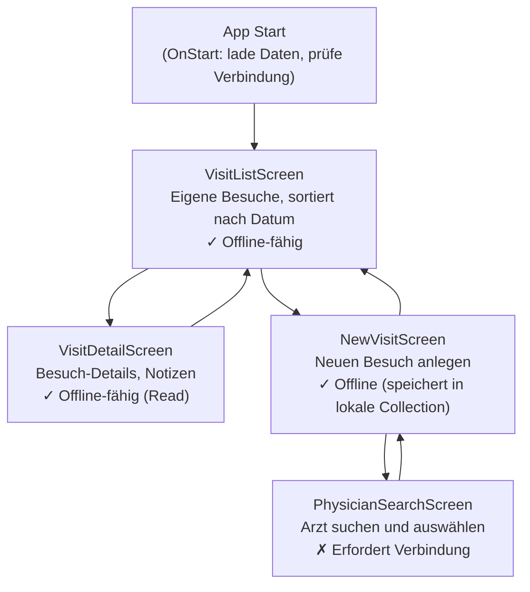

# Lösung: Canvas App mit AI-Editor bauen

## Aufgabe 1: App-Blueprint

**Erwartetes Ergebnis (Referenz-Mermaid):**



**Screen-Tabelle (Referenz):**

| Screen                | Controls                                                 | Offline?              |
| --------------------- | -------------------------------------------------------- | --------------------- |
| VisitListScreen       | galVisits, btnNewVisit, lblOfflineBanner                 | ✓                     |
| VisitDetailScreen     | frmVisitDetail, btnEdit, lblPhysicianName                | ✓ (Read)              |
| NewVisitScreen        | drpPhysician, datePicker, txtDuration, txtNotes, btnSave | ✓ (lokale Collection) |
| PhysicianSearchScreen | txtSearch, galPhysicians, btnSelect                      | ✗                     |

---

## Aufgabe 2: Power Fx Referenzformeln

**Formel A — Gefilterte Gallery:**

```powerfx
// Items-Formel galVisits
If(
    Connection.Connected,
    SortByColumns(
        Filter(
            vt_visits,
            vt_owner = User().Email
        ),
        "vt_visit_date",
        SortOrder.Descending
    ),
    SortByColumns(
        colOfflineVisits,
        "vt_visit_date",
        SortOrder.Descending
    )
)
```

**Prüfpunkte:**

- `vt_owner = User().Email` → Delegation: Dataverse delegiert `=`-Filter auf Text ✓
- `SortByColumns` → delegierbar auf Dataverse ✓
- Offline-Fallback auf `colOfflineVisits` ✓

**Formel B — Besuch speichern:**

```powerfx
// OnSelect — btnSaveVisit
If(
    IsBlank(drpPhysician.Selected),
    Notify("Bitte einen Arzt auswählen.", NotificationType.Error),
    If(
        DatePicker1.SelectedDate > Today(),
        Notify("Besuchsdatum darf nicht in der Zukunft liegen.", NotificationType.Error),
        If(
            Connection.Connected,
            // Online: direkt in Dataverse
            IfError(
                Patch(
                    vt_visits,
                    Defaults(vt_visits),
                    {
                        vt_physician_id: drpPhysician.Selected,
                        vt_visit_date: DatePicker1.SelectedDate,
                        vt_duration: Value(txtDuration.Text),
                        vt_notes: txtNotes.Text
                    }
                ),
                Notify("Fehler beim Speichern: " & FirstError.Message, NotificationType.Error),
                Navigate(VisitListScreen, ScreenTransition.Slide)
            ),
            // Offline: lokale Collection
            Collect(
                colOfflineVisits,
                {
                    vt_physician_id: drpPhysician.Selected,
                    vt_visit_date: DatePicker1.SelectedDate,
                    vt_duration: Value(txtDuration.Text),
                    vt_notes: txtNotes.Text,
                    _offlinePending: true
                }
            );
            Navigate(VisitListScreen, ScreenTransition.Slide)
        )
    )
)
```

**Formel C — Arzt suchen:**

```powerfx
// Items-Formel galPhysicians
FirstN(
    Filter(
        vt_physicians,
        StartsWith(vt_physician_name, txtSearch.Text)
    ),
    20
)
```

**Prüfpunkt:** `StartsWith` ist delegierbar auf Dataverse — kein Delegation-Warning.
`Contains` ist NICHT delegierbar → würde nur die ersten 500 Records lokal filtern.

---

## Aufgabe 3: PAC CLI PowerShell-Script

```powershell
# VisitTrack Deployment Script
# Variablen — hier anpassen
$DEV_ENV  = "https://medpharma-dev.crm4.dynamics.com"
$TEST_ENV = "https://medpharma-test.crm4.dynamics.com"
$SOLUTION = "VisitTrack"
$EXPORT_PATH = ".\exports"

$ErrorActionPreference = "Stop"

# 1. Authentifizierung
Write-Host "Authentifizierung DEV..."
pac auth create --url $DEV_ENV --name "visittrack-dev"
pac auth select --name "visittrack-dev"

# 2. Export aus DEV (Unmanaged)
Write-Host "Exportiere Solution aus DEV..."
New-Item -ItemType Directory -Path $EXPORT_PATH -Force | Out-Null
pac solution export `
    --name $SOLUTION `
    --path "$EXPORT_PATH\${SOLUTION}_unmanaged.zip" `
    --managed false

# 3. Wechsel zu TEST
Write-Host "Wechsel zu TEST-Umgebung..."
pac auth create --url $TEST_ENV --name "visittrack-test"
pac auth select --name "visittrack-test"

# 4. Import als Managed in TEST
Write-Host "Importiere als Managed Solution in TEST..."
pac solution import `
    --path "$EXPORT_PATH\${SOLUTION}_unmanaged.zip" `
    --publish-changes `
    --force-overwrite

Write-Host "Deployment abgeschlossen."
```

**Häufige Fehler in generierten Scripts:**

- `--managed false` beim Export ist korrekt (Unmanaged exportieren)
- Beim Import in TEST/PROD immer `--managed true` oder Managed Solution separat packen
- `pac solution publish` fehlt manchmal — `--publish-changes` deckt das ab

---

## Aufgabe 4: CLAUDE.md Referenz

```markdown
# CLAUDE.md — VisitTrack Power Platform Project

## Project

Canvas App for field reps (ADMs) at MedPharma GmbH.
Stack: Power Apps Canvas (offline-capable), Dataverse, Power Automate, Copilot Studio.
ALM: PAC CLI, GitHub Actions, DEV → TEST → PROD.

## Conventions

- Table prefix: vt\_ (publisher prefix: medpharma, solution: VisitTrack)
- Power Fx globals: gbl* | locals: loc* | collections: col\*
- Controls: btnX (button), lblX (label), galX (gallery), frmX (form),
  txtX (text input), datX (date picker), drpX (dropdown)
- Diagrams: Mermaid only (flowchart TD/LR, erDiagram, sequenceDiagram)
- Language: German prose, English identifiers/code

## Key Tables

- vt_visits: visit records — owner-based Row-Level Security
- vt_physicians: physician master data — readable by all ADMs
- vt_users: ADM profiles — linked to Dataverse systemuser

## What AI should NOT do

- Write or modify Row-Level Security / Column-Level Security configurations
- Generate production deployment scripts without a human-review comment block
- Assume online connectivity — always include Connection.Connected offline branches
```
